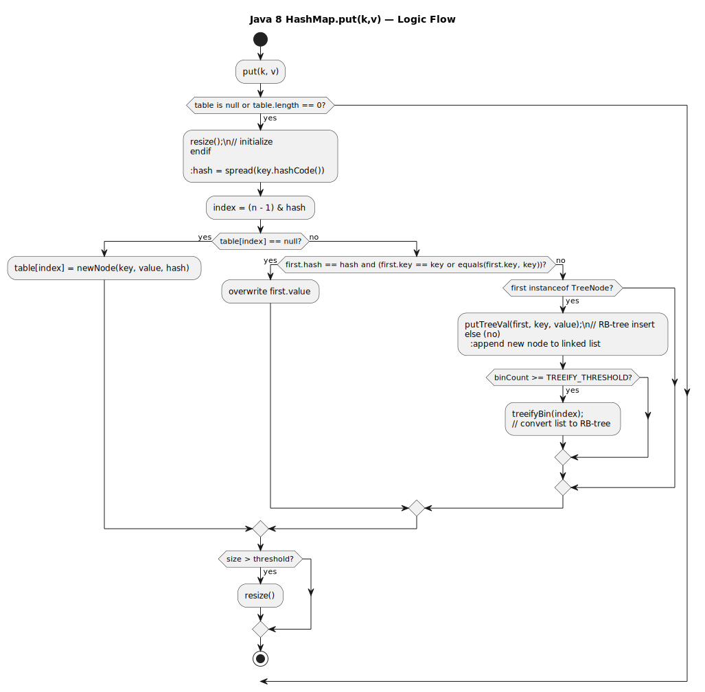
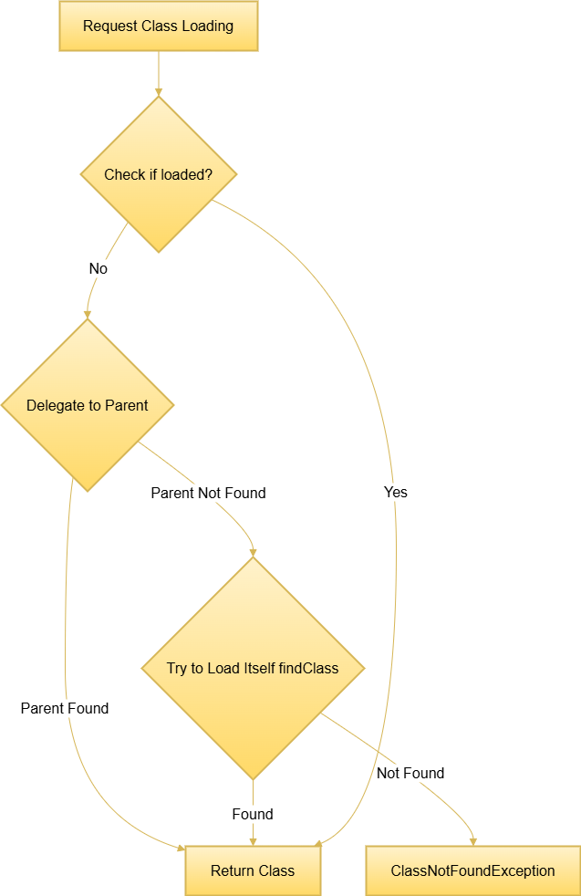
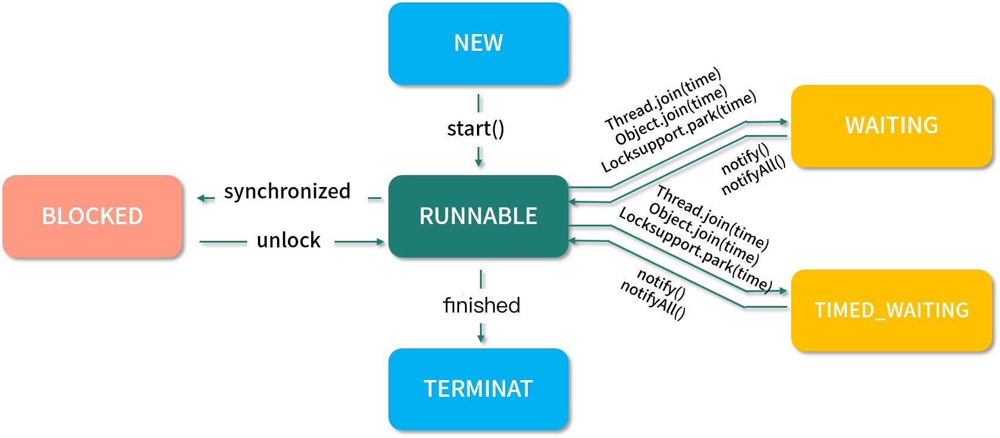
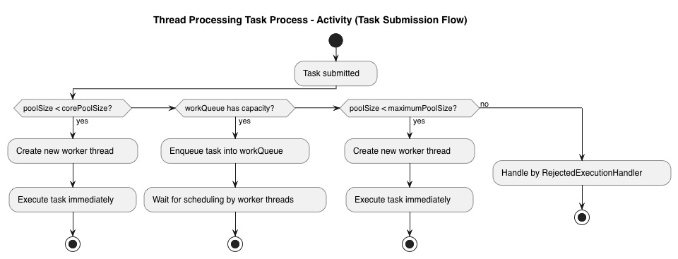
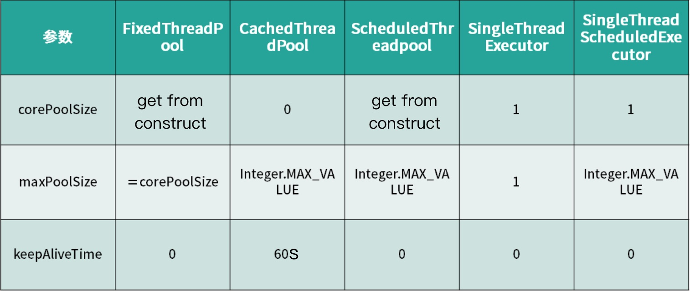
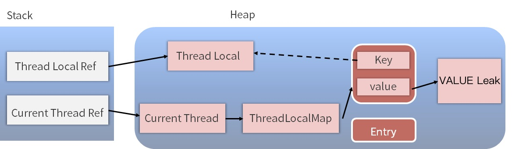
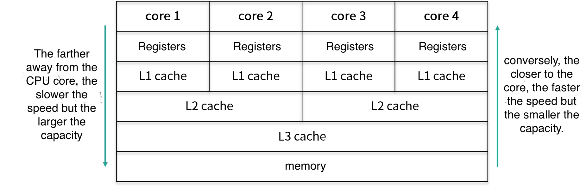

# Java
- TOC
{:toc}


## Java Basic

### Three object-oriented features

**Features:** Encapsulation, Inheritance, Polymorphism

**Encapsulation:** Abstraction of abstract things into an object, making the object's attributes private, and providing some methods that can be accessed by the outside to access attributes;

**Inheritance**: Subclasses extend new data fields or functions while reusing the attributes and functions of the parent class; single inheritance, multiple implementation;

**Polymorphism:** Through inheritance (multiple subclasses overriding the same method), or also through interfaces (implementing an interface and overriding it)

####  1、Differences between Java and C++

Differences: C++ supports multiple inheritance and has the concept of pointers, with memory managed by the programmer; Java is single inheritance and can use interfaces to implement multiple inheritance. Java does not provide pointers to directly access memory, making program memory safer, and Java has a JVM automatic memory management mechanism that does not require programmers to manually release unused memory.

####  2、Principles of Polymorphism Implementation

The underlying implementation of polymorphism is dynamic binding, which associates method calls with method implementations at runtime.

**Static binding and dynamic binding:**

One is determined at compile time, known as static dispatch, such as method overloading;

The other is determined at runtime, known as dynamic dispatch, such as method overriding (overwriting) and interface implementation.

**Polymorphism Implementation**

The virtual machine stack stores the current method's stack frame (local variables table, operand stack, dynamic linking, return address). The process of implementing polymorphism is the process of dynamic dispatch of method calls. If a subclass overrides a parent class's method, during polymorphic calls, the dynamic binding process first determines that the actual type is the subclass, thus searching for the method in the subclass first. This process is the essence of method overriding.

#### 3\. static and final keywords

**static:** Can modify attributes, methods

**Static-modified attributes**:

Class-level attributes, shared by all objects, loaded along with the class (loaded only once), precede object creation; can be called directly using the class name.

**Static-modified methods**:

Loaded along with the class; can be called directly using the class name; in a static method, only static members can be called, and this cannot be used.

**final:** The keyword is mainly used in three places: variables, methods, and classes.

**Final-modified variables**:

If it is a variable of a primitive data type, its value cannot be changed once initialized;

If it is a variable of a reference type, it cannot be made to point to another object after being initialized.

**final modification method:**

Locks the method to prevent any subclass from modifying its meaning (overriding); all private methods in the class are implicitly specified as final.

**final-modified class:**

When a class is modified with final, it indicates that the class cannot be inherited. All member methods in a final class are implicitly specified as final methods.

A class cannot be inherited, except for the final keyword and can have its constructor privatized (internal classes are invalid)

####  4、Abstract Classes and Interfaces

**Abstract Class:** A class that contains abstract methods, i.e., a class modified with the abstract keyword; abstract classes can only be inherited, so they cannot be modified with final, and abstract classes cannot be instantiated,

**Interface:** An interface is an abstract type, a collection of abstract methods, interfaces support multiple inheritance, and methods defined in an interface are default public abstract methods

**Similarities:**

① Abstract classes and interfaces cannot be instantiated

② Abstract classes and interfaces can define abstract methods, subclasses/implementing classes must override these abstract methods

**Differences:**

① Abstract classes have constructors, while interfaces do not have constructors

③ Abstract classes can contain regular methods, while in interfaces, abstract methods can only be modified with public abstract (this became possible after Java 8)

③ Abstract classes can only inherit from one class, while interfaces can inherit from multiple interfaces

④ Abstract classes can define various types of member variables, while in interfaces, only public static final static constants can be used

**Usage scenarios for abstract classes:**

Wanting to constrain subclasses to have common behavior (but not caring about how it's implemented), while also wanting to have default methods and instance variables

**Usage scenarios for interfaces:**

Constraining multiple implementing classes to have unified behavior, but not caring about how each implementing class specifically implements it; the various functionalities within the implementing classes may have no connection at all

####  5、Generics and Generic Erasure

**Generics:**

Generics are essentially parameterized types. These parameter types can be used in the creation of classes, interfaces, and methods, respectively known as generic classes, generic interfaces, and generic methods.

**Generic Erasure:**

Java generics are pseudo-generics. When using generics, type parameters are added, but they are removed during the compilation process when the compiler generates bytecode. This process is called type erasure.

For types like List, they all become List after compilation. The JVM only sees List, and the type information added by generics is invisible to the JVM.

Other type elements can be added through reflection.

#### 6、Reflection Principle and Usage Scenarios

**Java Reflection:**

refers to the ability to know all the properties and methods of any class during runtime, and to be able to invoke any of its methods;

**Reflection Principle:**

Reflection first enables obtaining the bytecode of reflection classes in Java, then maps methods, variables, constructors, etc. in the bytecode to corresponding classes like Method, Field, Constructor

**How to get an instance of Class:**

```
	1.	ClassName.class – represents the class’s bytecode.
	2.	Class.forName(String className) – creates a Class object based on the fully qualified name of a class.
	3.	Every object has the getClass() method: obj.getClass() – returns the object’s actual runtime type.
```

**Use cases:**

* **Developing General Frameworks** - Reflection's most important use is in developing various general frameworks. Many frameworks (such as Spring) are configurable (e.g., configuring JavaBeans, Filters via XML files), and to ensure the generality of the framework, different objects or classes need to be dynamically loaded at runtime based on configuration files, calling different methods.

* **Dynamic Proxy** - In aspect-oriented programming (AOP), it is necessary to intercept specific methods, typically, the dynamic proxy approach is chosen. At this point, reflection technology is needed to implement it.

  JDK: Spring uses dynamic proxy by default, requiring interface implementation

  CGLIB: Uses the ASM framework to serialize byte streams, configurable, poor performance

* **Custom Annotations** - Annotations themselves merely serve a marking purpose; they need to utilize reflection mechanisms to invoke annotation interpreters based on annotations, executing behavior.

#### 7、Java Exception Hierarchy

Throwable is the superclass of all errors and exceptions in the Java language. The next level is divided into Error and Exception.

**Error ：**

It refers to internal errors and resource exhaustion errors of the Java runtime system. Applications will not throw objects of this class. If such errors occur, the only thing left after informing the user is to do everything possible to make the program terminate safely.

**Exception includes: RuntimeException, CheckedException**

Programming errors can be divided into three categories: syntax errors, logical errors, and runtime errors.

**Syntax Error** (also known as compilation error) is an error that occurs during compilation, detected by the compiler for syntax errors

**Logical Error** refers to a program's execution result not matching expectations, which can be located and identified by debugging

**Runtime Error** is an error that causes a program to terminate abnormally, requiring exception handling to address runtime errors

**RuntimeException：** Runtime exception, the program should avoid such exceptions as much as possible from a logical perspective.

Such as NullPointerException, ClassCastException;

**CheckedException:** Checked exceptions, the program uses try-catch to catch and handle them.

Such as IOException, SQLException, NotFoundException;

### Data Structures

#### 1, ArrayList and LinkedList

**ArrayList:**

The underlying implementation is based on an array, supporting fast random access to elements, making it suitable for random lookup and traversal, but not suitable for insertions and deletions. (To mention actually) The default initial size is 10. When the array capacity is insufficient, it triggers an expansion mechanism (increasing to 1.5 times the current size), requiring the data from the original array to be copied to a new array; when inserting or deleting elements from the middle of an ArrayList, it requires copying and moving the array, which is relatively costly.

**LinkedList:**

The underlying implementation is based on a doubly linked list, making it suitable for dynamic insertions and deletions of data; It provides methods not defined in the List interface for manipulating header and tail elements, allowing it to be used as a stack, queue, and bidirectional queue. (For example, the JDK officially recommends using a Deque based on LinkedList for stack operations)

**Differences between ArrayList and LinkedList:**

All are thread-unsafe. ArrayList is suitable for search scenarios, and LinkedList is suitable for scenarios with frequent additions and deletions.

**To implement thread safety:**

You can use the native Vector, or the Collections.synchronizedList(List list) function to return a thread-safe ArrayList collection. It is recommended to use the **CopyOnWriteArrayList** from the concurrent package.

①**Vector:** The underlying layer ensures thread safety through the use of synchronize, but it has poor efficiency

②**CopyOnWriteArrayList：**Locking during write operations, using a method called **copy-on-write**; read operations do not need to be locked


#### 2、Fast and safe failure when traversing a List

**① Normal for loop traversal of List to delete specified elements**

```java
for(int i=0; i < list.size(); i++){
   if(list.get(i) == 5) 
       list.remove(i);
}
```

**② Iterator traversal, use the list.remove(i) method to delete elements**

```JAVA
Iterator<Integer> it = list.iterator();
while(it.hasNext()){
    Integer value = it.next();
    if(value == 5){
        list.remove(value);
    }
}
```

**③foreach loop through List to delete elements**

```JAVA
for(Integer i:list){
    if(i==3) list.remove(i);
}
```

**fail-fast:** Fast failure

When an exception occurs, it throws an exception directly and terminates the program;

fail-fast is mainly reflected when we often use iterators to traverse collection elements, but if the structure (modCount) of the collection is changed during the iterator traversal process, it will throw a ConcurrentModificationException exception to prevent further traversal. This is what is known as the fast-failure mechanism.

**fail-safe：** Safe failure

Collection containers that adopt the safe failure mechanism do not access the collection content directly during iteration but first copy the original collection content and iterate over the copied collection. Since modifications to the original collection during iteration are not detected by the iterator, ConcurrentModificationException is not thrown.

Disadvantages: The advantage of copying content is that it avoids ConcurrentModificationException, but similarly, the iterator cannot access modified content. That is: the iterator iterates over the copy of the collection obtained at the beginning of iteration, and it is unaware of modifications to the original collection that occur during iteration.

Scenarios: Containers under the java.util.concurrent package are all fail-safe and can be used concurrently in multi-threaded environments, allowing concurrent modifications.

#### 3、Detailed Introduction to HashMap

Perspective: Data structure + Expansion conditions + Detailed process of put lookup + Hash function + Why the capacity is always 2^N, differences between JDK 1.7 and 1.8.

**Data structure:**

HashMap uses an array + linked list + red-black tree in its underlying data structure, storing key-value pair data through hash mapping.

**Expansion scenario:**

The default load factor is 0.75, if the number of elements already stored in the array is greater than 75% of the array length, it will trigger an expansion operation.

【1】Create a new array with a length twice that of the original array**new array**.

【2】1.7 uses the rehash operation of Entry, while 1.8 uses a bitwise AND operation higher than the original.

**Steps for the put operation:**



1、Check if the array is empty, and initialize if it is;

2、If not empty, calculate the hash value of the key, and compute the index where it should be stored in the array using (n - 1) & hash;

3、Check if there is data in table\[index\], if not, create a Node node and store it in table\[index\];

4、If there is data, it means a hash collision has occurred (two nodes with the same hash value for key), continue to check if the keys are equal, if equal, replace the original data with the new value;

5、If not equal, check if the current node type is a tree node, if it is a tree node, create a tree node and insert it into the red-black tree;

6、If it is not a red-black tree, create an ordinary Node and add it to the linked list; check if the length of the linked list is greater than 8, if greater, convert the linked list to a red-black tree;

7、After insertion, check if the current number of nodes is greater than the threshold. If it is, expand to twice the size of the original array.

**Hash function:**

Through the hash function (quality factor 31 cyclic accumulation), first obtain the hashcode of the key, which is a 32-bit value, then perform a **exclusive OR** operation on the high 16 bits and low 16 bits of the hashcode. This function is also known as the perturbation function, designed to minimize hash collisions as much as possible, and insertion is performed using the tail insertion method.

**Why is the capacity always 2^N:**

First perform the modulo operation on the length of the array, the remainder obtained can be used as the position to store the element, which is the corresponding array index. The calculation method for this array index is "(n - 1) & hash" (where n represents the array length). This makes it convenient for array resizing and operations like addition, deletion, and modification to perform modulo operations.

**Differences between JDK 1.7 and 1.8:**

**JDK1.7 HashMap:**

The underlying implementation combines **arrays and linked lists** together, using linked list hashing. If they are the same, they are directly overwritten; if not, conflicts are resolved using the chain method. When resizing and inverting the order, using the head insertion method can cause a dead loop, leading to 100% CPU usage.

**JDK1.8 HashMap:**

The underlying data structure employs **array + linked list + red-black tree**; when the linked list length exceeds the threshold (default is 8-Poisson distribution), and the array length exceeds 64, the linked list will be converted to a red-black tree to reduce search time. (Solves the notorious URL parameter DoS attack issue in Tomcat)

#### 4、ConcurrentHashMap

Thread safety can be achieved through **ConcurrentHashMap** and **Hashtable**; Hashtable is the original API class, synchronized with synchronize for synchronization, inefficient; ConcurrentHashMap implements segment locking, more efficient than Hashtable;

**The underlying implementation of ConcurrentHashMap:**

The **ConcurrentHashMap in JDK1.7** employs segmented array + linked list at the underlying level; it uses **segmented locking** (Segment) to split the entire bucket array into segments (Segment default 16), with each lock only locking a portion of the container's data. When multiple threads access different data segments of the container, there is no lock contention, improving concurrent access rates.


**ConcurrentHashMap in JDK1.8** adopts the same data structure as HashMap1.8, which is array + linked list / red-black tree; it discards the concept of Segment and directly uses a Node array + linked list + red-black tree data structure to implement, ensuring thread safety through concurrent control with **synchronized and CAS** to operate.

#### 5\. Serialization and deserialization

Serialization means converting the state of an object into a byte stream, which can later be used to recreate an object with the same state. Object serialization is one way to achieve object persistence; it involves converting the attributes and methods of an object into a serialized form for storage and transmission. Deserialization is the process of reconstructing an object based on this saved information.

**Serialization:** The process of converting a Java object into a byte sequence.

**Deserialization:** The process of converting a byte sequence into a Java object.

**Advantages:**

a) Achieved data persistence; through serialization, data can be permanently stored on the hard disk (usually in files). Redis's RDB

b、Utilize serialization to implement remote communication, i.e., sending the byte sequence of objects over the network. Google's protoBuf

**Scenarios where deserialization fails:**

Serialization ID: serialVersionUID mismatch leads to deserialization failure

#### 6、String

String uses a **array** to store content, the array is modified with **final**, therefore the value of a string defined by String is also **immutable**.

StringBuffer adds a synchronization lock to methods, making it thread-safe, but slightly less efficient than StringBuilder

### Design Patterns and Principles

####  1\. Singleton Pattern

A class can only generate one instance, which is globally accessible, such as the singleton pool in the first-level cache of the Spring container.

**Pros**:

**Unique Access**: Such as generating unique serialized scenarios, or Spring's default bean types.

**Improved Performance**: Frequent instantiation and destruction, or time-consuming and resource-intensive scenarios, such as connection pools, thread pools.

**Cons**:

Not suitable for stateful and changeable scenarios.

**Implementation Method**:

**Eager Initialization**: Thread-safe and fast

**Lazy Initialization with Double-Checked Locking**: Reduces lock overhead on the first call, prevents duplicate instantiation on the second call, and volatile prevents reordering that could cause incomplete instantiation

**Static Inner Class**: High thread safety and utilization

**Enumeration**: Recommended in Effective Java, reflection cannot break it

####  2\. Factory Pattern

Define an interface used to create products, with subclasses determining what kind of product to produce.

**Pros:** Decoupling: Provide parameters to get products, and new specific products can be added without modifying code through configuration files.

**Disadvantages:** Each new product requires a new product class

####  3、Abstract Factory Pattern

Provides an interface for creating a family of related or dependent objects, and enforces this through constraints.

**Advantages:** Can enforce constraints on product families within the class.

**Disadvantages**: If a new product needs to be added to the product family, almost all the factory classes need to be modified.

## Interview Question

### Constructor

Constructors can be overloaded. A default constructor will only be generated when no explicit constructors are declared in the class.

Constructor methods do not have a return value; their purpose is to create new objects.

### Initialization block

Static initialization blocks have the highest priority and are executed first, before non-static initialization blocks.

Static initialization blocks are executed first when the class is loaded for the first time, so they run before the main method.

### This

The keyword `this` represents a reference to the current object. The current object refers to the object that calls the attributes or methods in the class.

Keyword `this` cannot be used in static methods. Static methods do not depend on references to specific class objects.

### The difference between override and overload

Overloading refers to defining multiple methods in the same class, where these methods have the same name but different signatures.

Overriding refers to methods in a subclass that have the same name and signature as those in the parent class, marked with the @Override annotation.

### Object class methods

**toString** is default as a pointer, generally needs to be overridden

**equals** compares whether objects are the same, default functionality is the same as ==

**hashCode** hash code, if equals then hashCode is the same, so overriding equals must override hashCode

**finalize ** used for last will before garbage collection, default is empty, subclasses need to override

**clone** Deep copy, the class needs to implement the cloneable interface

**getClass** Reflection to obtain object metadata, including class name, methods,

**notify、wait** Used for thread notification and awakening

### primitive data types and wrapper classes

| Type                    | Cache range     |
| ----------------------- | --------------- |
| Byte,Short,Integer,Long | \[-128, 127\]   |
| Character               | \[0, 127\]      |
| Boolean                 | \[false, true\] |

## JVM

### JVM memory division

#### 1、JVM Runtime Data Areas

Heap, Method Area (Metaspace), Virtual Machine Stack, Native Method Stack, Program Counter


**Heap (Heap):**

The memory for object instances and arrays is allocated on the heap.

The heap is a region shared by all threads, used to store object instances, and is also the main area for garbage collection (GC).

With escape analysis enabled, certain non-escaping objects can be allocated on the stack through scalar replacement.


Heap subdivision: the heap is divided into the **Young Generation** and the **Old Generation**.

The Young Generation is further divided into the **Eden Space**, **Survivor 1**, and **Survivor 2** spaces.

**Method area:**

In the JVM, the method area is also referred to as the **permanent generation** (PermGen).

It stores class information, constants, and static variables that have been loaded by the Java Virtual Machine.

Starting from JDK 1.8, the concept of the method area was removed and replaced with **Metaspace**.


When there are too many Java classes in an application—such as when frameworks like **Spring** use dynamic proxies to generate a large number of classes—if the space usage exceeds the configured limit, a **Metaspace OutOfMemoryError** will occur.

**Virtual Machine Stack:**

The virtual machine stack is thread-private, and its lifecycle is consistent with the lifecycle of the thread. It contains a series of stack frames, with one stack frame created for each method execution. The stack frame is used to store (local variable table, operand stack, dynamic linking, return address); in the Java Virtual Machine specification, two exceptional conditions are defined for this area: if the stack depth requested by the thread exceeds the depth allowed by the virtual machine, a StackOverflowError exception will be thrown; if the virtual machine stack cannot allocate sufficient memory during dynamic expansion, an OutOfMemoryError exception will be thrown.

* **Local Variable Table:** The local variable table is a set of variable value storage spaces, used to store method parameters and local variables defined within the method. It is implemented using variable slots.

* **Operand Stack:** It is used to record the process of bytecode instructions pushing and popping data into and out of the operand stack during the execution of a method. The size is determined at compile time. When a method starts executing, the operand stack is empty. During method execution, various bytecode instructions push and pop data into and out of the operand stack.

* **Dynamic Linking:** Since bytecode files contain many symbolic references, some of these symbolic references are converted into direct references during the class loading resolution phase or at the first use, which is called static resolution; the other part is converted into direct references during runtime, which is called dynamic linking.

* **Return Address (returnAddress):** Type (points to the address of a bytecode instruction)

  **JIT Compiler (Just In Time Compiler), also known as JIT Compiler**:

  To improve the execution efficiency of hot code, at runtime, the virtual machine will compile this code into machine code related to the local platform and perform various levels of optimization, such as lock coarsening.

**Local Method Stack:**

The local method stack is similar to the virtual machine stack, but the difference is that the virtual machine stack serves Java methods, while the **local method stack serves Native methods**. In the HotSpot virtual machine implementation, the local method stack and the virtual machine stack are combined into one, and similarly, it will also throw **StackOverflowError** and **OOM** exceptions.

**PC Program Counter:**

PC refers to a pointer that stores the location of the next instruction. It is a small memory space and is **thread-private**. Due to thread switching, the CPU needs to remember the location of the next instruction of the original thread during execution, so each thread needs its own PC.

#### 2、Heap Memory Allocation Strategy

* Objects are primarily allocated in the Eden space. If there is not enough space in Eden for allocation, the JVM performs a Minor GC. The surviving objects that do not need to be collected will move to the From space of the Survivor (if the From space is insufficient, they directly enter the Old space).

* Large objects are directly allocated to the Old generation (objects that require a large amount of contiguous memory space). The purpose of this is to avoid excessive memory copying between Eden and the two Survivor spaces (the young generation uses a copying algorithm for memory collection).

* Long-lived objects enter the Old generation. The JVM defines an age (Age Count) counter for each object. If an object survives one Minor GC, it moves to the Survivor space. After each subsequent Minor GC, the object's age increases by 1, until it reaches a threshold (default is 15 times), at which point the object enters the Old generation.

  （**Dynamic Object Age Determination**: The program starts accumulating from the youngest object. If the accumulated size of the objects is greater than half of the survivor space, then the current object's age is set as the new threshold. Objects with an age greater than this threshold are directly moved to the old generation）

* Each time a Minor GC is performed or a large object is directly moved to the old generation, the JVM calculates the required space size. If it is less than the remaining size of the old generation, a **Full GC** is performed.

#### 3\. Steps to Create an Object

**Steps: Class loading check, memory allocation, initialization of zero values, setting object header, execution of init method**

**① Class Loading Check:**

When the JVM encounters a new instruction, it first checks whether it can locate the symbolic reference of the class in the constant pool and whether the class represented by this symbolic reference has been loaded, resolved, and initialized. If not, the corresponding class loading process must be executed first.

**② Memory Allocation:**

After the class loading check passes, the JVM will then allocate memory for new objects. There are two allocation methods: **"Bump Pointer"** and **"Free List"**. Which method is chosen depends on whether the Java heap is compact, and whether the heap is compact depends on whether the garbage collector used has compaction and reorganization capabilities.

**③ Initialize to zero values:**

After memory allocation is completed, the JVM needs to initialize all allocated memory spaces to zero values. This step ensures that object instance fields can be used directly in Java code without explicit initialization, allowing the program to access the zero values corresponding to the data types of these fields.

**④ Set object header:**

After zero-initialization is complete, the JVM must perform necessary settings on the object, such as identifying which class the object belongs to, how to locate the class's metadata information, the object's hash code, and the object's GC generation age. This information is stored in the object header. Additionally, depending on the current runtime state of the JVM, such as whether biased locking is enabled, the object header may have different setting methods.

**⑤ Execute the init method:**

From the JVM's perspective, a new object has been created, but from the Java program's perspective, the method has not yet been executed, and all fields are still zero. Therefore, generally speaking (except for cyclic dependencies), after executing the new instruction, the method is executed next, and only then is a truly usable object created.

####  4、Object References

Ordinary object reference relationships are **strong references**.

**Soft references** are used to maintain some disposable objects. Only when **memory is insufficient, the system will reclaim soft reference objects**, and if there is still not enough memory after reclaiming soft reference objects, a memory overflow exception will be thrown.

**Weak references** are even more disposable than soft references, with a shorter lifetime. When the JVM performs garbage collection, **regardless of whether memory is sufficient**, it will reclaim objects associated with weak references.

**Phantom references** are a kind of non-existent reference, and they are not used very much in real-world scenarios. They are mainly used to **track the activity of objects being garbage collected**.

### JVM class loading process

**Process: Loading, Verification, Preparation, Parsing, Initialization**

**Loading Phase:**

1. Obtain the binary byte stream that defines this class through a fully qualified class name.

2. Convert the static storage structure represented by this byte stream into the runtime data structure of the method area.

3\. Generate a java.lang.Class object in the Java heap to represent this class, serving as the access entry for these data in the method area.

**Verification Phase:**

1\. File format verification (whether it conforms to the Class file format specification and can be processed by the current version of the virtual machine)

2\. Metadata verification (perform semantic analysis on the information described by the bytecode to ensure that the information it describes meets the requirements of the Java language specification)

3\. Bytecode verification (ensuring that the methods of the verified class will not perform actions that are harmful to the security of the virtual machine at runtime)

4\. Symbol reference verification (occurs during the parsing phase when the virtual machine converts symbol references into direct references)

**Preparation phase:**

The preparation phase is the stage where memory is formally allocated for class variables and class variable initial values are set. Objects are initialized to "zero" values

**Parsing Phase:**

During the parsing phase, the virtual machine replaces symbolic references in the constant pool with direct references.

**String Constant Pool**: On the heap, the default static constant pool of class files

**Runtime Constant Pool**: In the method area, belongs to the metaspace

**Initialization Phase:**

The final step of the loading process during the initialization phase, and this phase is when the Java program code defined in the class begins to be truly executed.

#### 1\. Parent Delegation Mechanism

Every class has a corresponding class loader. When ClassLoaders in the system work together, they default to using the parent delegation model. That is, when loading a class, the system first checks if the class has been loaded. If it has been loaded, it returns directly; otherwise, it attempts to load it. During loading, the request is first delegated to the parent class loader's loadClass() method. Therefore, all requests should ultimately be sent to the top-level BootstrapClassLoader. When the parent class loader cannot handle it, it handles it itself. When the parent class loader is null, the BootstrapClassLoader is used as the parent class loader.



**Benefits:**

This mechanism ensures the priority loading of JDK core classes; it makes Java programs run stably, avoids repeated class loading, and guarantees that Java's core API is not tampered with. If the parent delegation model is not used and each class loader loads itself, some problems may arise, such as if we write a class called java.lang.Object, then at runtime, the system will have multiple different Object classes.

**Breaking the parent delegation mechanism:**

*   You can define your own class loader and override the loadClass method;

*   Tomcat can load class files from its own directory and does not pass them to the parent class loader;

*   Java's SPI, the initiator BootstrapClassLoader is already at the top layer, it directly retrieves AppClassLoader for driving loading, which is opposite to the parent delegation.

#### 2\. Tomcat's class loading mechanism

**Steps:**

1.  First, check in the local cache whether the class has been loaded before, to see if Tomcat has loaded this class.
2.  If Tomcat has not loaded this class, then check in the system class loader's cache whether it has been loaded.
3.  If the class has not been loaded, attempt to load it using the ExtClassLoader class loader. Here's the key point: it does not first use the AppClassLoader to load the class. This Tomcat WebAPPClassLoader violates the parent-delegation mechanism and directly uses the ExtClassLoader to load the class. Note that the parent-delegation mechanism still applies to ExtClassLoader, which will then use the Bootstrap ClassLoader to load the class, ensuring that the core classes in the JRE are not loaded repeatedly. For example, when loading an Object class in a web application, the loading chain is WebAppClassLoader → ExtClassLoader → Bootstrap ClassLoader. This loading chain ensures that Object is not loaded repeatedly.
4.  If the Bootstrap ClassLoader fails to load the class, it will invoke its own findClass method to load the class itself. The findClass method loads the class from the location of the current web application's classes.
5.  Still failing to load, using AppClassLoader to continue loading.
6.  If none of them load successfully, throw an exception.

To summarize the above steps, when WebAppClassLoader loads classes, it deliberately breaks the JVM parent delegation mechanism, bypasses AppClassLoader, and directly uses ExtClassLoader to load classes first.

### JVM garbage collection

#### 1、Survival algorithm and two marking processes**

**Reference counting method:**

Add a reference counter to the object. Every time it is referenced from a place, the counter value is incremented by 1; when the reference becomes invalid, the counter value is decremented by 1; at any moment, objects with a counter value of 0 are those that can no longer be used.

Advantages: Simple implementation, high determination efficiency

Disadvantages: It is difficult to resolve the problem of mutual cyclic references between objects, and it is basically abandoned

**Reachability Analysis Method:**

Through a series of objects called "GC Roots" (various references related to active threads, virtual machine **stack frame references**, **static variable references**, **JNI references**) as starting points, search downward from these nodes starting with ReferenceChains. The path searched becomes a reference chain. When an object has no reference chain connected to any GC ROOTS, it proves that the object is no longer usable;

**Two-Phase Marking Process:**

Before an object is garbage collected, its finalize() method is called; two marking phases, where the first phase marks objects not in the "life cycle graph." For the second phase, it first checks whether the object implements the finalize() method. If it doesn't, the object is directly judged as collectible. If it does, the object is placed in a queue and executed by a low-priority thread established by the virtual machine. Subsequently, a second, small-scale marking is performed, and the objects marked during this phase are then truly garbage collected.

#### 2\. Garbage Collection Algorithms

**Garbage Collection Algorithms**: Copying algorithm, Mark-Sweep, Mark-Compact, Generational Collection

**Copying Algorithm: (Young)**

Split the memory into two equal-sized blocks, using one block at a time. When one block of memory is used up, copy the surviving objects to the other block, then clean up the used space in one go. This way, each memory 回收 is a 回收 of half the memory block;

Pros: Simple implementation, high memory efficiency, less prone to fragmentation

Cons: Memory is compressed by half, and if there are many surviving objects, the efficiency of the Copying algorithm will be significantly reduced

**Mark-and-Sweep: (CMS)**

Mark all objects that need to be recycled, and uniformly reclaim all marked objects after marking is complete

Disadvantages: Low efficiency, after marking and sweeping, a large number of discontinuous fragments will be generated, requiring reserved space for floating garbage during the allocation phase

**Marking and Compaction (old)**

The marking process is still the same as the "Mark-Sweep" algorithm, then move all surviving objects to one end, and then directly clean up memory outside the boundary; solves the problem of generating a large number of discontinuous fragments

**Generational Collection:**

Select appropriate garbage collection algorithms based on the characteristics of each generation.

The young generation uses the copying algorithm. The young generation recovers most objects during each garbage collection, with fewer surviving objects, meaning fewer copy operations are needed. Generally, the young generation is divided into a large Eden space and two smaller Survivor spaces (From Space, To Space). Each time, it uses the Eden space and one of the Survivor spaces. During collection, the surviving objects in these two spaces are copied to the other Survivor space.

The old generation has a higher survival rate, and there is no additional space for it to provide allocation guarantees, so we must choose the "mark-sweep" or "mark-compact" algorithm for garbage collection.

**Safepoint** When GC occurs, all user threads must stop before garbage collection can proceed. This state can be considered safe for the JVM, and the entire heap state is stable. If a thread fails to reach a safepoint before GC, the entire JVM waits for this blocked thread, causing the overall GC time to increase.

#### MinorGC, MajorGC, FullGC

**MinorGC** occurs when there is not enough space in the young generation.

**MajorGC** refers to the GC in the old generation. MajorGC is often accompanied by MinorGC.

**FullGC** 1. When the old generation cannot allocate more memory; 2. When the metaspace is insufficient; 3. When System.gc is explicitly called. Additionally, garbage collectors like CMS will also trigger FullGC when a MinorGC encounters promotion failure.

**Objects are prioritized in the Eden space** In most cases, objects are allocated in the Eden space of the young generation, and when the Eden space is insufficient, a Minor GC is triggered.

**Large objects are directly placed in the old generation** A large object is an object that requires a contiguous memory space, such as very long strings and arrays. The direct allocation in the old generation is **aimed at** avoiding a large amount of memory copying between the Eden and Survivor regions.

**Objects with long survival enter the old generation** The virtual machine defines an age counter for each object. After an object is born in the Eden region, if it survives a Minor GC, it will enter the Survivor region, and its age becomes 1. When the age reaches a certain threshold, it enters the old generation (the default threshold is 15).

**Dynamic object age determination** To better adapt to the memory conditions of different programs, the virtual machine does not always require objects to reach a threshold age before entering the old generation. If the total space of all objects of the same age in the Survivor space exceeds half the space of the Survivor space, objects with an age greater than or equal to that age directly enter the old generation.

**Space Allocation Guarantee** Before a Minor GC occurs, the virtual machine first checks if the maximum available continuous space in the old generation is greater than the total space of all objects in the young generation. If this condition is met, then the Minor GC can ensure safety. If not, a Full GC is performed.

#### 3\. Garbage Collectors

**JDK3: Serial Parnew Focuses on Efficiency**

**Serial：**

Serial is a single-threaded collector that not only uses one CPU or one thread to complete garbage collection, but also must pause all other working threads during garbage collection until it ends. It is suitable for client-side garbage collectors.

**Parnew：**

ParNew is actually a multi-threaded version of the Serial collector, which also uses the copying algorithm. In addition to using multiple threads for garbage collection, its behavior is exactly the same as that of the Serial collector. The ParNew garbage collector also needs to pause all other working threads during garbage collection.

**JDK5：parallel Scavenge+（Serial old/parallel old）Focus on throughput**

**parallel Scavenge：**(Focus on throughput)

The Parallel Scavenge collector's focus is throughput (efficient use of CPU). Collectors like CMS are more focused on user thread pause time (improving user experience); high throughput can efficiently utilize CPU time, completing program computation tasks as quickly as possible, mainly suitable for background operations that do not require much interaction.

**Serial old：**

The old version of the Serial collector, which is also a single-threaded collector using the mark-compact algorithm. It mainly has two uses:

*   In versions before JDK1.5, it was used in conjunction with the Parallel Scavenge collector in the young generation.

*   As a backup garbage collection scheme for the old generation using the CMS collector.

**parallel old：**

The old generation version of the Parallel Scavenge collector. Uses multi-threading and the "mark-compact" algorithm.

**JDK8-CMS: (Focuses on the shortest garbage collection pause time)**

The CMS collector is an old-generation garbage collector whose primary goal is to achieve **the shortest garbage collection pause time**. Unlike other old-generation collectors that use the mark-compact algorithm, it employs a multi-threaded mark-sweep algorithm. The shortest garbage collection pause time can improve the user experience for interactive applications. Compared to other garbage collectors, the working mechanism of CMS is more complex, and the entire process is divided into the following 4 stages:

**Initial Mark:** Simply marks objects that can be directly referenced by GC Roots, very fast, STW.

**Concurrent Marking:** The process of ReferenceChains tracking works alongside user threads and does not require pausing worker threads.

**Re-Mark:** To correct the marking records of objects whose marking has changed during concurrent marking due to user programs continuing to run, STW (Stop-The-World).

**Concurrent Sweeping:** Clears unreachable objects from GC Roots, works alongside user threads, and does not require pausing worker threads.

Since the longest-consuming processes, concurrent marking and concurrent sweeping, allow garbage collection threads to work concurrently with user threads, the overall memory recovery of the CMS collector is executed concurrently with user threads.

**Pros:** Concurrent collection, low pause time

**Cons:** Sensitive to CPU resources; unable to handle floating garbage; uses the "mark-sweep" algorithm, which can lead to a large amount of space fragmentation.

**JDK9-G1: (Precise control of pause time, avoids garbage fragmentation)**

It is a server-oriented garbage collector, primarily designed for machines equipped with multiple processors and large-capacity memory. With an extremely high probability of meeting GC pause time requirements, it also features high throughput performance characteristics. Compared to the CMS collector, the two most prominent improvements of the G1 collector are:

【1】Based on the mark-compact algorithm, it does not generate memory fragmentation.

【2】It allows for very precise control over pause times, achieving low-pause garbage collection without sacrificing throughput.

G1 collector avoids full-region garbage collection by dividing the heap memory into several fixed-size independent regions and tracking the garbage collection progress of these regions. It also maintains a priority list in the background, prioritizing the回收 of the region with the most garbage based on the allowed collection time. The **region partitioning** and **priority region** recycling mechanism ensure that the G1 collector can achieve the highest garbage collection efficiency within a limited time.

*   **Initial Marking**: **Stop The World**, performed using a single initial marking thread to mark objects reachable from GC Roots.

*   **Concurrent Marking**: executed concurrently with user threads using a single marking thread. This process performs **reachability analysis and is very slow**.

*   **Final Marking**: **Stop The World**, performed using multiple marking threads to execute concurrently.

*   **Filter and Recycle**: Recycle discarded objects, at this time you also need to **Stop The World**, and use multiple filter and recycle threads to execute concurrently

**JDK11-ZGC:** (Obtaining minimum pause time for 5TB/10ms without capacity concern)

Coloring pen technology: Accelerate the marking process

Read barrier: Solve the STW problem caused by concurrency between GC and applications

*   Supports TB-level heap memory (maximum 4T, JDK13 maximum 16TB)

*   Maximum GC pause 10ms

*   Mostly affects throughput, not exceeding 15%

#### 4\. Configure garbage collector

*   First is the memory size issue. Basically, I will set a limit for each memory area to avoid overflow issues, such as the metaspace.
*   Usually, I set the heap space to 2/3 of the operating system. For heaps larger than 8GB, G1 is preferred.
*   Then I will perform preliminary JVM optimizations, such as adjusting the ratio between the young generation and the old generation based on the promotion speed of objects in the old generation.
*   Based on system capacity, access latency, throughput, and other factors, we conduct targeted optimizations. Our service is highly concurrent, making the STW time sensitive.
*   I will identify this bottleneck point by recording detailed GC logs, leveraging log analysis tools like GCeasy to pinpoint the issue.

#### 4\. JVM Performance Tuning

The JVM state of the corresponding process to locate and resolve issues and make corresponding optimizations

**Common Commands:** jps, jinfo, jstat, jstack, jmap

**jps: View Java processes and related information**

```java
jps -l displays the JAR file path or the fully qualified class name.
jps -m displays the main method arguments.
jps -v displays the JVM arguments.
```

**jinfo: View JVM parameters**

```java
jinfo 11666
jinfo -flags 11666
Xmx、Xms、Xmn、MetaspaceSize
```

**jstat: View JVM runtime status information, including memory status, garbage collection**

```java
jstat [option] LVMID [interval] [count]
Here, LVMID is the process ID, interval is the print interval in milliseconds, and count is the number of times to print (default is continuous printing).

Option explanations:
	•	-gc – Garbage collection heap behavior statistics.
	•	-gccapacity – Capacity statistics for each garbage collection generation (young, old, perm) and their corresponding spaces.
	•	-gcutil – Overview of garbage collection statistics.
	•	-gcnew – Young generation behavior statistics.
	•	-gcold – Old generation and permanent generation behavior statistics.
```

**jstack: View JVM thread dumps, the jstack command can locate the cause of long-term stalls in threads, such as deadlocks, dead loops**

```java
jstack [-l] <pid> (attach to a running process)

Option explanations:
	•	-F – Force a thread stack dump when jstack <pid> does not respond.
	•	-m – Output both Java and native stacks (mixed mode).
	•	-l – Additionally display lock information.
```

**jmap: Can be used to view memory information** (used with jhat)

```java
jmap [option] <pid> (attach to a running process)

Option explanations:
	•	-heap – Print a summary of the Java heap.
	•	-dump: – Generate a dump file of the Java heap.
```

####  5\. New features of JDK

JDK8

Supports Lambda expressions, stream operations on collections, and improved HashMap performance

**JDK9**

```java
//In the Stream API, the new overloaded iterate method allows you to specify when to stop the iteration.
IntStream.iterate(1, i -> i < 100, i -> i + 1).forEach(System.out::println);
```

Default G1 garbage collector

**JDK10**

Its focus is on improving G1's worst-case wait time through full GC parallelism.

**JDK11**

ZGC (Concurrent GC strategy) 4TB

Local variable syntax for Lambda parameters

**JDK12**

Shenandoah GC (GC algorithm) pause times are unrelated to heap size, with parallel focus on pause response time.

**JDK13**

Increase ZGC to return unused heap memory to the operating system, 16TB

**JDK14**

Remove CMS garbage collector, deprecated ParallelScavenge+SerialOldGC garbage collection algorithm combination

Apply ZGC garbage collector to macOS and Windows platforms

### Online troubleshooting

####  1\. Hardware troubleshooting

If an instance encounters an issue, depending on the situation, decide whether to restart urgently. If CPU or memory usage spikes or OOM exceptions appear in the logs

**Step one is isolation**, step two is **preserving the scene**, and only then step three is **troubleshooting**.

**Isolation**

It means removing your machine from the request list, such as setting the weight related to nginx to zero.

**On-site retention**

**Instantaneous state and historical state**

Check things like CPU and system memory, which can reflect a trend issue through historical status, and this information is generally obtained through the collaboration of the monitoring system.

**Keep information**

（1）**Current system network connection**

```
ss -antp > $DUMP_DIR/ss.dump 2>&1
```

The reason for using the ss command instead of netstat is that netstat performs very slowly when there are many network connections.

Subsequent processing can be useful for troubleshooting TIME\_WAIT or CLOSE\_WAIT, or other high connection issues by reviewing the organization of various network connection states.

（2）**Network Status Statistics**

```java
netstat -s > $DUMP_DIR/netstat-s.dump 2>&1
```

It can output statistics according to various protocols, playing a significant role in understanding the overall network status at that time.

```java
sar -n DEV 1 2 > $DUMP_DIR/sar-traffic.dump 2>&1
```

On some very high-speed modules, such as Redis and Kafka, network card saturation often occurs. The manifestation is very slow network communication.

(3) **Process Resources**

```java
lsof -p $PID > $DUMP_DIR/lsof-$PID.dump
```

By examining processes, you can see which files are open and view the overall resource usage from the perspective of each process, including each network connection and open file handle. At the same time, it is also easy to see which servers are connected to and what resources are being used. This command may output slightly slower when there are many resources, so please be patient.

（4）**CPU Resources**

```
mpstat > $DUMP_DIR/mpstat.dump 2>&1
vmstat 1 3 > $DUMP_DIR/vmstat.dump 2>&1
sar -p ALL  > $DUMP_DIR/sar-cpu.dump  2>&1
uptime > $DUMP_DIR/uptime.dump 2>&1
```

Mainly used to output the current system's CPU and load, facilitating post-event troubleshooting.

（5）**I/O Resources**

```java
iostat -x > $DUMP_DIR/iostat.dump 2>&1
```

Generally, for compute-centric service nodes, I/O resources are usually normal, but problems can sometimes occur, such as **excessive log output or disk issues** and the like. This command can output basic performance information for each disk, used to troubleshoot I/O problems. The GC log disk issues introduced in Lesson 8 can be discovered using this command.

（6）**Memory Issues**

```java
free -h > $DUMP_DIR/free.dump 2>&1
```

The \`free\` command provides a general overview of the system's memory, which is a crucial point in troubleshooting. For example, SWAP can affect GC, and the SLAB area can consume JVM memory.

（7）**Other Global**

```java
ps -ef > $DUMP_DIR/ps.dump 2>&1
dmesg > $DUMP_DIR/dmesg.dump 2>&1
sysctl -a > $DUMP_DIR/sysctl.dump 2>&1
```

dmesg is the last clue left by many silently dying services. Of course, ps, being the most frequently executed command, will affect the system and JVM due to kernel configuration parameters, so we have also output one.

（8）**Process Snapshot**, Last Words (jinfo)

```java
${JDK_BIN}jinfo $PID > $DUMP_DIR/jinfo.dump 2>&1
```

This command outputs basic Java process information, including **environment variables and parameter configuration**, to check if JVM issues are caused by some incorrect configurations.

**(9) Dump Heap Information**

```java
${JDK_BIN}jstat -gcutil $PID > $DUMP_DIR/jstat-gcutil.dump 2>&1
${JDK_BIN}jstat -gccapacity $PID > $DUMP_DIR/jstat-gccapacity.dump 2>&1
```

jstat will output the current garbage collection information. Generally, it can give you a rough idea, but if not, you can use jmap for analysis.

**(10) Heap Information**

```java
${JDK_BIN}jmap $PID > $DUMP_DIR/jmap.dump 2>&1
${JDK_BIN}jmap -heap $PID > $DUMP_DIR/jmap-heap.dump 2>&1
${JDK_BIN}jmap -histo $PID > $DUMP_DIR/jmap-histo.dump 2>&1
${JDK_BIN}jmap -dump:format=b,file=$DUMP_DIR/heap.bin $PID > /dev/null  2>&1
```

jmap will obtain the dump information of the current Java process. As shown above, the most useful command is actually the fourth one, but the first three can give you a preliminary overall judgment of the system. Because the file generated by the fourth command is usually very large. Moreover, it needs to be downloaded and imported into tools like MAT for in-depth analysis to obtain results. This is a necessary process for analyzing memory leaks.

**（11）JVM Execution Stack**

```java
${JDK_BIN}jstack $PID > $DUMP_DIR/jstack.dump 2>&1
```

jstack will capture the current execution stack. It typically retrieves values multiple times, but we only need to do it once here. This information is very useful for reconstructing the thread situation in a Java process.

```java
top -Hp $PID -b -n 1 -c >  $DUMP_DIR/top-$PID.dump 2>&1
```

To obtain more detailed information, we use the top command to get CPU information for all threads in the process. This way, we can see exactly where the resources are being consumed.

**（12）Advanced Backup**

```java
kill -3 $PID
```

Sometimes, jstack may not run due to various reasons, such as the Java process being almost unresponsive. We can try sending the kill -3 signal to the process, which will print the jstack trace information to a log file, serving as a backup solution for jstack.

```java
gcore -o $DUMP_DIR/core $PID
```

For issues with jmap not executing, there is also a backup option, which is gcore from the GDB component, which generates a core file. We can use the following command to generate a dump:

```java
${JDK_BIN}jhsdb jmap --exe ${JDK}java  --core $DUMP_DIR/core --binaryheap
```

3.  **Memory leak phenomenon**

Briefly mentioning the jmap command, it was removed in version 9 and replaced by jhsdb. You can use it like the following command:

```java
jhsdb jmap  --heap --pid  37340
jhsdb jmap  --pid  37288
jhsdb jmap  --histo --pid  37340
jhsdb jmap  --binaryheap --pid  37340
```

General memory overflow manifests as a continuous rise in the usage of the Old generation, even after multiple rounds of garbage collection without significant improvement. For example, the GC Roots in ThreadLocal; the root cause of memory leaks is that these objects do not sever their connection with GC Roots, and some tools can reveal their relationship.

####  2\. Report Exceptions | JVM Tuning

There is a reporting system that frequently experiences memory overflow, and it also frequently causes service denials during peak usage. Since most users are in the administrator role, the issue was quickly reported to the development team.

The business scenario involves some result sets with incomplete fields, so there is a need to iterate through the result sets and call interfaces of other services via HttpClient to fill in the data. Although Guava was used to implement an in-memory cache in the JVM, the response time remains very long.

Initial investigation revealed that the JVM has insufficient resources. Each time Interface A performs report calculations, it involves hundreds of megabytes of memory and resides in memory for a long time. Some calculations are also very CPU-intensive, consuming significant resources. We have only allocated 3 GB of memory to the JVM, and when multiple users access these interfaces, the memory becomes insufficient, leading to an OOM (Out of Memory) error. In this situation, the only solution is to upgrade the machine. By upgrading the machine configuration to 4C8G and allocating 6GB of memory to the JVM, the OOM issue was resolved. However, this led to frequent GC (Garbage Collection) problems and excessively long GC times, with the average GC time reaching over 5 seconds.

Furthermore, since the report system is quite different from a high-concurrency system, its objects have much longer lifespans, and simply increasing the size of the young generation is not sufficient. Moreover, if the young generation is increased, the size of the old generation will necessarily be reduced. Due to the fragmentation and floating garbage issues of CMS (Concurrent Mark Sweep), the available space is further reduced. Although the service meets the current requirements, there are still some uncertain risks.

First, it was discovered that the program contains a lot of cached data and static statistics. To reduce the number of MinorGCs, the MaxTenuringThreshold parameter was adjusted to 3 (with special configurations for special scenarios) based on the analysis of object age distribution in GC logs. This parameter ensures that objects in the young generation are quickly promoted to the old generation and do not linger in the young generation.

Second, since our GC times are long, the CMSScavengeBeforeRemark parameter was enabled. This ensures that a Minor GC is performed to clear the young generation before the CMS remark phase. Combined with the previous parameter, the effect is quite good. On one hand, objects are quickly promoted to the old generation, and on the other hand, the number of objects in the young generation is limited in this scenario, and they occupy only a small portion of the time during the MajorGC.

Third, due to the use of caching, there are numerous weak references. Taking a single GC that lasts for 10 seconds as an example, we found that in the GC logs, the time spent processing weak references was quite long, reaching 4.5 seconds. Here, we can add the parameter ParallelRefProcEnabled to process References in parallel, thereby speeding up the processing time and reducing the duration.

After optimization, the results were quite good, but not particularly significant. After evaluation and research on peak period conditions, we decided to further enhance machine performance by switching to an 8-core 16GB machine. However, this introduced another issue.

**High-performance machines brought very large service throughput**, monitoring through jstat can show a significant increase in the allocation rate of the young generation, but the随之而来的 MinorGC duration becomes uncontrollable, sometimes exceeding 1 second. The accumulated requests caused even more severe consequences.

This is due to the significantly increased heap space causing longer garbage collection times. To achieve smaller pause times, we switched to the **G1 garbage collector** on the heap, setting its target at 200ms. G1 is an excellent garbage collector, suitable not only for applications with large heap memory but also simplifies tuning work. By adjusting the main parameters such as initial and maximum heap space, as well as the maximum tolerated GC pause target, good performance can be achieved. After the modification, although GC became slightly more frequent, the pause times were small, and the application ran smoothly.

So far, it has only barely managed to handle existing business, but at this point, the leadership stepped in, **requiring the reporting system to support a 10 to 100 times increase in business over the next two years** while maintaining its availability. However, this "failing" reporting system crashed under slight stress testing. How to handle tenfold or hundredfold pressure then? Hardware can be dynamically scalable, but it still has limits.

Using MAT to analyze heap snapshots, it was found that many areas could be optimized through code improvements. Those objects that consume a significant amount of memory:

1\. Conduct a full check of \`select \*\`, allowing only the retrieval of necessary data.

2\. The actual hit rate of the cache in the reporting system is not high. Change the reference level of Guava's Cache to weak references (WeakKeys).

3、Limit the file size of report imports and split user large-range query export requests.

Each operation makes JVM usage more available, after a series of optimizations, performance under the same machine stress test data improved several times.

####  3、Large screen exceptions | JUC optimization

Some data needs to be fetched using HttpClient for completion. The service providers offering data may have very long response times, which may also cause overall service blocking.


Interface A accesses Service 2 via HttpClient, returning after a 100ms response; Interface B accesses Service 3, taking 2 seconds. HttpClient itself has a maximum connection limit. If Service 3 does not return promptly, it will cause HttpClient's connection count to reach its limit, **to put it simply, for the same service, a very long-running interface caused the overall service to become unavailable**

At this point, when printing stack information using jstack, it is found that most are actually blocked on Interface A, rather than the longer-running Interface B. This phenomenon is initially quite confusing, but after analysis, we hypothesize that it is actually because Interface A is faster and enters more requests at the point where the issue occurs. When they all block simultaneously, they are printed out together.

To verify this issue, I set up a demo project that simulates two interfaces using the same HttpClient. The fast interface is used to access Baidu and returns very quickly; the slow interface accesses Google, which, for well-known reasons, blocks until it times out, taking about 10 seconds. Using ab to perform load testing on the two interfaces, while simultaneously using the jstack tool to dump the stack. First, use the jps command to find the process number and redirect the results to a file (you can refer to the 10271.jstack file).

Filtering out the keyword "nio" allows you to view the Tomcat-related threads, totaling 200, which coincides with the default maxThreads count of Spring Boot. More critically, most of the threads are in the BLOCKED state, indicating that the threads are waiting for resources to time out. Using grep fast | wc -l to analyze, it is indeed confirmed that out of the 200, 150 are blocked fast processes.

The problem has been identified, and the solution has become a natural progression.

1\. fast and slow compete for connection resources, limit the flow or implement circuit breakers through thread pools

2\. Sometimes the slow threads are not always slow, so monitoring needs to be added

3\. Use countdownLaunch to control the execution order logic of threads

#### 4、Interface Latency | SWAP Optimization**

There is a particular instance of the service that frequently experiences service stalls. Since the concurrency level of the service is relatively high, every additional second of downtime results in noticeable delays for tens of thousands of user requests.

We analyzed and compared the CPU, memory, network, and I/O resources of other instances of this service, but the differences were not significant, so we initially suspected an issue with the machine hardware.

Next, we compared the GC logs of the node and found that the time spent on both Minor GC and Major GC for this node was considerably longer than that of other instances.

By careful observation, we found that when GC occurs, the vmstat's si and so values surge very severely, which is significantly different from other instances.

Using the free command again for confirmation, we discovered that the SWAP partition is being used at a very high rate. What is the specific cause of this?

For more detailed information about the operating system's memory distribution, the /proc/meminfo file shows the specific logical memory block sizes. There are as many as 40 items of memory information, and all of these can be obtained by traversing some files in the /proc directory. We noticed some anomalies shown by the slabtop command, with dentry (directory cache) occupying a very high percentage.

The issue was ultimately traced to a system administrator deleting logs, who scheduled the execution of a command:

find / | grep "xxx.log"

He wants to find a log file called to be deleted, to see on which server it is located. As a result, these old servers, due to too many files, cached the file information in the slab area after scanning. Since the server has swap enabled, when the operating system finds that physical memory is full, it does not immediately release the cache, causing each GC to have to interact with the hard disk.

**The solution is to turn off the SWAP partition.**

Swap is the source of all evil in many performance scenarios. It is recommended to disable it. Under high concurrency, swap will definitely let you experience its devilish side: processes may not die, but long GC times are unbearable.

####  5、Memory Overflow | Cache Tuning

> Once, I encountered a failure online. After restarting, I used the jstat command and found that the Old generation space kept growing. I used the jmap command to export an online heap dump, then analyzed it with MAT. Through the analysis of GC Roots, I discovered a very large HashMap object. This was originally used by another colleague for caching purposes, but it was an unbounded cache without a timeout or LRU strategy. Additionally, the key class objects' hashCode and equals methods were not overridden, which prevented the objects from being retrieved and directly caused the heap memory usage to keep rising. Later, I replaced this cache with guava's Cache and set it to use weak references, and the issue was resolved.
>
> Regarding the application of the file processor, after reading or writing some files, due to some exceptions occurring, the **close method was not placed in the finally block**, resulting in a leak of file handles. Since file processing is very frequent, it has caused a serious memory leak issue.

Memory overflow is a result, while **memory leak** is a cause. Causes of memory overflow include **insufficient memory space, configuration errors**, and other factors. Some incorrect programming practices, such as objects that are no longer used, unreleased objects, or failing to promptly sever connections with GC Roots, constitute memory leaks.

For example, a team used HashMap for caching, but did not set a timeout or LRU policy, which led to more and more data being put into the Map object, resulting in memory leaks.

Here's another common example of memory leaks caused by HashMap. The code is as follows: Due to the lack of overriding the hashCode and equals methods in the Key class, all objects put into the HashMap could not be retrieved, disconnecting them from the outside. As a result, the following code returns null.

```java
//leak example
import java.util.HashMap;
import java.util.Map;
public class HashMapLeakDemo {
    public static class Key {
        String title;
    public Key(String title) {
        this.title = title;
    }
}

public static void main(String[] args) {
    Map<Key, Integer> map = new HashMap<>();
    map.put(new Key("1"), 1);
    map.put(new Key("2"), 2);
    map.put(new Key("3"), 2);
    Integer integer = map.get(new Key("2"));
    System.out.println(integer);
    }
}
```

Even when providing equals and hashCode methods, one must be very careful and avoid using custom objects as Keys as much as possible.

Let's look at another example, regarding the application of a file processor. After reading or writing some files, due to some exceptions occurring, the **close method is not placed inside the finally block**, resulting in a leak of file handles. Since file processing is very frequent, it has caused a serious memory leak issue.

####  6: CPU Spikes | Infinite Loop

We have an online application where CPU usage spikes on a single node after running for a period of time. Once a spike occurs, it is generally suspected that a business logic computation is too intensive or that an infinite loop has been triggered (such as the well-known infinite loop caused by high concurrency in HashMap). However, upon further investigation, it turns out to be a GC issue.

(1) Use the \`top\` command to find the process using the most CPU, and record its PID. You can sort by CPU usage by pressing Shift + P.

```java
top
```

(2) Use the \`top\` command again with the -H parameter to check the thread within the process that is using the most CPU, and record its thread ID.

```java
top -Hp $pid
```

（3）Use the printf function to convert the decimal tid into hexadecimal.

```java
printf %x $tid
```

（4）Use the jstack command to view the thread stack of the Java process.

```java
jstack $pid >$pid.log
```

（5）Use the less command to view the generated file and find the hexadecimal tid you just converted to locate the problematic thread context.

```java
less $pid.log
```

We searched for the keyword DEAD in the jstack log and found the thread IDs with the highest CPU usage.

It can be seen that the root cause of the problem is that our heap is already full, but there hasn't been an OOM, so the GC process keeps running there, with the recycling effect being quite poor, causing CPU to rise and the application to appear dead. The next specific problem investigation will require taking a memory dump and using tools like MAT to analyze the specific reasons.

# III. Multithreading

### Thread Scheduling

#### 1\. Thread States**

Threads are the smallest units of CPU task scheduling, and each thread has its own program counter, virtual machine stack, and local method stack

**Thread states: Created, Ready, Running, Blocked, Dead**



#### 2\. Thread state transitions**

| Methods   | Function                                                     | Difference                       |
| --------- | ------------------------------------------------------------ | -------------------------------- |
| begin     | Starts the thread, which is automatically scheduled by the virtual machine to execute the run() method | The thread is in a ready state   |
| execute   | Handling thread logic code block, JVM schedules execution    | Thread is in running state       |
| rest      | Let the currently executing thread sleep (pause execution)   | Do not release the lock          |
| delay     | Making the current thread wait                               | Release the synchronization lock |
| notify    | Wake up a single thread waiting on this object's monitor     | Wake up a single thread          |
| notifyAll | Wake up all threads waiting on this object's monitor         | Wake up multiple threads         |
| yield     | Stop the current thread to allow threads of equal priority to run | Call using the Thread class      |
| join      | Makes the current thread stop and wait until another thread that called join method terminates | Using a thread object to call    |


#### 3\. Blocking and Waking Process**

**Blocking:**

Calling any of these three methods will cause the current thread to block. The thread will be placed in the request waiting queue for that Object and will give up all the synchronization requests it currently holds on the Object. The thread will pause all thread scheduling until one of the following conditions occurs:

① Another thread called the notify method of this Object, and that thread happened to be the one being awakened;

② Another thread called the notifyAll method of this Object;

**Waking Up:**

The thread will be removed from the wait queue and become a schedulable thread again. It will compete with other threads for object synchronization requests in the usual way.**Once it regains the object synchronization request, all previous request states will be restored, specifically the state where the thread called wait. The thread will continue running from where it called wait previously.**

**Why does it appear in synchronized code blocks:**

Since `wait()` is a method of Object and calling it will forcibly release the current object lock, you must hold the monitor of the current object when invoking `wait()`. Therefore, the `wait()` method is called within a synchronized method or synchronized block.

#### 4\. Differences between wait and sleep**

*   The wait method must be used in code protected by synchronized, while the sleep method does not have this requirement.

*   The wait method will actively release the monitor lock, while executing the sleep method within synchronized code does not release the monitor lock.

*   The wait method implies indefinite waiting, only resuming after being interrupted or notified, and cannot recover on its own. The sleep method defines a duration, after which it will actively resume.

*   wait/notify are methods of the Object class, while sleep is a method of the Thread class.

####  5\. Ways to create threads

**Implement the Runnable interface** (prefer this method)

```java
public class RunnableThread implements Runnable {
    @Override
    public void run() {System.out.println('Runnable implements');}
}
```

**Implement the Callable interface** (supports return values and can throw exceptions)

```java
class CallableTask implements Callable<Integer> {
    @Override
    public Integer call() throws Exception { return new Random().nextInt();}
}
```

**Inherit from Thread class** (Java does not support multiple inheritance)

```java
public class ExtendsThread extends Thread {
    @Override
    public void run() {System.out.println('Thread implements');}
}
```

**Use thread pool** (all implementations are based on implementing the run method)

```java
static class DefaultThreadFactory implements ThreadFactory {
    DefaultThreadFactory() {
        SecurityManager s = System.getSecurityManager();
        group = (s != null) ? s.getThreadGroup() : Thread.currentThread().getThreadGroup();
        namePrefix = "pool-" + poolNumber.getAndIncrement() +"-thread-";
    }
    public Thread newThread(Runnable r) {
        Thread t = new Thread(group, r,namePrefix + threadNumber.getAndIncrement(),0);
        if (t.isDaemon()) t.setDaemon(false);  //if protect thread
        if (t.getPriority() != Thread.NORM_PRIORITY) t.setPriority(Thread.NORM_PRIORITY); //thread priority
        return t;
    }
}
```

### ThreadPool

Advantages: By reusing already created threads, **reduces resource consumption**, threads can directly process tasks in the queue **improves response speed**, and it is also convenient for **unified monitoring and management**.

#### 1\. ThreadPool Constructor**

```java
/**
* Constructor input
*/
public ThreadPoolExecutor(int corePoolSize,int maximumPoolSize,long keepAliveTime,
    TimeUnit unit,BlockingQueue<Runnable> workQueue,ThreadFactory threadFactory,
    RejectedExecutionHandler handler) {}
```

**Parameter Description:**

| Parameters               | Function                                                     |
| ------------------------ | ------------------------------------------------------------ |
| corePoolSize             | Core thread pool size                                        |
| maximumPoolSize          | Maximum thread pool size                                     |
| keepAliveTime            | Maximum time that idle threads in the thread pool can remain alive beyond corePoolSize |
| TimeUnit                 | keepAliveTime time unit                                      |
| workQueue                | Blocking task queue                                          |
| threadFactory            | New Thread Factory                                           |
| RejectedExecutionHandler | Rejection Policy. When the number of submitted tasks exceeds the sum of maxmumPoolSize and workQueue, the tasks will be handed over to the RejectedExecutionHandler for processing |

#### 2、Thread Processing Task Process:



1.  When the thread pool is smaller than corePoolSize, newly submitted tasks will create a new thread to execute the task, even if there are idle threads in the thread pool.
2.  When the thread pool reaches corePoolSize, newly submitted tasks will be placed in workQueue and wait for task scheduling in the thread pool.
3.  When workQueue is full and maximumPoolSize is greater than corePoolSize, newly submitted tasks will create a new thread to execute the task.
4.  When the number of submitted tasks exceeds maximumPoolSize, newly submitted tasks are handled by RejectedExecutionHandler.
5.  When the number of threads in the thread pool exceeds corePoolSize and the idle time reaches keepAliveTime, idle threads are closed.

#### 3、Thread Rejection Policy**

The threads in the thread pool have been exhausted and cannot continue to serve new tasks, while the waiting queue is also full and cannot accommodate new tasks anymore. At this point, we need a rejection policy mechanism to handle this issue reasonably.

The built-in rejection policies in JDK are as follows:

**AbortPolicy:** Throws an exception directly, preventing the system from running normally. You can choose to retry or abandon submission based on business logic.

**CallerRunsPolicy:** As long as the thread pool is not closed, this policy runs the discarded task directly in the caller's thread.

It does not cause task loss while slowing down the speed of submitting tasks, giving buffer time for task execution.

**DiscardOldestPolicy:** Discards the oldest request, which is the task about to be executed, and attempts to resubmit the current task.

**DiscardPolicy:** This policy silently discards unhandled tasks without any processing. If task loss is acceptable, this is the best solution.

#### 4、Executors class implements ThreadPool


*   **newSingleThreadExecutor():** A thread pool with only one thread, where tasks are executed sequentially, suitable for scenarios where tasks are executed one by one
*   **newCachedThreadPool():** A thread pool with many threads that need to execute simultaneously, with reuse within 60 seconds, suitable for executing many short-term asynchronous tasks or lightweight load services
*   **newFixedThreadPool()**: A thread pool with a fixed number of threads, where threads will wait if there are no tasks to execute, suitable for long-running tasks.
*   **newScheduledThreadPool()**: A thread pool used to schedule tasks that are about to execute.
*   **newWorkStealingPool()**: The underlying implementation uses a fork-join Deque, employing an independent task queue to reduce contention and accelerate task processing

*   

**Because all the above methods have drawbacks:**

FixedThreadPool and SingleThreadExecutor: Allow the **queue length** to be Integer.MAX\_VALUE, which can lead to OOM. ​ CachedThreadPool and ScheduledThreadPool: Allow the **number of threads** created to be Integer.MAX\_VALUE, which can lead to OOM.

Manually created thread pools use ArrayBlockingQueue at the bottom to prevent OOM.

#### 5、Thread pool size setting

*   CPU-intensive (n+1)

The meaning of CPU-intensive is that the task requires a lot of computation without blocking, and the CPU runs at full speed all the time.

CPU-intensive tasks should use as few threads as possible, generally a thread pool of CPU core count + 1 thread.

*   IO-intensive (2\*n)

Since the threads of IO-intensive tasks are not always executing tasks, a bit more thread count can be allocated, such as CPU \* 2

It can also use the formula: CPU core count \* (1 + average wait time / average work time).

### Thread safety

#### 1、Optimistic locking, CAS concept**

**Optimistic Locking Mechanism in Java:**

Optimistic locking represents the opposite of pessimistic locking. It is a proactive approach that always assumes data will not be modified, so it does not lock the data. However, when updating, optimistic locking checks whether the data has been updated. There are generally two implementation schemes for optimistic locking (version number mechanism and CAS). Optimistic locking is suitable for **read-heavy, write-light scenarios**, which can increase system concurrency. In Java, the atomic variable classes under **java.util.concurrent.atomic** use one implementation of optimistic locking via CAS.

Optimistic locking is mostly based on a data version (Version) recording mechanism. This involves adding a version identifier to the data. In database table-based version solutions, this is typically implemented by adding a "version" field to the database table. When data is read, this version number is also read out. When updating, the version number is incremented. At this point, the submitted data version is compared with the current version information of the corresponding record in the database table. If the submitted data version number is greater than the current version number in the database table, the update is allowed; otherwise, it is considered expired data.

**CAS Concept:**

CAS stands for compare and swap (**compare and swap**), a very well-known lock-free algorithm that enables thread synchronization without using locks. With CAS, threads are not blocked, so it is also referred to as non-blocking synchronization. The CAS algorithm involves three operations:

Need to read and write memory value V; the value to compare A; the value to be written B

Only when the value of V equals the value of A, which equals the value of V, is the value of B used to update V; otherwise, no operation is performed (comparison and replacement are an atomic operation—A and V are compared, and V and B are replaced). Generally, it is a **spin operation**, meaning **repeatedly retrying**.

**Disadvantages:**

#### ## ABA:

- **What it is:** In lock-free code that uses **CAS (Compare-And-Swap)**, a thread checks that a value is still A before changing it. If another thread briefly changes it from A → B → A, the first thread sees A again and thinks “nothing changed,” so its CAS **incorrectly succeeds**. The change to B is invisible—hence “ABA.”

- **Why it’s bad:** You can get **lost updates**, **use-after-free**, or corrupt data structures (e.g., a lock-free stack popping a node that was removed and later reinserted).

- **Tiny timeline example:**


1. T1 reads top = A.
2. T2 pops A (top becomes B), does work, then pushes A back (top is A again).
3. T1 does CAS(top, A → new) and **succeeds**, falsely assuming no one touched the stack.


- **Common fixes:**


- **Tag with a version (“stamp”)** so CAS checks (value, version) not just value

  (e.g., Java AtomicStampedReference, or pointer + counter).

- **Markable/stamped refs** for logical deletion (AtomicMarkableReference in Java).

- **Safe memory reclamation** (hazard pointers, epoch/RCU) so removed nodes aren’t reused too soon.

- **Avoid immediate reuse** of the same node/address.


Under high concurrency, concurrent conflicts are prone to occur. If CAS keeps failing, it will keep retrying, wasting CPU resources.

**Atomicity:**

CAS is capable of ensuring atomicity for operations on a single variable, but in Java, it needs to be used in conjunction with the volatile keyword to ensure thread safety; when it comes to multiple variables, CAS is helpless; besides, the implementation of CAS requires hardware-level support and cannot be directly used by ordinary Java users, only by **leveraging atomic classes under the atomic package** to achieve, which limits flexibility

#### 2、Underlying implementation of synchronized**

**Usage Methods:** The main three usage methods

**Modifying instance methods:** Acts on the current object instance, locking, and before entering the synchronized code, you need to obtain the lock of the current object instance

**Modifying static methods:** This is also locking the current class, it will affect all instances of the class, because static members do not belong to any instance object, they are class members.

**Modifying Code Blocks:** Specifies the locking object, locks the given object, and must obtain the lock of the given object before entering the synchronized code block.

**Summary:** The resources locked by synchronized are only of two types: one is **objects**, and the other is **classes**.

**Underlying Implementation:**

The object header is the key focus, as it is the foundation of synchronized's locking implementation, because synchronized's lock acquisition, locking, and release are all related to the object header. The object header mainly consists of a `Mark Word`, **where the `Mark Word` stores information such as the object's hashCode, lock information, generational age, or GC flags**.

Locks also have different states. Before JDK6, there were only two states: no lock and locked (heavy-weight lock). After JDK6, synchronized was optimized, adding two new states, making a total of four states: **no lock state, biased lock, lightweight lock, and heavy-weight lock**, where "no lock" is one state. The type and state of the lock are recorded in the object header's `Mark Word`, and the JVM needs to read the object's `Mark Word` data during lock acquisition, lock promotion, and other processes.

Synchronized code blocks are implemented using monitorenter and monitorexit instructions, while synchronized methods are implemented using flags.

#### 3、ReentrantLock underlying implementation

Since ReentrantLock is a mutex provided under the java.util.concurrent package, compared to Synchronized, the ReentrantLock class offers some advanced features.

**Usage:**

Based on the API-level mutex, the lock() and unlock() methods need to be used with try/finally blocks

**Underlying Implementation:**

The implementation of ReenTrantLock is a spinlock, which achieves locking by looping CAS operations. Its good performance is also because it avoids putting threads into a blocked state in the kernel. Finding ways to avoid threads entering the kernel's blocked state is the key to analyzing and understanding lock design.

**Differences from synchronized:**

1、**Underlying Implementation**: synchronized is a **JVM**\-level lock, a **Java keyword**, completed through the monitor object (monitorenter and monitorexit), while ReentrantLock is a **API-level** lock provided since JDK 1.5 (java.util.concurrent.locks.Lock).

2、**Implementation Principle****: The implementation of synchronized involves **lock promotion**, specifically from lock-free, biased lock, spin lock to requesting a heavy-weight lock from the OS; ReentrantLock's implementation, on the other hand, ensures atomicity of thread operations through the **CAS** (CompareAndSwap) spin mechanism and uses volatile to guarantee data visibility to achieve lock functionality.

3、**Can it be manually released:** Synchronized does not require the user to manually release the lock; the system automatically releases the lock occupancy after the synchronized code execution completes; ReentrantLock, however, requires manual lock release by the user, and failing to do so may lead to a **deadlock phenomenon**.

4、**Can it be interrupted** Synchronized is a non-interruptible type of lock, unless an exception occurs in the locked code or it completes normally; ReentrantLock can be interrupted, either by setting a timeout method with trylock(long timeout, TimeUnit unit) or by placing lockInterruptibly() in the code block and calling the interrupt method to initiate the interruption.

5、**Is Fair Lock** synchronized is a non-fair lock ReentrantLock can either choose a fair lock or a non-fair lock, by passing a boolean value through the constructor when creating a new ReentrantLock to make the choice, empty by default false non-fair lock, true for fair lock, fair lock performance is very low.

#### 4、Differences between fair and non-fair locks

**Fair lock:**

The fair lock naturally follows the **FIFO** (First-In-First-Out) principle, where the first-arriving thread will prioritize acquiring the resource, and the later ones will queue up and wait

**Pros:** All threads can eventually get the resource, preventing any thread from starving in the queue. Suitable for large tasks

**Cons:** Throughput decreases, as threads in the queue, except for the first one, will be blocked. The overhead of CPU waking up and blocking threads is significant

**Non-fair lock:**

When multiple threads try to acquire a lock, they will directly attempt to do so. If they cannot acquire it, they will then enter the waiting queue. If they can acquire it, they will directly obtain the lock.

**Advantages:** It can reduce the overhead of CPU waking up threads, resulting in higher overall throughput efficiency. The CPU does not need to wake up all threads and will reduce the number of threads awakened.

**Disadvantages:** As you may have noticed, this can cause threads in the middle of the queue to continuously fail to acquire the lock or take a long time to do so.

**Reasons for the inefficiency of fair locks:**

A fair lock needs to maintain a queue. Later threads need to acquire the lock, even if the lock is free, they must first check if there are other threads waiting. If there are, they should suspend themselves and be added to the end of the queue, then wake up the thread at the front of the queue. In this case, compared to non-fair locks, there is one additional **suspend and wake-up**.

The **overhead of thread switching**, in fact, is the reason why non-fair locks are more efficient than fair locks, because **non-fair locks reduce the chances of threads being suspended**, and later threads have a certain probability of escaping the overhead of being suspended.

#### 5、Lock optimization at the usage level

【1】**Reduce lock time:** Codes that do not need to be synchronized should not be placed inside the synchronized block if they can be executed outside, allowing the lock to be released as soon as possible;

【2】**Reduce lock granularity:** ​ The idea is to split a physical lock into multiple logical locks, increasing parallelism and thus reducing lock contention. The idea is also to trade space for time; many data structures in Java use this method to improve the efficiency of concurrent operations, such as:

**ConcurrentHashMap:**

In versions of ConcurrentHashMap before JDK 1.8, a Segment array is used: Segment< K,V >\[\] segments

Segment inherits from ReentrantLock, so each Segment is a reentrant lock. Each Segment has a HashEntry< K,V > array to store data. When performing a put operation, it first determines which Segment to place the data in, only locking that Segment, and then executes the put. Other Segments are not locked; therefore, the number of Segments in the array determines how many threads can store data at the same time, thus increasing concurrency.

【3】**Lock coarsening:** In most cases, we aim to minimize the granularity of locks, while lock coarsening aims to increase the granularity of locks;

If there is a loop where operations inside the loop require locking, we should place the lock outside the loop, otherwise, entering and exiting the loop each time involves entering and exiting a critical section, which is very inefficient;

**Use read-write locks:**

ReentrantReadWriteLock is a read-write lock, read operations acquire a read lock, allowing concurrent reads, while write operations use a write lock, which can only be written by a single thread;

**Use CAS:**

If the synchronized operation needs to be performed very quickly and thread contention is not intense, using CAS will be more efficient, because locking causes thread context switching. If the time spent on context switching is longer than the time spent on the synchronized operation itself, and if thread competition for resources is not intense, using volatile + CAS operations can be a very efficient choice;

####  6、System-level lock optimization

**Adaptive spinlocks:**

Spin locks can avoid the overhead of switching between kernel mode and user mode caused by waiting for a lock to be entered, blocked, and then awakened. They just need to wait (spin), but if the lock is held by another thread for a long time and the CPU is not released, waiting indefinitely will result in more performance overhead; the default spin count is 10

Further optimization of the spinlock method mentioned above, its spin count is no longer fixed. The number of spins is determined by the previous spin time on the same lock and the state of the lock's owner, which solves the drawbacks of spinlocks

**Lock Elimination:**

Lock elimination refers to the Java Virtual Machine (JVM) Just-In-Time (JIT) compiler removing locks at runtime for some code that requires synchronization but is detected to be unlikely to have shared data contention. In Netty, the lock-free design in the pipeline's channelhandler performs lock elimination optimizations.

**Lock Upgrading:**

**Biased Lock:**

If a thread already holds this lock, when it attempts to acquire the lock again, it will obtain it in the fastest way without performing additional monitor operations, because there is no competition in most cases. Therefore, using a biased lock can improve performance;

**Lightweight Lock:**

Under low competition, avoiding thread context switching through CAS can significantly improve performance.

**Heavyweight Lock:**

The overhead caused by the locking and unlocking process of a heavyweight lock is fixed. Heavyweight locks are suitable for situations with intense competition, high concurrency, and long execution time of synchronized blocks.

#### 7、ThreadLocal Principle

**Introduction to ThreadLocal:**

Generally, the variables we create can be accessed and modified by any thread. If we want to achieve each thread having its own exclusive local variable, how can this be solved? The ThreadLocal class provided in JDK is exactly for solving such problems. Similar to TLAB in operating systems.

**Principle:**

First, ThreadLocal is a generic class, ensuring it can accept any type of object. Since multiple ThreadLocal objects can exist within a thread, ThreadLocal actually maintains a Map internally, which is a static inner class called ThreadLocalMap in the implementation of ThreadLocal.

The final variable is placed in the current thread's `ThreadLocalMap`, not on the ThreadLocal itself. ThreadLocal can be understood as just a wrapper for ThreadLocalMap, passing the variable value.

The get() and set() methods we use are actually calls to the corresponding get() and set() methods of this ThreadLocalMap class. For example, the following

**How to use:**

1) Store user Session

```java
private static final ThreadLocal threadSession = new ThreadLocal();
```

2) Solving thread safety issues

```java
private static ThreadLocal<SimpleDateFormat> format1 = new ThreadLocal<SimpleDateFormat>()
```

**Scenarios of ThreadLocal memory leaks**

In fact, the key used in ThreadLocalMap is a weak reference to ThreadLocal, while the value is a strong reference. The characteristic of a weak reference is that if an object holds a weak reference, it will definitely be cleaned up during the next garbage collection.

Therefore, if ThreadLocal is not strongly referenced externally, it will be cleaned up during garbage collection. As a result, the key of ThreadLocal used in ThreadLocalMap will also be cleaned up. However, the value is a strong reference and will not be cleaned up, which will result in a scenario where the key is null but the value remains. If we take no measures, the value will never be GCed. If the thread is not destroyed for a long time, it may lead to memory leaks.



The ThreadLocalMap implementation has already considered this scenario. When calling the set(), get(), or remove() methods, it cleans up records with a null key. If memory leaks occur, it's only when records with a null key exist after a null key record has been created, without manually calling the remove() method, and no longer calling get(), set(), or remove() methods afterward. Therefore, after using ThreadLocal methods, it's **best to manually call the remove() method**.

#### 8、HashMap Thread Safety

**CPU 100% caused by dead loop**

HashMap may cause dead loops and result in CPU 100%. The main reason for this situation is during **expansion**, when internally **creating a new HashMap**, the expansion logic will **reverse the order of nodes in the hash buckets**. When multiple threads perform expansion simultaneously, since HashMap is not thread-safe, if **two threads reverse simultaneously, a loop may form**. This loop is a linked list loop, where node A points to node B, and node B points back to node A. As a result, when trying to retrieve the value corresponding to the key next time, it will result in an infinite loop during traversal, leading to CPU 100%.

So in summary, HashMap is not thread-safe, and it is recommended to use ConcurrentHashMap in multi-threaded scenarios for thread safety with good performance.

####  9\. Why String is immutable

1.  Can use the **string constant pool**, multiple creation of the same string will point to the same memory address

2.  Can be conveniently used as **HashMap's key**. It is generally recommended to use immutable objects as HashMap keys

3.  The hashCode is generated and will not change, no need to recalculate when using it

4.  Thread-safe, because objects with immutability are always thread-safe

### Memory model

Java Memory Model (Java Memory Model, JMM) is a mechanism and specification that conforms to the memory model specification, masks the access differences of various hardware and operating systems, and ensures that the access to memory in Java programs is consistent across different platforms.



The Java Memory Model (JMM) is a specification designed to address issues that arise when multiple threads communicate through shared memory, such as inconsistent data in local memory, instruction reordering by the compiler, and out-of-order execution by the processor. Its goal is to ensure atomicity, visibility, and ordering in concurrent programming scenarios.

**Atomicity:**

In Java, to ensure atomicity, two advanced bytecode instructions, Monitorenter and Monitorexit, are provided. These two bytecode instructions correspond to the keyword Synchronized in Java. Therefore, in Java, Synchronized can be used to ensure that operations within methods and code blocks are atomic.

**Visibility:**

The Volatile keyword in Java ensures that changes to variables are immediately synchronized to the main memory. Variables modified by Volatile are refreshed from the main memory each time they are used. Therefore, Volatile can be used to ensure the visibility of variables in multi-threaded operations. Besides Volatile, the Synchronized and Final keywords in Java can also achieve visibility, but the implementation methods are different.

**Ordering**

In Java, Synchronized and Volatile can be used to ensure the ordering of operations between multiple threads. Differences: Volatile prohibits instruction reordering. Synchronized ensures that only one thread can operate at the same time.

#### 1、Underlying Implementation of volatile

**Function:**

Ensuring "Visibility" of Data: Variables modified with the volatile keyword ensure that each thread can obtain the latest value of the variable, thus preventing the phenomenon of dirty reads.

Prohibiting Instruction Reordering: In multi-threaded operations, instruction reordering can lead to inconsistent computational results

**Underlying Implementation:**

“Observing the assembly code generated when adding the volatile keyword versus not adding it, it is found that adding the volatile keyword results in an additional lock prefix instruction.”

The **lock** prefix instruction is actually equivalent to an **memory barrier** (also called a memory fence), and a memory barrier provides three functions:

1) It ensures that when instructions are reordered, the instructions following the memory barrier are not placed before it, nor are the instructions preceding it placed after it;

2) It forces modifications to the cache to be immediately written to main memory;

3）If it's a write operation, it will invalidate the corresponding cache line in other CPUs.

**The role of volatile in the Singleton pattern:**

Prevent the code from reading an instance that is not null, but the object referenced by the instance may not have finished initialization.

```java
class Singleton {
    // Volatile prevents instruction reordering and ensures visibility across threads
    private volatile static Singleton instance = null;

    private Singleton() {
        // Private constructor prevents direct instantiation
    }

    public static Singleton getInstance() {
        if (instance == null) { // First check: avoid locking cost when instance is already initialized
            synchronized (Singleton.class) { // Synchronize only during initialization
                if (instance == null) { // Second check: ensure instance hasn't been initialized by another thread
                    instance = new Singleton();
                }
            }
        }
        return instance;
    }
}
```

#### 2、AQS Concept

The full name of AQS is (AbstractQueuedSynchronizer), which stands for an abstract queue-style synchronizer. It is a framework used to build locks and synchronizers, enabling simple and efficient construction of a wide variety of synchronizers using AQS, such as lock, CountDownLatch, CyclicBarrier, and Semaphore. The issues to be addressed:

```
	•	Atomic management of state – Ensuring that changes to shared state occur as indivisible operations, so that no other thread can observe a partially updated state.
	•	Thread blocking and unblocking – Controlling when threads are suspended from execution and when they are resumed, typically in response to certain conditions or resource availability.
	•	Queue management – Handling the orderly insertion and removal of tasks or data in a queue, ensuring correct sequencing and thread-safe access.
```

The core idea of AQS is that if the requested shared resource is idle, the thread requesting the resource is set as a valid working thread, and the shared resource is set to a locked state. If the requested shared resource is occupied, a mechanism for thread blocking and lock allocation upon awakening is needed. This mechanism in AQS is implemented using a **CLH (virtual double-ended queue)** queue lock, which adds threads that temporarily cannot obtain the lock to the queue.

**lock:**

It is a reentrant lock that can complete all the tasks that synchronized can accomplish, as well as provide methods such as interruptible locks, pollable lock requests, and timed locks to avoid deadlocks in multithreading. It is non-fair by default but can be initialized as fair. Locking and unlocking operations are performed through the lock() and unlock() methods;

**CountDownLatch：**

Using a counting mechanism (down counter), it blocks some threads until another thread completes a series of operations before being awakened; this tool is typically used to control thread waiting, allowing one thread to wait until the countdown ends before executing. Specific usage involves countDownLatch.await() to wait for the result. Often used for multi-threaded information aggregation.

**CompletableFuture：**

By setting parameters, it can address the same multi-platform response issue as CountDownLatch, but allows for more flexible presentation of partial return results.

**CyclicBarrier：**

Literally, it means a reusable (Cyclic) barrier (Barrier). The task it performs is to block a group of threads when they reach a barrier (which can also be called a synchronization point) until the last thread reaches the barrier, at which point the barrier opens and all the threads blocked by the barrier can continue their work. Threads enter the barrier through the CyclicBarrier's await() method. It can be used for batch sending of message queue information, asynchronous rate limiting.

**Semaphore：**

A semaphore is primarily used for two purposes: one is for mutual exclusion of multiple shared resources, and the other is for controlling the number of concurrent threads. The rate limiting concept of SpringHystrix

####  3、happens-before

Used to describe visibility-related issues: If the first operation happens-before the second operation, we say that the first operation is visible to the second operation.

Common happens-before: volatile, locks, thread lifecycle.