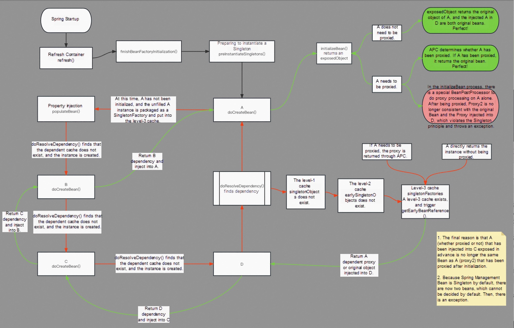
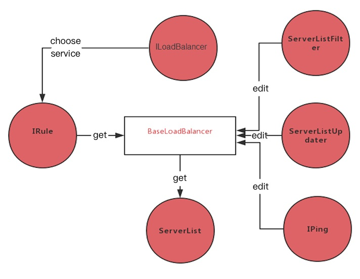
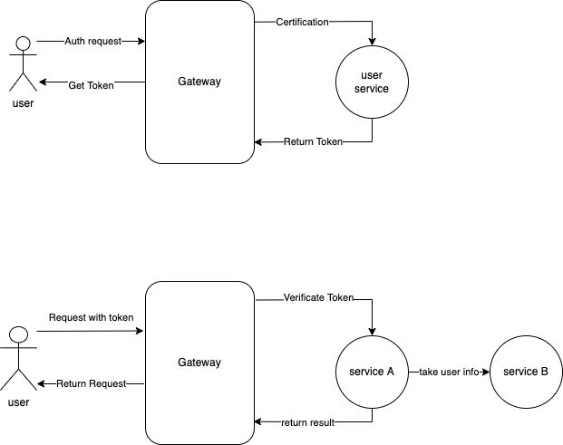
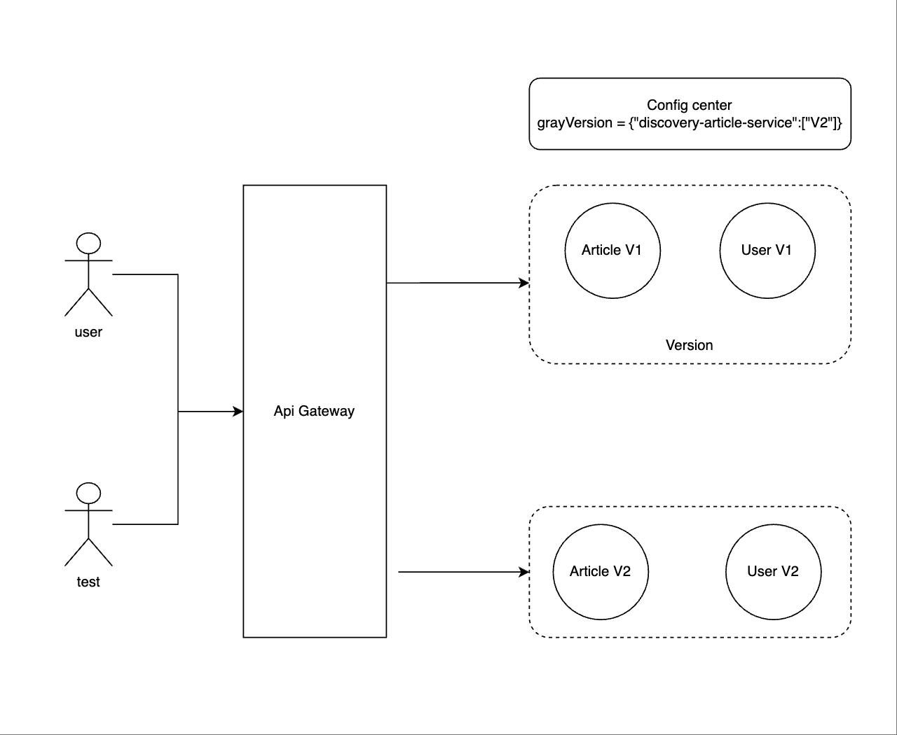

# VII. Spring Chapter

### Design Philosophy & Beans

#### **1、IOC Inversion of Control**

IoC (Inverse of Control: Control Reversal) is a design philosophy that transfers the control of manually creating objects in a program to the Spring framework for management. IoC is also applied in other languages and is not exclusive to Spring.

The IoC container is the vehicle Spring uses to implement IoC. The IoC container is essentially a Map (key, value), where the Map stores various objects. By entrusting the interdependencies between objects to the IoC container and allowing the IoC container to handle the injection of objects, the development of applications can be significantly simplified, freeing them from complex dependencies. The IoC container acts like a factory—when you need to create an object, you only need to configure the configuration file/annotations without worrying about how the object is created.

**DI (Dependency Injection)**

DI (Dependency Injection): From the container's perspective, it injects other objects that the creation of an object depends on into the object.

#### **2、AOP Aspect-Oriented Programming**

AOP (Aspect-Oriented Programming: Aspect-Oriented Programming) can encapsulate logic or responsibilities that are unrelated to business but are commonly invoked by business modules (such as transaction processing, logging management, access control, etc.), making it easier to reduce duplicate code in the system, lower coupling between modules, and enhance future scalability and maintainability.

Spring AOP is based on dynamic proxy. If the object to be proxied implements an interface, Spring AOP will use JDKProxy to create the proxy object. However, for objects that do not implement an interface, JDK Proxy cannot be used for proxying. In this case, Spring AOP uses Cglib dynamic proxy based on the bytecode stream of the asm framework. At this point, Spring AOP uses Cglib to generate a subclass of the proxied object as the proxy.

#### **3、Bean lifecycle**

**Singleton object:** singleton

Summary: The lifecycle of a singleton object is the same as that of the container

**Prototype object:** prototype

Birth: When using the object, the Spring framework creates it for us

Living: An object remains alive as long as it is in use

Death: When an object is unused for a long time and has no other references, it is recycled by Java's garbage collection mechanism


Initialization loading process of Beans in IOC container:

```java
@Override
public void refresh() throws BeansException, IllegalStateException {
  synchronized (this.startupShutdownMonitor) {

    // 1) Pre-refresh preparation (set flags, init properties, environment checks)
    prepareRefresh();

    // 2) Obtain a fresh BeanFactory and register bean definitions
    ConfigurableListableBeanFactory beanFactory = obtainFreshBeanFactory();

    // 3) Prepare the BeanFactory (set class loader, property editors, resolvers, etc.)
    prepareBeanFactory(beanFactory);

    try {
      // 4) Hook for post-processing the BeanFactory before beans get created
      postProcessBeanFactory(beanFactory);

      // 5) Invoke BeanFactoryPostProcessor beans (including ConfigurationClassPostProcessor)
      invokeBeanFactoryPostProcessors(beanFactory);

      // 6) Register BeanPostProcessors (to intercept bean creation lifecycle)
      registerBeanPostProcessors(beanFactory);

      // 7) Initialize MessageSource (i18n: message binding & resolution)
      initMessageSource();

      // 8) Initialize the application event multicaster
      initApplicationEventMulticaster();

      // 9) Template method for subclasses to customize refresh logic
      onRefresh();

      // 10) Register application listeners (ApplicationListener implementations)
      registerListeners();

      // 11) Instantiate all remaining non-lazy singleton beans
      finishBeanFactoryInitialization(beanFactory);

      // 12) Complete the refresh: publish events, start Lifecycle beans, etc.
      finishRefresh();
    }
    // ...
  }
}
```

Summary:

**Four stages**

*   Instantiation
*   Populate
*   Initialization
*   Destruction

**Multiple extension points**

*   Affects multiple Beans
    *   BeanPostProcessor
    *   InstantiationAwareBeanPostProcessor
*   Affects a single Bean
    *   Aware

**Complete process**

1.  Instantiating a Bean - that is what we commonly refer to as **new**;
2.  Configuring the instantiated Bean according to the Spring context - that is **IOC injection**;
3.  If this Bean implements the BeanNameAware interface, its setBeanName(String) method will be called, which means the **Bean's id and name from the Spring configuration file will be passed**
4.  If this Bean implements the BeanFactoryAware interface, its setBeanFactory(BeanFactory) method will be called, passing the **Spring factory itself as configured in the Spring configuration file**;
5.  If this Bean implements the ApplicationContextAware interface, its setApplicationContext(ApplicationContext) method will be called, which passes the same information as point 4, but since ApplicationContext is a sub-interface of BeanFactory, it is **more flexible**
6.  If this Bean is associated with the BeanPostProcessor interface, the postProcessBeforeInitialization() method will be called. BeanPostProcessor is often used for modifying Bean content. Since this method is called at the end of Bean initialization, it can also be applied to **in-memory or caching technologies**
7.  If the Bean has the init-method attribute configured in the Spring configuration file, its configured initialization method will be called automatically.
8.  If this Bean implements the BeanPostProcessor interface, postProcessAfterInitialization() will be called, **logging messages or upgrading beans in the三级缓存 technology**
9.  After the above work is completed, this Bean can be applied. This Bean is a Singleton, so generally, calling a Bean with the same id will be an instance with the same content address. Of course, in the Spring configuration file, it can also be configured as non-Singleton, but we will not elaborate on this here.
10.  When a Bean is no longer needed, it will go through a cleanup phase. If the Bean implements the DisposableBean interface, or according to the spring configuration's destroy-method attribute, the implemented destroy() method will be called.

#### **4**, Bean scope

| Name           | Scope                                                        |
| -------------- | ------------------------------------------------------------ |
| singleton      | Scope of singleton objects, default values                   |
| prototype      | Each retrieval creates a new bean instance                   |
| request        | Each HTTP request generates a new bean, which is only valid within the current HTTP request. |
| session        | In an HTTP session, the container will return the same instance |
| global-session | Stores objects in the session domain of a web project cluster; if there is no cluster, the global session is equivalent to a session |

The default scope is singleton; when multiple threads access the same bean, there may be thread safety issues

**Methods to ensure thread safety:**

1.  Avoid defining mutable member variables in Bean objects as much as possible (not very practical).

2.  Define a ThreadLocal member variable in the class and store the required mutable member variables in ThreadLocal.

**ThreadLocal**：

Each thread has its own ThreadLocalMap object where it can store its own objects, keeping them separate, so that threads can correctly access their own objects.

Use a shared ThreadLocal static instance as the key to store references of different objects in the ThreadLocalMap of different threads, and then **obtain the object saved in your thread by calling the get() method of this static ThreadLocal instance at various points during thread execution**, avoiding the hassle of passing this object as a parameter.

#### 5\. Circular Dependency

A circular dependency is essentially a circular reference, where two or more beans hold references to each other, ultimately forming a 闭环. For example, A depends on B, and B depends on A.

In Spring, circular dependency scenarios include:

* prototype prototype bean cyclic dependency

* Constructor cyclic dependency (constructor injection)

* Field property cyclic dependency (setter injection)

  Among them, the cyclic dependency problem of constructors cannot be solved, and lazy loading can be used when solving property cyclic dependencies. Spring adopts the method of exposing objects in advance.

**Lazy loading @Lazy solves circular dependency problems**

When Spring starts, it parses and converts all bean information (including XML and annotations) into Spring-recognizable BeanDefinition objects and stores them in a HashMap for use during subsequent initialization. It then processes each BeanDefinition. The initialization of regular beans is performed during the container's startup initialization phase, while beans marked with lazy-init=true are triggered during the first **context.getBean() call from the container**.


**The three-level cache solves the circular dependency problem**

#### 

1.  After ClassA is initialized by the constructor and exposed to the singletonFactorys (in the three-level cache) in advance in the Spring container, Spring initializes ClassA.

2.  ClassA calls the setClassB method. Spring first tries to get ClassB from the container, but ClassB does not exist in the Spring container.

3.  Spring initializes ClassB. ClassB first exposes itself in the three-level cache, then retrieves ClassA from the first, second, and third-level caches of the Spring container.

4.  After obtaining ClassA, instantiate it and place it in the singleton pool. The instantiated ClassA retrieves ClassB through the Spring container, completing its own object initialization.

5.  This way, both ClassA and ClassB have completed their object initialization, thus resolving the cyclic dependency issue.

### Spring annotations

#### 1、@SpringBoot

**Annotation for declaring beans**

**@Component** A common annotation that can be used to mark any class as a Spring component

**@Service** Used in the business logic layer (service layer)

**@Repository** Used in the data access layer (dao layer)

**@Controller** Used in the presentation layer, declaration of a controller (controller layer)

**Annotations for injecting beans**

**@Autowired**: Injects by default according to type, **@Qualifier**: Can be changed to name

**@Resource**: Injects by default according to name, JDK annotation, deprecated in newer versions

**@Autowired注解原理**

The use of @Autowired simplifies our development,

Implementing the AutowiredAnnotationBeanPostProcessor class, which implements some extension interfaces of the Spring framework. Implementing the BeanFactoryAware interface to hold the BeanFactory internally (making it easy to obtain the dependent Bean). Implementing the MergedBeanDefinitionPostProcessor interface, to obtain the @Autowired information inside before instantiating the Bean and cache it; Implementing the postProcessPropertyValues interface, to take the annotation information from the cache after instantiating the Bean, and set the dependent objects to the Bean properties through reflection.

**@SpringBootApplication**

```java
@SpringBootApplication
public class JpaApplication {
    public static void main(String[] args) {
        SpringApplication.run(JpaApplication.class, args);
    }
}
```

**@SpringBootApplication** annotation is equivalent to the following three annotations:

*   **@SpringBootConfiguration：** It is based on the **Configuration** annotation, basically supporting the **JavaConfig** way for configuration
*   **@EnableAutoConfiguration：** Enables the **auto-configuration** feature
*   **@ComponentScan：** It is a scanning annotation, which by default scans the package **under the current class**

Among them, `@EnableAutoConfiguration` is key (enabling auto-configuration). Internally, it actually loads information from the `META-INF/spring.factories` file, then filters out data with `EnableAutoConfiguration` as the key, loads it into the IOC container, and achieves auto-configuration functionality!

It primarily loads the main configuration class annotated with @SpringBootApplication. The main function of this @SpringBootApplication annotated main configuration class is that SpringBoot enables an auto-configuration feature annotated with @EnableAutoConfiguration.

**@EnableAutoConfiguration作用：**

It mainly utilizes an

EnableAutoConfigurationImportSelector selector to import some components into the Spring container.

```java
@Import(EnableAutoConfigurationImportSelector.class)
public @interface EnableAutoConfiguration 
```

#### **2、@SpringMVC**

```java
// @Controller – Declares the class as a Controller in Spring MVC
// @RequestMapping – Maps web requests to specific handler classes or methods
// @ResponseBody – Indicates that the return value should be written directly to the HTTP response body 
//                 instead of being resolved to a view; commonly used to return JSON data
// @RequestBody – Binds the HTTP request body to a method parameter (instead of appending parameters to the URL)
// @PathVariable – Binds a URI template variable to a method parameter

// Example: Mapping a path with a path variable
@RequestMapping("/hello/{name}")
public String hello(@PathVariable String name) {
    return "Hello, " + name;
}
```

**SpringMVC Principle**


1.  Client (browser) sends a request, directly requesting to DispatcherServlet.
2.  DispatcherServlet calls HandlerMapping based on the request information to parse the corresponding Handler.
3.  After parsing the corresponding Handler (which is the Controller), the HandlerAdapter adapter begins to process it.
4.  HandlerAdapter will call the actual processor based on the Handler to handle the request and process the corresponding business logic.
5.  After processing the business, the processor returns a ModelAndView object, where the Model is the data object to be returned.
6.  The ViewResolver looks up the actual View based on the logical View.
7.  DispaterServlet passes the returned Model to the View (view rendering).
8.  Returns the View to the requester (browser).

#### 3、@SpringMybatis

```java
@Insert   // Executes an INSERT SQL statement; syntax is identical to the <insert> in XML
@Select   // Executes a SELECT SQL statement; syntax is identical to the <select> in XML
@Update   // Executes an UPDATE SQL statement; syntax is identical to the <update> in XML
@Delete   // Executes a DELETE SQL statement; syntax is identical to the <delete> in XML

@Param    // Binds a method parameter to a named parameter in the SQL statement

@Results  // Defines a collection of @Result mappings
@Result   // Maps a single column to a property

@ResultMap // References a predefined result mapping

@SelectKey // Retrieves the most recently inserted ID (often used for auto-increment primary keys)
```

**How to prevent SQL injection in MyBatis?**

Simply put, #{} is precompiled and secure, while **{} is not precompiled and merely retrieves the value of variables, making it non-secure and vulnerable to SQL injection. When writing MyBatis mapping statements, it is best to use the format “#{xxx}”. If you need to dynamically pass in table names or column names, you also need to make the following modifications: add the attribute **statementType="STATEMENT"**, and change all variable value retrievals in the SQL to **{xxxx}

**Differences between Mybatis and Hibernate**

**Hibernate Framework:**

**Hibernate** is an open-source object-relational mapping framework that provides very lightweight object encapsulation for JDBC, establishing a mapping between objects and database tables. It is a fully automated, completely object-oriented persistence framework.

**Mybatis Framework:**

**Mybatis** is an open-source object-relational mapping framework, originally named iBatis, which was renamed after Google took over in 2010. It is a semi-automated persistence layer framework.

**Difference:**

**In terms of development**

During the project development process, in terms of speed:

In Hibernate development, SQL statements are encapsulated and can be used directly, accelerating system development;

MyBatis is semi-automated, requiring manual SQL completion, which is slightly more cumbersome;

However, nothing is absolute; for large and complex system projects with numerous complex statements, Hibernate may not be the ideal solution.

**SQL optimization aspects**

Hibernate automatically generates SQL, and some statements are quite complex, which may consume more performance;

MyBatis manually writes SQL, which can avoid unnecessary queries and improve system performance;

**Object management comparison**

Hibernate is a complete object-relational mapping framework; in development projects, there is no need to focus too much on the underlying implementation, as long as you manage objects

MyBatis needs to manage mapping relationships itself;

#### 4、@Transactional

```java
@EnableTransactionManagement 
@Transactional
```

Precautions:

① Do not handle time-consuming tasks in transaction functions, as this will lead to long-term occupation of the database connection.

② Do not handle unrelated business in transaction functions to prevent exceptions that cause transaction rollback.

**Transaction Propagation Attributes**

**1) REQUIRED（default attribute）** If a transaction exists, it supports the current transaction. If there is no transaction, it starts a new transaction.

2.  MANDATORY Supports the current transaction. If there is no current transaction, it throws an exception.

3.  NEVER executes in a non-transactional way, throwing an exception if a transaction is currently active.

4.  NOT\_SUPPORTED executes the operation in a non-transactional way, suspending the current transaction if one exists.

5.  REQUIRES\_NEW creates a new transaction, suspending the current transaction if one exists.

6.  SUPPORTS supports the current transaction, executing in a non-transactional way if no transaction is active.

**7) NESTED** （**Local Rollback**） Supports the current transaction, adds Savepoint points, and commits or rolls back synchronously with the current transaction. **A very important concept of nested transactions is that inner transactions depend on outer transactions. If the outer transaction fails, it will roll back the actions taken by the inner transaction. However, a failure in the inner transaction will not cause the outer transaction to roll back.**

### Reading the Spring Source Code

#### **1、Design Patterns in Spring**

**Singleton Design Pattern:** Beans in Spring are default singletons.

**Factory Design Pattern:** Spring uses the Factory pattern to create bean objects through BeanFactory and ApplicationContext.

**Proxy Design Pattern:** Implementation of Spring AOP functionality.

**Observer Pattern:** Spring's event-driven model is a classic application of the observer pattern.

**Adapter Pattern:** Spring AOP's enhancements or notifications (Advice) utilize the adapter pattern, and Spring MVC also uses the adapter pattern to adapt controllers.

# Section 8: Spring Cloud

#### Why SpringCloud

> Spring Cloud is an ordered collection of frameworks. It cleverly simplifies the development of distributed system infrastructure using the development convenience of Spring Boot, such as **service discovery and registration**, **configuration center**, **message bus**, **load balancing**, **circuit breaker**, **data monitoring**, etc., all of which can be achieved with Spring Boot's development style to enable one-click startup and deployment.

| SpringCloud (Microservice Solution)       | Dubbo (Distributed Service Governance Framework) |
| ----------------------------------------- | ------------------------------------------------ |
| Rest API (Lightweight, Flexible, Swagger) | RPC Remote Invocation (Efficient, Coupled)       |
| Eureka、Nacos                             | Zookeeper                                        |
| Easy to use                               | High performance                                 |
| Coming soon: SpringCloud2.0               | Resumed after a 5-year hiatus in 2017            |

SpringBoot is a Maven-based solution introduced by Spring to address the redundancy of traditional framework configuration files and the complexity of component assembly, **aimed at quickly setting up a single microservice**. SpringCloud depends on SpringBoot, whereas SpringBoot is not dependent on SpringCloud; it can even be excellently integrated with Dubbo for development.

MartinFlower proposed that communication between microservices is done through RestFulApi, with specific implementation

*   RestTemplate: Based on the HTTP protocol
*   Feign: Encapsulates ribbon and Hystrix, simplifies client development workload
*   RPC: Based on TCP protocol, serialization and transmission efficiency are significantly improved
*   MQ: Asynchronous decoupling of calls between microservices


#### Spring Boot

> Spring Boot allows you to create a Spring application through **simple steps**.
>
> Spring Boot provides **out-of-the-box functionality** for integrating third-party frameworks with Spring.
>
> The core philosophy of Spring Boot is **"convention over configuration"**.

**The problems Spring Boot solves**

*   When building the backend framework, Maven configuration needs to be manually added, involving many XML configuration files, which increases the difficulty and time cost of setup.

*   Compiling the project into a war package and deploying it to Tomcat, the project deployment depends on Tomcat, which is very inconvenient.

*   Application monitoring is relatively simple, usually done through an interface with no logic to determine the application's live status.

**Spring Boot Advantages**

**Auto-configuration:** Spring Boot initializes all configured Beans based on certain rules. It reduces a lot of repetitive work.

For example, when using MongoDB, you only need to add MongoDB's Starter package and configure the connection information, then you can directly use MongoTemplate for auto-configuration to operate the database. It simplifies Maven Jar package dependencies and reduces the chance of errors in cumbersome configurations.

**Embedded Container:** Spring Boot applications can be deployed without being deployed to external containers, such as Tomcat.

The application can be directly compiled into an executable jar package through Maven commands, and can be started using the java -jar command, which is very convenient.

**Application Monitoring:** Spring Boot comes with a built-in monitoring feature called Actuator, which can be used to monitor the internal runtime status of the program,

such as Bean loading status, environment variables, log information, thread information, etc. Of course, you can also customize monitoring related to your business, by exposing it through Actuator's endpoint information.

```java
spring-boot-starter-web          
spring-boot-starter-data-redis   
spring-boot-starter-data-mongodb 
spring-boot-starter-data-jpa    
```

**Customize a Starter**

1.  Create a Starter project, define the configuration (Properties) class needed for the Starter, such as database connection information;

2.  Write an auto-configuration class, which is to obtain configurations and automatically assemble Beans based on those configurations;

3.  Write a spring.factories file to load auto-configuration classes, Spring will scan the spring.factories file upon startup;

4.  Write a configuration hint file spring-configuration-metadata.json (not mandatory), when adding configurations, we want to know the specific purpose of each configuration item, and you can use a hint file to provide this information;

5.  Introduce the Maven dependency of a custom Starter into your project, and you can use it after adding configuration values.

**Spring Boot Admin** (visualizes data provided by actuator)

*   Display the monitoring status of the application, view JVM and thread information

*   Application online/offline monitoring

*   Visualize logs, dynamically switch log levels

*   Practical features such as HTTP request information tracking

#### GateWay / Zuul

> GateWay's goal is to replace Netflix Zuul. It is developed based on technologies such as Spring 5.0+SpringBoot 2.0+WebFlux, providing a **unified routing** method (reverse proxy) and offering basic gateway functions based on the **Filter** (filtering requests by defining filters to complete certain functions) chain, such as: authentication, traffic control, circuit breaking, path rewriting, and log monitoring.

**Composition:**

* **Route:** The most basic working unit of the gateway. A route consists of an ID, a target URL, a series of statements (matching conditions), and Filters. If the statement is true, the route is matched.

* **Predicates:** Referenced from Java8's Predicate, matching all content in the Http request (similar to location matching in nginx). If the predicate matches the request, the route is matched.

* **Filters:** Standard Spring webFilter, using filters to execute business logic before or after the request.

  Pre `pre` type filter before the request: performs **parameter validation**, **permission validation**, **traffic monitoring**, **logging output**, **protocol conversion**, etc.

  Post `post` type filter before the request: performs modifications to **response content**, **response headers**, **logging output**, **traffic monitoring**, etc.

**GateWayFilter** is applied to individual routes, **GlobalFilter** is applied to all routes.

#### Eureka / Zookeeper

> A service registry center is essentially designed to decouple service providers and consumers, and to support elastic scaling and resizing features. The number and distribution of a microservice provider are often dynamically changing.


| Difference   | Zookeeper                          | Eureka                                            | Nacos                                    |
| ------------ | ---------------------------------- | ------------------------------------------------- | ---------------------------------------- |
| CAP          | CP                                 | AP                                                | CP/AP Switching                          |
| Availability | Unavailable during election period | Self-protection mechanism, data is not up-to-date |                                          |
| Composition  | Leader and Follower                | Node Equality                                     |                                          |
| Advantages   | Distributed coordination           | Registration and discovery                        | Registry center and configuration center |
| Underlying   | Process                            | Service                                           | Jar package                              |

**Eureka** enhances system flexibility, scalability, and usability through mechanisms such as **heartbeat detection**, **health checks**, and **client-side caching**.


1.  us-east-1c, us-east-1d, us-east-1e represent different data centers, and **each Eureka Server is a cluster**.
2.  Service registers services with Eureka as a service provider, and upon receiving a registration event, Eureka performs **data synchronization within the cluster and partitions**. Client, as a consumer (service consumer), can retrieve service registration information from Eureka to perform service calls.
3.  After the microservice starts, it periodically sends a heartbeat to Eureka**to renew its information** (the default period is 30 seconds)
4.  If Eureka does not receive a heartbeat from a certain microservice node within a certain time frame (default is 90 seconds), Eureka will de-register that microservice node.
5.  The Eureka Client**caches information from the Eureka Server**. Even if all Eureka Server nodes go down, service consumers can still use the cached information to find service providers

**Eureka Cache**

> After a new service goes live, service consumers**cannot immediately access** the newly launched service and need some time to access it? Or when a service is taken offline, is it still called, and it takes a while for the service to**completely stop**, causing frequent errors during the access period!


After the service is registered to the registry center, the service instance information is**stored in the Registry table**, which is in memory. But Eureka optimizes internally to improve response speed by adding a two-level caching structure, directly caching the instance information needed by the Client and responding to the Client with data fetched from the cache.

* The first-level cache is **readOnlyCacheMap**, which uses **ConcurrentHashMap** to store data. It is mainly responsible for synchronizing data with readWriteCacheMap on a scheduled basis, with the default synchronization interval being **30** seconds.

* The second-level cache is **readWriteCacheMap**, which uses **Guava** to implement caching. The default cache expiration time is **180** seconds. Operations such as service **shutdown, expiration, registration, and status changes** will clear the data in this cache.

* If neither level of cache can retrieve the data, the cache loading will be triggered, fetching data from the storage layer into the cache and then returning it to the Client.

  Eureka designed the two-level caching mechanism to **improve the response speed of Eureka Server**. The drawback is that caching can cause the Client to **fail to obtain the latest service instance information**, leading to the inability to quickly discover new services and services that have been shut down.

**Solution**

*   We can **reduce the update time for read cache** to make service discovery more timely, or **directly turn off the read-only cache**. At the same time, we can shorten the refresh interval for clients like ribbon services. Multi-level caching also makes the C layer (data consistency) very weak.
*   In Eureka Server, there will be **periodic tasks to detect failed services**, removing service instance information from the registry. We can also **reduce the time for this failure detection**, so that services can be cleared from the registry promptly after being taken offline.

**Conditions for enabling self-protection mechanism**

*   Expected minimum number of times to renew per minute (instance \* frequency \* ratio == 10 \* 2 \* 0.85)
*   Expected number of service instances (10)

**Health check**

*   The Eureka Client will periodically send heartbeat to the Eureka Server to prove that it is in a healthy state

*   After integrating SBA, all health status information can be returned to Eureka at once

#### Feign / Ribbon

*   Feign can be combined with Eureka and Ribbon to support load balancing,
*   Feign can be combined with Hystrix to support circuit breaking and fallback
*   Feign can be used to implement fast RPC calls with ProtoBuf


* **InvocationHandlerFactory proxy**

  It uses JDK's dynamic proxy method to generate proxy objects. When we call this interface, we are actually calling the remote HTTP API

* **Contract agreement component**

  For example, whether the request type is GET or POST, what is the URI of the request

* **Encoder encoding component \\ Decoder decoding component**

  Through this component, we can encode and decode request information using the specified encoding method for transmission

* **Logger log recording**

  Responsible for logging in Feign, you can specify the Logger level and customize the log output

* **Client request execution component**

  The component responsible for HTTP request execution, the default Client in Feign is initiated through JDK's HttpURLConnection. A new HttpURLConnection link is created every time a request is sent, which makes Feign's performance very poor. You can improve performance by extending this interface and using high-performance HTTP clients like Apache HttpClient based on connection pooling.

* **Retryer retry component**

  The component responsible for retries, Feign comes built-in with a retryer. When an HTTP request encounters an IO exception, Feign will limit a maximum number of retry attempts to perform the retry operation.

* **RequestInterceptor Request Interceptor**

  Multiple interceptors can be added to Feign, setting some extended parameter information before the request execution.

**Feign best practices**

* Inheritance characteristics

* Interceptors

  For example, adding specified request header information, this can be used when passing certain information between services.

* GET request multiple parameter passing

* Log configuration

  FULL will output all complete request information.

* Exception decoder

  In the exception decoder, you can get exception information instead of a simple code, and then convert it into the corresponding exception object to return.

* How to inherit Hystrix in the source code

  In HystrixFeign.builder, it can be seen that it inherits from Feign's Builder and adds Hystrix's SetterFactory. In the build method, the invocationHandlerFactory is overridden, and when creating, it**returns HystrixInvocationHandler**. During invocation, it**wraps the request as a HystrixCommand** to execute, naturally integrating Hystrix here.

**Ribbon**



**Usage method**

* **Native API**, Ribbon is open-sourced by Netflix and does not use Spring Cloud; it requires using Ribbon's native API.

* **Ribbon + RestTemplate**, after integrating Spring Cloud, it can provide load-balanced services based on RestTemplate.

* **Ribbon + Feign**

  | Component         | Function                                                     |
    | ----------------- | ------------------------------------------------------------ |
  | LoadBalancer      | Defines a series of operation interfaces, such as selecting a service instance. |
  | IRule             | Algorithm strategy; contains many built-in strategies to select service instances for providing services. |
  | ServerList        | Responsible for obtaining service instance information, either from configuration files or from the registration center. |
  | ServerListFilter  | Can filter out unwanted service instance information.        |
  | ServerListUpdater | Responsible for updating locally cached service instance information. |
  | IPing             | Performs availability checks on existing service instances to ensure that the selected ones are available. |

**Load balancing algorithm**

*   RoundRobinRule is a **round-robin algorithm**, A and B take turns to select.

*   RandomRule is a **random algorithm**, this is relatively simple, randomly select from the service list.

*   BestAvailableRule selects the server with the **smallest concurrent request**

**Custom load balancing algorithm**

*   Implement the Irule interface
*   Inherit from AbstractLoadBalancerRule class

**Custom Load Balancing Use Cases** (Core)

* **Canary release**

  Gray release is a way of publishing that allows for a smooth transition. During the release process, a portion of the application is first released, allowing designated users to use the newly released application. Once testing shows no issues, the rest of the application is then fully released. If there are problems with the newly released version, only that portion needs to be rolled back, without rolling back the entire application.

* **Version Isolation**

  Version isolation is similar to gray release. For compatibility or transitional purposes, some applications may have multiple versions. At this point, how to ensure that the 1.0 version client does not call the 1.1 version service is the issue we need to consider.

* **Fault Isolation**

  When a failure occurs in an online instance, to avoid affecting users, we usually first preserve evidence such as thread information, JVM information, etc., and then restart or directly stop the instance. Offline, we analyze the cause of the failure based on some information. If I can achieve fault isolation, I can directly isolate the problematic instance, preventing normal user requests from accessing it, while allowing only specified users to access it. This way, we can use specific users to test and analyze the problematic instance.

#### Hystrix / Sentinel

**Service avalanche scenario**

You are both a service consumer and a service provider, and synchronous calls waiting for results lead to resource exhaustion.

**Solution**

Provider side: Scaling, rate limiting, code issue troubleshooting, adding hardware monitoring

Consumer side: Using Hystrix for resource isolation, circuit breaking, and degradation, and quick failure


**The role of the Hystrix circuit breaker**

*   **Request Wrapping** will encapsulate the user's operations uniformly, and the purpose of uniform encapsulation is for unified control.
*   **Resource Isolation and Rate Limiting** will isolate the corresponding resources according to the specified type, such as **thread pools** and **semaphores**.
    *   Counter rate limiting, for example, limits the number of requests to 1000 within 5 seconds, and once the limit is exceeded, it enforces rate limiting; if not exceeded, it resets the counter.
    *   Sliding window rate limiting addresses the issue of insufficient precision in counters by dividing a window into multiple sliding windows.
    *   Token bucket rate limiting is similar to ticket sales at a scenic spot; the speed of selling tickets is fixed, and you need a token to process requests
    *   Leaky bucket rate limiting is a producer-consumer model that implements constant-speed request processing and can absolutely prevent sudden traffic spikes
*   **Failure fallback** is actually an alternative plan, meaning that when a request fails, whether there is an alternative plan to meet the needs of this request.
*   **Circuit breaker** is the **most core** one. If the circuit breaker is in the open state, then all requests will fail and execute the fallback logic. If the circuit breaker is in the closed state, then the request will be executed normally. In some scenarios, we need to manually **open the circuit breaker to force degradation**.
*   **Metrics monitoring** will monitor the **lifecycle of requests**, including states such as success, failure, timeout, and rejection.

**Pitfalls encountered when using Hystrix**

* Configuration can be connected to a **configuration center** for dynamic adjustment.

  Hystrix has a large number of configuration items. If not connected to a configuration center, all configurations can only be modified in the code, making it difficult to handle emergencies in cluster deployments. Our project only sets a CommandKey, and the rest are specified in the configuration center. In emergencies, if some requests need to be isolated, simply modify them in the configuration center and force an update.

* Manual tracking can be implemented in the rollback logic or alerts can be triggered through output logs

  When a request fails or times out, the fallback logic will be executed. If there are numerous fallbacks, it indicates that some service is experiencing issues. At this point, we can perform instrumentation in the fallback logic to report data to the monitoring system, or output fallback logs for processing by a centralized log collection program. These methods can expose the problem, allowing for alerting operations through real-time data analysis.

* Be cautious when using **ThreadLocal** with the **thread pool isolation** pattern

  When using thread pool isolation mode, the isolated method is wrapped as a Command and dropped into a separate thread pool for execution. At this point, the context switches from thread A to thread B, causing the data in ThreadLocal to be lost

* Use semaphores extensively in **Gateway**

  The gateway is the entry point for all requests, and the number of routing services can be very large, ranging from dozens to hundreds. If thread pools are used for isolation, it would require creating hundreds of independent thread pools, which incurs significant overhead. Using semaphores for isolation, on the other hand, reduces overhead and also serves to limit traffic flow.

**Sentinel**

> Sentinel is a traffic control, circuit breaking, and degradation component designed for cloud-native microservices.
>
> As an alternative to Hystrix, addressing issues: service avalanche, service degradation, service circuit breaking, service rate limiting

Differences from Hystrix:

*   Standalone deployable Dashboard (developed based on Spring Boot) control console component
*   Does not depend on any framework/libraries, reduces code development, and can complete fine-grained control through the UI interface


**Rich Application Scenarios**: Sentinel has handled the core scenarios of Alibaba's 21-day Double 11 traffic for nearly 10 years, such as flash sales, message peak shaving and valley filling, cluster traffic control, real-time circuit breaking for downstream unavailable applications, etc.

**Comprehensive Real-time Monitoring**: It is possible to view the summary of clusters below a scale of 500 and also see second-level data for individual machines.

**Extensive open-source ecosystem:** Integration with SpringCloud and Dubbo. You only need to import the corresponding dependencies and perform simple configuration to quickly integrate Sentinel.

**Difference:**

*   Sentinel does not 放过 a request attempt to self-heal like Hystrix; it clearly follows the time window, rejecting requests within the time window after a circuit break is triggered, and then 恢复 after the time window.
*   The rule data added in the Sentinel Dashboard is stored in memory, and when the microservice is stopped, the rule data disappears, which is not suitable for production environments. You can persist Sentinel rule data to the Nacos configuration center and let the microservice fetch it from Nacos.

| #                                        | Sentinel                                                     | Hystrix                                  |
| ---------------------------------------- | ------------------------------------------------------------ | ---------------------------------------- |
| Isolation Strategy                       | Semaphore Isolation                                          | ThreadPool Isolation/Semaphore Isolation |
| Circuit Breaker and Degradation Strategy | Based on response time or failure rate                       | Based on failure rate                    |
| Real-time metrics implementation         | Sliding window                                               | Sliding Window (Based on RxJava)         |
| Scalability                              | Multiple extension points                                    | In the form of plugins                   |
| Rate Limiting                            | Supports rate limiting based on QPS and call relationships   | Not supported                            |
| Traffic Shaping                          | Supports slow start, governor mode                           | Not supported                            |
| System load protection                   | Supported                                                    | Not supported                            |
| Console                                  | Ready to use, configurable rules, view second-level monitoring, machine discovery, etc. | Incomplete                               |
| Adaptation of common frameworks          | Servlet, Spring Cloud, Dubbo, gRPC                           | Servlet, Spring Cloud Netflix            |

#### Config / Nacos

> Nacos is an Alibaba open-source project that provides a **service discovery**, **configuration management**, and **service management platform** for microservice architectures.
>
> Nacos is a combination of **service registry + configuration center** (Nacos=Eureka+Config+Bus)

**Nacos** Functional Features

*   Service Discovery and Health Checks
*   Dynamic configuration management
*   Dynamic DNS service
*   Service and metadata management

**Protection threshold:**

When the number of healthy instances of service A / total instances < the protection threshold, it indicates that there are really not many healthy instances left. At this point, the protection threshold will be triggered (status true), and Nacos will provide all instance information (both healthy and unhealthy) of the service to the consumers. Consumers may access unhealthy instances, resulting in request failures, but this is better than causing an avalanche. Some requests are sacrificed to ensure the usability of the entire system.

**Nacos** Data Model (Domain Model)

*   **Namespace** represents different environments, such as development (dev), testing (test), and production (prod)
*   **Group** represents a specific project, such as the Java Cloud Project
*   **Service** Specific xxx service in a project
*   **DataId** Specific xxx configuration file in a project

Configuration automatic update can be achieved through Spring Cloud's original annotation `@RefreshScope`

#### Bus / Stream

> Spring Cloud Stream message-driven components help us build **message-driven** microservices faster and more conveniently
>
> Essence: Hides the differences between various underlying **MQ** message middleware, unifies the **MQ** programming model, reduces the cost of learning, developing, and maintaining **MQ**, currently supporting Rabbit, Kafka two messaging

#### **Sleuth / Zipkin**

**Full-link tracking**


**Trace ID**: When a request is sent to the entry point of a distributed system, Sleuth creates a unique tracking identifier Trace ID for that request. As the request flows within the distributed system, the framework maintains this unique identifier until it is returned to the requester

**Span ID**: To track the time delay of each processing unit, when a request arrives at each service component, it is also marked with a unique identifier SpanID for its start and end.

Spring Cloud Sleuth (Tracing Service Framework) can trace calls between services. Sleuth can record which services a service request goes through, the processing time of the service, etc. Based on this, we can clarify the invocation relationships between microservices and conduct problem tracing and analysis.

**Time Consumption Analysis**: Use Sleuth to understand the time consumption of sampled requests, analyzing service performance issues (which service calls are relatively time-consuming)

**Link Optimization**: Identify frequently called services and optimize them specifically

**Aggregated Display**: Send data information to Zipkin for aggregation, utilizing Zipkin to store and display data.

### **Security and Authentication**

* Session

  The most commonly used and simplest authentication method. There is a situation of **multi-node session loss**, which can be solved through **nginx sticky Cookie** and Redis centralized Session storage.

* HTTP Basic Authentication

  The server verifies the Authorization in the request header, which is base64 encrypted, and the username and password.

* Token

  A session is just a key, and the session information is stored on the backend. The token stores user information, which is then encrypted using an encryption algorithm, and only the server can decrypt it. The server decrypts the token to obtain user information after receiving it.

* JWT authentication

> JWT (JSON Web Token) users provide their username and password to the authentication server, which verifies the legitimacy of the information submitted by the user. If the verification is successful, a Token is generated and returned; users can then use this Token to access protected resources on the server.



1.  The authentication service provides an authenticated API to verify user information and returns the authentication result.
2.  Using the RSA algorithm in JWTUtils, JWT tokens are generated, encapsulating the user ID and expiration period within the token.
3.  Inter-service parameters are passed through request headers, and context is passed internally through ThreadLocal.
4.  The issue of Hystrix causing ThreadLocal to become invalid can be addressed by overriding Hystrix's Callable method and passing the required data.

**Best practices for tokens**

* Set a relatively short (reasonable) expiration time.

* The revoked Token **should be cleared promptly** (put into Redis for a layer of filtering).

  Although the information of Tokens cannot be modified, a layer of filtering can be implemented at the verification level for processing.

* Monitor the **usage frequency** of the Token.

  To prevent data from being scraped by others, the most common approach is to monitor usage frequency, as the access frequency of crawler programs can be traced.

* Sensitive core function operations can use **dynamic verification** (captcha).

  For example, the withdrawal function requires a CAPTCHA verification again during withdrawal to prevent unauthorized operations.

* **Network environment, browser** information identification.

  The bank app has high requirements for the environment. If it loses connection while in use, the app will automatically exit and require relogin because the network environment is different from before. There are also some checks related to browser information, etc., all of which can be used to ensure the security of the backend API.

* **Encryption Key** supports dynamic modification.

  If the encryption key for the Token is leaked, it means others can forge your Token. The keys can be stored in a configuration center to support dynamic modification and refreshing. It is important to note that it is recommended to perform replacement operations during low traffic periods, otherwise all Tokens will become invalid, all online requests will need to reapply for Tokens, and the traffic volume will be high.

### Gray release

**Pain points:**

* Large number of services, frequent business changes, one release per week

* Gray release can reduce the risk of release failure, **reduce the scope of impact**

  Through grayscale release, a portion of users can first experience the new service, or only testers can conduct testing, and then fully release the service once everything is functioning properly. This helps reduce the impact scope caused by release failure.

* When a release fails, you can **quickly roll back**, without affecting users

  After grayscale release, if a problem is found with this node, only this node needs to be rolled back. Of course, not rolling back is also fine, as the grayscale strategy isolates issues and does not affect normal users.

Can perform canary releases through the Ribbon load balancing strategy, and can use more reliable Discovery

**Discovery**

> An enterprise-level open-source microservice solution based on components such as Discovery for service registration and discovery, Ribbon for load balancing, Feign, and RestTemplate for invocation, including features like canary release, canary routing, and service isolation.



1.  First, remove the service that needs to be released from the forwarding process, and then release it after the traffic is excluded.

2.  Upgrade the version on some machines, while users still request the old service by default, using the version to support test requests.

3.  After testing is complete, let the new version receive normal traffic, then deploy the next node, and so on.

```java
grayVersions = {"discovery-article-service":["1.01"]}
```

### Multi-version isolation


**Local Reuse Test Service**\-Highlights of Eureka Zone

**region** Geographical partitioning, such as Beijing, Shanghai, etc.

**zone** Can be simply understood as specific data centers within a region

During the invocation process, it will prioritize initiating calls to the same zone. When the same named zone is not found, it will choose other zones for the call. We can leverage this feature to address the issue of needing to start multiple services locally.

\[^\]: When you access the modified service A, this service depends on services B and C. B and C are not running locally, so when B and C cannot find the same zone, they will choose other zones for the call, which means they will invoke the B and C services deployed in the test environment. This way, the problem of deploying multiple services locally is resolved.

#### **Component optimization**

When you perform load testing on the gateway, you will find that the concurrency does not increase and the error rate is also very high. This is because you are using the default configuration. At this point, we need to adjust the configuration to achieve the optimal effect.

First, we can optimize the containers, the most common being the **built-in Tomcat** container,

```java
server.tomcat.accept-count     # The maximum number of requests that can be queued when all request-processing threads are busy.
server.tomcat.max-threads      # The maximum number of request-processing threads.
server.tomcat.max-connections  # The maximum number of connections that the server will accept and process at any given time.
```

The semaphore isolation mode of **Hystrix** is the reason why concurrency cannot be increased significantly; the default semaphore value is 100, meaning the maximum concurrency is only 100, and you have to wait if it exceeds 100.

```java
# Semaphore
zuul.semaphore.max-semaphores              # Semaphore: maximum concurrency

# Thread pool
hystrix.threadpool.default.coreSize        # Core (and by default, max) number of threads in the pool
hystrix.threadpool.default.maximumSize     # Maximum number of threads (if dynamic resizing is enabled)
hystrix.threadpool.default.maxQueueSize    # Maximum queue size for pending tasks
```

Configure the concurrency information for **Gateway**,

```java
gateway.host.max-per-route-connections  # Maximum number of connections per route
gateway.host.max-total-connections      # Maximum total number of connections
```

Adjust the concurrency configuration for **Ribbon**,

```java
ribbon.MaxConnectionsPerHost  # Maximum concurrent connections per service (host)
ribbon.MaxTotalConnections    # Maximum total concurrent connections
```

Modify the default HttpURLConnection of **Feign** to replace it with httpclient to improve performance

```java
feign.httpclient.max-connections-per-route  # Maximum number of connections per route
feign.httpclient.max-connections            # Maximum total number of connections
```

Gateway+Configuration Center to implement dynamic routing

Feign+Configuration Center to implement dynamic logging