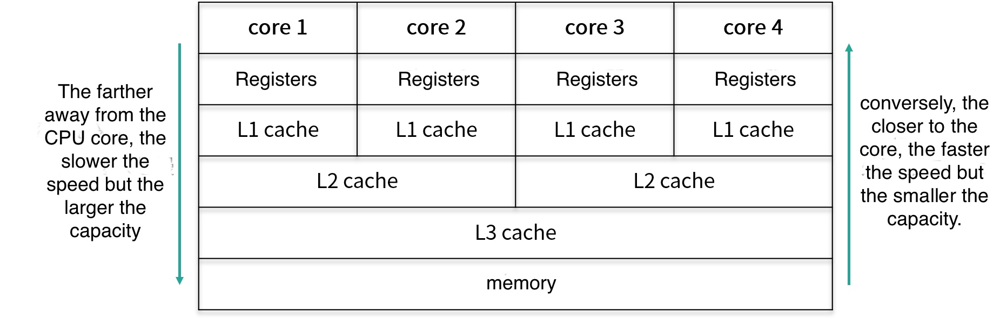
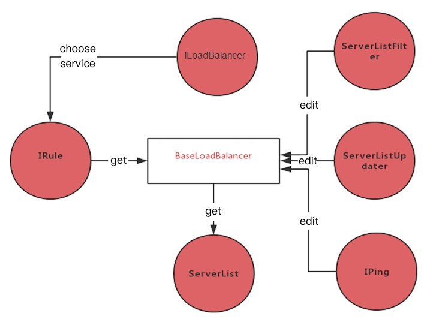

*   [I. Basics](#%E4%B8%80%E5%9F%BA%E7%A1%80%E7%AF%87)
    *   [Network Basics](#%E7%BD%91%E7%BB%9C%E5%9F%BA%E7%A1%80)
        *   [**TCP Three-Way Handshake**](#tcp%E4%B8%89%E6%AC%A1%E6%8F%A1%E6%89%8B)
            *   [**1、OSI and TCP/IP Models**](#1osi%E4%B8%8Etcpip-%E6%A8%A1%E5%9E%8B)
            *   [**2、Common Network Services Layering**](#2%E5%B8%B8%E8%A7%81%E7%BD%91%E7%BB%9C%E6%9C%8D%E5%8A%A1%E5%88%86%E5%B1%82)
            *   [**3\. Differences and Scenarios between TCP and UDP**](#3tcp%E4%B8%8Eudp%E5%8C%BA%E5%88%AB%E5%8F%8A%E5%9C%BA%E6%99%AF)
            *   [**4、TCP Sliding Window, Congestion Control**](#4tcp%E6%BB%91%E5%8A%A8%E7%AA%97%E5%8F%A3%E6%8B%A5%E5%A1%9E%E6%8E%A7%E5%88%B6)
            *   [**5、Causes and Solutions of TCP Stick Packets**](#5tcp%E7%B2%98%E5%8C%85%E5%8E%9F%E5%9B%A0%E5%92%8C%E8%A7%A3%E5%86%B3%E6%96%B9%E6%B3%95)
            *   [**6、TCP and UDP Message Formats**](#6tcpudp%E6%8A%A5%E6%96%87%E6%A0%BC%E5%BC%8F)
        *   [**HTTP protocol**](#http%E5%8D%8F%E8%AE%AE)
            *   [1、HTTP Protocol 1.0\_1.1\_2.0](#1http%E5%8D%8F%E8%AE%AE10_11_20)
            *   [2、Differences between HTTP and HTTPS](#2http%E4%B8%8Ehttps%E4%B9%8B%E9%97%B4%E7%9A%84%E5%8C%BA%E5%88%AB)
            *   [**3、Differences between GET and POST requests**](#3get%E5%92%8Cpost%E8%AF%B7%E6%B1%82%E5%8C%BA%E5%88%AB)
            *   [**4\. Common HTTP response status codes**](#4http%E5%B8%B8%E8%A7%81%E5%93%8D%E5%BA%94%E7%8A%B6%E6%80%81%E7%A0%81)
            *   [**5、Difference between redirection and forwarding**](#5%E9%87%8D%E5%AE%9A%E5%90%91%E5%92%8C%E8%BD%AC%E5%8F%91%E5%8C%BA%E5%88%AB)
            *   [**6\. Differences between Cookies and Sessions.**](#6cookie%E5%92%8Csession%E5%8C%BA%E5%88%AB)
        *   [**Browser input URL process**](#%E6%B5%8F%E8%A7%88%E5%99%A8%E8%BE%93%E5%85%A5url%E8%BF%87%E7%A8%8B)
    *   [**Operating System Basics**](#%E6%93%8D%E4%BD%9C%E7%B3%BB%E7%BB%9F%E5%9F%BA%E7%A1%80)
        *   [**Difference between processes and threads**](#%E8%BF%9B%E7%A8%8B%E5%92%8C%E7%BA%BF%E7%A8%8B%E7%9A%84%E5%8C%BA%E5%88%AB)
            *   [**1、Inter-process communication method IPC**](#1%E8%BF%9B%E7%A8%8B%E9%97%B4%E9%80%9A%E4%BF%A1%E6%96%B9%E5%BC%8Fipc)
            *   [**2\. User Mode and Kernel Mode**](#2%E7%94%A8%E6%88%B7%E6%80%81%E5%92%8C%E6%A0%B8%E5%BF%83%E6%80%81)
            *   [**3\. Process Space of the Operating System**](#3%E6%93%8D%E4%BD%9C%E7%B3%BB%E7%BB%9F%E7%9A%84%E8%BF%9B%E7%A8%8B%E7%A9%BA%E9%97%B4)
        *   [Operating system memory management](#%E6%93%8D%E4%BD%9C%E7%B3%BB%E7%BB%9F%E5%86%85%E5%AD%98%E7%AE%A1%E7%90%86)
            *   [**1、Page replacement algorithms FIFO, LRU**](#1%E9%A1%B5%E9%9D%A2%E7%BD%AE%E6%8D%A2%E7%AE%97%E6%B3%95fifolru)
            *   [**2、Deadlock conditions and solutions.**](#2%E6%AD%BB%E9%94%81%E6%9D%A1%E4%BB%B6%E8%A7%A3%E5%86%B3%E6%96%B9%E5%BC%8F)
    *   [**Java Basics**](#java%E5%9F%BA%E7%A1%80)
        *   [Three characteristics of object-oriented](#%E9%9D%A2%E5%90%91%E5%AF%B9%E8%B1%A1%E4%B8%89%E5%A4%A7%E7%89%B9%E6%80%A7)
            *   [**1、Differences between Java and C++**](#1java%E4%B8%8Ec%E5%8C%BA%E5%88%AB)
            *   [**2、Principles of Polymorphism Implementation**](#2%E5%A4%9A%E6%80%81%E5%AE%9E%E7%8E%B0%E5%8E%9F%E7%90%86)
            *   [3、static and final keywords](#3static%E5%92%8Cfinal%E5%85%B3%E9%94%AE%E5%AD%97)
            *   [4、Abstract Classes and Interfaces](#4%E6%8A%BD%E8%B1%A1%E7%B1%BB%E5%92%8C%E6%8E%A5%E5%8F%A3)
            *   [5、Generics and Generic Erasure](#5%E6%B3%9B%E5%9E%8B%E4%BB%A5%E5%8F%8A%E6%B3%9B%E5%9E%8B%E6%93%A6%E9%99%A4)
            *   [**6、Reflection Principle and Usage Scenarios**](#6%E5%8F%8D%E5%B0%84%E5%8E%9F%E7%90%86%E4%BB%A5%E5%8F%8A%E4%BD%BF%E7%94%A8%E5%9C%BA%E6%99%AF)
            *   [**7、Java Exception Hierarchy**](#7java%E5%BC%82%E5%B8%B8%E4%BD%93%E7%B3%BB)
        *   [Data Structures](#%E6%95%B0%E6%8D%AE%E7%BB%93%E6%9E%84)
            *   [**1\. ArrayList and LinkedList**](#1arraylist%E5%92%8Clinkedlist)
            *   [**2、Fast and safe failure when traversing a List**](#2list%E9%81%8D%E5%8E%86%E5%BF%AB%E9%80%9F%E5%92%8C%E5%AE%89%E5%85%A8%E5%A4%B1%E8%B4%A5)
            *   [**3、Detailed Introduction to HashMap**](#3%E8%AF%A6%E7%BB%86%E4%BB%8B%E7%BB%8Dhashmap)
            *   [**4. ConcurrentHashMap**](#4concurrenthashmap-)
            *   [**5\. Serialization and deserialization**](#5%E5%BA%8F%E5%88%97%E5%8C%96%E5%92%8C%E5%8F%8D%E5%BA%8F%E5%88%97%E5%8C%96)
            *   [**6、String**](#6string)
        *   [Design Patterns and Principles](#%E8%AE%BE%E8%AE%A1%E6%A8%A1%E5%BC%8F%E4%B8%8E%E5%8E%9F%E5%88%99)
            *   [1、Singleton Pattern](#1%E5%8D%95%E4%BE%8B%E6%A8%A1%E5%BC%8F)
            *   [2、Factory Pattern](#2%E5%B7%A5%E5%8E%82%E6%A8%A1%E5%BC%8F)
            *   [3、Abstract Factory Pattern](#3%E6%8A%BD%E8%B1%A1%E5%B7%A5%E5%8E%82%E6%A8%A1%E5%BC%8F)
    *   [Interview Questions](#%E9%9D%A2%E8%AF%95%E9%A2%98)
        *   [Constructor](#%E6%9E%84%E9%80%A0%E6%96%B9%E6%B3%95)
        *   [Initialization Block](#%E5%88%9D%E5%A7%8B%E5%8C%96%E5%9D%97)
        *   [This](#this)
        *   [**The difference between override and overload**](#%E9%87%8D%E5%86%99%E5%92%8C%E9%87%8D%E8%BD%BD%E7%9A%84%E5%8C%BA%E5%88%AB)
        *   [Object class methods](#object%E7%B1%BB%E6%96%B9%E6%B3%95)
        *   [Primitive data types and wrapper classes](#%E5%9F%BA%E6%9C%AC%E6%95%B0%E6%8D%AE%E7%B1%BB%E5%9E%8B%E5%92%8C%E5%8C%85%E8%A3%85%E7%B1%BB)
*   [II. JVM Section](#%E4%BA%8Cjvm%E7%AF%87)
    *   [**JVM memory division**](#jvm%E5%86%85%E5%AD%98%E5%88%92%E5%88%86)
        *   [**1、JVM Runtime Data Areas**](#1jvm%E8%BF%90%E8%A1%8C%E6%97%B6%E6%95%B0%E6%8D%AE%E5%8C%BA%E5%9F%9F)
        *   [**2、Heap Memory Allocation Strategy**](#2%E5%A0%86%E5%86%85%E5%AD%98%E5%88%86%E9%85%8D%E7%AD%96%E7%95%A5)
        *   [**3\. Steps to Create an Object**](#3%E5%88%9B%E5%BB%BA%E4%B8%80%E4%B8%AA%E5%AF%B9%E8%B1%A1%E7%9A%84%E6%AD%A5%E9%AA%A4)
        *   [4、**Object Reference**](#4%E5%AF%B9%E8%B1%A1%E5%BC%95%E7%94%A8)
    *   [**JVM class loading process**](#jvm%E7%B1%BB%E5%8A%A0%E8%BD%BD%E8%BF%87%E7%A8%8B)
        *   [**1\. Parent Delegation Mechanism**](#1%E5%8F%8C%E4%BA%B2%E5%A7%94%E6%B4%BE%E6%9C%BA%E5%88%B6)
        *   [**2\. Tomcat's class loading mechanism**](#2tomcat%E7%9A%84%E7%B1%BB%E5%8A%A0%E8%BD%BD%E6%9C%BA%E5%88%B6)
    *   [JVM Garbage Collection](#jvm%E5%9E%83%E5%9C%BE%E5%9B%9E%E6%94%B6)
        *   [**1、Survival algorithm and two marking processes**](#1%E5%AD%98%E6%B4%BB%E7%AE%97%E6%B3%95%E5%92%8C%E4%B8%A4%E6%AC%A1%E6%A0%87%E8%AE%B0%E8%BF%87%E7%A8%8B)
        *   [**2\. Garbage Collection Algorithms**](#2%E5%9E%83%E5%9C%BE%E5%9B%9E%E6%94%B6%E7%AE%97%E6%B3%95)
            *   [**MinorGC、MajorGC、FullGC**](#minorgcmajorgcfullgc)
        *   [**3\. Garbage Collectors**](#3%E5%9E%83%E5%9C%BE%E6%94%B6%E9%9B%86%E5%99%A8)
        *   [**4\. Configure garbage collector**](#4%E9%85%8D%E7%BD%AE%E5%9E%83%E5%9C%BE%E6%94%B6%E9%9B%86%E5%99%A8)
        *   [**4\. JVM Performance Tuning**](#4jvm%E6%80%A7%E8%83%BD%E8%B0%83%E4%BC%98)
        *   [5、New Features of JDK](#5jdk%E6%96%B0%E7%89%B9%E6%80%A7)
    *   [Online Fault Troubleshooting](#%E7%BA%BF%E4%B8%8A%E6%95%85%E9%9A%9C%E6%8E%92%E6%9F%A5)
        *   [1、Hardware Fault Troubleshooting](#1%E7%A1%AC%E4%BB%B6%E6%95%85%E9%9A%9C%E6%8E%92%E6%9F%A5)
        *   [2、Report Abnormalities | JVM Tuning](#2%E6%8A%A5%E8%A1%A8%E5%BC%82%E5%B8%B8--jvm%E8%B0%83%E4%BC%98)
        *   [3、Large screen anomaly | JUC optimization](#3%E5%A4%A7%E5%B1%8F%E5%BC%82%E5%B8%B8--juc%E8%B0%83%E4%BC%98)
        *   [**4、Interface Latency | SWAP Optimization**](#4%E6%8E%A5%E5%8F%A3%E5%BB%B6%E8%BF%9F--swap%E8%B0%83%E4%BC%98)
        *   [5、**Memory Overflow | Cache Tuning**](#5%E5%86%85%E5%AD%98%E6%BA%A2%E5%87%BA--cache%E8%B0%83%E4%BC%98)
        *   [6: CPU spikes | Infinite loop](#6cpu%E9%A3%99%E9%AB%98--%E6%AD%BB%E5%BE%AA%E7%8E%AF)
*   [III. Multithreading Chapter](#%E4%B8%89%E5%A4%9A%E7%BA%BF%E7%A8%8B%E7%AF%87)
    *   [Thread Scheduling](#%E7%BA%BF%E7%A8%8B%E8%B0%83%E5%BA%A6)
        *   [**1\. Thread States**](#1%E7%BA%BF%E7%A8%8B%E7%8A%B6%E6%80%81)
        *   [**2\. Thread state transitions**](#2%E7%BA%BF%E7%A8%8B%E7%8A%B6%E6%80%81%E5%88%87%E6%8D%A2)
        *   [**3\. Blocking and Waking Process**](#3%E9%98%BB%E5%A1%9E%E5%94%A4%E9%86%92%E8%BF%87%E7%A8%8B)
        *   [**4\. Differences between wait and sleep**](#4wait%E5%92%8Csleep%E5%8C%BA%E5%88%AB)
        *   [5、Methods for Creating Threads](#5%E5%88%9B%E5%BB%BA%E7%BA%BF%E7%A8%8B%E6%96%B9%E5%BC%8F)
    *   [Thread Pool](#%E7%BA%BF%E7%A8%8B%E6%B1%A0)
        *   [**1\. ThreadPool Constructor**](#1%E7%BA%BF%E7%A8%8B%E6%B1%A0%E6%9E%84%E9%80%A0%E5%87%BD%E6%95%B0)
        *   [**2、Thread Processing Task Process:**](#2%E7%BA%BF%E7%A8%8B%E5%A4%84%E7%90%86%E4%BB%BB%E5%8A%A1%E8%BF%87%E7%A8%8B)
        *   [**3、Thread Rejection Policy**](#3%E7%BA%BF%E7%A8%8B%E6%8B%92%E7%BB%9D%E7%AD%96%E7%95%A5)
        *   [**4、Executors class implements ThreadPool**](#4execuors%E7%B1%BB%E5%AE%9E%E7%8E%B0%E7%BA%BF%E7%A8%8B%E6%B1%A0)
        *   [**5、Thread pool size setting**](#5%E7%BA%BF%E7%A8%8B%E6%B1%A0%E5%A4%A7%E5%B0%8F%E8%AE%BE%E7%BD%AE)
    *   [Thread safety](#%E7%BA%BF%E7%A8%8B%E5%AE%89%E5%85%A8)
        *   [**1、Optimistic locking, CAS concept**](#1%E4%B9%90%E8%A7%82%E9%94%81cas%E6%80%9D%E6%83%B3)
        *   [**2、Underlying implementation of synchronized**](#2synchronized%E5%BA%95%E5%B1%82%E5%AE%9E%E7%8E%B0)
        *   [**3、ReentrantLock underlying implementation**](#3reentrantlock%E5%BA%95%E5%B1%82%E5%AE%9E%E7%8E%B0)
        *   [**4、Differences between fair and non-fair locks**](#4%E5%85%AC%E5%B9%B3%E9%94%81%E5%92%8C%E9%9D%9E%E5%85%AC%E5%B9%B3%E9%94%81%E5%8C%BA%E5%88%AB)
        *   [**5、Lock optimization at the usage level**](#5%E4%BD%BF%E7%94%A8%E5%B1%82%E9%9D%A2%E9%94%81%E4%BC%98%E5%8C%96)
        *   [6、Lock optimization at the system level](#6%E7%B3%BB%E7%BB%9F%E5%B1%82%E9%9D%A2%E9%94%81%E4%BC%98%E5%8C%96)
        *   [**7、ThreadLocal Principle**](#7threadlocal%E5%8E%9F%E7%90%86)
        *   [**8、HashMap Thread Safety**](#8hashmap%E7%BA%BF%E7%A8%8B%E5%AE%89%E5%85%A8)
        *   [9、Reasons for String Immutability](#9string%E4%B8%8D%E5%8F%AF%E5%8F%98%E5%8E%9F%E5%9B%A0)
    *   [Memory Model](#%E5%86%85%E5%AD%98%E6%A8%A1%E5%9E%8B)
        *   [**1、Underlying Implementation of volatile**](#1volatile%E5%BA%95%E5%B1%82%E5%AE%9E%E7%8E%B0)
        *   [**2、AQS Concept**](#2aqs%E6%80%9D%E6%83%B3)
        *   [3、happens-before](#3happens-before)
*   [Four、MySQL Section](#%E5%9B%9Bmysql%E7%AF%87)
    *   [Why MySQL?](#whymysql)
        *   [Massive Aerospike](#%E6%B5%B7%E9%87%8Faerospike)
        *   [Graph Neo4j](#%E5%9B%BE%E8%B0%B1neo4j)
        *   [**Document MongoDB**](#%E6%96%87%E6%A1%A3mongodb)
        *   [**Cloud storage**](#%E4%BA%91%E5%AD%98%E5%82%A8)
        *   [**FastDFS**](#fastdfs)
    *   [Transaction](#%E4%BA%8B%E5%8A%A1)
        *   [**1、The four characteristics of a transaction**](#1%E4%BA%8B%E5%8A%A14%E5%A4%A7%E7%89%B9%E6%80%A7)
        *   [**2、Transaction Isolation Levels**](#2%E4%BA%8B%E5%8A%A1%E9%9A%94%E7%A6%BB%E7%BA%A7%E5%88%AB)
        *   [**3、Default Isolation Level - RR**](#3%E9%BB%98%E8%AE%A4%E9%9A%94%E7%A6%BB%E7%BA%A7%E5%88%AB-rr)
        *   [**4、RR and RC Use Cases**](#4rr%E5%92%8Crc%E4%BD%BF%E7%94%A8%E5%9C%BA%E6%99%AF)
        *   [**5、Row Locks, Table Locks, Intention Locks**](#5%E8%A1%8C%E9%94%81%E8%A1%A8%E9%94%81%E6%84%8F%E5%90%91%E9%94%81)
        *   [**6、MVCC Multi-Version Concurrency Control**](#6mvcc%E5%A4%9A%E7%89%88%E6%9C%AC%E5%B9%B6%E5%8F%91%E6%8E%A7%E5%88%B6)
    *   [Index](#%E7%B4%A2%E5%BC%95)
        *   [**1\. InnoDB and MyISAM engines**](#1innodb%E5%92%8Cmyisam%E5%BC%95%E6%93%8E)
        *   [**2、Hash index**](#2%E5%93%88%E5%B8%8C%E7%B4%A2%E5%BC%95)
        *   [**3、B+ Tree Index**](#3b%E6%A0%91%E7%B4%A2%E5%BC%95)
        *   [4、Create Index](#4%E5%88%9B%E5%BB%BA%E7%B4%A2%E5%BC%95)
        *   [**5、Clustered Index and Non-Clustered Index**](#5%E8%81%9A%E7%B0%87%E7%B4%A2%E5%BC%95%E5%92%8C%E9%9D%9E%E8%81%9A%E7%B0%87%E7%B4%A2%E5%BC%95)
        *   [6、Leftmost Prefix Problem](#6%E6%9C%80%E5%B7%A6%E5%89%8D%E7%BC%80%E9%97%AE%E9%A2%98)
    *   [SQL Query](#sql%E6%9F%A5%E8%AF%A2)
        *   [**1\. Execution Process of SQL Statements**](#1sql%E8%AF%AD%E5%8F%A5%E7%9A%84%E6%89%A7%E8%A1%8C%E8%BF%87%E7%A8%8B)
        *   [**2\. Subquery and Covering Index**](#2%E5%9B%9E%E8%A1%A8%E6%9F%A5%E8%AF%A2%E5%92%8C%E8%A6%86%E7%9B%96%E7%B4%A2%E5%BC%95)
        *   [3\. Explain and Optimization](#3explain%E5%8F%8A%E4%BC%98%E5%8C%96)
        *   [4、JOIN queries](#4join%E6%9F%A5%E8%AF%A2)
    *   [**Cluster**](#%E9%9B%86%E7%BE%A4)
        *   [1、Master-slave replication process](#1%E4%B8%BB%E4%BB%8E%E5%A4%8D%E5%88%B6%E8%BF%87%E7%A8%8B)
        *   [2、Data consistency issues](#2%E6%95%B0%E6%8D%AE%E4%B8%80%E8%87%B4%E6%80%A7%E9%97%AE%E9%A2%98)
        *   [3、Cluster Architecture](#3%E9%9B%86%E7%BE%A4%E6%9E%B6%E6%9E%84)
        *   [4、Fault Tolerance and Recovery](#4%E6%95%85%E9%9A%9C%E8%BD%AC%E7%A7%BB%E5%92%8C%E6%81%A2%E5%A4%8D)
    *   [Interview Questions](#%E9%9D%A2%E8%AF%95%E9%A2%98-1)
        *   [Database Sharding](#%E5%88%86%E5%BA%93%E5%88%86%E8%A1%A8)
            *   [How to implement database sharding and table splitting](#%E5%A6%82%E4%BD%95%E8%BF%9B%E8%A1%8C%E5%88%86%E5%BA%93%E5%88%86%E8%A1%A8)
        *   [How to migrate old data](#%E5%A6%82%E4%BD%95%E5%B0%86%E8%80%81%E6%95%B0%E6%8D%AE%E8%BF%9B%E8%A1%8C%E8%BF%81%E7%A7%BB)
        *   [System performance evaluation and scaling](#%E7%B3%BB%E7%BB%9F%E6%80%A7%E8%83%BD%E7%9A%84%E8%AF%84%E4%BC%B0%E5%8F%8A%E6%89%A9%E5%AE%B9)
        *   [How to generate auto-incrementing primary keys](#%E5%A6%82%E4%BD%95%E7%94%9F%E6%88%90%E8%87%AA%E5%A2%9E%E7%9A%84id%E4%B8%BB%E9%94%AE)
    *   [Online failures and optimizations](#%E7%BA%BF%E4%B8%8A%E6%95%85%E9%9A%9C%E5%8F%8A%E4%BC%98%E5%8C%96)
        *   [Update failure | Master-slave synchronization delay](#%E6%9B%B4%E6%96%B0%E5%A4%B1%E8%B4%A5--%E4%B8%BB%E4%BB%8E%E5%90%8C%E6%AD%A5%E5%BB%B6%E6%97%B6)
        *   [**Application crash | Database sharding and table partitioning optimization**](#%E5%BA%94%E7%94%A8%E5%B4%A9%E6%BA%83--%E5%88%86%E5%BA%93%E5%88%86%E8%A1%A8%E4%BC%98%E5%8C%96)
        *   [Query exception | SQL tuning](#%E6%9F%A5%E8%AF%A2%E5%BC%82%E5%B8%B8--sql-%E8%B0%83%E4%BC%98)
*   [**V. Redis Chapter**](#%E4%BA%94redis%E7%AF%87)
    *   [Why Redis](#whyredis)
        *   [1、Simple and Efficient](#1%E7%AE%80%E5%8D%95%E9%AB%98%E6%95%88)
        *   [2、Memcache](#2memcache)
        *   [3、Tair](#3tair)
        *   [4、Guava](#4guava)
        *   [5、EVCache](#5evcache)
        *   [6、ETCD](#6etcd)
    *   [Redis Underlying](#redis%E5%BA%95%E5%B1%82)
        *   [1、Redis data types](#1redis%E6%95%B0%E6%8D%AE%E7%B1%BB%E5%9E%8B)
        *   [**2、Related APIs**](#2%E7%9B%B8%E5%85%B3api)
        *   [3、Redis underlying structure](#3redis%E5%BA%95%E5%B1%82%E7%BB%93%E6%9E%84)
        *   [4、Zset Underlying Implementation](#4zset%E5%BA%95%E5%B1%82%E5%AE%9E%E7%8E%B0)
    *   [**Redis Availability**](#redis%E5%8F%AF%E7%94%A8%E6%80%A7)
        *   [1、Redis Persistence](#1redis%E6%8C%81%E4%B9%85%E5%8C%96)
        *   [2、Redis Transactions](#2redis%E4%BA%8B%E5%8A%A1)
        *   [3、Redis expiration strategy](#3redis%E5%A4%B1%E6%95%88%E7%AD%96%E7%95%A5)
        *   [4、Redis read-write mode](#4redis%E8%AF%BB%E5%86%99%E6%A8%A1%E5%BC%8F)
        *   [5、Multi-level caching](#5%E5%A4%9A%E7%BA%A7%E7%BC%93%E5%AD%98)
    *   [Seven classic Redis problems](#redis%E4%B8%83%E5%A4%A7%E7%BB%8F%E5%85%B8%E9%97%AE%E9%A2%98)
        *   [1、Cache avalanche](#1%E7%BC%93%E5%AD%98%E9%9B%AA%E5%B4%A9)
        *   [**2、Cache penetration**](#2%E7%BC%93%E5%AD%98%E7%A9%BF%E9%80%8F)
        *   [**3、Cache breakdown**](#3%E7%BC%93%E5%AD%98%E5%87%BB%E7%A9%BF)
        *   [4、Data inconsistency](#4%E6%95%B0%E6%8D%AE%E4%B8%8D%E4%B8%80%E8%87%B4)
        *   [5、Data concurrent competition](#5%E6%95%B0%E6%8D%AE%E5%B9%B6%E5%8F%91%E7%AB%9E%E4%BA%89)
        *   [6、Hot key issue](#6%E7%83%AD%E7%82%B9key%E9%97%AE%E9%A2%98)
        *   [7、BigKey problem](#7bigkey%E9%97%AE%E9%A2%98)
    *   [Redis partition fault tolerance](#redis%E5%88%86%E5%8C%BA%E5%AE%B9%E9%94%99)
        *   [**1、Redis data partition**](#1redis%E6%95%B0%E6%8D%AE%E5%88%86%E5%8C%BA)
        *   [**2、Master-slave mode = simple**](#2%E4%B8%BB%E4%BB%8E%E6%A8%A1%E5%BC%8F%E7%AE%80%E5%8D%95)
        *   [3、**Sentry Mode**\=Read-Heavy](#3%E5%93%A8%E5%85%B5%E6%A8%A1%E5%BC%8F%E8%AF%BB%E5%A4%9A)
        *   [4、Cluster mode = write-heavy](#4%E9%9B%86%E7%BE%A4%E6%A8%A1%E5%BC%8F%E5%86%99%E5%A4%9A)
        *   [5、Distributed Lock](#5%E5%88%86%E5%B8%83%E5%BC%8F%E9%94%81)
        *   [6、Redis heartbeat detection](#6redis%E5%BF%83%E8%B7%B3%E6%A3%80%E6%B5%8B)
    *   [Redis in Action](#redis%E5%AE%9E%E6%88%98)
        *   [1、Redis Optimization](#1redis%E4%BC%98%E5%8C%96)
        *   [2、Redis Hot Upgrade](#2redis%E7%83%AD%E5%8D%87%E7%BA%A7)
*   [Six、Kafka Chapter](#%E5%85%ADkafka%E7%AF%87)
    *   [Why kafka](#why-kafka)
    *   [What Kafka](#what-kafka)
    *   [How Kafka](#how-kafka)
    *   [**Basic production and consumption process**](#%E7%94%9F%E4%BA%A7%E6%B6%88%E8%B4%B9%E5%9F%BA%E6%9C%AC%E6%B5%81%E7%A8%8B)
    *   [Consistency](#%E4%B8%80%E8%87%B4%E6%80%A7)
    *   [Availability](#%E5%8F%AF%E7%94%A8%E6%80%A7)
    *   [Interview Questions](#%E9%9D%A2%E8%AF%95%E9%A2%98-2)
        *   [**Online Issue: rebalance**](#%E7%BA%BF%E4%B8%8A%E9%97%AE%E9%A2%98rebalance)
        *   [The role of ZooKeeper](#zookeeper-%E7%9A%84%E4%BD%9C%E7%94%A8)
        *   [The role of Replica copies](#replica%E5%89%AF%E6%9C%AC%E7%9A%84%E4%BD%9C%E7%94%A8)
        *   [Why doesn't it support read-write separation?](#%E4%B8%BA%E4%BB%80%E4%B9%88%E4%B8%8D%E6%94%AF%E6%8C%81%E8%AF%BB%E5%86%99%E5%88%86%E7%A6%BB)
        *   [How to prevent duplicate consumption](#%E5%A6%82%E4%BD%95%E9%98%B2%E6%AD%A2%E9%87%8D%E5%A4%8D%E6%B6%88%E8%B4%B9)
        *   [**How to ensure data is not lost**](#%E5%A6%82%E4%BD%95%E4%BF%9D%E8%AF%81%E6%95%B0%E6%8D%AE%E4%B8%8D%E4%BC%9A%E4%B8%A2%E5%A4%B1)
        *   [**How to ensure ordered consumption**](#%E5%A6%82%E4%BD%95%E4%BF%9D%E8%AF%81%E9%A1%BA%E5%BA%8F%E6%B6%88%E8%B4%B9)
        *   [【Online】How to Solve Accumulated Consumption](#%E7%BA%BF%E4%B8%8A%E5%A6%82%E4%BD%95%E8%A7%A3%E5%86%B3%E7%A7%AF%E5%8E%8B%E6%B6%88%E8%B4%B9)
        *   [How to Avoid Message Accumulation](#%E5%A6%82%E4%BD%95%E9%81%BF%E5%85%8D%E6%B6%88%E6%81%AF%E7%A7%AF%E5%8E%8B)
        *   [How to Design a Message Queue](#%E5%A6%82%E4%BD%95%E8%AE%BE%E8%AE%A1%E6%B6%88%E6%81%AF%E9%98%9F%E5%88%97)
*   [Seven, Spring Chapter](#%E4%B8%83spring%E7%AF%87)
    *   [Design Philosophy & Beans](#%E8%AE%BE%E8%AE%A1%E6%80%9D%E6%83%B3beans)
        *   [**1、IOC Inversion of Control**](#1ioc-%E6%8E%A7%E5%88%B6%E5%8F%8D%E8%BD%AC)
        *   [**2、AOP Aspect-Oriented Programming**](#2aop-%E5%8A%A8%E6%80%81%E4%BB%A3%E7%90%86)
        *   [**3、Bean lifecycle**](#3bean%E7%94%9F%E5%91%BD%E5%91%A8%E6%9C%9F)
        *   [**4**, Bean Scope](#4bean%E4%BD%9C%E7%94%A8%E5%9F%9F)
        *   [5、Circular Dependencies](#5%E5%BE%AA%E7%8E%AF%E4%BE%9D%E8%B5%96)
    *   [Spring Annotations](#spring%E6%B3%A8%E8%A7%A3)
        *   [1, @SpringBoot](#1springboot)
        *   [**2、@SpringMVC**](#2springmvc)
        *   [3, @SpringMybatis](#3springmybatis)
        *   [4、@Transactional](#4transactional)
    *   [Reading the Spring Source Code](#spring%E6%BA%90%E7%A0%81%E9%98%85%E8%AF%BB)
        *   [**1、Design Patterns in Spring**](#1spring%E4%B8%AD%E7%9A%84%E8%AE%BE%E8%AE%A1%E6%A8%A1%E5%BC%8F)
*   [Section 8: Spring Cloud](#%E5%85%ABspringcloud%E7%AF%87) - [Why Spring Cloud](#why-springcloud) - [Spring Boot](#spring-boot) - [Gateway / Zuul](#gateway--zuul) - [Eureka / Zookeeper](#eureka--zookeeper) - [Feign / Ribbon](#feign--ribbon) - [Hystrix / Sentinel](#hystrix--sentinel) - [Config / Nacos](#config--nacos) - [Bus / Stream](#bus--stream) - [**Sleuth / Zipkin**](#sleuth--zipkin)
    *   [**Security and Authentication**](#%E5%AE%89%E5%85%A8%E8%AE%A4%E8%AF%81)
    *   [Gray Release](#%E7%81%B0%E5%BA%A6%E5%8F%91%E5%B8%83)
    *   [Multi-version isolation](#%E5%A4%9A%E7%89%88%E6%9C%AC%E9%9A%94%E7%A6%BB)
        *   [**Component optimization**](#%E5%90%84%E7%BB%84%E4%BB%B6%E8%B0%83%E4%BC%98)
*   [**IX. Distributed Computing**](#%E4%B9%9D%E5%88%86%E5%B8%83%E5%BC%8F%E7%AF%87)
    *   [**Development history**](#%E5%8F%91%E5%B1%95%E5%8E%86%E7%A8%8B)
    *   [CAP](#cap)
    *   [Consistency](#%E4%B8%80%E8%87%B4%E6%80%A7-1)
        *   [XA Scheme](#xa%E6%96%B9%E6%A1%88)
        *   [**Paxos Algorithm**](#paxos%E7%AE%97%E6%B3%95)
        *   [**ZAB algorithm**](#zab%E7%AE%97%E6%B3%95)
        *   [Raft algorithm](#raft%E7%AE%97%E6%B3%95)
        *   [Consistency of databases and Redis](#%E6%95%B0%E6%8D%AE%E5%BA%93%E5%92%8Credis%E7%9A%84%E4%B8%80%E8%87%B4%E6%80%A7)
    *   [Availability](#%E5%8F%AF%E7%94%A8%E6%80%A7-1)
        *   [**Heartbeat detection**](#%E5%BF%83%E8%B7%B3%E6%A3%80%E6%B5%8B)
        *   [**Real-time hot standby in multiple data centers**](#%E5%A4%9A%E6%9C%BA%E6%88%BF%E5%AE%9E%E6%97%B6%E7%83%AD%E5%A4%87)
    *   [Partition fault tolerance](#%E5%88%86%E5%8C%BA%E5%AE%B9%E9%94%99%E6%80%A7)
        *   [Log replication](#%E6%97%A5%E5%BF%97%E5%A4%8D%E5%88%B6)
        *   [**Master-Slave**](#%E4%B8%BB%E5%A4%87master-slave)
        *   [**Active-Active**](#%E4%BA%92%E5%A4%87active-active)
        *   [**Cluster mode**](#%E9%9B%86%E7%BE%A4cluster%E6%A8%A1%E5%BC%8F)
    *   [Distributed transactions](#%E5%88%86%E5%B8%83%E5%BC%8F%E4%BA%8B%E5%8A%A1)
        *   [XA Scheme](#xa%E6%96%B9%E6%A1%88-1)
        *   [TCC Scheme](#tcc%E6%96%B9%E6%A1%88)
        *   [**Saga Scheme**](#saga%E6%96%B9%E6%A1%88)
        *   [**Local Message Table (eBay)**](#%E6%9C%AC%E5%9C%B0%E6%B6%88%E6%81%AF%E8%A1%A8ebay)
        *   [**Eventual Consistency in MQ**](#mq%E6%9C%80%E7%BB%88%E4%B8%80%E8%87%B4%E6%80%A7)
        *   [Maximum Effort Notification Scheme (Order -> Points)](#%E6%9C%80%E5%A4%A7%E5%8A%AA%E5%8A%9B%E9%80%9A%E7%9F%A5%E6%96%B9%E6%A1%88%E8%AE%A2%E5%8D%95---%E7%A7%AF%E5%88%86)
    *   [Interview Questions](#%E9%9D%A2%E8%AF%95%E9%A2%98-3)
        *   [Implementation Scheme for Distributed Session](#%E5%88%86%E5%B8%83%E5%BC%8Fsession%E5%AE%9E%E7%8E%B0%E6%96%B9%E6%A1%88)

# I. Basics

## Network Basics

### **TCP Three-Way Handshake**

 **Three-way Handshake Process:**

 Client — sends a packet with the SYN flag — Server **first handshake** Client enters syn\_sent state

Server — sends a packet with SYN/ACK flags — Client **second handshake** — Server enters syn\_rcvd

Client — sends a packet with ACK flags — Server **third handshake** — Connection enters Established state

**Why three:**

Mainly to establish a reliable communication channel, ensuring both client and server have the ability to send and receive data

**Why not two?**

1\. To prevent expired request messages from being sent to the server again, establishing redundant links, and wasting resources

2\. A two-way handshake can only ensure that one direction of the connection is 畅通的. (To achieve reliable data transmission, both parties of the TCP protocol communication must maintain a sequence number to identify which data packets sent have been received by the other party. The three-way handshake process is the necessary step for both parties to inform each other of the starting sequence number and confirm that the other party has received the starting sequence number; if only a two-way handshake is used, at most only the starting sequence number of the connection-initiating side can be confirmed, and the sequence number chosen by the other side will not be confirmed)

**TCP Four-Way Handshake Process**

**The four 挥手 process:**

 Client — sends a packet with the FIN flag — Server, closes the connection with the server, the client enters the FIN-WAIT-1 state

 The server receives this FIN, it sends back an ACK, acknowledging the sequence number as the received sequence number plus 1, and the server enters the CLOSE-WAIT state

 The server — sends a FIN packet — Client, closes the connection with the client, the client enters the FIN-WAIT-2 state

The client receives this FIN, sends back an ACK message to confirm, and sets the acknowledgment number to the received sequence number plus one, entering the TIME-WAIT state

**Why four times:**

Because it needs to ensure that the data between the client and server can be completed.

**CLOSE-WAIT：**

The meaning of this state is actually to indicate waiting for closure

**TIME-WAIT：**

 To address issues such as packet loss and network instability, ensuring that the other party can close its connection within a time frame

**How to check the number of links in TIME-WAIT state?**

netstat -an | grep TIME\_WAIT | wc -l View the number of connections in the TIME\_WAIT state

**Why is there too much TIME\_WAIT? What is the solution?**

 **Possible Causes:** On a TCP server with high concurrency and short connections, when the server finishes processing the request, it immediately closes the connection actively and normally

**Solution:** Load balancing server; The web server first closes the connection from the load balancing server

#### **1、OSI and TCP/IP Models**

OSI Seven Layers: Physical Layer, Data Link Layer, Network Layer, Transport Layer, Session Layer, Presentation Layer, Application Layer

TCP/IP Five Layers: Physical Layer, Data Link Layer, Network Layer, Transport Layer, Application Layer

#### **2、Common Network Services Layering**

 Application Layer: HTTP, SMTP, DNS, FTP

Transport Layer: TCP, UDP

Network Layer: ICMP, IP, Router, Firewall

Data Link Layer: Network Interface Card, Bridge, Switch

Layer 2: Repeaters, Hubs

#### **3\. Differences and Scenarios between TCP and UDP**

| Type | Features | Performance | Application Scenarios | Header Bytes |  |
| --- | --- | --- | --- | --- | --- |
| TCP | Connection-oriented, Reliable, Byte Stream | Slow transmission efficiency, requires many resources | File, email transmission | 20-60 |  |
| UDP | Connectionless, unreliable, datagram segments | Fast transmission efficiency, requires fewer resources | Voice, video, live streaming | 8 bytes |  |

 **Protocols based on TCP:** HTTP, FTP, SMTP

 **Protocols based on UDP:** RIP, DNS, SNMP

#### **4、TCP Sliding Window, Congestion Control**

 **TCP ensures reliable data transmission through:** segmenting application data, numbering packets, checksums, flow control, congestion control, and timeout retransmissions.

 **Purpose of Congestion Control:** To prevent excessive data from being injected into the network, avoiding overload of routers and links within the network.

 **Congestion Control Process:** TCP maintains a congestion window that dynamically changes based on the level of network congestion. Algorithms such as slow start and congestion avoidance are used to reduce the occurrence of network congestion.

#### **5、Causes and Solutions of TCP Stick Packets**

**TCP stick packets refer to**: Several data packets sent by the sender stick together as one packet when received by the receiver

**Reasons on the sender side:**

 TCP uses the Nagle algorithm by default (main function: reduce the number of packets in the network):

Collecting multiple small groups and sending them together upon confirmation can cause the sender to potentially experience packet sticking issues

**Reasons on the receiver side:**

TCP stores received data packets in the receive buffer. If the speed at which TCP receives data packets into the buffer is greater than the speed at which the application reads packets from the buffer, multiple packets may be cached, and the application may read packets that are stuck together end-to-end.

**Solving the stick packet problem:**

The most fundamental reason lies in the inability of the receiving peer to determine where the boundary between messages lies. This can be addressed by using a scheme to define the boundary, for example:

*   Send fixed-length packets. The size of each message is the same, and the receiver simply accumulates data until it equals a fixed-length value, treating it as a message.
    
*   Add a \\r\\n marker at the end of the packet. The FTP protocol does exactly this. However, the issue is that if \\r\\n is also present in the message body, it may be mistakenly identified as a message boundary.
    
*   Include the packet body length in the header. The header is a fixed-length 4 bytes that indicates the length of the packet body. The receiving peer first receives the packet body length and then receives the packet body based on that length.
    

#### **6、TCP and UDP Message Formats**

**TCP message format:**

 

**Source port number and destination port number:**

Used to locate the sending and receiving application processes. These two values, combined with the source IP address and destination IP address in the IP header, uniquely identify a TCP connection.

**Sequence number field:**

The sequence number is used to identify the byte stream sent from the TCP sender to the TCP receiver. It indicates the first data byte in this segment. If the byte stream is viewed as a one-way flow between two applications, TCP counts each byte using a sequence number. The sequence number is a 32-bit unsigned number, and after reaching 2^32-1, it restarts from 0.

When establishing a new connection, the SYN flag is set to 1. The sequence number field contains the initial sequence number (ISN) chosen by this host for the connection. The first byte to be sent by the host has a sequence number of this ISN plus 1, because the SYN flag consumes one sequence number.

**ACKnowledgment number:**

Since each byte of the transmission is counted, the acknowledgment number confirms the sequence number that the side sending the acknowledgment expects to receive next. Therefore, the acknowledgment number should be the sequence number of the last data byte successfully received plus 1. The acknowledgment number field is only valid when the ACK flag is 1. Sending ACK incurs no cost because the 32-bit acknowledgment number field and the ACK flag are always part of the TCP header. Thus, once a connection is established, this field is always set, and the ACK flag is also always set to 1. TCP provides full-duplex service to the application layer. This means data can be transmitted independently in both directions. Therefore, each end of the connection must maintain the sequence numbers of the transmitted data in each direction.

**Capital Length**：

The header length indicates the number of 32-bit words in the header. This value is needed because the length of the optional field is variable. This field occupies 4 bits, so the TCP header can be up to 60 bytes long. However, without the optional field, the normal length is 20 bytes.

**Flag Field**：There are 6 flag bits in the TCP header. Multiple of them can be set to 1 at the same time. 　　URG urgent pointer (urgent pointer) is valid 　　

ACK acknowledge sequence number is valid. 　　

PSH the receiver should deliver this segment to the application layer as soon as possible. 　　

RST rebuild connection. 　　

SYN synchronize sequence number is used to initiate a connection. This flag and the next flag will be introduced in Chapter 18. 　　

FIN the sender has completed sending tasks.

**Window Size**：

TCP flow control is provided by each end of the connection through the declared window size. The window size is measured in bytes, starting from the value indicated in the acknowledgment number field, which is the number of bytes the receiver expects to receive. The window size is a 16-bit field, thus the maximum window size is 65535 bytes.

**Checksum**：

The checksum covers the entire TCP segment: TCP header and TCP data. This is a mandatory field that must be calculated and stored by the sender and verified by the receiver.

**Emergency Pointer**:

The emergency pointer is only valid when the URG flag is set to 1. The emergency pointer is a positive offset that, when added to the value in the sequence field, indicates the sequence number of the last byte of urgent data. The urgent mode of TCP is a way for the sender to send urgent data to the other end.

**Options**:

The most common optional field is the Maximum Segment Size, also known as MSS. Each party typically specifies this option in the first message segment of communication (the segment that sets the SYN flag to establish the connection). It indicates the maximum length of message segments that this end can receive.

**UDP Message Format:**

 

**Port Number:**

Used to represent the sending and receiving processes. Since the IP layer has already assigned the IP datagram to TCP or UDP (based on the protocol field value in the IP header), TCP port numbers are checked by TCP, while UDP port numbers are checked by UDP. TCP port numbers and UDP port numbers are mutually independent.

**Length**：

The UDP length field refers to the byte length of the UDP header and UDP data. The minimum value of this field is 8 bytes (sending a UDP datagram with 0 bytes of data is OK).

**Checksum**：

The UDP checksum is an end-to-end checksum. It is calculated by the sending end and then verified by the receiving end. Its purpose is to detect any changes to the UDP header and data between the sending end and the receiving end.

**IP message format:** The normal IP header length is 20 bytes, unless it contains an optional field.

 

**4-bit version**：

The current protocol version number is 4, so IP is sometimes also referred to as IPV4.

**4-bit header length**：

Header length refers to the number of 32-bit words the header occupies, including any options. Since it is a 4-bit field, the maximum header length is 60 bytes.

**Service Type (TOS)**:

The Service Type field includes a 3-bit priority field (now ignored), a 4-bit TOS subfield, and 1 unused bit which must be set to 0. The 4-bit TOS represents: minimum delay, maximum throughput, highest reliability, and minimum cost. Only one bit among the 4 bits can be set. If all 4 bits are 0, it means it is a general service.

**Total Length**:

The Total Length field indicates the length of the entire IP datagram in bytes. Using the header length and Total Length fields, the starting position and length of the data content in the IP datagram can be determined. Since this field is 16 bits long, the maximum length of an IP datagram can be up to 65535 bytes. When the datagram is fragmented, the value of this field also changes.

**Identification Field**:

The Identify field uniquely identifies each data packet sent by the host. Typically, its value is incremented by 1 for each packet sent.

**Time to Live**：

The TTL (time-to-live) field in the data packet sets the maximum number of routers it can pass through. It specifies the lifetime of the packet. The initial value of TTL is set by the source host (usually 32 or 64), and its value is decremented by 1 each time it passes through a processing router. When the value of this field reaches 0, the packet is discarded, and an ICMP message is sent to notify the source host.

**Header Checksum:**

The checksum field of the header is a checksum code calculated based on the IP header. It does not calculate the data following the header. ICMP, IGMP, UDP, and TCP all contain a checksum code in their respective headers that covers both the header and the data.

**Ethernet Message Format:**

**Destination Address and Source Address:**

Refers to the hardware address of a network card (also known as a MAC address), which is 48 bits long and is fixed when the network card is manufactured.

**Data:**

In Ethernet frames, the data length is specified to be a minimum of 46 bytes and a maximum of 1500 bytes. ARP and RARP packet lengths are less than 46 bytes and require padding bits to be added at the end. The maximum value of 1500 is known as the Ethernet Maximum Transmission Unit (MTU). Different network types have different MTUs. If a packet is routed from Ethernet to a dial-up link and the packet size exceeds the MTU of the dial-up link, the packet needs to be fragmented. The output of the \`ifconfig\` command also shows "MTU:1500". Note that the MTU concept refers to the maximum length of the payload in a data frame, excluding the length of the frame header.

### **HTTP protocol**

#### 1、HTTP Protocol 1.0\_1.1\_2.0

**HTTP1.0:** The server immediately disconnects the TCP connection after processing is complete (**connectionless**), and the server does not track each client or log past requests (**stateless**)

**HTTP1.1:** **KeepAlived** long connection avoids the overhead of connection establishment and release; determines whether the current request data has been fully accepted through Content-Length (**stateful**)

**HTTP2.0:** **Introduces the concept of binary data frames and streams, where frames identify data in order; because of the sequence, the server can** **parallel** **transmit data.**

**The main differences between HTTP1.0 and HTTP1.1 are as follows:** 1、Cache processing: 1.1 Add more cache control strategies (such as: Entity tag, If-Match) 2、Network connection optimization: 1.1 Support resumable upload 3、Increase in error status codes: 1.1 Added 24 new error status response codes, rich error codes make various states more explicit 4、Host header processing: Support Host header field, no longer use IP as the requestor identifier ​ 5、Long connection: Reduces the consumption and latency of establishing and closing connections.

 **Key differences between HTTP/1.1 and HTTP/2.0:** ​ 1、New transmission format: 2.0 uses a binary format, while 1.0 still uses a text-based format ​ 2、Multiplexing: Connection sharing, different requests can use the same connection for transmission (finally combined into normal requests based on the id numbers of each request) 3、Header compression: Since headers in 1.X contain a lot of information and need to be transmitted repeatedly, 2.0 uses an encoder to reduce the size of headers that need to be transmitted. 4、Server push: Similar to Google's SPDUY (an upgrade of 1.0).

#### 2\. Differences between HTTP and HTTPS

**Differences between HTTP and HTTPS:**

| HTTP | HTTPS |
| --- | --- |
| Default port 80 | HTTPS uses port 443 by default |
| Plain text transmission, data is not encrypted, poor security | Transmission process is SSL encrypted, better security |
| Fast response speed, low resource consumption | Slower response speed, high resource consumption, requires CA certificate |

**Process of establishing an HTTPS link:**

 1. First, the client sends a request to the server

2\. The server sends an SSL certificate to the client, which includes: the issuer of the certificate, validity period, owner, signature, and public key

3\. The client verifies the authenticity of the received public key. If the verification is successful, it uses the public key to encrypt the symmetric encryption algorithm and the symmetric key

4\. The server decrypts using the private key and sends a confirmation message encrypted with the symmetric key to the client

5\. Subsequently, the client and server use the symmetric key for information transmission

**Symmetric encryption algorithms:**

Both parties hold the same key, and encryption is fast. Typical symmetric encryption algorithms: DES, AES

**Asymmetric encryption algorithms:**

Keys come in pairs (private key, public key). The private key is only known to oneself and is not transmitted over the network; the public key can be made public. Compared to symmetric encryption, it is slower. Typical asymmetric encryption algorithms include: RSA, DSA

#### **3、Differences between GET and POST requests**

**HTTP requests:**

| Methods | Description |
| --- | --- |
| GET | Make a request to a specific resource to query data and return entities |
| POST | Submit data to a specified resource for processing requests, which may lead to the creation of new resources or modifications to existing resources |
| PUT | Upload new content to the server |
| HEAD | Similar to GET requests, the response does not contain specific content and is used for retrieving headers |
| DELETE | Request the server to delete the resource with the specified identifier |
| OPTIONS | Can be used to send requests to the server to test server functionality |
| TRACE | Echoes the request received by the server, used for testing or diagnostics |
| CONNECT | Reserved in the HTTP/1.1 protocol for proxy servers that can switch connections to a pipelining mode |

**Differences between GET and POST:**

|  | GET | POST |
| --- | --- | --- |
| Visibility | Data in the URL is visible to everyone | Data is not displayed in the URL |
| Security | Compared to POST, GET is less secure because it..The data sent is part of the URL | Secure, as parameters are not stored in the browserIn history or web server logs |
| Data length | Is restricted, maximum 2kb | Unlimited |
| Encoding type | application/x-www-form-urlencoded | multipart/form-data |
| Cache | Cacheable | Not cacheable |
|  |  |  |

#### **4\. Common HTTP response status codes**

100: Continue --- Continue. The client should continue its request.

200: OK --- Request successful. Generally used for GET and POST requests.

301: Moved Permanently --- Permanent redirect.

302: Found --- Temporary redirect.

400: Bad Request --- The syntax of the client's request is incorrect, and the server cannot understand it.

403：Forbidden --- The server understands the request sent by the client but refuses to execute it.

404：Not Found --- The server cannot find the resource (web page) requested by the client.

500：Internal Server Error --- There is an internal server error, and the request cannot be completed.

502：Bad Gateway --- When acting as a gateway or proxy server, it received an invalid response from the remote server while trying to execute the request.

#### **5、Difference between redirection and forwarding**

**Redirect: redirect:**

 The address bar changes

 Redirection can access resources from other sites (servers)

Redirection involves two requests. Data cannot be shared using the request object.

**Forward: forward:**

The address bar path remains unchanged after forwarding.

Forwarding can only access resources under the current server.

Forwarding is a request, and data can be shared using the request object.

#### **6、Differences between Cookies and Sessions.**

 Both Cookies and Sessions are methods for tracking the identity of a browser user, but they have differences:

 Cookie data is stored on the client (browser side), while Session data is stored on the server side.

Cookie is not very secure, others can analyze and deceive the cookies stored locally. Considering security, sessions should be used.

Cookie is generally used to store user information, and the main purpose of Session is to record the user's state on the server side.

### **Browser input URL process**

**Process:** DNS resolution, TCP connection, sending HTTP request, server processes request and returns HTTP message, browser rendering, ends

| Process | Used protocols |
| --- | --- |
| 1\. Browser looks up the IP address of the domain name DNSDNS lookup process (browser cache, router cache, DNS cache) | DNS: Obtain the IP address corresponding to the domain name |
| 2\. Establish a TCP connection based on the IP address | TCP: Connect to the server |
| 3\. The browser sends an HTTP request to the server | HTTP: Sending requests |
| 4\. Server responds with an HTTP response | HTTP |
| 5\. Browser renders the content |  |

## **Operating System Basics**

### **Difference between processes and threads**

 **Process:** The smallest unit of resource allocation, a process can have multiple threads, multiple threads share the heap and method area resources of the process, but do not share the stack and program counter

 **Thread:** The smallest unit of task scheduling and execution, parallel execution of threads exists resource competition and context switching issues

 **Coroutine:** A lighter-weight existence than a thread, just as a process can have multiple threads, a thread can have multiple coroutines.

#### **1、Inter-process communication method IPC**

**Pipes:**

Anonymous pipes are used for related processes, while named pipes are used for unrelated processes. Pipes follow FIFO, are half-duplex, and data can only be communicated in one direction;

**Signals:**

Signal is a relatively complex communication method, where users call the kill command to send signals to other processes.

**Message Queue:**

Message queues overcome the limitations of signals, which convey limited information, pipes that can only carry unformatted byte streams, and the restricted size of buffers.

**Shared Memory (Share Memory):**

*   Enabling multiple processes to directly read and write the same memory space is the fastest available IPC form. It is designed for situations where other communication mechanisms have lower efficiency.
*   Since multiple processes share a segment of memory, some synchronization mechanism (such as semaphores) is needed to achieve inter-process synchronization and mutual exclusion.

**Semaphores:**

 A semaphore is a counter used by multiple processes to access shared data. This communication method is primarily used to solve synchronization-related problems and avoid race conditions.

**Sockets :**

Simply put, it is an agreement between the two parties for communication, completing the communication process using the relevant functions in the socket.

#### **2\. User Mode and Kernel Mode**

**User Mode:** Can only access memory in a restricted manner, running all applications.

**Kernel Mode:** Running operating system programs, the CPU can access all data in memory, including peripheral devices

**Why do we need user mode and kernel mode:**

 Due to the need to limit the access capabilities between different programs, preventing them from accessing the memory data of other programs, or accessing peripheral device data and sending it to the network

**Three ways to switch from user mode to kernel mode:**

**a. System calls**

a. System calls are proactive calls, and the core mechanism of system calls still uses an interrupt that the operating system specially opens for users to implement, such as Linux's int 80h interrupt.

**b. Exceptions**

When the CPU is executing a program running in user mode, certain unpredictable exceptions occur, such as page faults, which trigger a switch to kernel mode to handle the exceptions.

**c. Interrupts of peripheral devices**

When peripheral devices complete the operations requested by users, they send the corresponding interrupt signals to the CPU. At this point, the CPU switches from user mode to kernel mode.

#### **3\. Process Space of the Operating System**

Stack area (stack) — Automatically allocated and released by the compiler, stores function parameter values, local variable values, etc.

Heap — generally allocated and released by programmers; if not released by programmers, it may be reclaimed by the OS when the program ends.

Static — storage for global and static variables.

Text — storage for the binary code of function bodies.

**Thread sharing heap and static areas**

### Memory Management of Operating Systems

**Memory Management Methods:** Paging, Segmentation, Segmented Paging

**Segmentation Management:**

 Divide the program's address space into several segments (segments), such as code segment, data segment, stack segment; this way, each process has a two-dimensional address space, which is independent and does not interfere with each other. The advantages of segmentation management are: no internal fragmentation (because the segment size is variable, the internal fragmentation is eliminated by changing the segment size). However, when segments are swapped in and out, external fragmentation may occur (for example, when swapping a 4k segment with a 5k segment, 1k external fragmentation will be generated)

**Pagination Management:**

In paging storage management, the logical address of a program is divided into fixed-size pages, while physical memory is divided into equally sized page frames. When a program is loaded, any page can be placed into any page frame in memory, and these page frames do not need to be contiguous, thus achieving dispersion. The advantages of paging storage management are: no external fragmentation (since the page size is fixed), but it may produce internal fragmentation (a page may not be fully filled).

**Segmented Paging Management:**

Segmented paging management combines the advantages of segmented management and paging management. Simply put, segmented paging management divides main memory into several segments first, and each segment is then divided into several pages. In other words, in segmented paging management, both between segments and within segments are discrete.

#### **1、Page replacement algorithms FIFO, LRU**

**Replacement algorithms:** First-In-First-Out (FIFO), Least Recently Used (LRU), Optimal Replacement Algorithm (OPT)

**First-In-First-Out (FIFO):**

 Disadvantages: Does not consider the actual page usage frequency, poor performance, does not align with typical page usage patterns, and is rarely used in practice

**Most recently and least used recently:**

 Principle: Select the page that has been used recently but least recently for elimination

 Advantages: Considers the temporal locality of program access, has good performance, and is also widely used in practice

 Disadvantages: There is no suitable algorithm, only appropriate algorithms, such as lFU, random

```java
/**
 * LRU (Least Recently Used) cache implementation using LinkedHashMap
 */
public class LRUCache {
    private LinkedHashMap<Integer,Integer> cache;
    private int capacity;   // Capacity size

    /**
     * Constructor to initialize the cache with a given capacity
     * @param capacity maximum number of entries in the cache
     */
    public LRUCache(int capacity) {
        cache = new LinkedHashMap<>(capacity);
        this.capacity = capacity;
    }

    /**
     * Get the value associated with the given key
     * If the key is not present, return -1
     * @param key the key to search for
     * @return the value or -1 if not found
     */
    public int get(int key) {
        // If the key is not in the cache, return -1
        if(!cache.containsKey(key)) {
            return -1;
        }

        int res = cache.get(key);
        // Remove from current position
        cache.remove(key);
        // Re-insert at the end (most recently used position)
        cache.put(key, res);
        return res;
    }

    /**
     * Insert or update the value for the given key
     * If the cache is full, remove the least recently used entry
     * @param key the key to insert/update
     * @param value the value to associate with the key
     */
    public void put(int key, int value) {
        if(cache.containsKey(key)) {
            // Remove the old entry if it exists
            cache.remove(key);
        }
        if(capacity == cache.size()) {
            // Cache is full, remove the least recently used entry (head of the list)
            Set<Integer> keySet = cache.keySet();
            Iterator<Integer> iterator = keySet.iterator();
            cache.remove(iterator.next());
        }
        // Insert at the end (most recently used position)
        cache.put(key, value);
    }
}

```

**Best displacement algorithm OPT:**

 Principle: Each time select the page in the current physical block that will not be accessed for a long time in the future or will not be used in the future for replacement

 Advantages: Has good performance, can ensure the lowest page fault rate

 Disadvantages: Too idealized, but it is actually impossible to achieve (cannot predict future pages)

#### **2、Deadlock conditions and solutions.**

Deadlock refers to a situation in which two or more processes, during execution, compete for resources and end up waiting for each other indefinitely.

**Conditions for deadlock:**

 Mutual exclusion condition: Processes do not allow other processes to access the resources they have been allocated. If other processes need to access these resources, they can only wait until the process holding the resource releases it;

Request and Hold Condition: After a process acquires certain resources, it requests additional resources, and it does not release the resources it already holds during the blocking process.

Non-preemption Condition: Resources acquired by a process cannot be preempted until the process has completed their use; they can only be released by the process itself after use.

Circular Wait Condition: Several processes in the system form a cycle, where each process in the cycle is waiting for a resource held by its adjacent process.

**Solution:** Break any one of the conditions that cause deadlock

Optimistic locking, violates the resource mutual exclusion condition, **CAS**

Resource is allocated once, thus depriving the request and hold conditions, **tryLock**

Deferable resources: When a process's new resource is not satisfied, it releases the resources it has occupied, thus violating the non-deferable condition, **database deadlock timeout**

Ordered resource allocation method: The system assigns a serial number to each type of resource, and each process requests resources in increasing order of the serial number, thus violating the cycle waiting condition, **transfer scenario**

## **Java Basics**

### Three object-oriented features

**Features:** Encapsulation, Inheritance, Polymorphism

 **Encapsulation:** Abstraction of abstract things into an object, making the object's attributes private, and providing some methods that can be accessed by the outside to access attributes;

**Inheritance**: Subclasses extend new data fields or functions while reusing the attributes and functions of the parent class; single inheritance, multiple implementation;

**Polymorphism:** Through inheritance (multiple subclasses overriding the same method), or also through interfaces (implementing an interface and overriding it)

#### **1、Differences between Java and C++**

Differences: C++ supports multiple inheritance and has the concept of pointers, with memory managed by the programmer; Java is single inheritance and can use interfaces to implement multiple inheritance. Java does not provide pointers to directly access memory, making program memory safer, and Java has a JVM automatic memory management mechanism that does not require programmers to manually release unused memory.

#### **2、Principles of Polymorphism Implementation**

The underlying implementation of polymorphism is dynamic binding, which associates method calls with method implementations at runtime.

**Static binding and dynamic binding:**

One is determined at compile time, known as static dispatch, such as method overloading;

The other is determined at runtime, known as dynamic dispatch, such as method overriding (overwriting) and interface implementation.

**Polymorphism Implementation**

 The virtual machine stack stores the current method's stack frame (local variables table, operand stack, dynamic linking, return address). The process of implementing polymorphism is the process of dynamic dispatch of method calls. If a subclass overrides a parent class's method, during polymorphic calls, the dynamic binding process first determines that the actual type is the subclass, thus searching for the method in the subclass first. This process is the essence of method overriding.

#### 3\. static and final keywords

**static:** Can modify attributes, methods

**Static-modified attributes**:

 Class-level attributes, shared by all objects, loaded along with the class (loaded only once), precede object creation; can be called directly using the class name.

**Static-modified methods**:

 Loaded along with the class; can be called directly using the class name; in a static method, only static members can be called, and this cannot be used.

**final:** The keyword is mainly used in three places: variables, methods, and classes.

**Final-modified variables**:

If it is a variable of a primitive data type, its value cannot be changed once initialized;

If it is a variable of a reference type, it cannot be made to point to another object after being initialized.

**final modification method:**

 Locks the method to prevent any subclass from modifying its meaning (overriding); all private methods in the class are implicitly specified as final.

**final-modified class:**

 When a class is modified with final, it indicates that the class cannot be inherited. All member methods in a final class are implicitly specified as final methods.

A class cannot be inherited, except for the final keyword and can have its constructor privatized (internal classes are invalid)

#### 4、Abstract Classes and Interfaces

**Abstract Class:** A class that contains abstract methods, i.e., a class modified with the abstract keyword; abstract classes can only be inherited, so they cannot be modified with final, and abstract classes cannot be instantiated,

**Interface:** An interface is an abstract type, a collection of abstract methods, interfaces support multiple inheritance, and methods defined in an interface are default public abstract methods

**Similarities:**

 ① Abstract classes and interfaces cannot be instantiated

 ② Abstract classes and interfaces can define abstract methods, subclasses/implementing classes must override these abstract methods

**Differences:**

① Abstract classes have constructors, while interfaces do not have constructors

③ Abstract classes can contain regular methods, while in interfaces, abstract methods can only be modified with public abstract (this became possible after Java 8)

③ Abstract classes can only inherit from one class, while interfaces can inherit from multiple interfaces

④ Abstract classes can define various types of member variables, while in interfaces, only public static final static constants can be used

**Usage scenarios for abstract classes:**

 Wanting to constrain subclasses to have common behavior (but not caring about how it's implemented), while also wanting to have default methods and instance variables

**Usage scenarios for interfaces:**

 Constraining multiple implementing classes to have unified behavior, but not caring about how each implementing class specifically implements it; the various functionalities within the implementing classes may have no connection at all

#### 5、Generics and Generic Erasure

**Generics:**

Generics are essentially parameterized types. These parameter types can be used in the creation of classes, interfaces, and methods, respectively known as generic classes, generic interfaces, and generic methods.

**Generic Erasure:**

Java generics are pseudo-generics. When using generics, type parameters are added, but they are removed during the compilation process when the compiler generates bytecode. This process is called type erasure.

For types like List, they all become List after compilation. The JVM only sees List, and the type information added by generics is invisible to the JVM.

Other type elements can be added through reflection.

#### **6、Reflection Principle and Usage Scenarios**

**Java Reflection:**

 refers to the ability to know all the properties and methods of any class during runtime, and to be able to invoke any of its methods;

**Reflection Principle:**

Reflection first enables obtaining the bytecode of reflection classes in Java, then maps methods, variables, constructors, etc. in the bytecode to corresponding classes like Method, Field, Constructor

**How to get an instance of Class:**

```
	1.	ClassName.class – represents the class’s bytecode.
	2.	Class.forName(String className) – creates a Class object based on the fully qualified name of a class.
	3.	Every object has the getClass() method: obj.getClass() – returns the object’s actual runtime type.
```

**Use cases:**

*   **Developing General Frameworks** - Reflection's most important use is in developing various general frameworks. Many frameworks (such as Spring) are configurable (e.g., configuring JavaBeans, Filters via XML files), and to ensure the generality of the framework, different objects or classes need to be dynamically loaded at runtime based on configuration files, calling different methods.
    
*   **Dynamic Proxy** - In aspect-oriented programming (AOP), it is necessary to intercept specific methods, typically, the dynamic proxy approach is chosen. At this point, reflection technology is needed to implement it.
    
    JDK: Spring uses dynamic proxy by default, requiring interface implementation
    
    CGLIB: Uses the ASM framework to serialize byte streams, configurable, poor performance
    
*   **Custom Annotations** - Annotations themselves merely serve a marking purpose; they need to utilize reflection mechanisms to invoke annotation interpreters based on annotations, executing behavior.
    

#### **7、Java Exception Hierarchy**

Throwable is the superclass of all errors and exceptions in the Java language. The next level is divided into Error and Exception.

**Error ：**

It refers to internal errors and resource exhaustion errors of the Java runtime system. Applications will not throw objects of this class. If such errors occur, the only thing left after informing the user is to do everything possible to make the program terminate safely.

**Exception includes: RuntimeException, CheckedException**

Programming errors can be divided into three categories: syntax errors, logical errors, and runtime errors.

**Syntax Error** (also known as compilation error) is an error that occurs during compilation, detected by the compiler for syntax errors

**Logical Error** refers to a program's execution result not matching expectations, which can be located and identified by debugging

**Runtime Error** is an error that causes a program to terminate abnormally, requiring exception handling to address runtime errors

**RuntimeException：** Runtime exception, the program should avoid such exceptions as much as possible from a logical perspective.

 Such as NullPointerException, ClassCastException;

**CheckedException:** Checked exceptions, the program uses try-catch to catch and handle them.

 Such as IOException, SQLException, NotFoundException;

### Data Structures

#### **1, ArrayList and LinkedList**

**ArrayList:**

The underlying implementation is based on an array, supporting fast random access to elements, making it suitable for random lookup and traversal, but not suitable for insertions and deletions. (To mention actually) The default initial size is 10. When the array capacity is insufficient, it triggers an expansion mechanism (increasing to 1.5 times the current size), requiring the data from the original array to be copied to a new array; when inserting or deleting elements from the middle of an ArrayList, it requires copying and moving the array, which is relatively costly.

**LinkedList:**

The underlying implementation is based on a doubly linked list, making it suitable for dynamic insertions and deletions of data; It provides methods not defined in the List interface for manipulating header and tail elements, allowing it to be used as a stack, queue, and bidirectional queue. (For example, the JDK officially recommends using a Deque based on LinkedList for stack operations)

**Differences between ArrayList and LinkedList:**

All are thread-unsafe. ArrayList is suitable for search scenarios, and LinkedList is suitable for scenarios with frequent additions and deletions.

**To implement thread safety:**

You can use the native Vector, or the Collections.synchronizedList(List list) function to return a thread-safe ArrayList collection. It is recommended to use the **CopyOnWriteArrayList** from the concurrent package.

①**Vector:** The underlying layer ensures thread safety through the use of synchronize, but it has poor efficiency

②**CopyOnWriteArrayList：**Locking during write operations, using a method called **copy-on-write**; read operations do not need to be locked


#### **2、Fast and safe failure when traversing a List**

**① Normal for loop traversal of List to delete specified elements**

```java
for(int i=0; i < list.size(); i++){
   if(list.get(i) == 5) 
       list.remove(i);
}
```

**② Iterator traversal, use the list.remove(i) method to delete elements**

```JAVA
Iterator<Integer> it = list.iterator();
while(it.hasNext()){
    Integer value = it.next();
    if(value == 5){
        list.remove(value);
    }
}
```

**③foreach loop through List to delete elements**

```JAVA
for(Integer i:list){
    if(i==3) list.remove(i);
}
```

**fail-fast:** Fast failure

When an exception occurs, it throws an exception directly and terminates the program;

fail-fast is mainly reflected when we often use iterators to traverse collection elements, but if the structure (modCount) of the collection is changed during the iterator traversal process, it will throw a ConcurrentModificationException exception to prevent further traversal. This is what is known as the fast-failure mechanism.

**fail-safe：** Safe failure

Collection containers that adopt the safe failure mechanism do not access the collection content directly during iteration but first copy the original collection content and iterate over the copied collection. Since modifications to the original collection during iteration are not detected by the iterator, ConcurrentModificationException is not thrown.

Disadvantages: The advantage of copying content is that it avoids ConcurrentModificationException, but similarly, the iterator cannot access modified content. That is: the iterator iterates over the copy of the collection obtained at the beginning of iteration, and it is unaware of modifications to the original collection that occur during iteration.

Scenarios: Containers under the java.util.concurrent package are all fail-safe and can be used concurrently in multi-threaded environments, allowing concurrent modifications.

#### **3、Detailed Introduction to HashMap**

Perspective: Data structure + Expansion conditions + Detailed process of put lookup + Hash function + Why the capacity is always 2^N, differences between JDK 1.7 and 1.8.

**Data structure:**

HashMap uses an array + linked list + red-black tree in its underlying data structure, storing key-value pair data through hash mapping.

**Expansion scenario:**

 The default load factor is 0.75, if the number of elements already stored in the array is greater than 75% of the array length, it will trigger an expansion operation.

 【1】Create a new array with a length twice that of the original array**new array**.

【2】1.7 uses the rehash operation of Entry, while 1.8 uses a bitwise AND operation higher than the original.

**Steps for the put operation:**

 

1、Check if the array is empty, and initialize if it is;

2、If not empty, calculate the hash value of the key, and compute the index where it should be stored in the array using (n - 1) & hash;

3、Check if there is data in table\[index\], if not, create a Node node and store it in table\[index\];

4、If there is data, it means a hash collision has occurred (two nodes with the same hash value for key), continue to check if the keys are equal, if equal, replace the original data with the new value;

5、If not equal, check if the current node type is a tree node, if it is a tree node, create a tree node and insert it into the red-black tree;

6、If it is not a red-black tree, create an ordinary Node and add it to the linked list; check if the length of the linked list is greater than 8, if greater, convert the linked list to a red-black tree;

7、After insertion, check if the current number of nodes is greater than the threshold. If it is, expand to twice the size of the original array.

**Hash function:**

Through the hash function (quality factor 31 cyclic accumulation), first obtain the hashcode of the key, which is a 32-bit value, then perform a **exclusive OR** operation on the high 16 bits and low 16 bits of the hashcode. This function is also known as the perturbation function, designed to minimize hash collisions as much as possible, and insertion is performed using the tail insertion method.

**Why is the capacity always 2^N:**

First perform the modulo operation on the length of the array, the remainder obtained can be used as the position to store the element, which is the corresponding array index. The calculation method for this array index is "(n - 1) & hash" (where n represents the array length). This makes it convenient for array resizing and operations like addition, deletion, and modification to perform modulo operations.

**Differences between JDK 1.7 and 1.8:**

**JDK1.7 HashMap:**

 The underlying implementation combines **arrays and linked lists** together, using linked list hashing. If they are the same, they are directly overwritten; if not, conflicts are resolved using the chain method. When resizing and inverting the order, using the head insertion method can cause a dead loop, leading to 100% CPU usage.

**JDK1.8 HashMap:**

The underlying data structure employs **array + linked list + red-black tree**; when the linked list length exceeds the threshold (default is 8-Poisson distribution), and the array length exceeds 64, the linked list will be converted to a red-black tree to reduce search time. (Solves the notorious URL parameter DoS attack issue in Tomcat)

#### **4、ConcurrentHashMap**

 Thread safety can be achieved through **ConcurrentHashMap** and **Hashtable**; Hashtable is the original API class, synchronized with synchronize for synchronization, inefficient; ConcurrentHashMap implements segment locking, more efficient than Hashtable;

**The underlying implementation of ConcurrentHashMap:**

 The **ConcurrentHashMap in JDK1.7** employs segmented array + linked list at the underlying level; it uses **segmented locking** (Segment) to split the entire bucket array into segments (Segment default 16), with each lock only locking a portion of the container's data. When multiple threads access different data segments of the container, there is no lock contention, improving concurrent access rates.


**ConcurrentHashMap in JDK1.8** adopts the same data structure as HashMap1.8, which is array + linked list / red-black tree; it discards the concept of Segment and directly uses a Node array + linked list + red-black tree data structure to implement, ensuring thread safety through concurrent control with **synchronized and CAS** to operate.

#### **5\. Serialization and deserialization**

Serialization means converting the state of an object into a byte stream, which can later be used to recreate an object with the same state. Object serialization is one way to achieve object persistence; it involves converting the attributes and methods of an object into a serialized form for storage and transmission. Deserialization is the process of reconstructing an object based on this saved information.

**Serialization:** The process of converting a Java object into a byte sequence.

**Deserialization:** The process of converting a byte sequence into a Java object.

**Advantages:**

 a) Achieved data persistence; through serialization, data can be permanently stored on the hard disk (usually in files). Redis's RDB

b、Utilize serialization to implement remote communication, i.e., sending the byte sequence of objects over the network. Google's protoBuf

**Scenarios where deserialization fails:**

 Serialization ID: serialVersionUID mismatch leads to deserialization failure

#### **6、String**

String uses a **array** to store content, the array is modified with **final**, therefore the value of a string defined by String is also **immutable**.

StringBuffer adds a synchronization lock to methods, making it thread-safe, but slightly less efficient than StringBuilder

### Design Patterns and Principles

#### 1\. Singleton Pattern

A class can only generate one instance, which is globally accessible, such as the singleton pool in the first-level cache of the Spring container.

**Pros**:

 **Unique Access**: Such as generating unique serialized scenarios, or Spring's default bean types.

 **Improved Performance**: Frequent instantiation and destruction, or time-consuming and resource-intensive scenarios, such as connection pools, thread pools.

**Cons**:

Not suitable for stateful and changeable scenarios.

**Implementation Method**:

 **Eager Initialization**: Thread-safe and fast

 **Lazy Initialization with Double-Checked Locking**: Reduces lock overhead on the first call, prevents duplicate instantiation on the second call, and volatile prevents reordering that could cause incomplete instantiation

 **Static Inner Class**: High thread safety and utilization

**Enumeration**: Recommended in Effective Java, reflection cannot break it

#### 2\. Factory Pattern

Define an interface used to create products, with subclasses determining what kind of product to produce.

**Pros:** Decoupling: Provide parameters to get products, and new specific products can be added without modifying code through configuration files.

**Disadvantages:** Each new product requires a new product class

#### 3、Abstract Factory Pattern

 Provides an interface for creating a family of related or dependent objects, and enforces this through constraints.

**Advantages:** Can enforce constraints on product families within the class.

**Disadvantages**: If a new product needs to be added to the product family, almost all the factory classes need to be modified.

## Interview Question

### Constructor

Constructors can be overloaded. A default constructor will only be generated when no explicit constructors are declared in the class.

Constructor methods do not have a return value; their purpose is to create new objects.

### Initialization block

Static initialization blocks have the highest priority and are executed first, before non-static initialization blocks.

Static initialization blocks are executed first when the class is loaded for the first time, so they run before the main method.

### This

The keyword `this` represents a reference to the current object. The current object refers to the object that calls the attributes or methods in the class.

Keyword `this` cannot be used in static methods. Static methods do not depend on references to specific class objects.

### **The difference between override and overload**

Overloading refers to defining multiple methods in the same class, where these methods have the same name but different signatures.

Overriding refers to methods in a subclass that have the same name and signature as those in the parent class, marked with the @Override annotation.

### Object class methods

**toString** is default as a pointer, generally needs to be overridden

**equals** compares whether objects are the same, default functionality is the same as ==

**hashCode** hash code, if equals then hashCode is the same, so overriding equals must override hashCode

**finalize ** used for last will before garbage collection, default is empty, subclasses need to override

**clone** Deep copy, the class needs to implement the cloneable interface

**getClass** Reflection to obtain object metadata, including class name, methods,

**notify、wait** Used for thread notification and awakening

### primitive data types and wrapper classes

| Type | Cache range |
| --- | --- |
| Byte,Short,Integer,Long | \[-128, 127\] |
| Character | \[0, 127\] |
| Boolean | \[false, true\] |

# II. JVM

### **JVM memory division**

#### **1、JVM Runtime Data Areas**

Heap, Method Area (Metaspace), Virtual Machine Stack, Native Method Stack, Program Counter


**Heap (Heap):**

The memory for object instances and arrays is allocated on the heap.

The heap is a region shared by all threads, used to store object instances, and is also the main area for garbage collection (GC).

With escape analysis enabled, certain non-escaping objects can be allocated on the stack through scalar replacement.


Heap subdivision: the heap is divided into the **Young Generation** and the **Old Generation**.

The Young Generation is further divided into the **Eden Space**, **Survivor 1**, and **Survivor 2** spaces.

**Method area:**

In the JVM, the method area is also referred to as the **permanent generation** (PermGen).

It stores class information, constants, and static variables that have been loaded by the Java Virtual Machine.

Starting from JDK 1.8, the concept of the method area was removed and replaced with **Metaspace**.


When there are too many Java classes in an application—such as when frameworks like **Spring** use dynamic proxies to generate a large number of classes—if the space usage exceeds the configured limit, a **Metaspace OutOfMemoryError** will occur.

**Virtual Machine Stack:**

The virtual machine stack is thread-private, and its lifecycle is consistent with the lifecycle of the thread. It contains a series of stack frames, with one stack frame created for each method execution. The stack frame is used to store (local variable table, operand stack, dynamic linking, return address); in the Java Virtual Machine specification, two exceptional conditions are defined for this area: if the stack depth requested by the thread exceeds the depth allowed by the virtual machine, a StackOverflowError exception will be thrown; if the virtual machine stack cannot allocate sufficient memory during dynamic expansion, an OutOfMemoryError exception will be thrown.

*   **Local Variable Table:** The local variable table is a set of variable value storage spaces, used to store method parameters and local variables defined within the method. It is implemented using variable slots.
    
*   **Operand Stack:** It is used to record the process of bytecode instructions pushing and popping data into and out of the operand stack during the execution of a method. The size is determined at compile time. When a method starts executing, the operand stack is empty. During method execution, various bytecode instructions push and pop data into and out of the operand stack.
    
*   **Dynamic Linking:** Since bytecode files contain many symbolic references, some of these symbolic references are converted into direct references during the class loading resolution phase or at the first use, which is called static resolution; the other part is converted into direct references during runtime, which is called dynamic linking.
    
*   **Return Address (returnAddress):** Type (points to the address of a bytecode instruction)
    
    **JIT Compiler (Just In Time Compiler), also known as JIT Compiler**:
    
    To improve the execution efficiency of hot code, at runtime, the virtual machine will compile this code into machine code related to the local platform and perform various levels of optimization, such as lock coarsening.
    

**Local Method Stack:**

 The local method stack is similar to the virtual machine stack, but the difference is that the virtual machine stack serves Java methods, while the **local method stack serves Native methods**. In the HotSpot virtual machine implementation, the local method stack and the virtual machine stack are combined into one, and similarly, it will also throw **StackOverflowError** and **OOM** exceptions.

**PC Program Counter:**

 PC refers to a pointer that stores the location of the next instruction. It is a small memory space and is **thread-private**. Due to thread switching, the CPU needs to remember the location of the next instruction of the original thread during execution, so each thread needs its own PC.

#### **2、Heap Memory Allocation Strategy**

*   Objects are primarily allocated in the Eden space. If there is not enough space in Eden for allocation, the JVM performs a Minor GC. The surviving objects that do not need to be collected will move to the From space of the Survivor (if the From space is insufficient, they directly enter the Old space).
    
*   Large objects are directly allocated to the Old generation (objects that require a large amount of contiguous memory space). The purpose of this is to avoid excessive memory copying between Eden and the two Survivor spaces (the young generation uses a copying algorithm for memory collection).
    
*   Long-lived objects enter the Old generation. The JVM defines an age (Age Count) counter for each object. If an object survives one Minor GC, it moves to the Survivor space. After each subsequent Minor GC, the object's age increases by 1, until it reaches a threshold (default is 15 times), at which point the object enters the Old generation.
    
    （**Dynamic Object Age Determination**: The program starts accumulating from the youngest object. If the accumulated size of the objects is greater than half of the survivor space, then the current object's age is set as the new threshold. Objects with an age greater than this threshold are directly moved to the old generation）
    
*   Each time a Minor GC is performed or a large object is directly moved to the old generation, the JVM calculates the required space size. If it is less than the remaining size of the old generation, a **Full GC** is performed.
    

#### **3\. Steps to Create an Object**

**Steps: Class loading check, memory allocation, initialization of zero values, setting object header, execution of init method**

**① Class Loading Check:**

When the JVM encounters a new instruction, it first checks whether it can locate the symbolic reference of the class in the constant pool and whether the class represented by this symbolic reference has been loaded, resolved, and initialized. If not, the corresponding class loading process must be executed first.

**② Memory Allocation:**

After the class loading check passes, the JVM will then allocate memory for new objects. There are two allocation methods: **"Bump Pointer"** and **"Free List"**. Which method is chosen depends on whether the Java heap is compact, and whether the heap is compact depends on whether the garbage collector used has compaction and reorganization capabilities.

**③ Initialize to zero values:**

After memory allocation is completed, the JVM needs to initialize all allocated memory spaces to zero values. This step ensures that object instance fields can be used directly in Java code without explicit initialization, allowing the program to access the zero values corresponding to the data types of these fields.

**④ Set object header:**

After zero-initialization is complete, the JVM must perform necessary settings on the object, such as identifying which class the object belongs to, how to locate the class's metadata information, the object's hash code, and the object's GC generation age. This information is stored in the object header. Additionally, depending on the current runtime state of the JVM, such as whether biased locking is enabled, the object header may have different setting methods.

**⑤ Execute the init method:**

From the JVM's perspective, a new object has been created, but from the Java program's perspective, the method has not yet been executed, and all fields are still zero. Therefore, generally speaking (except for cyclic dependencies), after executing the new instruction, the method is executed next, and only then is a truly usable object created.

#### 4、**Object References**

Ordinary object reference relationships are **strong references**.

**Soft references** are used to maintain some disposable objects. Only when **memory is insufficient, the system will reclaim soft reference objects**, and if there is still not enough memory after reclaiming soft reference objects, a memory overflow exception will be thrown.

**Weak references** are even more disposable than soft references, with a shorter lifetime. When the JVM performs garbage collection, **regardless of whether memory is sufficient**, it will reclaim objects associated with weak references.

**Phantom references** are a kind of non-existent reference, and they are not used very much in real-world scenarios. They are mainly used to **track the activity of objects being garbage collected**.

### **JVM class loading process**

**Process: Loading, Verification, Preparation, Parsing, Initialization**

**Loading Phase:**

 1. Obtain the binary byte stream that defines this class through a fully qualified class name.

 2. Convert the static storage structure represented by this byte stream into the runtime data structure of the method area.

3\. Generate a java.lang.Class object in the Java heap to represent this class, serving as the access entry for these data in the method area.

**Verification Phase:**

1\. File format verification (whether it conforms to the Class file format specification and can be processed by the current version of the virtual machine)

2\. Metadata verification (perform semantic analysis on the information described by the bytecode to ensure that the information it describes meets the requirements of the Java language specification)

3\. Bytecode verification (ensuring that the methods of the verified class will not perform actions that are harmful to the security of the virtual machine at runtime)

4\. Symbol reference verification (occurs during the parsing phase when the virtual machine converts symbol references into direct references)

**Preparation phase:**

The preparation phase is the stage where memory is formally allocated for class variables and class variable initial values are set. Objects are initialized to "zero" values

**Parsing Phase:**

During the parsing phase, the virtual machine replaces symbolic references in the constant pool with direct references.

**String Constant Pool**: On the heap, the default static constant pool of class files

**Runtime Constant Pool**: In the method area, belongs to the metaspace

**Initialization Phase:**

 The final step of the loading process during the initialization phase, and this phase is when the Java program code defined in the class begins to be truly executed.

#### **1\. Parent Delegation Mechanism**

 Every class has a corresponding class loader. When ClassLoaders in the system work together, they default to using the parent delegation model. That is, when loading a class, the system first checks if the class has been loaded. If it has been loaded, it returns directly; otherwise, it attempts to load it. During loading, the request is first delegated to the parent class loader's loadClass() method. Therefore, all requests should ultimately be sent to the top-level BootstrapClassLoader. When the parent class loader cannot handle it, it handles it itself. When the parent class loader is null, the BootstrapClassLoader is used as the parent class loader.


**Benefits:**

This mechanism ensures the priority loading of JDK core classes; it makes Java programs run stably, avoids repeated class loading, and guarantees that Java's core API is not tampered with. If the parent delegation model is not used and each class loader loads itself, some problems may arise, such as if we write a class called java.lang.Object, then at runtime, the system will have multiple different Object classes.

**Breaking the parent delegation mechanism:**

*   You can define your own class loader and override the loadClass method;
    
*   Tomcat can load class files from its own directory and does not pass them to the parent class loader;
    
*   Java's SPI, the initiator BootstrapClassLoader is already at the top layer, it directly retrieves AppClassLoader for driving loading, which is opposite to the parent delegation.
    

#### **2\. Tomcat's class loading mechanism**

**Steps:**

1.  First, check in the local cache whether the class has been loaded before, to see if Tomcat has loaded this class.
2.  If Tomcat has not loaded this class, then check in the system class loader's cache whether it has been loaded.
3.  If the class has not been loaded, attempt to load it using the ExtClassLoader class loader. Here's the key point: it does not first use the AppClassLoader to load the class. This Tomcat WebAPPClassLoader violates the parent-delegation mechanism and directly uses the ExtClassLoader to load the class. Note that the parent-delegation mechanism still applies to ExtClassLoader, which will then use the Bootstrap ClassLoader to load the class, ensuring that the core classes in the JRE are not loaded repeatedly. For example, when loading an Object class in a web application, the loading chain is WebAppClassLoader → ExtClassLoader → Bootstrap ClassLoader. This loading chain ensures that Object is not loaded repeatedly.
4.  If the Bootstrap ClassLoader fails to load the class, it will invoke its own findClass method to load the class itself. The findClass method loads the class from the location of the current web application's classes.
5.  Still failing to load, using AppClassLoader to continue loading.
6.  If none of them load successfully, throw an exception.

To summarize the above steps, when WebAppClassLoader loads classes, it deliberately breaks the JVM parent delegation mechanism, bypasses AppClassLoader, and directly uses ExtClassLoader to load classes first.

### JVM garbage collection

#### **1、Survival algorithm and two marking processes**

**Reference counting method:**

Add a reference counter to the object. Every time it is referenced from a place, the counter value is incremented by 1; when the reference becomes invalid, the counter value is decremented by 1; at any moment, objects with a counter value of 0 are those that can no longer be used.

Advantages: Simple implementation, high determination efficiency

Disadvantages: It is difficult to resolve the problem of mutual cyclic references between objects, and it is basically abandoned

**Reachability Analysis Method:**

Through a series of objects called "GC Roots" (various references related to active threads, virtual machine **stack frame references**, **static variable references**, **JNI references**) as starting points, search downward from these nodes starting with ReferenceChains. The path searched becomes a reference chain. When an object has no reference chain connected to any GC ROOTS, it proves that the object is no longer usable;

**Two-Phase Marking Process:**

Before an object is garbage collected, its finalize() method is called; two marking phases, where the first phase marks objects not in the "life cycle graph." For the second phase, it first checks whether the object implements the finalize() method. If it doesn't, the object is directly judged as collectible. If it does, the object is placed in a queue and executed by a low-priority thread established by the virtual machine. Subsequently, a second, small-scale marking is performed, and the objects marked during this phase are then truly garbage collected.

#### **2\. Garbage Collection Algorithms**

**Garbage Collection Algorithms**: Copying algorithm, Mark-Sweep, Mark-Compact, Generational Collection

**Copying Algorithm: (Young)**

Split the memory into two equal-sized blocks, using one block at a time. When one block of memory is used up, copy the surviving objects to the other block, then clean up the used space in one go. This way, each memory 回收 is a 回收 of half the memory block;

Pros: Simple implementation, high memory efficiency, less prone to fragmentation

Cons: Memory is compressed by half, and if there are many surviving objects, the efficiency of the Copying algorithm will be significantly reduced

**Mark-and-Sweep: (CMS)**

Mark all objects that need to be recycled, and uniformly reclaim all marked objects after marking is complete

Disadvantages: Low efficiency, after marking and sweeping, a large number of discontinuous fragments will be generated, requiring reserved space for floating garbage during the allocation phase

**Marking and Compaction (old)**

The marking process is still the same as the "Mark-Sweep" algorithm, then move all surviving objects to one end, and then directly clean up memory outside the boundary; solves the problem of generating a large number of discontinuous fragments

**Generational Collection:**

 Select appropriate garbage collection algorithms based on the characteristics of each generation.

 The young generation uses the copying algorithm. The young generation recovers most objects during each garbage collection, with fewer surviving objects, meaning fewer copy operations are needed. Generally, the young generation is divided into a large Eden space and two smaller Survivor spaces (From Space, To Space). Each time, it uses the Eden space and one of the Survivor spaces. During collection, the surviving objects in these two spaces are copied to the other Survivor space.

 The old generation has a higher survival rate, and there is no additional space for it to provide allocation guarantees, so we must choose the "mark-sweep" or "mark-compact" algorithm for garbage collection.

**Safepoint** When GC occurs, all user threads must stop before garbage collection can proceed. This state can be considered safe for the JVM, and the entire heap state is stable. If a thread fails to reach a safepoint before GC, the entire JVM waits for this blocked thread, causing the overall GC time to increase.

##### **MinorGC, MajorGC, FullGC**

**MinorGC** occurs when there is not enough space in the young generation.

**MajorGC** refers to the GC in the old generation. MajorGC is often accompanied by MinorGC.

**FullGC** 1. When the old generation cannot allocate more memory; 2. When the metaspace is insufficient; 3. When System.gc is explicitly called. Additionally, garbage collectors like CMS will also trigger FullGC when a MinorGC encounters promotion failure.

**Objects are prioritized in the Eden space** In most cases, objects are allocated in the Eden space of the young generation, and when the Eden space is insufficient, a Minor GC is triggered.

**Large objects are directly placed in the old generation** A large object is an object that requires a contiguous memory space, such as very long strings and arrays. The direct allocation in the old generation is **aimed at** avoiding a large amount of memory copying between the Eden and Survivor regions.

**Objects with long survival enter the old generation** The virtual machine defines an age counter for each object. After an object is born in the Eden region, if it survives a Minor GC, it will enter the Survivor region, and its age becomes 1. When the age reaches a certain threshold, it enters the old generation (the default threshold is 15).

**Dynamic object age determination** To better adapt to the memory conditions of different programs, the virtual machine does not always require objects to reach a threshold age before entering the old generation. If the total space of all objects of the same age in the Survivor space exceeds half the space of the Survivor space, objects with an age greater than or equal to that age directly enter the old generation.

**Space Allocation Guarantee** Before a Minor GC occurs, the virtual machine first checks if the maximum available continuous space in the old generation is greater than the total space of all objects in the young generation. If this condition is met, then the Minor GC can ensure safety. If not, a Full GC is performed.

#### **3\. Garbage Collectors**

 **JDK3: Serial Parnew Focuses on Efficiency**

**Serial：**

Serial is a single-threaded collector that not only uses one CPU or one thread to complete garbage collection, but also must pause all other working threads during garbage collection until it ends. It is suitable for client-side garbage collectors.

**Parnew：**

ParNew is actually a multi-threaded version of the Serial collector, which also uses the copying algorithm. In addition to using multiple threads for garbage collection, its behavior is exactly the same as that of the Serial collector. The ParNew garbage collector also needs to pause all other working threads during garbage collection.

 **JDK5：parallel Scavenge+（Serial old/parallel old）Focus on throughput**

**parallel Scavenge：**(Focus on throughput)

The Parallel Scavenge collector's focus is throughput (efficient use of CPU). Collectors like CMS are more focused on user thread pause time (improving user experience); high throughput can efficiently utilize CPU time, completing program computation tasks as quickly as possible, mainly suitable for background operations that do not require much interaction.

**Serial old：**

The old version of the Serial collector, which is also a single-threaded collector using the mark-compact algorithm. It mainly has two uses:

*   In versions before JDK1.5, it was used in conjunction with the Parallel Scavenge collector in the young generation.
    
*   As a backup garbage collection scheme for the old generation using the CMS collector.
    

**parallel old：**

The old generation version of the Parallel Scavenge collector. Uses multi-threading and the "mark-compact" algorithm.

**JDK8-CMS: (Focuses on the shortest garbage collection pause time)**

The CMS collector is an old-generation garbage collector whose primary goal is to achieve **the shortest garbage collection pause time**. Unlike other old-generation collectors that use the mark-compact algorithm, it employs a multi-threaded mark-sweep algorithm. The shortest garbage collection pause time can improve the user experience for interactive applications. Compared to other garbage collectors, the working mechanism of CMS is more complex, and the entire process is divided into the following 4 stages:

**Initial Mark:** Simply marks objects that can be directly referenced by GC Roots, very fast, STW.

**Concurrent Marking:** The process of ReferenceChains tracking works alongside user threads and does not require pausing worker threads.

**Re-Mark:** To correct the marking records of objects whose marking has changed during concurrent marking due to user programs continuing to run, STW (Stop-The-World).

**Concurrent Sweeping:** Clears unreachable objects from GC Roots, works alongside user threads, and does not require pausing worker threads.

Since the longest-consuming processes, concurrent marking and concurrent sweeping, allow garbage collection threads to work concurrently with user threads, the overall memory recovery of the CMS collector is executed concurrently with user threads.

**Pros:** Concurrent collection, low pause time

**Cons:** Sensitive to CPU resources; unable to handle floating garbage; uses the "mark-sweep" algorithm, which can lead to a large amount of space fragmentation.

**JDK9-G1: (Precise control of pause time, avoids garbage fragmentation)**

It is a server-oriented garbage collector, primarily designed for machines equipped with multiple processors and large-capacity memory. With an extremely high probability of meeting GC pause time requirements, it also features high throughput performance characteristics. Compared to the CMS collector, the two most prominent improvements of the G1 collector are:

【1】Based on the mark-compact algorithm, it does not generate memory fragmentation.

【2】It allows for very precise control over pause times, achieving low-pause garbage collection without sacrificing throughput.

G1 collector avoids full-region garbage collection by dividing the heap memory into several fixed-size independent regions and tracking the garbage collection progress of these regions. It also maintains a priority list in the background, prioritizing the回收 of the region with the most garbage based on the allowed collection time. The **region partitioning** and **priority region** recycling mechanism ensure that the G1 collector can achieve the highest garbage collection efficiency within a limited time.

*   **Initial Marking**: **Stop The World**, performed using a single initial marking thread to mark objects reachable from GC Roots.
    
*   **Concurrent Marking**: executed concurrently with user threads using a single marking thread. This process performs **reachability analysis and is very slow**.
    
*   **Final Marking**: **Stop The World**, performed using multiple marking threads to execute concurrently.
    
*   **Filter and Recycle**: Recycle discarded objects, at this time you also need to **Stop The World**, and use multiple filter and recycle threads to execute concurrently
    

**JDK11-ZGC:** (Obtaining minimum pause time for 5TB/10ms without capacity concern)

Coloring pen technology: Accelerate the marking process

Read barrier: Solve the STW problem caused by concurrency between GC and applications

*   Supports TB-level heap memory (maximum 4T, JDK13 maximum 16TB)
    
*   Maximum GC pause 10ms
    
*   Mostly affects throughput, not exceeding 15%
    

#### **4\. Configure garbage collector**

*   First is the memory size issue. Basically, I will set a limit for each memory area to avoid overflow issues, such as the metaspace.
*   Usually, I set the heap space to 2/3 of the operating system. For heaps larger than 8GB, G1 is preferred.
*   Then I will perform preliminary JVM optimizations, such as adjusting the ratio between the young generation and the old generation based on the promotion speed of objects in the old generation.
*   Based on system capacity, access latency, throughput, and other factors, we conduct targeted optimizations. Our service is highly concurrent, making the STW time sensitive.
*   I will identify this bottleneck point by recording detailed GC logs, leveraging log analysis tools like GCeasy to pinpoint the issue.

#### **4\. JVM Performance Tuning**

The JVM state of the corresponding process to locate and resolve issues and make corresponding optimizations

**Common Commands:** jps, jinfo, jstat, jstack, jmap

**jps: View Java processes and related information**

```java
jps -l displays the JAR file path or the fully qualified class name.
jps -m displays the main method arguments.
jps -v displays the JVM arguments.
```

**jinfo: View JVM parameters**

```java
jinfo 11666
jinfo -flags 11666
Xmx、Xms、Xmn、MetaspaceSize
```

**jstat: View JVM runtime status information, including memory status, garbage collection**

```java
jstat [option] LVMID [interval] [count]
Here, LVMID is the process ID, interval is the print interval in milliseconds, and count is the number of times to print (default is continuous printing).

Option explanations:
	•	-gc – Garbage collection heap behavior statistics.
	•	-gccapacity – Capacity statistics for each garbage collection generation (young, old, perm) and their corresponding spaces.
	•	-gcutil – Overview of garbage collection statistics.
	•	-gcnew – Young generation behavior statistics.
	•	-gcold – Old generation and permanent generation behavior statistics.
```

**jstack: View JVM thread dumps, the jstack command can locate the cause of long-term stalls in threads, such as deadlocks, dead loops**

```java
jstack [-l] <pid> (attach to a running process)

Option explanations:
	•	-F – Force a thread stack dump when jstack <pid> does not respond.
	•	-m – Output both Java and native stacks (mixed mode).
	•	-l – Additionally display lock information.
```

**jmap: Can be used to view memory information** (used with jhat)

```java
jmap [option] <pid> (attach to a running process)

Option explanations:
	•	-heap – Print a summary of the Java heap.
	•	-dump: – Generate a dump file of the Java heap.
```

#### 5\. New features of JDK

JDK8

Supports Lambda expressions, stream operations on collections, and improved HashMap performance

**JDK9**

```java
//In the Stream API, the new overloaded iterate method allows you to specify when to stop the iteration.
IntStream.iterate(1, i -> i < 100, i -> i + 1).forEach(System.out::println);
```

Default G1 garbage collector

**JDK10**

Its focus is on improving G1's worst-case wait time through full GC parallelism.

**JDK11**

ZGC (Concurrent GC strategy) 4TB

Local variable syntax for Lambda parameters

**JDK12**

Shenandoah GC (GC algorithm) pause times are unrelated to heap size, with parallel focus on pause response time.

**JDK13**

Increase ZGC to return unused heap memory to the operating system, 16TB

**JDK14**

Remove CMS garbage collector, deprecated ParallelScavenge+SerialOldGC garbage collection algorithm combination

Apply ZGC garbage collector to macOS and Windows platforms

### Online troubleshooting

#### 1\. Hardware troubleshooting

If an instance encounters an issue, depending on the situation, decide whether to restart urgently. If CPU or memory usage spikes or OOM exceptions appear in the logs

**Step one is isolation**, step two is **preserving the scene**, and only then step three is **troubleshooting**.

**Isolation**

It means removing your machine from the request list, such as setting the weight related to nginx to zero.

**On-site retention**

**Instantaneous state and historical state**

Check things like CPU and system memory, which can reflect a trend issue through historical status, and this information is generally obtained through the collaboration of the monitoring system.

**Keep information**

（1）**Current system network connection**

```
ss -antp > $DUMP_DIR/ss.dump 2>&1
```

The reason for using the ss command instead of netstat is that netstat performs very slowly when there are many network connections.

Subsequent processing can be useful for troubleshooting TIME\_WAIT or CLOSE\_WAIT, or other high connection issues by reviewing the organization of various network connection states.

（2）**Network Status Statistics**

```java
netstat -s > $DUMP_DIR/netstat-s.dump 2>&1
```

It can output statistics according to various protocols, playing a significant role in understanding the overall network status at that time.

```java
sar -n DEV 1 2 > $DUMP_DIR/sar-traffic.dump 2>&1
```

On some very high-speed modules, such as Redis and Kafka, network card saturation often occurs. The manifestation is very slow network communication.

(3) **Process Resources**

```java
lsof -p $PID > $DUMP_DIR/lsof-$PID.dump
```

By examining processes, you can see which files are open and view the overall resource usage from the perspective of each process, including each network connection and open file handle. At the same time, it is also easy to see which servers are connected to and what resources are being used. This command may output slightly slower when there are many resources, so please be patient.

（4）**CPU Resources**

```
mpstat > $DUMP_DIR/mpstat.dump 2>&1
vmstat 1 3 > $DUMP_DIR/vmstat.dump 2>&1
sar -p ALL  > $DUMP_DIR/sar-cpu.dump  2>&1
uptime > $DUMP_DIR/uptime.dump 2>&1
```

Mainly used to output the current system's CPU and load, facilitating post-event troubleshooting.

（5）**I/O Resources**

```java
iostat -x > $DUMP_DIR/iostat.dump 2>&1
```

Generally, for compute-centric service nodes, I/O resources are usually normal, but problems can sometimes occur, such as **excessive log output or disk issues** and the like. This command can output basic performance information for each disk, used to troubleshoot I/O problems. The GC log disk issues introduced in Lesson 8 can be discovered using this command.

（6）**Memory Issues**

```java
free -h > $DUMP_DIR/free.dump 2>&1
```

The \`free\` command provides a general overview of the system's memory, which is a crucial point in troubleshooting. For example, SWAP can affect GC, and the SLAB area can consume JVM memory.

（7）**Other Global**

```java
ps -ef > $DUMP_DIR/ps.dump 2>&1
dmesg > $DUMP_DIR/dmesg.dump 2>&1
sysctl -a > $DUMP_DIR/sysctl.dump 2>&1
```

dmesg is the last clue left by many silently dying services. Of course, ps, being the most frequently executed command, will affect the system and JVM due to kernel configuration parameters, so we have also output one.

（8）**Process Snapshot**, Last Words (jinfo)

```java
${JDK_BIN}jinfo $PID > $DUMP_DIR/jinfo.dump 2>&1
```

This command outputs basic Java process information, including **environment variables and parameter configuration**, to check if JVM issues are caused by some incorrect configurations.

**(9) Dump Heap Information**

```java
${JDK_BIN}jstat -gcutil $PID > $DUMP_DIR/jstat-gcutil.dump 2>&1
${JDK_BIN}jstat -gccapacity $PID > $DUMP_DIR/jstat-gccapacity.dump 2>&1
```

jstat will output the current garbage collection information. Generally, it can give you a rough idea, but if not, you can use jmap for analysis.

**(10) Heap Information**

```java
${JDK_BIN}jmap $PID > $DUMP_DIR/jmap.dump 2>&1
${JDK_BIN}jmap -heap $PID > $DUMP_DIR/jmap-heap.dump 2>&1
${JDK_BIN}jmap -histo $PID > $DUMP_DIR/jmap-histo.dump 2>&1
${JDK_BIN}jmap -dump:format=b,file=$DUMP_DIR/heap.bin $PID > /dev/null  2>&1
```

jmap will obtain the dump information of the current Java process. As shown above, the most useful command is actually the fourth one, but the first three can give you a preliminary overall judgment of the system. Because the file generated by the fourth command is usually very large. Moreover, it needs to be downloaded and imported into tools like MAT for in-depth analysis to obtain results. This is a necessary process for analyzing memory leaks.

**（11）JVM Execution Stack**

```java
${JDK_BIN}jstack $PID > $DUMP_DIR/jstack.dump 2>&1
```

jstack will capture the current execution stack. It typically retrieves values multiple times, but we only need to do it once here. This information is very useful for reconstructing the thread situation in a Java process.

```java
top -Hp $PID -b -n 1 -c >  $DUMP_DIR/top-$PID.dump 2>&1
```

To obtain more detailed information, we use the top command to get CPU information for all threads in the process. This way, we can see exactly where the resources are being consumed.

**（12）Advanced Backup**

```java
kill -3 $PID
```

Sometimes, jstack may not run due to various reasons, such as the Java process being almost unresponsive. We can try sending the kill -3 signal to the process, which will print the jstack trace information to a log file, serving as a backup solution for jstack.

```java
gcore -o $DUMP_DIR/core $PID
```

For issues with jmap not executing, there is also a backup option, which is gcore from the GDB component, which generates a core file. We can use the following command to generate a dump:

```java
${JDK_BIN}jhsdb jmap --exe ${JDK}java  --core $DUMP_DIR/core --binaryheap
```

3.  **Memory leak phenomenon**

Briefly mentioning the jmap command, it was removed in version 9 and replaced by jhsdb. You can use it like the following command:

```java
jhsdb jmap  --heap --pid  37340
jhsdb jmap  --pid  37288
jhsdb jmap  --histo --pid  37340
jhsdb jmap  --binaryheap --pid  37340
```

General memory overflow manifests as a continuous rise in the usage of the Old generation, even after multiple rounds of garbage collection without significant improvement. For example, the GC Roots in ThreadLocal; the root cause of memory leaks is that these objects do not sever their connection with GC Roots, and some tools can reveal their relationship.

#### 2\. Report Exceptions | JVM Tuning

There is a reporting system that frequently experiences memory overflow, and it also frequently causes service denials during peak usage. Since most users are in the administrator role, the issue was quickly reported to the development team.

The business scenario involves some result sets with incomplete fields, so there is a need to iterate through the result sets and call interfaces of other services via HttpClient to fill in the data. Although Guava was used to implement an in-memory cache in the JVM, the response time remains very long.

Initial investigation revealed that the JVM has insufficient resources. Each time Interface A performs report calculations, it involves hundreds of megabytes of memory and resides in memory for a long time. Some calculations are also very CPU-intensive, consuming significant resources. We have only allocated 3 GB of memory to the JVM, and when multiple users access these interfaces, the memory becomes insufficient, leading to an OOM (Out of Memory) error. In this situation, the only solution is to upgrade the machine. By upgrading the machine configuration to 4C8G and allocating 6GB of memory to the JVM, the OOM issue was resolved. However, this led to frequent GC (Garbage Collection) problems and excessively long GC times, with the average GC time reaching over 5 seconds.

Furthermore, since the report system is quite different from a high-concurrency system, its objects have much longer lifespans, and simply increasing the size of the young generation is not sufficient. Moreover, if the young generation is increased, the size of the old generation will necessarily be reduced. Due to the fragmentation and floating garbage issues of CMS (Concurrent Mark Sweep), the available space is further reduced. Although the service meets the current requirements, there are still some uncertain risks.

First, it was discovered that the program contains a lot of cached data and static statistics. To reduce the number of MinorGCs, the MaxTenuringThreshold parameter was adjusted to 3 (with special configurations for special scenarios) based on the analysis of object age distribution in GC logs. This parameter ensures that objects in the young generation are quickly promoted to the old generation and do not linger in the young generation.

Second, since our GC times are long, the CMSScavengeBeforeRemark parameter was enabled. This ensures that a Minor GC is performed to clear the young generation before the CMS remark phase. Combined with the previous parameter, the effect is quite good. On one hand, objects are quickly promoted to the old generation, and on the other hand, the number of objects in the young generation is limited in this scenario, and they occupy only a small portion of the time during the MajorGC.

Third, due to the use of caching, there are numerous weak references. Taking a single GC that lasts for 10 seconds as an example, we found that in the GC logs, the time spent processing weak references was quite long, reaching 4.5 seconds. Here, we can add the parameter ParallelRefProcEnabled to process References in parallel, thereby speeding up the processing time and reducing the duration.

After optimization, the results were quite good, but not particularly significant. After evaluation and research on peak period conditions, we decided to further enhance machine performance by switching to an 8-core 16GB machine. However, this introduced another issue.

**High-performance machines brought very large service throughput**, monitoring through jstat can show a significant increase in the allocation rate of the young generation, but the随之而来的 MinorGC duration becomes uncontrollable, sometimes exceeding 1 second. The accumulated requests caused even more severe consequences.

This is due to the significantly increased heap space causing longer garbage collection times. To achieve smaller pause times, we switched to the **G1 garbage collector** on the heap, setting its target at 200ms. G1 is an excellent garbage collector, suitable not only for applications with large heap memory but also simplifies tuning work. By adjusting the main parameters such as initial and maximum heap space, as well as the maximum tolerated GC pause target, good performance can be achieved. After the modification, although GC became slightly more frequent, the pause times were small, and the application ran smoothly.

So far, it has only barely managed to handle existing business, but at this point, the leadership stepped in, **requiring the reporting system to support a 10 to 100 times increase in business over the next two years** while maintaining its availability. However, this "failing" reporting system crashed under slight stress testing. How to handle tenfold or hundredfold pressure then? Hardware can be dynamically scalable, but it still has limits.

Using MAT to analyze heap snapshots, it was found that many areas could be optimized through code improvements. Those objects that consume a significant amount of memory:

1\. Conduct a full check of \`select \*\`, allowing only the retrieval of necessary data.

2\. The actual hit rate of the cache in the reporting system is not high. Change the reference level of Guava's Cache to weak references (WeakKeys).

3、Limit the file size of report imports and split user large-range query export requests.

Each operation makes JVM usage more available, after a series of optimizations, performance under the same machine stress test data improved several times.

#### 3、Large screen exceptions | JUC optimization

Some data needs to be fetched using HttpClient for completion. The service providers offering data may have very long response times, which may also cause overall service blocking.


Interface A accesses Service 2 via HttpClient, returning after a 100ms response; Interface B accesses Service 3, taking 2 seconds. HttpClient itself has a maximum connection limit. If Service 3 does not return promptly, it will cause HttpClient's connection count to reach its limit, **to put it simply, for the same service, a very long-running interface caused the overall service to become unavailable**

At this point, when printing stack information using jstack, it is found that most are actually blocked on Interface A, rather than the longer-running Interface B. This phenomenon is initially quite confusing, but after analysis, we hypothesize that it is actually because Interface A is faster and enters more requests at the point where the issue occurs. When they all block simultaneously, they are printed out together.

To verify this issue, I set up a demo project that simulates two interfaces using the same HttpClient. The fast interface is used to access Baidu and returns very quickly; the slow interface accesses Google, which, for well-known reasons, blocks until it times out, taking about 10 seconds. Using ab to perform load testing on the two interfaces, while simultaneously using the jstack tool to dump the stack. First, use the jps command to find the process number and redirect the results to a file (you can refer to the 10271.jstack file).

Filtering out the keyword "nio" allows you to view the Tomcat-related threads, totaling 200, which coincides with the default maxThreads count of Spring Boot. More critically, most of the threads are in the BLOCKED state, indicating that the threads are waiting for resources to time out. Using grep fast | wc -l to analyze, it is indeed confirmed that out of the 200, 150 are blocked fast processes.

The problem has been identified, and the solution has become a natural progression.

1\. fast and slow compete for connection resources, limit the flow or implement circuit breakers through thread pools

2\. Sometimes the slow threads are not always slow, so monitoring needs to be added

3\. Use countdownLaunch to control the execution order logic of threads

#### **4、Interface Latency | SWAP Optimization**

There is a particular instance of the service that frequently experiences service stalls. Since the concurrency level of the service is relatively high, every additional second of downtime results in noticeable delays for tens of thousands of user requests.

We analyzed and compared the CPU, memory, network, and I/O resources of other instances of this service, but the differences were not significant, so we initially suspected an issue with the machine hardware.

Next, we compared the GC logs of the node and found that the time spent on both Minor GC and Major GC for this node was considerably longer than that of other instances.

By careful observation, we found that when GC occurs, the vmstat's si and so values surge very severely, which is significantly different from other instances.

Using the free command again for confirmation, we discovered that the SWAP partition is being used at a very high rate. What is the specific cause of this?

For more detailed information about the operating system's memory distribution, the /proc/meminfo file shows the specific logical memory block sizes. There are as many as 40 items of memory information, and all of these can be obtained by traversing some files in the /proc directory. We noticed some anomalies shown by the slabtop command, with dentry (directory cache) occupying a very high percentage.

The issue was ultimately traced to a system administrator deleting logs, who scheduled the execution of a command:

find / | grep "xxx.log"

He wants to find a log file called to be deleted, to see on which server it is located. As a result, these old servers, due to too many files, cached the file information in the slab area after scanning. Since the server has swap enabled, when the operating system finds that physical memory is full, it does not immediately release the cache, causing each GC to have to interact with the hard disk.

**The solution is to turn off the SWAP partition.**

Swap is the source of all evil in many performance scenarios. It is recommended to disable it. Under high concurrency, swap will definitely let you experience its devilish side: processes may not die, but long GC times are unbearable.

#### 5、**Memory Overflow | Cache Tuning**

> Once, I encountered a failure online. After restarting, I used the jstat command and found that the Old generation space kept growing. I used the jmap command to export an online heap dump, then analyzed it with MAT. Through the analysis of GC Roots, I discovered a very large HashMap object. This was originally used by another colleague for caching purposes, but it was an unbounded cache without a timeout or LRU strategy. Additionally, the key class objects' hashCode and equals methods were not overridden, which prevented the objects from being retrieved and directly caused the heap memory usage to keep rising. Later, I replaced this cache with guava's Cache and set it to use weak references, and the issue was resolved.
> 
> Regarding the application of the file processor, after reading or writing some files, due to some exceptions occurring, the **close method was not placed in the finally block**, resulting in a leak of file handles. Since file processing is very frequent, it has caused a serious memory leak issue.

Memory overflow is a result, while **memory leak** is a cause. Causes of memory overflow include **insufficient memory space, configuration errors**, and other factors. Some incorrect programming practices, such as objects that are no longer used, unreleased objects, or failing to promptly sever connections with GC Roots, constitute memory leaks.

For example, a team used HashMap for caching, but did not set a timeout or LRU policy, which led to more and more data being put into the Map object, resulting in memory leaks.

Here's another common example of memory leaks caused by HashMap. The code is as follows: Due to the lack of overriding the hashCode and equals methods in the Key class, all objects put into the HashMap could not be retrieved, disconnecting them from the outside. As a result, the following code returns null.

```java
//leak example
import java.util.HashMap;
import java.util.Map;
public class HashMapLeakDemo {
    public static class Key {
        String title;
    public Key(String title) {
        this.title = title;
    }
}

public static void main(String[] args) {
    Map<Key, Integer> map = new HashMap<>();
    map.put(new Key("1"), 1);
    map.put(new Key("2"), 2);
    map.put(new Key("3"), 2);
    Integer integer = map.get(new Key("2"));
    System.out.println(integer);
    }
}
```

Even when providing equals and hashCode methods, one must be very careful and avoid using custom objects as Keys as much as possible.

Let's look at another example, regarding the application of a file processor. After reading or writing some files, due to some exceptions occurring, the **close method is not placed inside the finally block**, resulting in a leak of file handles. Since file processing is very frequent, it has caused a serious memory leak issue.

#### 6: CPU Spikes | Infinite Loop

We have an online application where CPU usage spikes on a single node after running for a period of time. Once a spike occurs, it is generally suspected that a business logic computation is too intensive or that an infinite loop has been triggered (such as the well-known infinite loop caused by high concurrency in HashMap). However, upon further investigation, it turns out to be a GC issue.

(1) Use the \`top\` command to find the process using the most CPU, and record its PID. You can sort by CPU usage by pressing Shift + P.

```java
top
```

(2) Use the \`top\` command again with the -H parameter to check the thread within the process that is using the most CPU, and record its thread ID.

```java
top -Hp $pid
```

（3）Use the printf function to convert the decimal tid into hexadecimal.

```java
printf %x $tid
```

（4）Use the jstack command to view the thread stack of the Java process.

```java
jstack $pid >$pid.log
```

（5）Use the less command to view the generated file and find the hexadecimal tid you just converted to locate the problematic thread context.

```java
less $pid.log
```

We searched for the keyword DEAD in the jstack log and found the thread IDs with the highest CPU usage.

It can be seen that the root cause of the problem is that our heap is already full, but there hasn't been an OOM, so the GC process keeps running there, with the recycling effect being quite poor, causing CPU to rise and the application to appear dead. The next specific problem investigation will require taking a memory dump and using tools like MAT to analyze the specific reasons.

# III. Multithreading

### Thread Scheduling

#### **1\. Thread States**

 Threads are the smallest units of CPU task scheduling, and each thread has its own program counter, virtual machine stack, and local method stack

**Thread states: Created, Ready, Running, Blocked, Dead**


#### **2\. Thread state transitions**

| Methods | Function | Difference |
| --- | --- | --- |
| begin | Starts the thread, which is automatically scheduled by the virtual machine to execute the run() method | The thread is in a ready state |
| execute | Handling thread logic code block, JVM schedules execution | Thread is in running state |
| rest | Let the currently executing thread sleep (pause execution) | Do not release the lock |
| delay | Making the current thread wait | Release the synchronization lock |
| notify | Wake up a single thread waiting on this object's monitor | Wake up a single thread |
| notifyAll | Wake up all threads waiting on this object's monitor | Wake up multiple threads |
| yield | Stop the current thread to allow threads of equal priority to run | Call using the Thread class |
| join | Makes the current thread stop and wait until another thread that called join method terminates | Using a thread object to call |


#### **3\. Blocking and Waking Process**

**Blocking:**

 Calling any of these three methods will cause the current thread to block. The thread will be placed in the request waiting queue for that Object and will give up all the synchronization requests it currently holds on the Object. The thread will pause all thread scheduling until one of the following conditions occurs:

① Another thread called the notify method of this Object, and that thread happened to be the one being awakened;

② Another thread called the notifyAll method of this Object;

**Waking Up:**

The thread will be removed from the wait queue and become a schedulable thread again. It will compete with other threads for object synchronization requests in the usual way.**Once it regains the object synchronization request, all previous request states will be restored, specifically the state where the thread called wait. The thread will continue running from where it called wait previously.**

**Why does it appear in synchronized code blocks:**

Since `wait()` is a method of Object and calling it will forcibly release the current object lock, you must hold the monitor of the current object when invoking `wait()`. Therefore, the `wait()` method is called within a synchronized method or synchronized block.

#### **4\. Differences between wait and sleep**

*   The wait method must be used in code protected by synchronized, while the sleep method does not have this requirement.
    
*   The wait method will actively release the monitor lock, while executing the sleep method within synchronized code does not release the monitor lock.
    
*   The wait method implies indefinite waiting, only resuming after being interrupted or notified, and cannot recover on its own. The sleep method defines a duration, after which it will actively resume.
    
*   wait/notify are methods of the Object class, while sleep is a method of the Thread class.
    

#### 5\. Ways to create threads

**Implement the Runnable interface** (prefer this method)

```java
public class RunnableThread implements Runnable {
    @Override
    public void run() {System.out.println('Runnable implements');}
}
```

**Implement the Callable interface** (supports return values and can throw exceptions)

```java
class CallableTask implements Callable<Integer> {
    @Override
    public Integer call() throws Exception { return new Random().nextInt();}
}
```

**Inherit from Thread class** (Java does not support multiple inheritance)

```java
public class ExtendsThread extends Thread {
    @Override
    public void run() {System.out.println('Thread implements');}
}
```

**Use thread pool** (all implementations are based on implementing the run method)

```java
static class DefaultThreadFactory implements ThreadFactory {
    DefaultThreadFactory() {
        SecurityManager s = System.getSecurityManager();
        group = (s != null) ? s.getThreadGroup() : Thread.currentThread().getThreadGroup();
        namePrefix = "pool-" + poolNumber.getAndIncrement() +"-thread-";
    }
    public Thread newThread(Runnable r) {
        Thread t = new Thread(group, r,namePrefix + threadNumber.getAndIncrement(),0);
        if (t.isDaemon()) t.setDaemon(false);  //if protect thread
        if (t.getPriority() != Thread.NORM_PRIORITY) t.setPriority(Thread.NORM_PRIORITY); //thread priority
        return t;
    }
}
```

### ThreadPool

Advantages: By reusing already created threads, **reduces resource consumption**, threads can directly process tasks in the queue **improves response speed**, and it is also convenient for **unified monitoring and management**.

#### **1\. ThreadPool Constructor**

```java
/**
* Constructor input
*/
public ThreadPoolExecutor(int corePoolSize,int maximumPoolSize,long keepAliveTime,
    TimeUnit unit,BlockingQueue<Runnable> workQueue,ThreadFactory threadFactory,
    RejectedExecutionHandler handler) {}
```

**Parameter Description:**

| Parameters | Function |
| --- | --- |
| corePoolSize | Core thread pool size |
| maximumPoolSize | Maximum thread pool size |
| keepAliveTime | Maximum time that idle threads in the thread pool can remain alive beyond corePoolSize |
| TimeUnit | keepAliveTime time unit |
| workQueue | Blocking task queue |
| threadFactory | New Thread Factory |
| RejectedExecutionHandler | Rejection Policy. When the number of submitted tasks exceeds the sum of maxmumPoolSize and workQueue, the tasks will be handed over to the RejectedExecutionHandler for processing |

#### **2、Thread Processing Task Process:**


1.  When the thread pool is smaller than corePoolSize, newly submitted tasks will create a new thread to execute the task, even if there are idle threads in the thread pool.
2.  When the thread pool reaches corePoolSize, newly submitted tasks will be placed in workQueue and wait for task scheduling in the thread pool.
3.  When workQueue is full and maximumPoolSize is greater than corePoolSize, newly submitted tasks will create a new thread to execute the task.
4.  When the number of submitted tasks exceeds maximumPoolSize, newly submitted tasks are handled by RejectedExecutionHandler.
5.  When the number of threads in the thread pool exceeds corePoolSize and the idle time reaches keepAliveTime, idle threads are closed.

#### **3、Thread Rejection Policy**

The threads in the thread pool have been exhausted and cannot continue to serve new tasks, while the waiting queue is also full and cannot accommodate new tasks anymore. At this point, we need a rejection policy mechanism to handle this issue reasonably.

The built-in rejection policies in JDK are as follows:

**AbortPolicy:** Throws an exception directly, preventing the system from running normally. You can choose to retry or abandon submission based on business logic.

**CallerRunsPolicy:** As long as the thread pool is not closed, this policy runs the discarded task directly in the caller's thread.

It does not cause task loss while slowing down the speed of submitting tasks, giving buffer time for task execution.

**DiscardOldestPolicy:** Discards the oldest request, which is the task about to be executed, and attempts to resubmit the current task.

**DiscardPolicy:** This policy silently discards unhandled tasks without any processing. If task loss is acceptable, this is the best solution.

#### **4、Executors class implements ThreadPool**


*   **newSingleThreadExecutor():** A thread pool with only one thread, where tasks are executed sequentially, suitable for scenarios where tasks are executed one by one
*   **newCachedThreadPool():** A thread pool with many threads that need to execute simultaneously, with reuse within 60 seconds, suitable for executing many short-term asynchronous tasks or lightweight load services
*   **newFixedThreadPool()**: A thread pool with a fixed number of threads, where threads will wait if there are no tasks to execute, suitable for long-running tasks.
*   **newScheduledThreadPool()**: A thread pool used to schedule tasks that are about to execute.
*   **newWorkStealingPool()**: The underlying implementation uses a fork-join Deque, employing an independent task queue to reduce contention and accelerate task processing

*   

**Because all the above methods have drawbacks:**

 FixedThreadPool and SingleThreadExecutor: Allow the **queue length** to be Integer.MAX\_VALUE, which can lead to OOM. ​ CachedThreadPool and ScheduledThreadPool: Allow the **number of threads** created to be Integer.MAX\_VALUE, which can lead to OOM.

Manually created thread pools use ArrayBlockingQueue at the bottom to prevent OOM.

#### **5、Thread pool size setting**

*   CPU-intensive (n+1)

The meaning of CPU-intensive is that the task requires a lot of computation without blocking, and the CPU runs at full speed all the time.

CPU-intensive tasks should use as few threads as possible, generally a thread pool of CPU core count + 1 thread.

*   IO-intensive (2\*n)

Since the threads of IO-intensive tasks are not always executing tasks, a bit more thread count can be allocated, such as CPU \* 2

It can also use the formula: CPU core count \* (1 + average wait time / average work time).

### Thread safety

#### **1、Optimistic locking, CAS concept**

**Optimistic Locking Mechanism in Java:**

Optimistic locking represents the opposite of pessimistic locking. It is a proactive approach that always assumes data will not be modified, so it does not lock the data. However, when updating, optimistic locking checks whether the data has been updated. There are generally two implementation schemes for optimistic locking (version number mechanism and CAS). Optimistic locking is suitable for **read-heavy, write-light scenarios**, which can increase system concurrency. In Java, the atomic variable classes under **java.util.concurrent.atomic** use one implementation of optimistic locking via CAS.

Optimistic locking is mostly based on a data version (Version) recording mechanism. This involves adding a version identifier to the data. In database table-based version solutions, this is typically implemented by adding a "version" field to the database table. When data is read, this version number is also read out. When updating, the version number is incremented. At this point, the submitted data version is compared with the current version information of the corresponding record in the database table. If the submitted data version number is greater than the current version number in the database table, the update is allowed; otherwise, it is considered expired data.

**CAS Concept:**

CAS stands for compare and swap (**compare and swap**), a very well-known lock-free algorithm that enables thread synchronization without using locks. With CAS, threads are not blocked, so it is also referred to as non-blocking synchronization. The CAS algorithm involves three operations:

 Need to read and write memory value V; the value to compare A; the value to be written B

Only when the value of V equals the value of A, which equals the value of V, is the value of B used to update V; otherwise, no operation is performed (comparison and replacement are an atomic operation—A and V are compared, and V and B are replaced). Generally, it is a **spin operation**, meaning **repeatedly retrying**.

**Disadvantages:**

###### ABA:

- **What it is:** In lock-free code that uses **CAS (Compare-And-Swap)**, a thread checks that a value is still A before changing it. If another thread briefly changes it from A → B → A, the first thread sees A again and thinks “nothing changed,” so its CAS **incorrectly succeeds**. The change to B is invisible—hence “ABA.”

- **Why it’s bad:** You can get **lost updates**, **use-after-free**, or corrupt data structures (e.g., a lock-free stack popping a node that was removed and later reinserted).

- **Tiny timeline example:**

  

  1. T1 reads top = A.
  2. T2 pops A (top becomes B), does work, then pushes A back (top is A again).
  3. T1 does CAS(top, A → new) and **succeeds**, falsely assuming no one touched the stack.

  

- **Common fixes:**

  

  - **Tag with a version (“stamp”)** so CAS checks (value, version) not just value

    (e.g., Java AtomicStampedReference, or pointer + counter).

  - **Markable/stamped refs** for logical deletion (AtomicMarkableReference in Java).

  - **Safe memory reclamation** (hazard pointers, epoch/RCU) so removed nodes aren’t reused too soon.

  - **Avoid immediate reuse** of the same node/address.

  

Under high concurrency, concurrent conflicts are prone to occur. If CAS keeps failing, it will keep retrying, wasting CPU resources.

**Atomicity:**

CAS is capable of ensuring atomicity for operations on a single variable, but in Java, it needs to be used in conjunction with the volatile keyword to ensure thread safety; when it comes to multiple variables, CAS is helpless; besides, the implementation of CAS requires hardware-level support and cannot be directly used by ordinary Java users, only by **leveraging atomic classes under the atomic package** to achieve, which limits flexibility

#### **2、Underlying implementation of synchronized**

**Usage Methods:** The main three usage methods

**Modifying instance methods:** Acts on the current object instance, locking, and before entering the synchronized code, you need to obtain the lock of the current object instance

**Modifying static methods:** This is also locking the current class, it will affect all instances of the class, because static members do not belong to any instance object, they are class members.

**Modifying Code Blocks:** Specifies the locking object, locks the given object, and must obtain the lock of the given object before entering the synchronized code block.

**Summary:** The resources locked by synchronized are only of two types: one is **objects**, and the other is **classes**.

**Underlying Implementation:**

The object header is the key focus, as it is the foundation of synchronized's locking implementation, because synchronized's lock acquisition, locking, and release are all related to the object header. The object header mainly consists of a `Mark Word`, **where the `Mark Word` stores information such as the object's hashCode, lock information, generational age, or GC flags**.

Locks also have different states. Before JDK6, there were only two states: no lock and locked (heavy-weight lock). After JDK6, synchronized was optimized, adding two new states, making a total of four states: **no lock state, biased lock, lightweight lock, and heavy-weight lock**, where "no lock" is one state. The type and state of the lock are recorded in the object header's `Mark Word`, and the JVM needs to read the object's `Mark Word` data during lock acquisition, lock promotion, and other processes.

Synchronized code blocks are implemented using monitorenter and monitorexit instructions, while synchronized methods are implemented using flags.

#### **3、ReentrantLock underlying implementation**

Since ReentrantLock is a mutex provided under the java.util.concurrent package, compared to Synchronized, the ReentrantLock class offers some advanced features.

**Usage:**

 Based on the API-level mutex, the lock() and unlock() methods need to be used with try/finally blocks

**Underlying Implementation:**

 The implementation of ReenTrantLock is a spinlock, which achieves locking by looping CAS operations. Its good performance is also because it avoids putting threads into a blocked state in the kernel. Finding ways to avoid threads entering the kernel's blocked state is the key to analyzing and understanding lock design.

**Differences from synchronized:**

1、**Underlying Implementation**: synchronized is a **JVM**\-level lock, a **Java keyword**, completed through the monitor object (monitorenter and monitorexit), while ReentrantLock is a **API-level** lock provided since JDK 1.5 (java.util.concurrent.locks.Lock).

2、**Implementation Principle****: The implementation of synchronized involves **lock promotion**, specifically from lock-free, biased lock, spin lock to requesting a heavy-weight lock from the OS; ReentrantLock's implementation, on the other hand, ensures atomicity of thread operations through the **CAS** (CompareAndSwap) spin mechanism and uses volatile to guarantee data visibility to achieve lock functionality.

3、**Can it be manually released:** Synchronized does not require the user to manually release the lock; the system automatically releases the lock occupancy after the synchronized code execution completes; ReentrantLock, however, requires manual lock release by the user, and failing to do so may lead to a **deadlock phenomenon**.

4、**Can it be interrupted** Synchronized is a non-interruptible type of lock, unless an exception occurs in the locked code or it completes normally; ReentrantLock can be interrupted, either by setting a timeout method with trylock(long timeout, TimeUnit unit) or by placing lockInterruptibly() in the code block and calling the interrupt method to initiate the interruption.

5、**Is Fair Lock** synchronized is a non-fair lock ReentrantLock can either choose a fair lock or a non-fair lock, by passing a boolean value through the constructor when creating a new ReentrantLock to make the choice, empty by default false non-fair lock, true for fair lock, fair lock performance is very low.

#### **4、Differences between fair and non-fair locks**

**Fair lock:**

The fair lock naturally follows the **FIFO** (First-In-First-Out) principle, where the first-arriving thread will prioritize acquiring the resource, and the later ones will queue up and wait

**Pros:** All threads can eventually get the resource, preventing any thread from starving in the queue. Suitable for large tasks

**Cons:** Throughput decreases, as threads in the queue, except for the first one, will be blocked. The overhead of CPU waking up and blocking threads is significant

**Non-fair lock:**

When multiple threads try to acquire a lock, they will directly attempt to do so. If they cannot acquire it, they will then enter the waiting queue. If they can acquire it, they will directly obtain the lock.

**Advantages:** It can reduce the overhead of CPU waking up threads, resulting in higher overall throughput efficiency. The CPU does not need to wake up all threads and will reduce the number of threads awakened.

**Disadvantages:** As you may have noticed, this can cause threads in the middle of the queue to continuously fail to acquire the lock or take a long time to do so.

**Reasons for the inefficiency of fair locks:**

A fair lock needs to maintain a queue. Later threads need to acquire the lock, even if the lock is free, they must first check if there are other threads waiting. If there are, they should suspend themselves and be added to the end of the queue, then wake up the thread at the front of the queue. In this case, compared to non-fair locks, there is one additional **suspend and wake-up**.

The **overhead of thread switching**, in fact, is the reason why non-fair locks are more efficient than fair locks, because **non-fair locks reduce the chances of threads being suspended**, and later threads have a certain probability of escaping the overhead of being suspended.

#### **5、Lock optimization at the usage level**

【1】**Reduce lock time:** Codes that do not need to be synchronized should not be placed inside the synchronized block if they can be executed outside, allowing the lock to be released as soon as possible;

【2】**Reduce lock granularity:** ​ The idea is to split a physical lock into multiple logical locks, increasing parallelism and thus reducing lock contention. The idea is also to trade space for time; many data structures in Java use this method to improve the efficiency of concurrent operations, such as:

 **ConcurrentHashMap:**

In versions of ConcurrentHashMap before JDK 1.8, a Segment array is used: Segment< K,V >\[\] segments

Segment inherits from ReentrantLock, so each Segment is a reentrant lock. Each Segment has a HashEntry< K,V > array to store data. When performing a put operation, it first determines which Segment to place the data in, only locking that Segment, and then executes the put. Other Segments are not locked; therefore, the number of Segments in the array determines how many threads can store data at the same time, thus increasing concurrency.

【3】**Lock coarsening:** In most cases, we aim to minimize the granularity of locks, while lock coarsening aims to increase the granularity of locks;

If there is a loop where operations inside the loop require locking, we should place the lock outside the loop, otherwise, entering and exiting the loop each time involves entering and exiting a critical section, which is very inefficient;

**Use read-write locks:**

ReentrantReadWriteLock is a read-write lock, read operations acquire a read lock, allowing concurrent reads, while write operations use a write lock, which can only be written by a single thread;

**Use CAS:**

If the synchronized operation needs to be performed very quickly and thread contention is not intense, using CAS will be more efficient, because locking causes thread context switching. If the time spent on context switching is longer than the time spent on the synchronized operation itself, and if thread competition for resources is not intense, using volatile + CAS operations can be a very efficient choice;

#### 6、System-level lock optimization

**Adaptive spinlocks:**

Spin locks can avoid the overhead of switching between kernel mode and user mode caused by waiting for a lock to be entered, blocked, and then awakened. They just need to wait (spin), but if the lock is held by another thread for a long time and the CPU is not released, waiting indefinitely will result in more performance overhead; the default spin count is 10

Further optimization of the spinlock method mentioned above, its spin count is no longer fixed. The number of spins is determined by the previous spin time on the same lock and the state of the lock's owner, which solves the drawbacks of spinlocks

**Lock Elimination:**

Lock elimination refers to the Java Virtual Machine (JVM) Just-In-Time (JIT) compiler removing locks at runtime for some code that requires synchronization but is detected to be unlikely to have shared data contention. In Netty, the lock-free design in the pipeline's channelhandler performs lock elimination optimizations.

**Lock Upgrading:**

**Biased Lock:**

 If a thread already holds this lock, when it attempts to acquire the lock again, it will obtain it in the fastest way without performing additional monitor operations, because there is no competition in most cases. Therefore, using a biased lock can improve performance;

**Lightweight Lock:**

Under low competition, avoiding thread context switching through CAS can significantly improve performance.

**Heavyweight Lock:**

The overhead caused by the locking and unlocking process of a heavyweight lock is fixed. Heavyweight locks are suitable for situations with intense competition, high concurrency, and long execution time of synchronized blocks.

#### **7、ThreadLocal Principle**

**Introduction to ThreadLocal:**

Generally, the variables we create can be accessed and modified by any thread. If we want to achieve each thread having its own exclusive local variable, how can this be solved? The ThreadLocal class provided in JDK is exactly for solving such problems. Similar to TLAB in operating systems.

**Principle:**

First, ThreadLocal is a generic class, ensuring it can accept any type of object. Since multiple ThreadLocal objects can exist within a thread, ThreadLocal actually maintains a Map internally, which is a static inner class called ThreadLocalMap in the implementation of ThreadLocal.

The final variable is placed in the current thread's `ThreadLocalMap`, not on the ThreadLocal itself. ThreadLocal can be understood as just a wrapper for ThreadLocalMap, passing the variable value.

The get() and set() methods we use are actually calls to the corresponding get() and set() methods of this ThreadLocalMap class. For example, the following

**How to use:**

1) Store user Session

```java
private static final ThreadLocal threadSession = new ThreadLocal();
```

2) Solving thread safety issues

```java
private static ThreadLocal<SimpleDateFormat> format1 = new ThreadLocal<SimpleDateFormat>()
```

**Scenarios of ThreadLocal memory leaks**

In fact, the key used in ThreadLocalMap is a weak reference to ThreadLocal, while the value is a strong reference. The characteristic of a weak reference is that if an object holds a weak reference, it will definitely be cleaned up during the next garbage collection.

Therefore, if ThreadLocal is not strongly referenced externally, it will be cleaned up during garbage collection. As a result, the key of ThreadLocal used in ThreadLocalMap will also be cleaned up. However, the value is a strong reference and will not be cleaned up, which will result in a scenario where the key is null but the value remains. If we take no measures, the value will never be GCed. If the thread is not destroyed for a long time, it may lead to memory leaks.


The ThreadLocalMap implementation has already considered this scenario. When calling the set(), get(), or remove() methods, it cleans up records with a null key. If memory leaks occur, it's only when records with a null key exist after a null key record has been created, without manually calling the remove() method, and no longer calling get(), set(), or remove() methods afterward. Therefore, after using ThreadLocal methods, it's **best to manually call the remove() method**.

#### **8、HashMap Thread Safety**

**CPU 100% caused by dead loop**

HashMap may cause dead loops and result in CPU 100%. The main reason for this situation is during **expansion**, when internally **creating a new HashMap**, the expansion logic will **reverse the order of nodes in the hash buckets**. When multiple threads perform expansion simultaneously, since HashMap is not thread-safe, if **two threads reverse simultaneously, a loop may form**. This loop is a linked list loop, where node A points to node B, and node B points back to node A. As a result, when trying to retrieve the value corresponding to the key next time, it will result in an infinite loop during traversal, leading to CPU 100%.

So in summary, HashMap is not thread-safe, and it is recommended to use ConcurrentHashMap in multi-threaded scenarios for thread safety with good performance.

#### 9\. Why String is immutable

1.  Can use the **string constant pool**, multiple creation of the same string will point to the same memory address
    
2.  Can be conveniently used as **HashMap's key**. It is generally recommended to use immutable objects as HashMap keys
    
3.  The hashCode is generated and will not change, no need to recalculate when using it
    
4.  Thread-safe, because objects with immutability are always thread-safe
    

### Memory model

Java Memory Model (Java Memory Model, JMM) is a mechanism and specification that conforms to the memory model specification, masks the access differences of various hardware and operating systems, and ensures that the access to memory in Java programs is consistent across different platforms.



The Java Memory Model (JMM) is a specification designed to address issues that arise when multiple threads communicate through shared memory, such as inconsistent data in local memory, instruction reordering by the compiler, and out-of-order execution by the processor. Its goal is to ensure atomicity, visibility, and ordering in concurrent programming scenarios.

**Atomicity:**

In Java, to ensure atomicity, two advanced bytecode instructions, Monitorenter and Monitorexit, are provided. These two bytecode instructions correspond to the keyword Synchronized in Java. Therefore, in Java, Synchronized can be used to ensure that operations within methods and code blocks are atomic.

**Visibility:**

The Volatile keyword in Java ensures that changes to variables are immediately synchronized to the main memory. Variables modified by Volatile are refreshed from the main memory each time they are used. Therefore, Volatile can be used to ensure the visibility of variables in multi-threaded operations. Besides Volatile, the Synchronized and Final keywords in Java can also achieve visibility, but the implementation methods are different.

**Ordering**

In Java, Synchronized and Volatile can be used to ensure the ordering of operations between multiple threads. Differences: Volatile prohibits instruction reordering. Synchronized ensures that only one thread can operate at the same time.

#### **1、Underlying Implementation of volatile**

**Function:**

 Ensuring "Visibility" of Data: Variables modified with the volatile keyword ensure that each thread can obtain the latest value of the variable, thus preventing the phenomenon of dirty reads.

 Prohibiting Instruction Reordering: In multi-threaded operations, instruction reordering can lead to inconsistent computational results

**Underlying Implementation:**

“Observing the assembly code generated when adding the volatile keyword versus not adding it, it is found that adding the volatile keyword results in an additional lock prefix instruction.”

The **lock** prefix instruction is actually equivalent to an **memory barrier** (also called a memory fence), and a memory barrier provides three functions:

1) It ensures that when instructions are reordered, the instructions following the memory barrier are not placed before it, nor are the instructions preceding it placed after it;

2) It forces modifications to the cache to be immediately written to main memory;

3）If it's a write operation, it will invalidate the corresponding cache line in other CPUs.

**The role of volatile in the Singleton pattern:**

Prevent the code from reading an instance that is not null, but the object referenced by the instance may not have finished initialization.

```java
class Singleton {
    // Volatile prevents instruction reordering and ensures visibility across threads
    private volatile static Singleton instance = null;

    private Singleton() {
        // Private constructor prevents direct instantiation
    }

    public static Singleton getInstance() {
        if (instance == null) { // First check: avoid locking cost when instance is already initialized
            synchronized (Singleton.class) { // Synchronize only during initialization
                if (instance == null) { // Second check: ensure instance hasn't been initialized by another thread
                    instance = new Singleton();
                }
            }
        }
        return instance;
    }
}
```

#### **2、AQS Concept**

The full name of AQS is (AbstractQueuedSynchronizer), which stands for an abstract queue-style synchronizer. It is a framework used to build locks and synchronizers, enabling simple and efficient construction of a wide variety of synchronizers using AQS, such as lock, CountDownLatch, CyclicBarrier, and Semaphore. The issues to be addressed:

```
	•	Atomic management of state – Ensuring that changes to shared state occur as indivisible operations, so that no other thread can observe a partially updated state.
	•	Thread blocking and unblocking – Controlling when threads are suspended from execution and when they are resumed, typically in response to certain conditions or resource availability.
	•	Queue management – Handling the orderly insertion and removal of tasks or data in a queue, ensuring correct sequencing and thread-safe access.
```

The core idea of AQS is that if the requested shared resource is idle, the thread requesting the resource is set as a valid working thread, and the shared resource is set to a locked state. If the requested shared resource is occupied, a mechanism for thread blocking and lock allocation upon awakening is needed. This mechanism in AQS is implemented using a **CLH (virtual double-ended queue)** queue lock, which adds threads that temporarily cannot obtain the lock to the queue.

**lock:**

It is a reentrant lock that can complete all the tasks that synchronized can accomplish, as well as provide methods such as interruptible locks, pollable lock requests, and timed locks to avoid deadlocks in multithreading. It is non-fair by default but can be initialized as fair. Locking and unlocking operations are performed through the lock() and unlock() methods;

**CountDownLatch：**

 Using a counting mechanism (down counter), it blocks some threads until another thread completes a series of operations before being awakened; this tool is typically used to control thread waiting, allowing one thread to wait until the countdown ends before executing. Specific usage involves countDownLatch.await() to wait for the result. Often used for multi-threaded information aggregation.

**CompletableFuture：**

 By setting parameters, it can address the same multi-platform response issue as CountDownLatch, but allows for more flexible presentation of partial return results.

**CyclicBarrier：**

Literally, it means a reusable (Cyclic) barrier (Barrier). The task it performs is to block a group of threads when they reach a barrier (which can also be called a synchronization point) until the last thread reaches the barrier, at which point the barrier opens and all the threads blocked by the barrier can continue their work. Threads enter the barrier through the CyclicBarrier's await() method. It can be used for batch sending of message queue information, asynchronous rate limiting.

**Semaphore：**

A semaphore is primarily used for two purposes: one is for mutual exclusion of multiple shared resources, and the other is for controlling the number of concurrent threads. The rate limiting concept of SpringHystrix

#### 3、happens-before

 Used to describe visibility-related issues: If the first operation happens-before the second operation, we say that the first operation is visible to the second operation.

 Common happens-before: volatile, locks, thread lifecycle.

# IV. MySQL || PostgreSQL

### Why Mysql || PostgreSQL？

Four major families of NoSQL databases

*   Columnar storage Hbase
*   K-V storage Redis
*   Image storage Neo4j
*   Document storage MongoDB

Cloud storage OSS

#### Massive Aerospike

Aerospike (abbreviated as AS) is a distributed, scalable NoSQL**database** for key-value storage. It is designed for T-level big data with high concurrency for structured**data storage**,采用 a hybrid architecture where indexes are stored in memory, while data can be stored on mechanical hard drives (HDD) or solid-state drives (SSD). Read and write operations reach microsecond levels, with 99% of responses being achieved within 1 millisecond.

|  | Aerospike | Redis |
| --- | --- | --- |
| Type | NoSQL database | Cache |
| Thread count | Multithreading | Single-threaded |
| Data sharding | Automated processing is equivalent to sharding | Provide sharding algorithms, balance data across each shard |
| Data expansion | Dynamically increase data volume to balance traffic | Need to shut down |
| Data synchronization | After setting the replication factor, failover can be completed transparently | Manual failover and data synchronization |
| Carrier | Memory storage index + SSD storage data | Memory |

Aerospike, as a high-capacity NoSql solution, is suitable for scenarios with relatively high capacity requirements and lower QPS. It is primarily used in the advertising industry. Personalized advertising recommendations are based on understanding consumers' unique preferences and habits, enabling accurate prediction or guidance of their purchasing needs. This involves presenting highly relevant ads to consumers at the right place, right time, and in the right format to promote their consumption behavior.

(ETL data warehouse technology) Extract (extract), Transform (transform), Load (load)

*   The user behavior log collection system collects logs and pushes them to ETL for data cleaning and transformation
    
*   The data after ETL is sent to the recommendation engine to calculate the recommendation results for each consumer, where the recommendation logic includes both rules and algorithms
    
*   Collect user features such as recent browsing history and longest stay, and analyze algorithms for product similarity, user similarity, and similarity.
    
*   Store the results of the recommendation engine in the Aerospike cluster and provide them to the ad delivery engine for real-time retrieval.
    
    Perform offline and real-time analysis of logs through HDFS and HBase respectively, then store the tag results (tag: programmer, otaku...) of user profiles into the high-performance NoSQL database Aerospike, while backing up the data to a geographically distant data center. Front-end ad delivery requests read the corresponding user profile data from the user profile database through the decision engine (delivery engine), and then bid based on the bidding algorithm. After a successful bid, the ad can be displayed. And after a successful bid, what specific ad to display to the user is completed by the personalized recommendation ads mentioned above.
    

|  | Aerospike | Mysql |
| --- | --- | --- |
| Database Name | Namespace | Database |
| Table Name | Set | Table |
| Record | Bin | Column |
| Field | Record | Row |
| Index | key, pk, kv | pk |

#### Graph Neo4j

> Neo4j is an open-source NoSQL database developed in Java, which stores structured data in a graph rather than in tables. It is an embedded, disk-based, fully transactional Java persistence engine. Program data is stored in an object-oriented, flexible network structure rather than in strict tables, but it still offers all the benefits of a fully transactional, enterprise-grade database.

A graph-based data structure composed of nodes (Node) and edges (Edge). Nodes represent entities, identified by a globally unique ID, and edges represent relationships used to connect two nodes. In simple terms, a knowledge graph is a relationship network formed by connecting all kinds of information. Knowledge graphs provide the ability to analyze problems from a "relationship" perspective.

In the context of the internet and big data, search engines like Google, Baidu, and Sogou have created their own knowledge graphs based on this background: **Knowledge Graph (Google)**, **Zhixin (Baidu)**, and **Zhili Fangtu (Sogou)**, primarily aimed at improving search quality.

The main purpose of my project is for friend recommendation. A graph database refers to a database that stores and queries data in the form of a graph data structure. In a relational graph, the organization of relationships adopts a graph structure, making it highly suitable for storage using a graph library.

Summary of Advantages:

*   In terms of performance, using CQL queries, the speed of querying long-range relationships is fast.

*   Good at discovering hidden relationships, for example, by determining whether there is a path between two points on a graph, one can discover the connections between things.


#### **Document MongoDB**

> MongoDB is a database based on distributed file storage, which is the most feature-rich NoSQL database that resembles a relational database. Under high load conditions, server performance can be guaranteed by adding more nodes. Written in C++, it provides a scalable, high-performance, and easy-to-deploy data storage solution for web applications.

**What is BSON**

> {key:value, key2:value2} is similar to JSON, and is a binary storage format that supports embedded document objects and array objects. However, BSON has some data types that JSON does not, such as value types including string, double, Array, Date. BSON can be used as a storage format for network data exchange. Its advantages are high flexibility, but its disadvantage is not very ideal in terms of space utilization.

BSON has three characteristics: lightweight, traversable, and efficient

```mysql
/* Query: The find() method can accept multiple keys, separated by commas */
db.collection.find({ key1: value1, key2: value2 }).pretty();

/* Update:
   $set   – set the value of a field
   $unset – remove a specified field
   $inc   – increment the value of a field
*/
db.collection.update(
  { where },
  { $set: { fieldName: value } },
  { multi: true }
);

/* Delete:
   justOne – if true, delete only one matching document (default is false, delete all matching documents)
*/
db.collection.remove(
  { where },
  { justOne: <boolean>, writeConcern: <writeConcern> }
);
```

**Advantages:**

*   **The way documents are stored, making it more convenient to access data.**
    
    For a hierarchical data structure, using a flat, tabular structure to query and store data is very difficult.
    
*   **Built-in GridFS, supports large-capacity storage.**
    
    GridFS is an excellent distributed file system that supports massive data storage and meets fast range queries for large datasets.
    
*   **Superior performance**
    
    With millions of document objects and nearly 10GB of data, queries on indexed IDs will not be slower than MySQL, while queries on non-indexed fields are completely superior. MySQL cannot actually handle queries on any fields under large data volumes, while MongoDB's query performance is truly impressive. Write performance is equally satisfying, and writing millions of level data, MongoDB can basically solve it in less than 10 minutes.
    

Disadvantages:

*   Does not support transactions
*   Large disk space usage

MySQL 8.0 version

**1\. Performance**: The speed of MySQL 8.0 is twice as fast as MySQL 5.7.

**2\. NoSQL**: MySQL started providing NoSQL storage features from the 5.7 version, and in the 8.0 version, NoSQL has been further improved.

**3\. Window Functions**: Implement several new query methods. Window functions are similar to aggregate functions like SUM() and COUNT(), but they do not combine multiple rows of query results into a single row. Instead, they return the results in multiple rows, meaning window functions do not require GROUP BY.

**4\. Hidden Index**: In MySQL 8.0, indexes can be "hidden" and "shown." When an index is hidden, it is not used by the query optimizer. We can use this feature for performance debugging, for example, by hiding an index first and then observing its impact on the database. If the database performance decreases, it indicates that the index is useful, and you can then "restore it to show." If the database performance shows no change, the index is redundant and can be considered for deletion.

#### **Cloud storage**

|  | OSS | Self-built |
| --- | --- | --- |
| Reliability | Availability not less than 99.995%Data design durability is no less than 99.9999999999% (12 nines) | Constrained by hardware reliability, prone to issues, once disk bad sectors occur, irreversible data loss is likely to happen. Manual data recovery is difficult, time-consuming, and labor-intensive. |
| Security | Server-side encryption, client-side encryption, anti-hotlinking, IP black/white lists, etc. Multi-user resource isolation mechanism, supports cross-regional disaster recovery mechanism. | Need to purchase additional cleaning and black hole devices. Need to implement security mechanisms separately. |
| Cost | Multi-line BGP backbone network, no bandwidth limit, upstream traffic is free. No need for operation and maintenance personnel or hosting fees, 0 cost operation and maintenance. | Single-line or dual-line access is slow, has bandwidth limits, requires manual expansion during peak periods. Requires dedicated operation and maintenance personnel, high cost. |

**Steps to Use**

 1、Enable the service

 2、Create storage space

 3、Upload files, download files, delete files

4、Domain binding, log recording

5、Authorization access based on open interfaces

**Function**

 Image editing (cropping, blurring, watermark)

Video Screenshot

Audio transcoding, video repair

**CDN acceleration**

Object storage OSS combined with Alibaba Cloud CDN service can optimize scenarios where downloads of static hot files are accelerated (i.e., scenarios where a large number of users in the same region download the same static file simultaneously). The storage space (Bucket) of OSS can be used as the origin server, and Alibaba Cloud CDN can be used to publish the source content to edge nodes. When a large number of terminal users repeatedly access the same file, they can directly obtain the cached data from the edge nodes, improving access response speed

#### **FastDFS**

> **A lightweight open-source distributed file system**. It manages files, with functions including: **file storage, file synchronization, file access** (file upload, file download), etc., solving the problems of **large-capacity storage and load balancing**. It is easy to set up a high-performance file server cluster using FastDFS to provide file upload, download, and other services. Such as **photo album websites, video websites**, etc.

**Scalability:** Supports horizontal expansion, can be dynamically scaled;

**High Availability:** First is the availability of the entire file system, and second is the integrity and consistency of the data;

**Flexible Storage:** Resources in the storage pool can be flexibly added or removed according to business needs without interrupting system operation

Features

*   Seamlessly integrates with popular web servers, FastDFS has provided Apache and Nginx extension modules
*   File IDs are generated by FastDFS as file access credentials, and FastDFS does not require a traditional name server
*   Grouped storage, flexible and concise, peer-to-peer structure, no single point of failure
*   Files are not chunked, uploaded files correspond one-to-one with files in the OS file system
*   Both small and medium files are well-supported, supports massive storage of small files
*   Supports storing only one copy of files with identical content, saving disk space
*   Supports multiple disks, supports single disk data recovery
*   Supports online expansion, supports master-slave files
*   File download supports multi-threading, supports resuming from breakpoint

**Composition**

*   **Client**
    
    Interacts with tracker servers or storage nodes for data exchange via proprietary interfaces using the TCP/IP protocol.
    
*   **Tracker**
    
    The tracker server's role is load balancing and scheduling. During file uploads, it can find the address for file upload based on policies. Trackers perform load balancing in access.
    
*   **Storage node (storage)**
    
    The role of Storageserver is file storage, and files uploaded by clients are ultimately stored on the Storage server. The Storage server**does not implement its own file system but instead uses the operating system's file system to manage files**. All servers in the storage nodes can**be added or taken offline at any time without affecting online services**.
    

**Resumable Upload**

 The MD5 of the file size involved in continuation upload will not change. The continuation upload process is similar to file upload, first**locating the source storage**, completing a full or partial upload, and then **synchronizing server files within the same group through binlog**.

**Configuration Optimization**

Configuration files: tracker.conf and storage.conf

```java
// FastDFS uses a memory pool approach.
// Since version 5.04, incremental preallocation is used:
//   - Tracker preallocates 1024 connections at a time
//   - Storage preallocates 256 connections at a time
max_connections = 10240
// Set max_connections to a sufficiently large number based on actual needs,
// for example 10240 or even higher.
// At the same time, increase the maximum number of open files allowed per process.
vi /etc/security/limits.conf   // Changes take effect after system reboot
* soft nofile 65535
* hard nofile 65535
```

```java
work_threads = 4
// Note: To avoid CPU context-switch overhead and unnecessary resource consumption,
// it is not recommended to set this parameter too high.
// Formula: work_threads + (reader_threads + writer_threads) = number of CPU cores
```

```java
// For single-disk mount configurations, set both disk read and write threads to 1.
// If the disk is configured with RAID, consider increasing the number of read/write threads
// to maximize disk performance.

disk_rw_separated: Whether to separate disk read and write operations
disk_reader_threads: Number of read threads per disk
disk_writer_threads: Number of write threads per disk
```

**Avoid duplication**

How to avoid duplicate file uploads Solution After the file is uploaded successfully, calculate the MD5 corresponding to the file and then **store it in MySQL**. When adding a file, compare the **file MD5 with the stored information in MySQL**. DigestUtils.md5DigestAsHex(bytes).

### Transactions

#### **1、The four characteristics of a transaction**

**Four Major Characteristics of Transactions:** Atomicity, Consistency, Isolation, Durability

**Atomicity:** A transaction is the smallest execution unit and cannot be split. The atomicity of a transaction ensures that actions are either fully completed or not executed at all.

**Consistency:** Before and after executing a transaction, the data remains consistent. The results of multiple transactions reading the same data are the same;

**Isolation:** When accessing the database concurrently, one user's transaction is not interfered with by other transactions. The database is independent between concurrent transactions;

**Durability:** After a transaction is committed, the changes it makes to the data in the database are permanent and should not be affected by any database failures.

**Implementation guarantees:**

MySQL's storage engine InnoDB uses the redo log to guarantee consistency and durability, the undo log to guarantee atomicity, and various locks to guarantee isolation.

#### **2、Transaction Isolation Levels**

**Read Uncommitted**  
- **Definition:** The lowest isolation level. Transactions can read uncommitted changes from other transactions (dirty reads).  
- **MySQL (InnoDB):** Supports it, but internally still reads committed data for consistent reads—dirty reads are rare in practice.  
- **PostgreSQL:** Mapped to **Read Committed** internally; dirty reads are not possible.  

**Read Committed**  
- **Definition:** Transactions only see data committed before each statement starts; prevents dirty reads, but non-repeatable reads and phantom reads may occur.  
- **MySQL (InnoDB):** Uses *record* and *gap locks* only when necessary; range queries can still see phantoms.  
- **PostgreSQL (default):** Each statement gets a fresh snapshot; no gap locks—phantoms possible.  

**Repeatable Read**  
- **Definition:** All statements in a transaction see the same snapshot of data, preventing dirty and non-repeatable reads. Phantom reads are still possible under the SQL standard.  
- **MySQL (InnoDB default):** Prevents phantoms by using **next-key locks** (row + gap), which may block concurrent inserts/updates in scanned ranges.  
- **PostgreSQL:** Implements **snapshot isolation**—phantoms are invisible within the transaction’s snapshot, but *write skew* anomalies are possible. To eliminate them, use SERIALIZABLE.  

**Serializable**  
- **Definition:** The strictest isolation; transactions behave as if executed one by one in sequence. Prevents all anomalies.  
- **MySQL (InnoDB):** Emulated using locking; can significantly reduce concurrency.  
- **PostgreSQL:** Adds **predicate locks** and detects dangerous patterns; aborts conflicting transactions with `serialization_failure` (SQLSTATE 40001), requiring retry.  

| Isolation Level  | SQL Standard Possible Issues         | MySQL (InnoDB) Behavior                | PostgreSQL Behavior                                       |
| ---------------- | ------------------------------------ | -------------------------------------- | --------------------------------------------------------- |
| Read Uncommitted | Dirty, non-repeatable, phantom reads | Dirty reads rare; behaves close to RC  | Internally RC; no dirty reads                             |
| Read Committed   | Non-repeatable, phantom reads        | Phantoms possible, gap locks on demand | Phantoms possible, no gap locks                           |
| Repeatable Read  | Phantom reads possible               | Blocks phantoms via next-key locks     | Snapshot isolation (no phantoms, but write skew possible) |
| Serializable     | None                                 | Lock-based serial execution            | Serializable snapshot isolation + retries                 |

#### **3、Default Isolation Level - RR**

**MySQL (InnoDB) default:** **REPEATABLE READ** (RR)  
- Guarantees the same snapshot for the whole transaction—multiple reads of the same row return consistent data unless modified by the transaction itself.  
- Prevents phantom reads by **locking index ranges** with **gap locks** and **next-key locks** during current reads.  
- Concurrency can be reduced due to blocking inserts/updates in scanned ranges.

**PostgreSQL default:** **READ COMMITTED**  
- **REPEATABLE READ** in PostgreSQL is **snapshot isolation**:  
  - Multiple reads within the transaction see the same snapshot.  
  - Phantoms are invisible, but **write skew anomalies** are possible.  
  - No gap locks—concurrent inserts in scanned ranges are allowed, but they won’t appear in the current transaction’s view.  
- **SERIALIZABLE** is required to eliminate write skew, with predicate locks + retry on conflict.

---

**To ensure absolute safety:**  
- MySQL: Set isolation level to **SERIALIZABLE** to execute transactions logically sequentially (full ACID), at the cost of performance.  
- PostgreSQL: Use **SERIALIZABLE** for the same guarantee—may result in `serialization_failure` (SQLSTATE 40001) requiring retries.

---

##### Three practical approaches

1. **MVCC + version field** (for snapshot-read phantom prevention)  
   - Works in both MySQL and PostgreSQL; only allows one update per version.  
   - Example:
     ```sql
     SELECT id FROM table_xx WHERE id = ? AND version = V;
     UPDATE table_xx SET version = V+1 WHERE id = ? AND version = V;
     ```

2. **Gap Lock + Next-Key Lock** (for current-read phantom prevention)  
   - **MySQL only**: Locks the index range to block concurrent inserts/updates.  
   - Example:
     ```mysql
     SELECT id FROM table_xx WHERE id > 100 FOR UPDATE;
     SELECT id FROM table_xx WHERE id > 100 LOCK IN SHARE MODE;
     ```
   - **PostgreSQL**: Does not use gap locks; to prevent anomalies in current reads, escalate to `SERIALIZABLE` or use explicit advisory locks.

3. **Serializable isolation level**  
   - Both databases: Eliminates all phantom/read anomalies.  
   - MySQL: Lock-based serialization.  
   - PostgreSQL: Predicate locks + conflict detection, requiring retries.

#### **4、RR and RC Use Cases**

The transaction isolation levels RC (read commit) and RR (repeatable read) are implemented based on Multi-Version Concurrency Control (MVCC).

|  | RC | RR |
| --- | --- | --- |
| Implementation | Multiple query statements will create multiple different ReadViews | Only one version of ReadView is needed |
| Granularity | Statement-level read consistency | Transaction-level read consistency |
| Accuracy | Data at the point of execution of each statement | Data at the point of execution of the first statement |


#### **5、Row Locks, Table Locks, Intention Locks**

**MySQL (InnoDB) supports row-level locking and table-level locking, with row-level locking as the default.**  

InnoDB categorizes locks as follows:

- **Row-level locks**  
  - **Record Lock:** Locks index entries (the rows that match the criteria). Other transactions cannot modify or delete the locked rows.  
  - **Gap Lock:** Locks the "gaps" between index entries, preventing inserts into the range (does not lock existing rows). Used to prevent phantoms under `REPEATABLE READ`.  
  - **Next-key Lock:** Combination of record lock + gap lock; locks both the matching rows and the index range.  
- **Table-level locks**  
  - Locks the entire table for the current operation. Coarse granularity → lower concurrency but simpler to implement, lower resource cost, and avoids deadlocks.  
- **Intention locks** (table-level metadata locks)  
  - **IS (Intention Shared):** Intends to acquire S locks on certain rows.  
  - **IX (Intention Exclusive):** Intends to acquire X locks on certain rows.  

| Mutual exclusivity       | Shared lock (S) | Exclusive lock (X) | Intent shared lock IS | Intent exclusive lock IX |
| ------------------------ | --------------- | ------------------ | --------------------- | ------------------------ |
| Shared lock (S)          | ✅               | ❌                  | ✅                     | ❌                        |
| Exclusive lock (X)       | ❌               | ❌                  | ❌                     | ❌                        |
| Intent shared lock IS    | ✅               | ❌                  | ✅                     | ✅                        |
| Intent exclusive lock IX | ❌               | ❌                  | ✅                     | ✅                        |

---

**PostgreSQL locking model**  

PostgreSQL also supports **row-level** and **table-level** locks, but differs in important ways:  

- **No gap locks:** PostgreSQL’s MVCC does not use gap locks to prevent phantoms; instead, phantoms are avoided via snapshot isolation or predicate locks in `SERIALIZABLE` mode.  
- **Row-level locks**:  
  - `FOR UPDATE` / `FOR NO KEY UPDATE` → Exclusive row lock for updates.  
  - `FOR SHARE` / `FOR KEY SHARE` → Shared row lock for read or foreign key checks.  
  - Locks are **held until transaction end**.  
- **Table-level locks** (acquired via `LOCK TABLE ...`):  
  - AccessShareLock (lowest level, e.g., `SELECT`)  
  - RowShareLock, RowExclusiveLock, ShareLock, ShareRowExclusiveLock, ExclusiveLock, AccessExclusiveLock (strongest, blocks all)  
  - These are **automatically managed** by the system or can be explicitly requested.  
- **No intention lock concept** like InnoDB’s IS/IX; PostgreSQL manages lock compatibility internally using a different lock manager architecture.  
- **Predicate locks (SERIALIZABLE mode)**: Logical locks on query predicates to detect conflicts and prevent anomalies without blocking like gap locks.  

---

**Key differences summary**  

| Feature                 | MySQL (InnoDB)                       | PostgreSQL                                                   |
| ----------------------- | ------------------------------------ | ------------------------------------------------------------ |
| Gap locks               | Yes (REPEATABLE READ / SERIALIZABLE) | No (phantoms avoided via MVCC or SERIALIZABLE predicate locks) |
| Next-key locks          | Yes                                  | No                                                           |
| Intention locks (IS/IX) | Yes, explicit compatibility matrix   | No explicit IS/IX, internal lock manager handles hierarchy   |
| Row lock types          | Record, Gap, Next-key                | FOR UPDATE / FOR NO KEY UPDATE / FOR SHARE / FOR KEY SHARE   |
| Table lock granularity  | Explicit IS/IX + S/X                 | AccessShare → AccessExclusive hierarchy                      |
| Phantom prevention      | Locking (gap/next-key locks)         | Snapshot isolation or SERIALIZABLE predicate locks           |

---

**Takeaway:**  
- MySQL’s concurrency control at RR relies heavily on **physical range locks** (gap/next-key).  
- PostgreSQL prefers **non-blocking snapshot reads** and detects anomalies in SERIALIZABLE mode without blocking range inserts—conflicts result in retries instead of waits.


#### **6、MVCC Multi-Version Concurrency Control**

 MVCC is a multi-version concurrency control mechanism that allows transactions to see the data they expect through visibility, reducing system overhead. (Works at RC and RR levels)

 InnoDB's MVCC, by saving the system version number (can be understood as the transaction ID) after each row record, automatically increments the system version number whenever a new transaction starts, and the system version number at the time the transaction starts becomes the transaction ID. This ensures that the rows read by a transaction are either those that already existed before the transaction started, or those inserted or modified by the transaction itself, preventing the occurrence of phantom reads.

 1. MVCC methods only apply to the Read Committed and Repeatable Read isolation levels in MySQL.

2\. Read uncommitted cannot be used because of dirty reads, which means it can read data rows from uncommitted transactions, so it is not applicable to MVCC.

3\. Simple SELECT statements do not require locking, while delete, update, and SELECT FOR UPDATE scenarios that require current reading will involve locking.

The reason is that the creation and deletion versions in MVCC only occur after a transaction is committed. Objectively, MySQL uses an optimistic locking implementation, where each row has a version number, and the save operation determines success based on the version number. InnoDB's MVCC uses snapshot storage in the Undo log, which connects all snapshots of a data row through rollback pointers.

**Version chain**

In InnoDB engine tables, there are two necessary hidden columns in its clustered index records:

**trx\_id**

This ID is used to store the transaction ID of each modification to a clustered index record.

**roll\_pointer**

Whenever a modification is made to a clustered index record, the old version is written into the undo log. This roll\_pointer is a pointer that stores the position of the previous version of the clustered index record, allowing access to the information of the previous version through it. (Note that insert operations' undo logs do not have this attribute because they do not have an old version.)

Every modification is recorded in the version chain. **SELECT can retrieve records from the version chain, which achieves concurrent execution of read-write and write-read, thereby enhancing system performance.**

### Indexes (wait for supplement)

#### **1、Innodb and Myisam engines**

**Myisam:** Supports table-level locking, suitable for read-intensive scenarios, does not support foreign keys, does not support transactions, and indexes are stored in separate files from data

**InnoDB:** Supports row and table locks, with row locks as the default, suitable for concurrent scenarios, supports foreign keys, supports transactions, and indexes are in the same file as data

#### **2、Hash index**

 Hash indexes use the value of the indexed column to calculate its hashCode, then store the physical location of the row data at the corresponding position of the hashCode. Because they use a hashing algorithm, access speed is very fast. However, one value can only correspond to one hashCode, and due to the hashing distribution method, hash indexes do not support range searches or sorting functions

#### **3、B+ Tree Index**

**Advantages:**

 B-trees have low disk read/write costs, fewer query times, more stable query efficiency, and are beneficial for database scanning.

 B+ tree is an upgraded version of B tree, where only leaf nodes store data and other nodes are used for indexing. Index nodes can be fully loaded into memory to increase query efficiency. Leaf nodes can be implemented as doubly linked lists, thus **improving the efficiency of range searches and expanding the range of the index**

 When dealing with large-scale data storage, red-black trees often suffer from excessive disk IO read and write operations due to **excessive tree depth**, which can lead to low efficiency. Therefore, as long as we use a better tree structure to reduce the height of the tree, B trees and B+ trees can have multiple children, ranging from dozens to thousands, which can reduce the height of the tree.

**Principle of Disk Prefetching**: Set the size of a node to be equal to one page, so that each node only needs one I/O operation to load completely. To achieve this purpose, the following techniques are required in the actual implementation of B-Trees: When a new node is created, directly allocate space for one page, which ensures that **one node is physically stored in one page**. Combined with the fact that computer storage allocation is always aligned by pages, it achieves the goal of one node requiring only one I/O operation.

#### 4\. Creating indexes

```sql
CREATE [UNIQUE | FULLTEXT] INDEX index_name 
ON table_name (column_name) [USING index_method];

Explanation:
UNIQUE    – Optional. Specifies that the index is a unique index.
FULLTEXT  – Optional. Specifies that the index is a full-text index.
INDEX / KEY – Either can be used to declare an index on a field; both serve the same purpose.
index_name – Optional. The name to assign to the created index.
column_name – The name of the column to be indexed; it must be a column already defined in the table.
Note: The default index method is B+TREE.
```

#### **5、Clustered Index and Non-Clustered Index**

**Clustered Index:** Stores data and indexes in one place, with the leaf nodes of the index structure saving row data (**Primary Key Index**)

**Non-Clustered Index:** Stores data and indexes separately, with the leaf nodes of the index structure pointing to the corresponding data locations (**Secondary Index**)

The leaf nodes of a clustered index are the data nodes, whereas the leaf nodes of a non-clustered index are still index nodes, but they contain pointers to the corresponding data blocks.

#### 6\. The most left prefix problem

The most left prefix principle is primarily used in composite indexes, where the B+Tree of a composite index is arranged based on the first key.

The underlying structure of a composite index is a B+ tree, but the nodes of the B+ tree for a composite index store keys. Since building a B+ tree can only determine index relationships based on a single value, the database relies on the leftmost field of the composite index to construct it.

Using operators like >, <, etc., for matching will prevent the subsequent columns from using the index, because the data matched through these methods is unknown.

### SQL query

#### **1\. Execution Process of SQL Statements**

**Query statement:**

```mysql
select * from student  A where A.age='18' and A.name='张三';
```

Combining the above explanation, let's analyze the execution flow of this statement:

① Establish a connection with MySQL through the client/server communication protocol and check for permissions.

② For MySQL versions before 8.0, check if caching is enabled. If the Query Cache is enabled and a completely identical SQL statement is hit, the query result is returned directly to the client;

③ The parser performs syntax and semantic parsing and generates a parse tree. If the query is select, the table name is tb\_student, and the condition is id='1'

④ The query optimizer generates an execution plan. It checks whether optimization is possible based on indexes.

⑤ The query execution engine executes the SQL statement and obtains the query results based on the storage engine type. If Query Cache is enabled, it caches the results; otherwise, it returns them directly.

#### **2\. Subquery and Covering Index**

**Regular Index** (Unique Index + Composite Index + Full-Text Index) requires scanning the index tree twice

(1) First, locate the primary key value id=5 through the regular index;

(2) Then, locate the row records through the clustered index;

This is what is known as **reverse table lookup**, first locate the primary key value, then locate the row record, and its performance is lower than scanning the entire index tree.

**Covering index**: Primary key index == Clustered index == Covering index

If the columns in the WHERE condition and the returned data are in one index, then there is no need to look back at the table, which is called a covering index.

**Implement Covering Index**: A common method is to add the fields to be queried to the composite index.

#### 3\. Explain and Optimize

Reference: [https://www.jianshu.com/p/8fab76bbf448](https://www.jianshu.com/p/8fab76bbf448)

```mysql
mysql> explain select * from staff;
+----+-------------+-------+------+---------------+------+---------+------+------+-------+
| id | select_type | table | type | possible_keys | key  | key_len | ref  | rows | Extra |
+----+-------------+-------+------+---------------+------+---------+------+------+-------+
|  1 | SIMPLE      | staff | ALL  | NULL          | 索引  | NULL    | NULL |    2 | NULL  |
+----+-------------+-------+------+---------------+------+---------+------+------+-------+
1 row in set
```

**Index Optimization:**

 ① Leftmost Prefix Index: 'like' is only used with 'string%', and '=' and 'in' in the statement will dynamically adjust the order.

 ② Unique Index: The uniqueness of the unique key is above 0.1.

 ③ Cannot use index: !=, is null, or, ><, (**5.7 and later automatically determine based on quantity**) in, not in

④ Composite index: Avoid using select \*, use covering index for query columns

```mysql
SELECT uid From user Where gid = 2 order by ctime asc limit 10
ALTER TABLE user add index idx_gid_ctime_uid(gid,ctime,uid) 
```

**Statement optimization:**

 ① char fixed-length queries are efficient, varchar records data length in the first byte

 ② Indexes should be added to Rows in Explain

 ③ Both group by and order by fields involve indexes

 ④ Pagination in Limit will slow down as the start value increases; use subqueries + table joins to solve

```sql
select * from mytbl order by id limit 100000,10  改进后的SQL语句如下：
select * from mytbl where id >= ( select id from mytbl order by id limit 100000,1 ) limit 10
select * from mytbl inner ori join (select id from mytbl order by id limit 100000,10) as tmp on tmp.id=ori.id;
```

 ⑤ count performs a full table scan; if estimation is possible, use explain

⑥ When deleting a table, it generates a large amount of undo and redo logs; use truncate to determine deletion

**Table structure optimization:**

 ① No more than 200 tables in a single database

 ② No more than 5 million data points in a single table

③ A single table should not exceed 40 columns

④ A single table index should not exceed 5

**Database Normalization**:

 ① First Normal Form (1NF) columns cannot be divided

② Second Normal Form (2NF) attributes are fully dependent on the primary key \[Eliminating partial functional dependencies\]

③ Third Normal Form (3NF) attributes do not depend on other non-prime attributes \[Eliminating transitive dependencies\]

**Configuration Optimization:**

 Configure connection number, disable Swap, increase memory, upgrade SSD hard drive

#### 4、JOIN queries


**left join (left outer join)** returns all records from the left table and the records from the right table where the associated fields are equal

**right join (right outer join)** returns all records from the right table and the records from the left table where the associated fields are equal

**inner join (equi-join)** only returns rows where the associated fields in the two tables are equal

### **Cluster**

#### 1\. Master-slave replication process

**MySQL Master-Slave Replication:**

*   **Principle**: Copy the binlog logs from the master server to the slave server to execute them, achieving data consistency between the master and slave.
*   **Process**: Start an I/O thread from the slave to request Binlog logs from the master. The master node starts a binlog dump thread, checks its binary logs, and sends them to the slave. The slave saves the received data to the relay log (Relay log) and also starts an SQL thread to execute the operations in the Relay on its own machine.
*   **Pros**:
    *   As a standby database and without affecting business
    *   Can be set up for read-write separation, one write database, and one or more read databases on different servers, to fully leverage server and database performance, but ensuring data consistency

**binlog record format:** statement, row, mixed

Statement-based replication, row-based replication, and mixed (statement and row) replication. Among them, row-based replication is better at ensuring data consistency between the master and slave databases, but it generates more logs, so consider disk space when setting it up

#### 2、Data consistency issues

"Master-slave replication has latency," during this latency period, if you read from the slave database, you might read inconsistent data.

**Cache record write key method:**

Record in the cache which records have had write requests to route between reading the master database or the slave database

**Asynchronous Replication:**

In asynchronous replication, after the master completes an operation and writes to the binlog log, it returns to the client, and this action ends without verifying whether the slave has received it or not, which may **cause data inconsistency**.

**Semi-synchronous Replication:**

When the master database commits a transaction, it does not return immediately but waits for one of the slave databases to receive the Binlog and successfully write it to the Relay-log before returning to the client. By having one copy of the Binlog on the master database and another on the Relay-log of one of the slave databases, data security and consistency are guaranteed.

**Full synchronous replication:**

In full synchronization replication, when the master completes a transaction, it only returns to the client after all slaves have executed that transaction. Because it needs to wait for all slaves to execute the transaction before returning, the performance of full synchronization replication will inevitably **be severely affected**.

#### 3、Cluster architecture

**Keepalived + VIP + MySQL Master-Slave/Active-Active**

When the write node Master db1 fails, the switch script is triggered by MMM Monitor or Keepalived to migrate the VIP to the available Master db2. During network jitter or network partitioning, MMM Monitor may make incorrect judgments, and in severe cases, the write VIP switches back and forth, causing double writing in the cluster. When there is data replication delay, applications may experience data corruption or data conflict issues. An effective architecture to avoid single points of failure is to use shared storage, and single point failure switching can be monitored by a distributed sentinel system.

#### 4\. Failover and Recovery

**Transfer methods and recovery methods**

```
1. Virtual IP or DNS-based service (Keepalived + VIP/DNS, and MMM architecture — MySQL Master-Master Manager).
```

Problem: During the operation of virtual IPs, there can sometimes be an issue where a VIP is bound to multiple servers simultaneously, providing connections. This is also one of the reasons why it's advisable to avoid using the Keepalived+VIP and MMM architecture, as it cannot handle such issues, leading to multi-point writes in the cluster.

```
2. Promote a standby/slave to the primary/master (MHA, QMHA).
```

Attempt to set the original Master to read\_only on to prevent multi-point writes in the cluster. Use the binlog server to retain the Master's Binlog; when data delay occurs, data must be compensated before promoting a Slave to the new Master, otherwise data will be lost.

### Interview Question

#### Database sharding and table splitting

##### How to perform database sharding and table splitting

> **Table Partitioning** by user ID, with each table limited to 3 million data entries.
> 
> **Sharding** shard by business scenario and region, with no more than 2000 concurrent connections per shard

**Sharding-jdbc** This client-side solution's**advantages lie in not requiring deployment, low maintenance costs, no need for proxy layer request forwarding, and high performance**, but each system needs to be**coupled** with the Sharding-jdbc dependency, making upgrades troublesome

**Mycat** This proxy-layer solution's**disadvantage is that it requires deployment**, requiring self-maintained middleware, which has high maintenance costs, but the**benefit is that it is transparent to various projects**, and if upgrades are encountered, it can all be handled by the middleware itself

**Horizontal Splitting**: Distribute one table across multiple databases to handle high concurrency and speed up query performance

*   **id** ensures that operations on multiple tables can be performed on the same database when associating business data
*   **range** facilitates scalability and data statistics
*   **hash** allows for more evenly distributed data

**Vertical Splitting**: Splitting one table into multiple tables, some cold data can be split into a redundant database

> Do not prioritize table splitting based on write bottlenecks

*   Data between split databases cannot be queried directly through the database anymore. This will cause deep pagination issues
    
*   The more databases are split, the higher the likelihood of issues occurring, and the maintenance costs also increase.
    
*   After splitting databases, it cannot be guaranteed that cross-database transactions will be supported, and other middleware must be used to achieve eventual consistency.
    

When splitting databases, the first consideration should be to meet the most core scenarios of the business:

1、Order data is split by **User** to improve **User's Full-Process Experience**

2、Super customers causing **Data Skew** can use the finest-grained unique identifier for hash splitting

3、After splitting by the finest-grained level such as order number, the database can no longer perform single-database deduplication

Three questions:

*   Rich Query: After adopting split database and split table, how to satisfy cross-database queries? **Use ES** for wide tables
    
    Leveraging **sharding gateway + sharding business** can achieve **multi-dimensional query capabilities**, but overall performance is poor and it has a certain impact on normal write requests. The most common industry approach to **multi-dimensional real-time queries** is to use **ElasticSearch**
    
*   Data Skew: Data sharding on top of sharding tables
    
*   Distributed Transactions: Modification across multiple databases and write operations between multiple microservices leading to distributed transaction issues?
    
*   Deep Pagination Issues: Cursor-based queries, or carrying the maximum ID from the previously sorted query in each new query
    

#### How to migrate old data

**Double-write without interrupting migration**

*   All write operations in the online system, such as add, delete, and modify, **except for add, delete, and modify on the old database, also add them to the new database**
*   After the system is deployed, you still need to run a program to read data from the old database and write to the new database. When writing, you need to check the updateTime
*   Loop until the data in both libraries is completely consistent, then just redeploy the code for sharding tables

#### System performance evaluation and scaling

Jiajiaqin currently has 100 million users: scenario 100,000 write concurrency, 1 million read concurrency, 6 billion data volume

Design considers extreme cases, 32 libraries \* 32 tables ~ 64 tables, a total of 1,000 ~ 2,000 tables

*   Supports **30,000** write concurrency, paired with MQ to achieve a writing speed of 100,000 per second
    
*   Read-write separation **60,000** read concurrency, paired with distributed caching for 100 read concurrency per second
    
*   2,000 tables with each containing 3 million records, capable of handling up to 6 billion data entries
    
*   32 user tables supporting hundreds of millions of users, with room for at most one expansion in the future
    

**Steps for dynamic expansion**

1.  It is recommended to use 32 stores \* 32 tables, which might be enough for our company for several years.
2.  Configure the routing rules, where uid % 32 = store, uid / 32 % 32 = table
3.  During expansion, apply for more database servers to be added, expanding exponentially
4.  The DBA is responsible for migrating the libraries from the original database server to the new database server.
5.  Modify the configuration, republish the system, go live, and the original routing rules don't need to be changed.
6.  Directly continue to provide services for the online system based on n times the resources of the database server.

#### How to generate an auto-incrementing ID primary key

*   Using Redis can
*   A low concurrency can start a separate **service** to generate auto-increment ID
*   Setting the database **step** auto-increment step can support horizontal scalability
*   UUID is suitable for filenames, numbering, but **not suitable as a primary key**
*   **snowflake snowflake algorithm**, integrates **41 time** (ms), **10 machine**, **12 sequence number** (auto-increment within ms)

Among them, the reserved 10 bits for the machine can be configured according to your business scenario

### Online failures and optimizations

#### Update failure | Master-slave synchronization delay

We have indeed handled bugs in production caused by master-slave synchronization delays in the past, which were minor production incidents.

This is the scenario. A colleague wrote the code logic like this. First, insert a piece of data, then retrieve it, and then update that data. During peak production hours, write operations reached 2000/s, and at that time, the master-slave replication delay was around a few dozen milliseconds. Online, we noticed that there were always some data that we expected to update the status of important data, but failed to update during peak hours. Users reported to customer service, and the customer service then reported to us.

We used the MySQL command:

```
show slave status
```

Check `Seconds_Behind_Master` to see how many milliseconds the replica is behind the master in copying data.

Generally speaking, if the master-slave delay is severe, there are the following solutions:

*   Split the database, divide it into multiple master databases, and the write concurrency of each master database is reduced several times, making the master-slave delay negligible.
*   Rewrite the code, the code writers need to be cautious, when inserting data, it might not be immediately queryable.
*   If it is indeed necessary to insert first, immediately request to query, and then immediately perform some reverse operations on this query, either by **directly connecting to the master database** or by **delaying the query**. The master-slave replication delay is generally not more than 50ms.

#### **Application crash | Database sharding and table partitioning optimization**

 We have an online access record table, and due to the large amount of data, it underwent database sharding and table partitioning. During the initial phase of sharding and partitioning, some issues frequently occurred. A typical example is the use of deep pagination in access record queries. Using tools like MAT and Jstack to trace these issues revealed that they were caused by internal references within sharding-jdbc.

 Traffic record data is stored in two databases. If no **sharding key** is provided, the query statement will be distributed to all databases. For example, if the query statement is limit 10, offset 1000, the final result only needs to return 10 records, but the database middleware needs to complete this calculation by (1000+10)\*2=2020 records. If the offset value is too large, memory usage will surge. Although sharding-jdbc uses a merging algorithm for some optimizations, deep pagination still causes **memory and performance** issues in practical scenarios.

 This **merging and aggregation** operation on intermediate nodes is very common in distributed frameworks. For example, in ElasticSearch, there is a similar data retrieval logic, and **unrestricted deep pagination** can also cause memory issues in ES.

**Industry Solutions:**

**Method 1: Global Vision Method**

（1）Change "order by time offset X limit Y" to "order by time offset 0 limit X+Y"

(2) The service layer sorts the N\*(X+Y) records obtained in memory, and then takes Y records after the offset X after the in-memory sort

This method degrades in performance as the page turns.

**Method 2: Business Compromise Method - Prohibit Page Skip Query**

(1) Use the normal method to obtain the first page data and get the time\_max of the first page records

（2）Each time you change pages, change "order by time offset X limit Y" to "order by time where time>$time\_max limit Y"

To ensure only one page of data is returned each time, with constant performance.

**Method 3: Business Compromise Method - Allow Fuzzy Data**

（1）Change "order by time offset X limit Y" to "order by time offset X/N limit Y/N"

**Method 4: Secondary Query Method**

（1）Change "order by time offset X limit Y" to "order by time offset X/N limit Y"

（2）Find the minimum value time\_min

（3）between secondary query, order by time between $time_min and $ time\_i\_max

（4）Set a virtual time\_min, find the offset of time\_min in each sub-database, thereby obtaining the global offset of time\_min

（5）Got the global offset of time\_min, naturally got the global offset X limit Y

#### Query exceptions | SQL optimization

Before sharding and partitioning, there was an SQL statement to query a user by username:

```python
select * from user where name = "xxx" and community="other";
```

To achieve dynamic concatenation, a colleague modified this SQL statement as follows. His intention was that when name or community is passed as empty, the query conditions are dynamically removed. This style is very common in MyBatis configuration files. Most of the time, this style is fine because the result set can be controlled. However, as the system runs, the number of records in the user table increases. When both name and community passed are empty, a tragic thing happened:

```
select * from user where 1=1
```

All records in the database will be queried and loaded into the JVM's memory. Since there are too many database records, the memory is directly overwhelmed. Memory overflow caused by this reason occurs very frequently, such as when importing Excel files.

The usual solution is to **force pagination functionality** or to **validate some required parameters**

**Controller layer**

Now many projects adopt a front-end and back-end separation architecture, so methods in the Controller layer generally use the @ResponseBody annotation to parse the query results into JSON data and return them. In cases of very large datasets, this will consume a lot of memory resources. If the result set occupies 10MB of memory before being parsed into JSON, it may use 20M or more during the parsing process.

Therefore, it is very necessary to keep the result set concise, which is also the reason for the existence of DTO (Data Transfer Object). The internet environment is not afraid of high concurrent requests for small result sets, but it is very afraid of time-consuming requests for large result sets, which is one of the reasons.

**Service layer**

The Service layer is used to handle specific business logic, more aligned with the functional requirements of the business. A Service may be used by multiple Controller layers, and it may also use query results from multiple DAO structures for calculation and assembly.

```java
int getUserSize() {
        List<User> users = dao.getAllUser();
        return null == users ? 0 : users.size();
}
```

A time bomb was discovered during code review, which only reveals problems when the data volume reaches a certain level.

**ORM Layer**

For example, when using Mybatis, there is a batch import service. When MyBatis executes batch insertion, it 竟然 produced an out-of-memory error. According to theory, such insertion operations should not cause additional memory usage. The issue was finally traced through the source code.

This is because MyBatis processes the batch in a loop, with the operation object being an array. When we define the interface, we use a List. When a very large List is passed in, it needs to call the List's toArray method to convert the list to an array (shallow copy). In the final assembly stage, StringBuilder is used to concatenate the final SQL, so the actual memory used is much more than the List.

It has been proven that whether it is insertion operations or query actions, as long as the dataset involved is very large, problems are prone to occur. Due to the introduction of many frameworks in the project, it becomes very difficult to analyze the specific memory usage. Therefore, maintaining small batch operations and keeping the result sets clean is a very good habit.

# **V. Redis Chapter**

### WhyRedis

Fast, completely memory-based, implemented in C, uses epoll in the network layer to solve high concurrency issues, single-threaded model avoids unnecessary context switching and race conditions;

|  | GuavaCache | Tair | EVCache | Aerospike |
| --- | --- | --- | --- | --- |
| Category | Local JVM Cache | Distributed caching | Distributed caching | Distributed NoSQL database |
| Application | Local cache | Taobao | Netflix、AWS | Ads |
| Performance | Very high | Higher | High | Higher |
| Persistence | n | y | y | y |
| Cluster | n | Flexible configuration | y | Auto-scaling |

Unlike traditional databases, Redis stores data in memory, so its read and write speeds are very fast. As a result, Redis is widely used for caching purposes and can handle over 100,000 read and write operations per second, making it the fastest known Key-Value database in terms of performance. Additionally, Redis is often used for distributed locking. Beyond that, Redis supports transactions, persistence, Lua scripting, LRU-driven events, and multiple clustering solutions.

#### 1\. Simple and Efficient

1) Fully based on memory, with most requests being pure in-memory operations. Data is stored in memory, similar to a HashMap, with both lookup and operation time complexities being O(1);

2）The data structure is simple, and data operations are also simple; the data structures in Redis are specifically designed;

3）It uses a single thread, avoiding unnecessary context switching and race conditions in multi-threading, with no locking and unlocking operations, reducing performance consumption caused by lock contention (multi-threading since version 6.0);

4）It uses the EPOLL multi-path I/O model, non-blocking IO;

5）They use different underlying models, with different underlying implementation methods and application protocols between them and client communication; Redis directly constructs its own VM mechanism because general system calls to system functions would waste a certain amount of time moving and requesting;

#### 2、Memcache

| redis | Memcached |
| --- | --- |
| In-memory high-speed database | High-performance distributed in-memory cache database |
| Supports hash, list, set, zset, string structures | Only supports key-value structure |
| Places most data in memory | All data is placed in memory |
| Supports persistence, master-slave replication backup | Does not support data persistence and data backup |
| Data loss can be recovered through AOF | After dropping, data cannot be recovered |
| Single-threaded (20,000~40,000 TPS) | Multi-threaded (200,000~400,000 TPS) |

**Use cases:**

1、If there is a need for persistence or requirements on data types and processing, you should choose Redis. 2、If you need simple key/value storage, you should choose Memcached.

#### 3、Tair

Tair (Taobao Pair) is a distributed Key-Value storage engine developed by Taobao, which can be used as both a cache and a data source (three engines can be switched).

*   MDB (Memcache) is an in-memory product that supports kv and hash map-like structures, with the best performance.
*   RDB (Redis) supports complex data structures such as List, Set, and Zset, with slightly lower performance, and can provide both caching and persistent storage modes
*   LDB (levelDB) is a persistent storage product, supporting kv and hashmap-like structures, with slightly lower performance than the previous two, but offering the highest reliability in persistence

**Distributed caching**

Storage for large access to small amounts of temporary data (around kb)

Used for caching, reducing access pressure on the backend database

Session scenarios

Applications and computations that require high-speed access to certain data structures (rdb)

**Data source storage**

Quick data reading (fdb)

Continuous storage and reading of large data volumes (ldb), transaction snapshots

High-frequency update and reading (ldb), inventory

**Pain points**: In Redis clusters, borrowing cache resources requires specifying the Redis server address. This increases the complexity of program maintenance because Redis servers are likely to be frequently changed. Taobao thought, why can't it be like operating distributed databases or Hadoop by adding a central node to proxy everything. In Tair, the program only needs to interact with the Tair central node. At the same time, Tair has the concept of a configuration server, which also avoids the need to operate like Hadoop, where each Hadoop node needs an identical configuration file. Changing the configuration file requires the entire cluster to be updated.

#### 4、Guava

 Distributed caching provides better consistency, used in cluster environments where multiple nodes use the same cache; there is network I/O, and throughput is greatly related to the size of the cached data;

Local caching is very efficient, but local caching occupies heap memory, which affects garbage collection and system performance.

**Design of local caching:**

Taking Java as an example, local caching implemented using built-in map or guava is lightweight and fast. Its lifecycle ends with the destruction of the JVM. In multi-instance scenarios, each instance needs to maintain its own copy of the cache, and the cache lacks consistency.

**Solving cache expiration:**

1、Set the cache expiration time to permanent

2、Distribute the cache invalidation time, don't set all cache durations to the same value; for example, we can add a random value to the original expiration time, so the repetition rate of expiration times for each cache will be reduced, making it difficult to trigger collective expiration events.

**Solving memory overflow:**

**Step 1**, modify the JVM startup parameters to directly increase the memory. (Don't forget to add the -Xms and -Xmx parameters.)

　**Step 2**, check the error logs to see if there are any other exceptions or errors before the "OutOfMemory" error.

　**Step 3**, review and analyze the code to identify potential locations where memory overflow might occur.

**Google Guava Cache**

**Pain points of locally designed caching:**

*   Cannot evict data according to certain rules, such as LRU, LFU, FIFO, etc.
*   Callback notification when clearing data
*   Poor concurrent processing capability, CurrentHashMap can be used for concurrency, but other cache functions need to be implemented manually
*   Cache expiration handling, cache data loading and refreshing all need to be implemented manually

**Guava Cache scenarios:**

*   Has very high performance requirements
*   Does not change frequently, does not consume much memory
*   Requires access to the entire collection
*   Data allows for non-real-time consistency

**Advantages of Guava Cache**:

*   Cache expiration and eviction mechanisms

In GuavaCache, you can set the expiration time of keys, including access-based expiration and creation-based expiration. When the cache capacity reaches the specified size, GuavaCache uses LRU (Least Recently Used) to delete infrequently used key-value pairs from the cache

*   Concurrency handling capability

GuavaCache is similar to CurrentHashMap and is thread-safe. It provides an API to set concurrency levels, allowing the cache to support concurrent writes and reads. It employs a sharded lock mechanism, which reduces lock contention and enhances concurrency. The sharded lock involves splitting the lock, treating a collection as several partitions, with each partition having its own lock. Updates are locked.

*   Prevent cache breakdown

Generally, when querying a key in the cache, if it doesn't exist, the source data is queried and then refilled into the cache (Cache Aside Pattern). Under high concurrency, this can lead to multiple queries to the source and repeated refilling of the cache, potentially causing the source (DB) to crash or performance to degrade. GuavaCache can control this in the CacheLoader's load method, allowing only one request to read from the source and refill the cache for the same key, while blocking other requests (similar to integrating the data source, making it convenient for users).

*   Monitor cache loading/hit status

Statistics

**Issues:**

OOM->Set expiration time, use weak references, configure expiration policies

#### 5、EVCache

EVCache is an open-source, fast distributed cache from Netflix that is based on Memcached's in-memory storage implementation, used to build a large-capacity, high-performance, low-latency, cross-regional, globally available caching data layer.

E：Ephemeral：Data storage is transient, with its own lifespan

V：Volatile：Data can disappear at any time

EVCache is typically suitable for scenarios where strong consistency is not a must

Typical use case: Netflix recommends movies that interest users


**EVCache Cluster** can process up to**200kb** requests per second at peak,

The EVCache deployed in the Netflix production system frequently handles over**30 million requests per second**, storing billions of objects,

across thousands of memcached servers. The entire EVCache cluster**handles nearly 2 trillion requests per day**.

The average response latency of the EVCache cluster is approximately 1-5 milliseconds, with a maximum not exceeding 20 milliseconds.

The cache hit rate of the EVCache cluster is around 99%.

**Typical deployment**

EVCache is linearly scalable, capable of completing expansion within a minute, and achieving load balancing and cache warming within a few minutes.


1、When the cluster starts, EVCache registers each instance with the service registry (Zookeeper, Eureka).

2、When the web application starts, it queries the EVCache server list from the naming service and establishes connections.

3、Clients use the consistency hash algorithm with the key to shard data across the cluster.

#### 6、ETCD

**Like Zookeeper, the CP model pursues data consistency, and an increasing number of systems are beginning to use it to store critical data. For example, flash sale systems often use it to store information about each node to control the number of services consuming MQ. Some business systems also use etcd to synchronize configuration data to the nodes of the business system in real time. For instance, the flash sale management backend uses etcd to synchronize the configuration data of flash sale activities to the nodes of the flash sale API service in real time.**


### Redis underlying

#### 1\. redis data types

| Type | Underlying | Application Scenarios | Encoding type |
| --- | --- | --- | --- |
| String | SDS array | Posts, comments, hot data, input buffer | RAW << EMBSTR << INT |
| List | QuickList | Comment list, product list, publishing and subscribing, slow queries, monitor | LINKEDLIST << ZIPLIST |
| Set | intSet | Suitable for intersection, union, and set operations, such as friendships | HT << INSET |
| Zset | Skip list | Deduplicated and sorted, suitable for ranking scenarios | SKIPLIST << ZIPLIST |
| Hash | Hash | Structured data, such as stored objects | HT << ZIPLIST |
| Stream | Compact list | Message Queue |  |

#### **2、Related APIs**

> [http://redisdoc.com](http://redisdoc.com)

|  |  |  |  |  |  |  |  |  |  |
| --- | --- | --- | --- | --- | --- | --- | --- | --- | --- |
| String | SET | SETNX | SETEX | GET | GETSET | INCR | DECR | MSET | MGET |
| Hash | HSET | HSETNX | HGET | HDEL | HLEN | HMSET | HMGET | HKEYS | HGETALL |
| LIST | LPUSH | LPOP | RPUSH | RPOP | LINDEX | LREM | LRANGE | LLEN | RPOPLPUSH |
| ZSET | ZADD | ZREM | ZSCORE | ZCARD | ZRANGE | ZRANK | ZREVRANK |  | ZREVRANGE |
| SET | SADD | SREM | SISMEMBER | SCARD | SINTER | SUNION | SDIFF | SPOP | SMEMBERS |
| Transaction | MULTI | EXEC | DISCARD | WATCH | UNWATCH |  |  |  |  |

#### 3\. Redis underlying structure

**SDS array structure**, used for storing string and integer data and input buffer.

```java
struct sdshdr { 
    int len;   // Records the number of bytes currently used in the buf array
    int free;  // Records the number of unused bytes remaining in the buf array
    char buf[]; // Character array used to store the string
}
```

**Skip List**: A partially ordered linked list where some nodes are layered, with each layer being an ordered linked list.

1、Can quickly find the desired node O(logn), with extra storage of double the space

2、Can quickly obtain the head node, tail node, length, and height of the skip list under O(1) time complexity.

**Dictionary (dict):** Also known as a hash table, it is a data structure used to store key-value pairs.

The entire Redis database is stored using a dictionary (K-V structure) — Hash + array + linked list

 Redis dictionary implementation includes: **Dictionary (dict), Hash table (dictht), Hash table node (dictEntry)**.

 The dictionary reaches its storage limit (threshold 0.75), requiring rehash (expansion).

 1. Initial application requests a default capacity of 4 dictEntry, non-initial application requests double the current hash table capacity.

 2. rehashidx=0 indicates that a rehash operation needs to be performed.

3、Newly added data is in the new hash table h\[1\], while modify, delete, and query operations are performed on the old hash table h\[0\]

4、Migrating all data from the old hash table h\[0\] to the new hash table h\[1\] after recalculating the index values, this process is called rehash.

 **Progressive rehash**

```
Because the rehashing process can be very slow when the data volume is huge, optimization is necessary. You can batch rehash a portion of the nodes based on the server’s idle time.
```

**ZipList**

Ziplists are sequential data structures composed of a series of specially encoded consecutive memory blocks, saving content.

**sorted-set and hash elements are few** and are small integers or short strings (used directly)

 list uses the quicklist data structure for storage, and **quicklist is a combination of a doubly linked list and a compressed list**. (used indirectly)

**Integer sets intSet**

An integer set (intset) is a continuous storage structure that stores integers in ascending order.

When the elements of a Redis set type are all integers and fall within the range of 64-bit signed integers (2^64), this structure is used for storage.

**Quick list**

The quick list (quicklist) is an important data structure in the Redis backend. It is the underlying implementation of Redis 3.2 lists.

(Before Redis 3.2, Redis used doubly linked lists (adlist) and compressed lists (ziplist) for implementation.)

**Redis Stream** primarily uses listpack (compact list) and Rax tree (radix tree) at the bottom.

 **listpack** represents a serialized string list, listpack can be used to store strings or integers. Used to store the message content of stream.

**Rax Tree** is an ordered dictionary tree (Radix Tree), arranged according to the lexicographical order of keys, supporting fast location, insertion, and deletion operations.

#### 4、Zset Underlying Implementation

 Skip list is a randomized data structure based on parallel linked lists, with simple implementation and insertion, deletion, and search complexities of O(logN). Simply put, a skip list is also a type of linked list, but it adds a jumping function on the basis of linked lists. It is precisely this jumping function that allows skip lists to provide O(logN) time complexity when searching for elements.

 Zset**uses ziplist for small data sets** to implement, where the sorted set uses adjacent compressed list nodes to store elements, with the first node saving the member and the second saving the score. The collection elements in ziplist are sorted by score from small to large, with smaller scores at the head of the list. **For large data sets, it uses a combination of skiplist and hash\_map** to implement, with time complexity for search, deletion, and insertion being O(logN).

 Redis uses skip lists instead of red-black trees because the index structure of skip lists is more serialized and deserialized quickly, making it easier for persistence.

**Search**

 Skiplists store all set elements in order of score from small to large, with an average search time complexity of *O(logN), and worst-case O(N)*.

**Insertion**

A linked list is selected as the underlying structure to support efficient dynamic addition and deletion. Since the underlying singly linked list of skip lists is ordered, to maintain this order, the list needs to be traversed before insertion to find the insertion point. The time complexity of traversing a singly linked list to find is O(n), and similarly, traversing a skip list also requires traversing the index list, so it is O(logn).

**Delete**

If the node is still in the index, deletion not only needs to remove the node from the singly linked list but also remove the node from the index; when the singly linked list knows who the deleted node is, the time complexity is O(1), but for the singly linked list, deletion always requires obtaining the predecessor node O(logN) to change the reference relationship in order to delete the target node.

### **Redis Availability**

#### 1、Redis Persistence

Persistence is the process of storing data from memory to local disk to prevent data loss when the server goes down.

Redis provides two persistence mechanisms: **RDB (default)** and **AOF mechanism**. Since Redis 4.0, a hybrid persistence is adopted, using AOF to **ensure data is not lost** as the first choice for data recovery; and using RDB for不同程度的**cold backups**.

**RDB:** Stands for Redis Database, a snapshot.

RDB is the default persistence method in Redis. It saves data from memory to the hard disk in the form of snapshots at certain intervals, with the resulting data file named dump.rdb. The snapshot period is defined by the save parameter in the configuration file.

**Pros:**

1) Only one file dump.rdb for easy persistence;

2) Good disaster recovery capability, one file can be saved to a secure disk.

3）Maximize performance by forking a child process for persistent write operations, allowing the main process to continue handling commands, with only millisecond-level unresponsiveness to requests.

4）Compared to AOF when dealing with large datasets, it has higher startup efficiency.

**Cons:**

Low data security, as RDB performs persistence at intervals. If a Redis failure occurs between persistence periods, data loss may occur.

**AOF: Persistence**

AOF persistence (i.e., Append Only File persistence) involves recording every write command executed by Redis into a separate log file. When Redis restarts, it restores data from the persisted log file.

**Pros:**

1) Data security, AOF persistence can be configured with the appendfsync attribute, which has options like always, where each command operation is recorded in the AOF file once.

2）Writing files in append mode allows for resolution of data consistency issues even if the server crashes mid-process using the redis-check-aof tool.

**Disadvantages:**

1）AOF files are larger than RDB files and have slower recovery speeds.

2）When dealing with large datasets, they have lower startup efficiency compared to RDB.

#### 2、Redis Transactions

A transaction is a single isolated operation: all commands within a transaction are serialized and executed in order. During execution, a transaction is not interrupted by command requests from other clients. A transaction is an atomic operation: either all commands in a transaction are executed, or none are.

**Concept of Redis Transactions**

The essence of Redis transactions is a set of commands including MULTI, EXEC, WATCH, etc. Transactions support executing multiple commands at once, with all commands in a transaction being serialized. During transaction execution, commands in the serialization queue are executed in order, and command requests submitted by other clients are not inserted into the transaction execution sequence. In summary: Redis transactions are the execution of a series of commands in a queue in a single, sequential, and exclusive manner.

Redis transactions always have **consistency and isolation** from ACID, and other features are not supported. When the server is running in AOF persistence mode and the appendfsync option is set to always, transactions also have durability.

The Redis transaction feature is implemented through four primitives: MULTI, EXEC, DISCARD, and WATCH.

**Transaction commands:**

**MULTI:** Used to start a transaction, it always returns OK. After executing MULTI, the client can continue to send any number of commands to the server. These commands will not be executed immediately but are placed in a queue. When the EXEC command is called, all commands in the queue are executed.

**EXEC：** Executes all commands within a transaction block. Returns the return values of all commands within the transaction block in the order they were executed. If the operation is interrupted, it returns nil.

**WATCH** : It is an optimistic lock that provides check-and-set (CAS) behavior for Redis transactions. It can monitor one or more keys, and once any of them is modified (or deleted), subsequent transactions will not execute, and the monitoring continues until the EXEC command is issued. (**Flash sale scenario**)

**DISCARD：** Calling this command allows the client to clear the transaction queue and abandon the execution of the transaction, and the client will exit the transaction state.

**UNWATCH** : The command can cancel the monitoring of all keys.

#### 3、Redis Expiration Policy

**Memory Eviction Policy**

1) Global selective key space removal

 **noeviction** : When memory is insufficient to accommodate new write data, new write operations will report errors. (Commonly used in dictionary libraries)

**allkeys-lru**: Remove the least recently used key in the key space. (Cache frequently used)

**allkeys-random**: Randomly remove a key in the key space.

2) Selective removal of keys in the key space with expiration times

**volatile-lru**: Remove the least recently used key in the key space with an expiration time set.

**volatile-random**: Randomly remove a key in the key space with an expiration time set.

**volatile-ttl**: In the key space with expiration times set, keys with earlier expiration times are removed first.

**Cache invalidation strategy**

**Timed clearing:** Create a specified timer for each key with expiration time set.

**Lazy Cleanup:** Determines during access, not memory-friendly

**Periodic Scan Cleanup:** Randomly checks 20 expired dictionaries every 100ms. If more than 25% exist, continue the loop to delete.

#### 4\. Redis Read/Write Mode

**Cache Aside Bypass Cache**

Write requests to update the database after deleting cached data. Read requests do not hit the database, and after the query is completed, the data is written to the cache.

 

The business side handles all data access details, while utilizing the concept of **Lazy computation**. After updating the DB, it directly deletes the cache and updates through the DB to ensure the data is based on DB results, which can significantly reduce the probability of data inconsistency between the cache and DB.

If there is no dedicated storage service, and it is a business with high data consistency requirements or a business with complex cache data updates, the Cache Aside pattern is suitable. For example, in the early days of Weibo, many businesses adopted this mode.

```java
// Delayed double deletion to ensure eventual consistency,
// preventing the rare case where an outdated read request after the first deletion
// might update the database.
public void write(String key, Object data) {
    redis.delKey(key);     // First deletion
    db.updateData(data);   // Update database
    Thread.sleep(1000);    // Wait briefly
    redis.delKey(key);     // Second deletion
}
```

Ensure absolute consistency under high concurrency by first deleting the cache and then updating the data, which requires using a **memory queue for asynchronous serialization**. In non-high concurrency scenarios, update the data first and then delete the cache, and the **delayed double delete** strategy basically meets the requirements.

*   First update db then delete redis: If redis deletion fails, issues will occur
*   First delete redis then update db: During redis deletion, old data is refilled into redis
*   First delete redis then update db, sleep then delete redis: Same as the second point, deleting redis after sleep may cause a crash
*   Java internal JVM queue: Not applicable to distributed scenarios and reduces concurrency

 **Read/Write Though**

 **First check** if the data exists in the cache; if it does, return it directly. If it **does not exist**, the **cache component** is responsible for synchronously loading the data from the database.

 

 First check if the data to be **written already exists in the cache**; if it does, **update the data in the cache** and have the **cache component** synchronously update it in the database.

 

Users perform more **read operations**. Compared to Cache aside, it is more suitable for cache consistency scenarios. It uses simple shielding to hide **lower-level database operations**, only operating on the cache.

**Scenario:**

The Outbox Vector (i.e., the list of a user's latest Weibo posts) of the Weibo Feed adopts this pattern. For users with fewer and less active followers, after they post a Weibo, the Vector service first queries the Vector Cache. If there is no Outbox record for the user in the cache, the service does not write cache data for that user, updates the DB directly, and then returns. Only if the cache exists will it update via the CAS instruction.


**Write Behind Caching (Asynchronous Cache Writing)**


For example, for some counting business, a **Feed is liked** 10,000 times. If you update the DB 10,000 times, the cost is high, while merging it into one request and adding 10,000 directly is a very lightweight operation. However, this model has a significant drawback, that is, data consistency becomes worse, and in some extreme scenarios, data may even be lost.

#### 5、Multi-level caching

**Browser local memory cache:** Special topic activities, once launched, will not change randomly during the event period.

**Browser local disk cache:** Logo cache, lazy loading of large images

**Server-side local memory cache:** Due to the lack of persistence, it will definitely be bypassed upon restart.

**Server-side network memory cache**: Redis and others. For penetration, it can continue to be layered, and it must ensure that the database is not overwhelmed.

**Why not use local server disk for caching?**

When the system processes a large number of disk IO operations, since the speed of CPU and memory is much higher than that of disks, it may cause the CPU to spend too much time waiting for disk return processing results. For this part of CPU overhead on IO, we call it **iowait**.

### Seven classic problems of Redis

#### 1、Cache avalanche

 It refers to a large-scale failure of cache at the same time, so all subsequent requests will fall back to the database, causing the database to collapse under a large number of requests in a short period.

**Solution:**

*   **Redis High Availability**, master-slave + sentinel, Redis cluster, avoid full disk crash
    
*   Local ehcache cache + hystrix **rate limiting & degradation**, avoid MySQL being overwhelmed
    
*   Set cache data **expiration time randomly**, prevent a large amount of data expiring at the same time.
    
*   **Logically Never Expiring** adds corresponding**cache tags** to every cached data, and updates the data cache when the cache tags expire.
    
*   **Multi-level Caching**, when expired, updates the first level through the second level, and is updated by third-party plugins for the second-level cache.
    

#### **2、Cache penetration**


Cache penetration refers to data that is not present in both the cache and the database, causing all requests to fall back to the database, resulting in the database experiencing a large number of requests in a short period and crashing.

 **Solution:**

1）**Interface layer adds validation**, such as user authentication validation, basic validation for id, and direct interception for id<=0;

2）For data that cannot be fetched from the cache, if it is also not found in the database, you can also write the **key-value pair as key-null**, and the cache validity period can be set to a shorter duration, such as 30 seconds. This can prevent attacking users from repeatedly using the same id to perform brute-force attacks;

3）Adopt a **Bloom filter**, which hashes all possible existing data into a sufficiently large bitmap. An data that definitely does not exist will be intercepted by this bitmap, thus avoiding the query pressure on the underlying storage system. (Better to err on the side of caution)

#### **3、Cache breakdown**

 At this time, due to a large number of concurrent users, reading the cache fails to retrieve data, and simultaneously querying the database, causing the database pressure to increase instantly, resulting in excessive pressure. Unlike cache avalanche, cache breakdown refers to concurrent queries for the same data, while cache avalanche means that different data has expired, and many pieces of data cannot be found, thus querying the database.

**Solution:**

1）Set **hotspot data never expires**, process with asynchronous threads.

2）Add **write-back operation with mutex lock**, return default value quickly on query failure.

3）Cache warming

After the system goes online, directly load relevant **expected (e.g., leaderboards)** hot data into the cache.

Write a cache refresh page to manually take hot data **(e.g., advertising promotions)** online and offline.

#### 4、Data inconsistency

When the bandwidth of the cache machine is fully utilized, or there are fluctuations in the data center network, cache updates fail, and new data is not written to the cache, which will lead to data inconsistency between the cache and the database. During cache rehashing, if a cache machine repeatedly behaves abnormally and is taken online and offline multiple times, update requests are repeatedly rehashed. As a result, one piece of data exists on multiple nodes, and each rehash only updates a specific node, leading to some cache nodes producing dirty data.

*   After a cache update fails, it can be retried. Then, the keys that fail to retry are written to the message queue (mq). Once the cache access recovers, these keys are deleted from the cache. When these keys are queried again, they are loaded from the database again, ensuring data consistency.
    
*   Cache time should be appropriately shortened, allowing cached data to expire earlier and then reload from the DB to ensure eventual data consistency.
    
*   Instead of using the rehash drift strategy, adopt a cache tiering strategy to minimize the generation of dirty data.
    

#### 5、Data Concurrency Competition

Data concurrency competition is also common in high-traffic systems, such as ticket systems. If the cache information for a particular train journey expires but there are still many users querying the journey information, or in a microblogging system where a tweet is exactly being evicted from the cache but still has a large number of retweets, comments, and likes, these scenarios will all cause issues with concurrent read access.

*   Add **write-back operation with mutex lock**, return default value quickly on query failure.
*   Maintain multiple backups of cache data to reduce the probability of concurrent contention.


#### 6、Hot key issues

Special unexpected events like celebrity marriages, divorces, or affairs, as well as major events or holidays such as the Olympics, Chinese New Year, or online promotional activities like flash sales, double 12, or 618, are all prone to causing hot key situations.

How to identify HotKeys in advance?

*   For events that are known in advance, such as important holidays and online promotional activities, it is possible to evaluate potential hot keys in advance.
*   For unexpected events that cannot be evaluated in advance, you can **perform real-time analysis on corresponding stream tasks through Spark** to promptly identify newly published hotspot keys. As for previously issued events that gradually evolve into hot keys, they can be processed through Hadoop's batch processing tasks for offline computation to identify high-frequency hot keys in recent historical data.

**Solution:**

*   These n keys are distributed across multiple cache nodes. When a client makes a request, it randomly accesses a hot key with a certain suffix, which helps to distribute the requests for hot keys, preventing any single cache node from being overloaded.
    
*   The caching cluster can perform master-slave replication and vertical scaling on a single node.
    
*   Utilize pre-cache within the application, but note that a limit needs to be set.
    
*   Latency is not sensitive; use scheduled refresh for periodic updates and active refresh for real-time awareness.
    
*   Like cache penetration, limit escape traffic; perform data backsource and refresh pre-cache per request
    
*   No matter how it's designed, a fallback logic must be written, as millions of traffic can come at any moment
    

#### 7、BigKey problem

 For example, in internet systems, there is a need to store a user's latest 10,000 followers, such as a user's personal information cache, including basic information, relationship graph counts, and feed statistics. Weibo's feed content caching is also very common. Generally, a user's Weibo post is within 140 characters, but many users also post tweets that are 1,000 characters or even longer. These long tweets become big keys

*   First, based on the different values in the Redis underlying data structure, the data structure will be reselected
*   Can extend new data structures, perform serialization construction, and then write all at once through restore
*   Split large keys into multiple keys, set a longer expiration time

### Redis partition fault tolerance

#### **1、Redis data partition**

**Hash: (Unstable)**

Client partitioning: Hash + modulo

Node scaling: Changes in data node relationships lead to data migration

Migration amount is related to the number of nodes added: It is recommended to double the capacity

A simple and intuitive idea is to directly use a hash to calculate, taking the modulus of the number of nodes after hashing the key. It can be seen that when the keys are sufficiently distributed, uniformity can be achieved, but once a node joins or leaves, all existing nodes are affected, and stability becomes 无从谈起.

**Consistent Hashing: (Unbalanced)**

Client-side sharding: Hash + clockwise (optimized modulo)

Node scaling: Only affects neighboring nodes, but still involves data migration

Double Expansion: Ensures minimal migration data and load balancing

Consistent Hashing can effectively address the stability issue by arranging all storage nodes in a circular Hash ring that connects end-to-end. Each key, after calculating the Hash, will find the first group of storage nodes encountered clockwise to store. When a node joins or leaves, it only affects the subsequent nodes clockwise adjacent to it on the Hash ring, receiving or giving data from that node. However, this also introduces the problem of uniformity. Even if storage nodes can be arranged at equal intervals, it will still lead to **data unevenness when the number of storage nodes changes**.

**Codis's Hash slots**

Codis divides all keys into 1024 slots by default. It first performs a crc32 operation on the key sent by the client to calculate the Hash value, then takes the modulus of the Hashed integer with 1024 to get a remainder. This remainder is the slot corresponding to the key.

**RedisCluster**

Redis-cluster maps all physical nodes to \[0-16383\] **slots**. After obtaining the hash value of a key using the crc16 algorithm, it takes the modulus with 16384, basically adopting an approach of average and continuous allocation.

#### **2、Master-slave mode = simple**

The biggest advantage of the master-slave mode is **simple deployment**, requiring at least **two nodes to form a master-slave mode**, and it can avoid both read and write becoming unavailable through **read-write separation**. However, once the Master node fails, the master-slave nodes **cannot switch automatically**, directly resulting in a decrease in SLA. Therefore, the master-slave mode is generally **suited for early-stage business development, low concurrency, and low operational costs**.


**Principle of Master-Slave Replication:**

 ① Send the PSYNC command from the slave server to the master server

 ② If it's the first connection, trigger a **full replication**. At this point, the master node will start a background thread to generate an RDB snapshot file.

 ③ The master node will send this RDB to the slave node, which will first write it to the local disk and then load it from the local disk into memory

 ④ The master will write the write commands during this process into the cache, and the slave node **real-time synchronizes** this data.

 ⑤ If the connection is disconnected, after automatic reconnection, the master node propagates commands through **incremental replication** to the slave node for partially missing data.

**Disadvantages**

 All data replication and synchronization of slave nodes are handled by the master node, which causes excessive pressure on the master node. The master-slave-slave structure is used to solve this, and Redis 4.0 introduced psync2 to solve the problem of incremental synchronization after slave restarts.

#### 3、**Sentry Mode** = Read-Heavy

 A Sentinel cluster, composed of one or more Sentinel instances, can monitor one or more master servers and multiple slave servers. **Sentry Mode is suitable for business scenarios where read requests far outnumber write requests, such as caching event information in a flash sale system**. If there are many write requests, when the number of cluster slave nodes increases, the pressure on the Master node to synchronize data will be very high.


When a master server enters an offline state, Sentinel can promote one of its slave servers to become a new master server to continue providing services, thus ensuring high availability for Redis.

**Check subjective offline status**

Sentinel sends a PING command to all instances that have established a command connection with it (master servers, slave servers, and other Sentinels) once per second

 If an instance returns an invalid response within down-after-milliseconds milliseconds, Sentinel will consider the instance subjectively down (**SDown**)

**Check objective offline status**

When a Sentinel determines a master server as subjectively down, Sentinel will send a command to query the host status to all other Sentinels monitoring this master server.

 If the number of Sentinel instances that judge the master server as subjectively down reaches the quorum number specified in the Sentinel configuration, then the master server will be determined to be objectively down (**ODown**).

**Election Leader Sentinel**

When a master server is judged as objectively down, all Sentinels monitoring this master server will select a Leader Sentinel through an election algorithm (Raft) to perform the **failover (故障转移)** operation.

**Raft algorithm**

The Raft protocol is a protocol used to solve consistency problems in distributed systems. The nodes described in the Raft protocol have three states: Leader, Follower, and Candidate. The Raft protocol divides time into individual Terms (terms), which can be considered a form of "logical time." Election process: ①Raft uses a heartbeat mechanism to trigger Leader elections. After the system starts, all nodes are initialized as Followers with term 0.

② If a node receives a RequestVote or AppendEntries, it will maintain its Follower status.

③ If a node does not receive an AppendEntries message within a certain period and does not discover a Leader within its timeout, the Follower will become a Candidate and begin to campaign for Leader. Once converted to a Candidate, the node immediately starts the following actions: -- Increase its own term and start a new timer -- Vote for itself, send RequestVote to all other nodes, and wait for their replies.

 ④ If before the timer times out, the node receives a majority of nodes' agreement votes, it becomes the Leader. It also sends notifications to other nodes through AppendEntries.

 ⑤ Each node can only cast one vote within a term, following a first-come, first-served strategy. The Candidate votes for itself, and the Follower votes for the first node that receives a RequestVote.

 ⑥ The timer in the Raft protocol uses random timeouts (a key factor in elections). The first node to transition to Candidate initiates the vote, thereby obtaining a majority vote.

**Selection of the main server**

When the Leader Sentinel is elected, the Leader Sentinel will select a new primary server from the servers based on the following rules.

1.  Filter out nodes that are down in subjective and objective terms
2.  Select the node with the highest slave-priority configuration, if any, otherwise continue selecting
3.  Select the node with the largest replication offset, as a larger replication offset indicates more complete data replication
4.  Choose the node with the smallest run\_id, because a smaller run\_id indicates fewer restarts

**Failover**

 When the Leader Sentinel completes the selection of a new master server, the Leader Sentinel will perform a failover operation on the decommissioned master server, mainly consisting of three steps:

 1、It will promote one of the Slaves of the failed Master to a new Master, and change the other Slaves of the failed Master to replicate the new Master;

2、When a client attempts to connect to a failed Master, the cluster returns the address of a new Master to the client, ensuring that the cluster's current state has only one Master.

3、After the switch between Master and Slave servers, the contents of the configuration files—redis.conf for the Master, redis.conf for the Slave, and sentinel.conf—will change accordingly. Specifically, the Master's redis.conf configuration file will include an additional line for replicaof, and the monitored targets in sentinel.conf will be adjusted.

#### 4、Cluster mode = write-heavy

To avoid excessive load on a single node causing instability, the cluster mode employs the **consistent hashing algorithm or the hash slot method** to distribute keys across various nodes. Each Master node is followed by several Slave nodes, used for **failover switching** in case of failures. Clients can **connect to any Master node**, and within the cluster, requests are forwarded to different Master nodes based on **different keys**.

How does the cluster mode achieve high availability? Nodes within the cluster **periodically probe** each other to check if they are alive. If a majority of nodes determine that a node has failed, it is removed from the cluster, and one node from the **Slave** nodes is elected to replace the failed Master node. **The entire principle is basically the same as the sentinel mode**.

Although the cluster mode avoids the single-node Master problem, **synchronizing data within the cluster consumes some bandwidth**. Therefore, the cluster mode is only used when there are **more write operations**, while in most other cases, the **sentinel mode** can meet the requirements.

#### 5\. Distributed Lock

**Implementing Redis optimistic locking using Watch**

Optimistic locking is based on the CAS (Compare And Swap) concept of comparing and replacing, which does not consume resources due to lock waiting, but requires repeated retries. However, it is also because of the retry mechanism that it can respond quickly. Therefore, we can use Redis to implement optimistic locking **(flash sales)**. The specific approach is as follows:

1\. Utilize Redis's watch feature to monitor the status value of this redisKey. 2. Obtain the value of the redisKey, create a Redis transaction, and increment the value of this key by 1. 3. Execute this transaction; if the value of the key has been modified, roll it back; the key will not be incremented.

**Using setnx to prevent overselling of inventory** A distributed lock is a way to control synchronized access to shared resources between distributed systems. It serializes shared resources using Redis's single-threaded特性.

```java
// It is recommended to acquire a lock using the SET command with NX and EX options
String result = jedis.set(lockKey, requestId, "NX", "EX", expireTime);

// Using SETNX alone can be problematic: 
// if the thread holding the lock dies, other threads may never be able to acquire the lock
String result = jedis.setnx(lockKey, requestId);
```

```java
// Releasing a lock like this is NOT atomic and may accidentally release a lock 
// that was just acquired by another thread
if (requestId.equals(jedis.get(lockKey))) { 
    jedis.del(lockKey);
}

// Recommended: use Redis + Lua script to ensure atomicity
String lua = "if redis.call('get', KEYS[1]) == ARGV[1] " +
             "then return redis.call('del', KEYS[1]) " +
             "else return 0 end";

Object result = jedis.eval(
    lua,
    Collections.singletonList(lockKey),
    Collections.singletonList(requestId)
);
```

**Problems with Distributed Locks**:

*   **Client long-term blocking leading to lock expiration issue**

 The issue of asynchronously starting another thread within the calculation time to check whether the key has expired. When the lock expiration time is close to expiration and the logic is not yet completed, extend the lock expiration time.

*   **Redis server clock drift issue causing concurrent locking. Redis's expiration time is dependent on the system clock. If the clock drift is too large, theoretically, it is possible to affect the calculation of expiration time.**
    
*   **Single-node instance failure, lock not synchronized in time leading to loss**
    
    **RedLock algorithm**
    

1.  Get the current timestamp T0, configure clock drift error T1
    
2.  Acquire all N/2+1 locks one by one in a short period, end time point T2
    
3.  The actual processing duration that the lock can use becomes: TTL - (T2 - T0) - T1
    
    This solution uses multiple nodes to **prevent Redis's single point of failure**, but its effectiveness is generally average and it also fails to prevent:
    

*   **Locks being held by two clients simultaneously due to master-slave switching**
    
    In most cases, **the duration is extremely short**, and there are issues when using **Redlock to acquire a node lock during a switch**. This is already a very low probability time, and it cannot be avoided. **Redis distributed locks are suitable for idempotent transactions**. If you must **ensure security**, you should **use Zookeeper or a DB**, but, **performance will drop dramatically**.
    

**Compared to Zookeeper distributed locks**

*   Redis distributed lock actually requires **constantly trying to acquire the lock**, which is quite performance-intensive.
*   Zookeeper distributed locks, you just need to register a listener, no need to continuously actively try to acquire the lock, ZK acquires locks in the order they were locked, so it's a fair lock, performance is similar to MySQL, and the difference with Redis is significant

**Redission production environment distributed locks**

Redisson is an open-source distributed lock component based on the Netty framework, which is built on NIO.

However, when the business must ensure strong data consistency, i.e., it is not allowed to repeatedly acquire the lock, such as in financial scenarios (repeated ordering, repeated transfers), **please do not use Redis distributed lock**. CP model can be used instead, such as: **zookeeper and etcd**.

|  | Redis | zookeeper | etcd |
| --- | --- | --- | --- |
| Consistency algorithms | 无 | paxos(ZAB) | raft |
| CAP | AP | CP | CP |
| High Availability | Master-slave cluster | n+1 | n+1 |
| Implementation | setNX | createNode | restfulAPI |

#### 6、redis heartbeat detection

During the command propagation phase, the server will by default send ACK commands to the master server at a frequency of once per second:

1、Check the connection status of master-slave Check the network connection status between the master and slave servers

The lag value should fluctuate between 0 or 1. If it exceeds 1, it indicates a failure in the connection between the master and slave.

2、Assist in implementing min-slaves, Redis can prevent the master server from executing write commands in unsafe conditions through configuration

```yaml
min-slaves-to-write 3 (min-replicas-to-write 3 )

min-slaves-max-lag 10 (min-replicas-max-lag 10)
```

The above configuration indicates: If the number of slave servers is less than 3, or if the lag values of all three slave servers are greater than or equal to 10 seconds, the master server will refuse to execute write commands.

3、Detect missing commands, add retransmission mechanism

If due to network issues, the write command propagated from the master server to the slave server is lost in transit, then when the slave server sends the REPLCONF ACK command to the master server, the master server will notice that the current replication offset of the slave server is less than its own replication offset. Then, the master server will find the data missing from the slave server in the replication backlog buffer based on the replication offset submitted by the slave server, and retransmit this data to the slave server.

### Redis in Action

#### 1、Redis optimization


**Read/Write Methods** In simple terms, it's about not using **keys** but rather using **range, contains** and similar methods. For example, when it comes to user fan counts, top influencers can have tens of millions or even hundreds of millions of followers, so fetching the full fan list can only be done partially. Additionally, when determining whether one user is following another, it's more efficient to check the follow list and return True/False or 0/1.

**KV size** If the KV size for a single business is too large, it needs to be split into multiple KV entries for caching. When splitting, **access frequency** should be considered.

**number of keys** If the data volume is large, try to keep only frequently accessed hot data in the cache as much as possible, and directly access the DB for cold data.

**Read/Write Peak** If it is less than the 100,000 level, it can be simply split into a separate Cache pool. If it reaches a QPS of 1 million, then a hierarchical processing of the Cache is required. It is possible to use Local-Cache in conjunction with remote cache, and even continue to stack and split pools within the remote cache. **（Multi-level Cache）**

**Hit Rate** The hit rate of caching has a significant impact on the performance of the entire service system. For core high-concurrency access business, sufficient capacity needs to be reserved to ensure that the core business cache maintains a high hit rate. For example, the Feed Vector Cache (Hot News) in Weibo has a hit rate of over 99.5% year-round. To continuously maintain the hit rate of caching, the caching system needs to be continuously monitored, and timely fault handling or failover needs to be performed. At the same time, when some cache nodes are abnormal and the hit rate decreases, the failover solution needs to consider whether to adopt a consistent Hash distribution access drift strategy or a multi-layer data backup strategy.

**Expiration Strategy**

You can set a shorter expiration time to automatically expire cold keys; or you can attach a timestamp to the key while setting a longer expiration time, such as many keys in internal business systems like key\_20190801.

**Cache Penetration Time** The average cache penetration loading time is also important in some business scenarios. For business data that has a long loading time or requires complex calculations after cache penetration, and has a high access volume, more capacity should be configured to maintain a higher hit rate, thereby reducing the probability of penetrating to the DB, to ensure the access performance of the entire system.

**Caching Operational Manageability** When considering the operational manageability of caching, it is necessary to consider cluster management of the caching system, how to perform one-click scaling and resizing, how to upgrade and modify caching components, how to quickly detect and locate issues, and how to continuously monitor and alert. It is best to have a comprehensive operational platform that integrates various operational tools.

**Caching Security** Regarding caching security, one approach is to restrict source IPs, allowing only internal network access, while also encrypting and authenticating access.

#### 2\. Redis Hot Upgrade

> When upgrading the version or fixing bugs in Redis, if a direct restart is performed for the changes, as data recovery is required, this process takes nearly 10 minutes, which is too long and severely affects system availability. To address this issue, the hot upgrade feature of Redis can be extended, allowing upgrade operations to be completed in milliseconds without affecting business access.

The hot upgrade solution is as follows: First, build a Redis shell program that saves all properties of redisServer (including redisDb, client, etc.) as global variables. Then, encapsulate all of Redis's processing logic code into a dynamic link library (so) file. When Redis starts for the first time, it loads recovery data from disk. During subsequent upgrades, the shell program reloads the new redis-4.so to redis-5.so file via commands, completing the functional upgrade and finishing the Redis version upgrade in milliseconds. Moreover, all client connections remain preserved throughout the process. After the upgrade is successful, the original clients can continue read and write operations, and the entire process is completely transparent to the business.

# VI. Kafka Chapter

### Why kafka

The role of message queues: **asynchronous, peak shaving and valley filling, decoupling**

For **small and medium-sized companies**, with relatively average technical capabilities and not particularly high technical challenges, using **RabbitMQ** (open source, active community) is a good choice; for **large companies**, with strong infrastructure R&D capabilities, using **RocketMQ** (Java secondary development) is a great choice.

If it is in the field of **big data** for real-time computing, log collection and other scenarios, using **Kafka** is the industry standard, absolutely no problem, the community is very active, it will definitely not fade away, let alone it is almost the de facto standard in this field all over the world.


**RabbitMQ**

RabbitMQ was initially used for reliable communication in telecommunications and is one of the few products that **support the AMQP** protocol.

**Advantages:**

*   Lightweight, fast, easy to deploy and use
*   Supports flexible routing configuration. In RabbitMQ, there is an exchange module between producers and queues. According to the configured routing rules, messages sent by producers can be sent to different queues. The routing rules are very flexible and can also be implemented by yourself.
*   RabbitMQ's clients support most programming languages and **support the AMQP** protocol.


**Disadvantages:**

*   If there are a large number of messages piled up in the queue, performance will drop sharply.
*   Processes tens of thousands to hundreds of thousands of messages per second. If the application requires high performance, do not choose RabbitMQ.
*   RabbitMQ is developed in Erlang, and the cost of functional expansion and secondary development is very high.

**RocketMQ**

Drawing inspiration from Kafka's design and making many improvements, it **almost possesses all the features and functions that a message queue should have**.

*   RocketMQ is mainly used for ordered, transactional, stream computing, message push, log stream processing, binlog distribution, and other scenarios.
*   After undergoing multiple Double 11 tests, performance, stability, and reliability are undeniable.
*   Java development, reading source code, extension, and secondary development are very convenient.
*   A lot of optimization has been done on response delay in the e-commerce field.
*   Handling several hundred thousand messages per second while responding in milliseconds. If the application pays close attention to response time, RocketMQ can be used.
*   10 times higher performance than RabbitMQ.
*   Supports dead-letter queues, DLX is a very useful feature. It can handle the situation where, in **exceptional cases, messages cannot be properly consumed by consumers and are placed in a dead-letter queue**, and subsequent analysis programs can analyze the content of this dead-letter queue to understand the exceptional situations encountered at that time, thereby **improving and optimizing the system**.

**Cons**:

 Integration and compatibility with surrounding systems are not very good.

**Kafka**

**High Availability**, almost all related open-source software supports it, meeting most application scenarios, especially in the **big data and stream computing** fields,

*   Kafka is efficient, scalable, and persistent. It supports partitioning, replication, and fault tolerance.
*   Extensive design for batch and asynchronous processing, so Kafka can achieve very high performance.
*   Processes hundreds of thousands of asynchronous messages per second, and if compression is enabled, it can ultimately reach a level of processing 20 million messages per second.
*   However, due to being asynchronous and batch processed, the latency is also high, making it unsuitable for e-commerce scenarios.

### What Kafka

*   Producer API: Allows applications to publish a stream of records to one or more Kafka topics.
*   Consumer API: Allows applications to subscribe to one or more topics and process the record streams generated for them.
*   Streams API: Allows applications to act as stream processors, converting input streams into output streams.


**Message**

Kafka's data unit is called a message. A message can be seen as a "data row" or a "record" in a database.

**Batch**

 To improve efficiency, messages are batched and written to Kafka. Increasing throughput also increases response time

**Topic**

 Topics are used for categorization, similar to tables in a database,

**Partition**

 Topics can be divided into multiple partitions and distributed across the Kafka cluster for easy scalability

 Within a single partition, there is an order, and setting the partition to one ensures global order

**Replicas**

Each topic is divided into several partitions, and each partition has multiple replicas.

**Producer**

 Producers distribute messages **uniformly** across all partitions of a topic by default:

*   Directly specify the partition for the message
*   The partition is determined by hashing the message's key and taking the modulus.
*   Poll the specified partition.

**Consumer**

 Consumers consume messages by distinguishing read messages through **offsets**. The offset of the last read message for each partition is stored in Zookeeper or Kafka, so if a consumer shuts down or restarts, its **reading state is not lost**.

**ConsumerGroup**

 ConsumerGroup ensures that **each partition can only be used by one consumer** to prevent duplicate consumption. If a **consumer fails** within the group, other consumers in the ConsumerGroup can **take over the failed consumer's work and rebalance** the partitions.

**Node Broker**

 Connects producers and consumers, **single** broker **can easily handle** thousands of partitions **and** millions of messages per second.

*    broker receives messages from producers, sets offsets for messages, and submits **messages to be saved to disk**.
*   The broker provides services to consumers, responding to requests to read partitions, **returning messages that have already been submitted to disk**.

**Cluster**

 Each partition has a **leader**, when a partition is assigned to multiple brokers, partition replication is performed through the leader.

**Producer Offset**

 When messages are written, each partition has an offset, which is the latest and largest offset for each partition.

**Consumer Offset**

 Consumers in different consumer groups can store different offsets for a partition, which do not affect each other.

**LogSegment**

*   A partition is composed of multiple LogSegments,
*   A LogSegment consists of `.log .index .timeindex`
*   `.log` is appended sequentially, and the filename is named based on the offset of the first message in the file
*   `.Index` allows for quick location during log deletion and data lookup
*   `.timeStamp` is used to find the corresponding offset based on the timestamp

### How Kafka

**Pros**

*   **High Throughput**: Handles tens of millions of messages per second per machine. Even with TB-level message storage, it maintains stable performance.
    *   **Zero-Copy** Reduces the copy from kernel space to user space, disk achieves **DMA** copy of Socket buffer through sendfile
    *   **Sequential Read/Write** Fully utilizes the ultra-high performance of disk sequential read/write
    *   **Page Cache mmap**, Maps disk files to memory, users can modify disk files by modifying memory.
*   **High Performance**: Supports thousands of clients on a single node and guarantees zero downtime and zero data loss.
*   **Persistence**: Messages are persisted to disk. By persisting data to hard drives and using replication to prevent data loss.
*   **Distributed System**, Easy to Scale. All components are distributed, and machines can be scaled without downtime.
*   **Reliability** - Kafka is distributed, partitioned, replicated, and fault-tolerant.
*   **Client Status Maintenance**: The status of messages being processed is maintained on the Consumer side, and it can automatically balance when failures occur.

**Application Scenarios**

*   **Log Collection:** Kafka can collect logs from various services and process them through a big data platform;
*   **Message System:** Decoupling producers and consumers, caching messages, etc.;
*   **User Activity Tracking:** Kafka is often used to record various activities of web or app users, such as browsing web pages, searching, clicking, etc. This activity information is published by various servers to Kafka Topics, and consumers then subscribe to these Topics to perform real-time monitoring and analysis of **operational data**, which can also be saved to a database;

### **Basic production and consumption process**


1.  When the Producer is created, it creates a Sender thread and sets it as a daemon thread.
    
2.  The produced messages first pass through the interceptor -> serializer -> partitioner, and then the messages are cached in the buffer.
    
3.  The condition for batch sending is: the buffer data size reaches **batch.size** or **linger.ms** reaches its upper limit.
    
4.  After batch sending, it is sent to the specified partition, and then written to the broker.
    
    *   **acks=0** means that as soon as the message is placed in the buffer, it is considered to have been sent.
        
    *   **acks=1** indicates that the message only needs to be written to the primary partition. In this case, if the primary partition crashes after receiving the message confirmation, and the replica partitions haven't had time to synchronize the message, then the message is lost.
        
    *   **acks=all （default）**the leader partition will wait** for confirmation from all ISR replica partitions**. This process ensures that as long as at least one ISR replica partition is alive, the message will not be lost.
    
5.  If the producer is configured with a **retries parameter greater than 0 and confirmation is not received**, then the client will retry the message.
    
6.  Successfully replicated to the broker, returning production metadata to the producer.
    

**Leader election**

*   Kafka maintains a collection called ISR (in-sync replica) for each Topic on Zookeeper
    
*   Only when all replicas in the collection have synchronized with the replica in the Leader does Kafka consider the message committed
    
*   Only those Followers that stay synchronized with the Leader should be selected as the new Leader
    
*   Assuming a topic has N+1 replicas, Kafka can tolerate up to N servers being unavailable, with low redundancy
    
    If all replicas in the ISR are lost, then:
    
    *   You can wait for any replica in the ISR to recover, and then serve external requests, which requires waiting time
    *   Select a replica from the OSR to be the Leader replica, which will result in data loss

**Replica message synchronization**

 First, the Follower sends a FETCH request to the Leader. Then, the Leader reads the message data from the underlying log file and updates the LEO value of the Follower replica in its memory to the fetchOffset value in the FETCH request. Finally, it attempts to update the partition high watermark value. After the Follower receives the FETCH response, it writes the message to the underlying log and then updates the LEO and HW values.

**Related Concepts**: **LEO** and **HW**.

*   LEO: Stands for log end offset, which records the offset value of the next message in the replica's log. If LEO=10, it means the replica has stored 10 messages, with offset values ranging from \[0, 9\].
*   HW: The HW value (high watermark) refers to the backed-up offset. For the same replica object, its HW value will not exceed its LEO value. All messages with values less than or equal to HW are considered "backed up" (replicated).

**Rebalance**

*   Number of team members changes
*   Number of subscribed topics changes
*   Number of partitions of subscribed topics changes

After the leader election is completed, when any of the three situations occur, the leader starts allocating the consumption plan based on the configured **RangeAssignor**, i.e., which consumer is responsible for consuming which topics' partitions. Once the allocation is complete, the leader will encapsulate this plan into a **SyncGroup** request and send it to the coordinator. Non-leaders will also send SyncGroup requests, but their content will be empty. After receiving the allocation plan, the coordinator will package the plan into the SyncGroup response and send it to each consumer. This way, all members of the group will know which partitions they should consume.

**Partition allocation algorithm RangeAssignor**

*   The principle is to perform an integer division based on the total number of consumers and the total number of partitions to evenly distribute them among all consumers.
    
*   Consumers subscribing to a Topic are sorted by name in lexicographical order, evenly distributed, and the remaining ones are assigned from the front to the back in lexicographical order.
    

**Create, Read, Update, Delete**

```bash
kafka-topics.sh --zookeeper localhost:2181/myKafka --create --topic topic_x 
								--partitions 1 --replication-factor 1
kafka-topics.sh --zookeeper localhost:2181/myKafka --delete --topic topic_x
kafka-topics.sh --zookeeper localhost:2181/myKafka --alter --topic topic_x
								--config max.message.bytes=1048576
kafka-topics.sh --zookeeper localhost:2181/myKafka --describe --topic topic_x
```

**How to view a message with an offset of 23?**

By querying the skip list `ConcurrentSkipListMap`, it locates to 00000000000000000000.index. Using binary search in the offset index file, it finds the **largest index entry** not greater than 23, i.e., the offset 20 column, and then sequentially searches for the message with offset 23 starting from the physical location 320 in the log segment file.


**Splitting file**

*   **Size Segmentation** The size of the current log segment file exceeds the value configured by the broker-side parameter `log.segment.bytes`
*   **Time Segmentation** The difference between the maximum timestamp of messages in the current log segment and the system timestamp is greater than the value configured by `log.roll.ms`
*   **Index Segmentation** The size of the offset or timestamp index file reaches the value configured by `log.index.size.max.bytes` on the broker side
*   **Offset Segmentation** The difference between the offset of appended messages and the offset of the current log segment is greater than Integer.MAX\_VALUE

### Consistency

**Idempotency**

Ensure that consumers do not process messages repeatedly when they are resent. Even if **consumers receive duplicate messages and process them repeatedly**, it must

still **be guaranteed that the final result is consistent**. The concept of idempotency in mathematics is: f(f(x)) = f(x)


**How to implement?**

Add a unique ID, similar to a database primary key, to uniquely identify a message.

```bash
ProducerID – Assigned a unique PID each time a new producer is initialized.
SequenceNumber – For each PID and each topic it sends data to, there is a monotonically increasing SN (starting from 0).
```


**How to elect**

1.  Use Zookeeper's **distributed lock election controller** and notify the controller when nodes join or leave the cluster.
2.  The controller is responsible for conducting partition Leader elections when nodes join or leave the cluster.
3.  The controller uses epoch `ignores small epochs` to avoid **split-brain**: two nodes simultaneously believe they are the current controller.

### Availability

*   When creating a Topic, you can specify --replication-factor 3, which means no more than the number of replicas for the broker.
*   Only the Leader is responsible for read and write operations, while Followers periodically pull data from the Leader.
*   ISR is a list of replicas maintained by the Leader that are kept in sync, i.e., the list of currently active replicas. If a Follower falls too far behind, the Leader will remove it from the ISR. During elections, Followers are prioritized from the ISR.
*   Set acks=all. The Leader only sends an ACK to the Producer after receiving ACKs from all Replicas in the ISR.

### Interview Question

#### **Online Issue: rebalance**

> Due to the rebalancing within the consumer group caused by changes in the cluster architecture, if the Kafka cluster has a large number of nodes, such as hundreds, the rebalancing may take a long time, lasting from **minutes to hours**. During this time, Kafka is essentially in an unusable state, greatly affecting its TPS.

Cause:

*   Number of team members changes
    
*   Number of subscribed topics changes
    
*   Number of partitions of subscribed topics changes
    
    **Member crash and member 主动 leaving are two different scenarios.** Because when a member crashes, it does not actively inform the coordinator of this event, and the coordinator may need an entire session.timeout period (heartbeat period) to detect such a crash, which inevitably causes consumer lag. It can be said that leaving the group is an active initiation of rebalance; while a crash is a passive initiation of rebalance.
    
    
    

Solution:

```properties
加大超时时间 session.timout.ms=6s
加大心跳频率 heartbeat.interval.ms=2s
增长推送间隔 max.poll.interval.ms=t+1 minutes
```

In recent years, the interview questions I've memorized to get into Alibaba

#### The role of ZooKeeper

Currently, Kafka uses ZooKeeper to store cluster metadata, member management, Controller elections, and other administrative tasks. After the completion of the KIP-500 proposal, Kafka will no longer rely on ZooKeeper at all.

*   **Storing metadata** refers to all data of topic partitions being stored in ZooKeeper, and other "people" need to stay aligned with it.
*   **Member management** refers to the registration, deprecation, and attribute changes of Broker nodes.
*   **Controller election** refers to the election of the cluster Controller, including but not limited to topic deletion, parameter configuration, etc.

In a nutshell: **KIP-500, which uses the community-developed Raft-based consensus algorithm, achieves Controller self-election**.

Similarly for metadata storage, the popularity of **etcd based on Raft algorithm** has been increasing in recent years.

More and more systems are starting to use it to store critical data. For example, **flash sale systems often use it to store node information** to control the number of MQ service instances. There are also **configuration data of business systems**, which are synchronized to the nodes of the business systems in real-time via etcd. For instance, the flash sale management backend uses etcd to synchronize the **configuration data of flash sale activities to the nodes of the flash sale API services** in real-time.

#### The role of Replica copies

**Kafka can only provide read-write services to external clients through the Leader replica, responding to requests from the Client side. Follower replicas only adopt a pull (PULL) method, passively synchronizing data from the Leader replica, and are ready to step in as the Leader replica at any time after the Broker hosting the Leader replica goes down.**

*   **Starting from Kafka 2.4 version**, the community can allow Follower replicas to provide read services to a limited extent through configuration parameters.
*   The main method to ensure consistency previously was the high watermark mechanism, but the high watermark value could not guarantee data consistency in scenarios with continuous leader changes. Therefore, the community introduced the **Leader Epoch** mechanism to address the shortcomings of the high watermark value.

#### Why is read-write separation not supported?

*   **Since Kafka 2.4**, Kafka has provided limited read-write separation.
    
*   **Not applicable to scenarios**. Read-write separation is suitable for scenarios where read load is high, while write operations are relatively infrequent.
    
*   **Synchronization mechanism**. Kafka implements follower synchronization using the PULL method, and the replication delay is relatively large.
    

#### How to prevent duplicate consumption

*   Code level, each consumption needs to submit offset
*   Through MySQL's **unique key constraint**, combined with Redis to check if the **id has been consumed**, storing in Redis can directly use the set method
*   In cases of large volume and allowing for false positives, using a Bloom filter can also work

#### **How to ensure data is not lost**

*   **Producer** producing messages can solve the issue by configuring **ack=all** in comfirm
*   **Broker** synchronization process where the leader crashes can be resolved by configuring **ISR replica + retry**
*   **Consumer** loss can be addressed by **disabling the auto-commit** offset feature, and submitting the offset when the system processing is complete

#### **How to ensure ordered consumption**

*   Single topic, single partition, single consumer, single-threaded consumption, low throughput, not recommended
*   **If you just need to ensure order for a single key**, request a separate memory queue for each key, and have each thread consume a separate memory queue. This will ensure the order for a single key (e.g., user ID, event ID).

#### \[Online\] How to solve backlogged consumption

*   **Fix the consumer** to make it capable of consuming and expand to N machines
*   Write a **distribution program** to evenly distribute the Topic to temporary Topics
*   Simultaneously start N consumer instances, consuming different temporary Topics

#### How to avoid message backlog

*   Increase consumer parallelism
*   Batch consumption
*   Reduce the interaction times of component IO
*   Priority consumption

```java
if (maxOffset - curOffset > 100000) {
  // TODO 消息堆积情况的优先处理逻辑
  // 未处理的消息可以选择丢弃或者打日志
  return ConsumeConcurrentlyStatus.CONSUME_SUCCESS;
}
// TODO 正常消费过程
return ConsumeConcurrentlyStatus.CONSUME_SUCCESS;
```

#### How to design a message queue

Need to support rapid horizontal scaling, broker+partition, placing partitions on different machines, migrating data based on topics when adding machines, distributed systems need to consider consistency, availability, and partition tolerance

*   **Consistency:** Producer message acknowledgment, consumer idempotency, Broker data synchronization
*   **Availability:** How to ensure data is not lost or duplicated, data persistence methods, how to read and write during persistence
*   **Partition Tolerance:** What election mechanism to adopt, how to perform multi-copy synchronization
*   **Massive Data:** How to Solve Message Backlog and Performance Degradation of 海量 Topic

In terms of performance, it can draw inspiration from time wheel, zero copy, IO multiplexing, sequential read/write, and compressed batch processing

# VII. Spring Chapter

### Design Philosophy & Beans

#### **1、IOC Inversion of Control**

IoC (Inverse of Control: Control Reversal) is a design philosophy that transfers the control of manually creating objects in a program to the Spring framework for management. IoC is also applied in other languages and is not exclusive to Spring.

The IoC container is the vehicle Spring uses to implement IoC. The IoC container is essentially a Map (key, value), where the Map stores various objects. By entrusting the interdependencies between objects to the IoC container and allowing the IoC container to handle the injection of objects, the development of applications can be significantly simplified, freeing them from complex dependencies. The IoC container acts like a factory—when you need to create an object, you only need to configure the configuration file/annotations without worrying about how the object is created.

**DI (Dependency Injection)**

DI (Dependency Injection): From the container's perspective, it injects other objects that the creation of an object depends on into the object.

#### **2、AOP Aspect-Oriented Programming**

AOP (Aspect-Oriented Programming: Aspect-Oriented Programming) can encapsulate logic or responsibilities that are unrelated to business but are commonly invoked by business modules (such as transaction processing, logging management, access control, etc.), making it easier to reduce duplicate code in the system, lower coupling between modules, and enhance future scalability and maintainability.

Spring AOP is based on dynamic proxy. If the object to be proxied implements an interface, Spring AOP will use JDKProxy to create the proxy object. However, for objects that do not implement an interface, JDK Proxy cannot be used for proxying. In this case, Spring AOP uses Cglib dynamic proxy based on the bytecode stream of the asm framework. At this point, Spring AOP uses Cglib to generate a subclass of the proxied object as the proxy.

#### **3、Bean lifecycle**

**Singleton object:** singleton

Summary: The lifecycle of a singleton object is the same as that of the container

**Prototype object:** prototype

Birth: When using the object, the Spring framework creates it for us

Living: An object remains alive as long as it is in use

Death: When an object is unused for a long time and has no other references, it is recycled by Java's garbage collection mechanism


Initialization loading process of Beans in IOC container:

```java
@Override
public void refresh() throws BeansException, IllegalStateException {
  synchronized (this.startupShutdownMonitor) {

    // 1) Pre-refresh preparation (set flags, init properties, environment checks)
    prepareRefresh();

    // 2) Obtain a fresh BeanFactory and register bean definitions
    ConfigurableListableBeanFactory beanFactory = obtainFreshBeanFactory();

    // 3) Prepare the BeanFactory (set class loader, property editors, resolvers, etc.)
    prepareBeanFactory(beanFactory);

    try {
      // 4) Hook for post-processing the BeanFactory before beans get created
      postProcessBeanFactory(beanFactory);

      // 5) Invoke BeanFactoryPostProcessor beans (including ConfigurationClassPostProcessor)
      invokeBeanFactoryPostProcessors(beanFactory);

      // 6) Register BeanPostProcessors (to intercept bean creation lifecycle)
      registerBeanPostProcessors(beanFactory);

      // 7) Initialize MessageSource (i18n: message binding & resolution)
      initMessageSource();

      // 8) Initialize the application event multicaster
      initApplicationEventMulticaster();

      // 9) Template method for subclasses to customize refresh logic
      onRefresh();

      // 10) Register application listeners (ApplicationListener implementations)
      registerListeners();

      // 11) Instantiate all remaining non-lazy singleton beans
      finishBeanFactoryInitialization(beanFactory);

      // 12) Complete the refresh: publish events, start Lifecycle beans, etc.
      finishRefresh();
    }
    // ...
  }
}
```

Summary:

**Four stages**

*   Instantiation
*   Populate
*   Initialization
*   Destruction

**Multiple extension points**

*   Affects multiple Beans
    *   BeanPostProcessor
    *   InstantiationAwareBeanPostProcessor
*   Affects a single Bean
    *   Aware

**Complete process**

1.  Instantiating a Bean - that is what we commonly refer to as **new**;
2.  Configuring the instantiated Bean according to the Spring context - that is **IOC injection**;
3.  If this Bean implements the BeanNameAware interface, its setBeanName(String) method will be called, which means the **Bean's id and name from the Spring configuration file will be passed**
4.  If this Bean implements the BeanFactoryAware interface, its setBeanFactory(BeanFactory) method will be called, passing the **Spring factory itself as configured in the Spring configuration file**;
5.  If this Bean implements the ApplicationContextAware interface, its setApplicationContext(ApplicationContext) method will be called, which passes the same information as point 4, but since ApplicationContext is a sub-interface of BeanFactory, it is **more flexible**
6.  If this Bean is associated with the BeanPostProcessor interface, the postProcessBeforeInitialization() method will be called. BeanPostProcessor is often used for modifying Bean content. Since this method is called at the end of Bean initialization, it can also be applied to **in-memory or caching technologies**
7.  If the Bean has the init-method attribute configured in the Spring configuration file, its configured initialization method will be called automatically.
8.  If this Bean implements the BeanPostProcessor interface, postProcessAfterInitialization() will be called, **logging messages or upgrading beans in the三级缓存 technology**
9.  After the above work is completed, this Bean can be applied. This Bean is a Singleton, so generally, calling a Bean with the same id will be an instance with the same content address. Of course, in the Spring configuration file, it can also be configured as non-Singleton, but we will not elaborate on this here.
10.  When a Bean is no longer needed, it will go through a cleanup phase. If the Bean implements the DisposableBean interface, or according to the spring configuration's destroy-method attribute, the implemented destroy() method will be called.

#### **4**, Bean scope

| Name | Scope |
| --- | --- |
| singleton | Scope of singleton objects, default values |
| prototype | Each retrieval creates a new bean instance |
| request | Each HTTP request generates a new bean, which is only valid within the current HTTP request. |
| session | In an HTTP session, the container will return the same instance |
| global-session | Stores objects in the session domain of a web project cluster; if there is no cluster, the global session is equivalent to a session |

The default scope is singleton; when multiple threads access the same bean, there may be thread safety issues

**Methods to ensure thread safety:**

1.  Avoid defining mutable member variables in Bean objects as much as possible (not very practical).
    
2.  Define a ThreadLocal member variable in the class and store the required mutable member variables in ThreadLocal.
    

**ThreadLocal**：

Each thread has its own ThreadLocalMap object where it can store its own objects, keeping them separate, so that threads can correctly access their own objects.

Use a shared ThreadLocal static instance as the key to store references of different objects in the ThreadLocalMap of different threads, and then **obtain the object saved in your thread by calling the get() method of this static ThreadLocal instance at various points during thread execution**, avoiding the hassle of passing this object as a parameter.

#### 5\. Circular Dependency

A circular dependency is essentially a circular reference, where two or more beans hold references to each other, ultimately forming a 闭环. For example, A depends on B, and B depends on A.

In Spring, circular dependency scenarios include:

*   prototype prototype bean cyclic dependency
    
*   Constructor cyclic dependency (constructor injection)
    
*   Field property cyclic dependency (setter injection)
    
    Among them, the cyclic dependency problem of constructors cannot be solved, and lazy loading can be used when solving property cyclic dependencies. Spring adopts the method of exposing objects in advance.
    

**Lazy loading @Lazy solves circular dependency problems**

When Spring starts, it parses and converts all bean information (including XML and annotations) into Spring-recognizable BeanDefinition objects and stores them in a HashMap for use during subsequent initialization. It then processes each BeanDefinition. The initialization of regular beans is performed during the container's startup initialization phase, while beans marked with lazy-init=true are triggered during the first **context.getBean() call from the container**.


**The three-level cache solves the circular dependency problem**

#### 

1.  After ClassA is initialized by the constructor and exposed to the singletonFactorys (in the three-level cache) in advance in the Spring container, Spring initializes ClassA.
    
2.  ClassA calls the setClassB method. Spring first tries to get ClassB from the container, but ClassB does not exist in the Spring container.
    
3.  Spring initializes ClassB. ClassB first exposes itself in the three-level cache, then retrieves ClassA from the first, second, and third-level caches of the Spring container.
    
4.  After obtaining ClassA, instantiate it and place it in the singleton pool. The instantiated ClassA retrieves ClassB through the Spring container, completing its own object initialization.
    
5.  This way, both ClassA and ClassB have completed their object initialization, thus resolving the cyclic dependency issue.
    

### Spring annotations

#### 1、@SpringBoot

**Annotation for declaring beans**

**@Component** A common annotation that can be used to mark any class as a Spring component

**@Service** Used in the business logic layer (service layer)

**@Repository** Used in the data access layer (dao layer)

**@Controller** Used in the presentation layer, declaration of a controller (controller layer)

**Annotations for injecting beans**

 **@Autowired**: Injects by default according to type, **@Qualifier**: Can be changed to name

 **@Resource**: Injects by default according to name, JDK annotation, deprecated in newer versions

**@Autowired注解原理**

The use of @Autowired simplifies our development,

Implementing the AutowiredAnnotationBeanPostProcessor class, which implements some extension interfaces of the Spring framework. Implementing the BeanFactoryAware interface to hold the BeanFactory internally (making it easy to obtain the dependent Bean). Implementing the MergedBeanDefinitionPostProcessor interface, to obtain the @Autowired information inside before instantiating the Bean and cache it; Implementing the postProcessPropertyValues interface, to take the annotation information from the cache after instantiating the Bean, and set the dependent objects to the Bean properties through reflection.

**@SpringBootApplication**

```java
@SpringBootApplication
public class JpaApplication {
    public static void main(String[] args) {
        SpringApplication.run(JpaApplication.class, args);
    }
}
```

**@SpringBootApplication** annotation is equivalent to the following three annotations:

*   **@SpringBootConfiguration：** It is based on the **Configuration** annotation, basically supporting the **JavaConfig** way for configuration
*   **@EnableAutoConfiguration：** Enables the **auto-configuration** feature
*   **@ComponentScan：** It is a scanning annotation, which by default scans the package **under the current class**

Among them, `@EnableAutoConfiguration` is key (enabling auto-configuration). Internally, it actually loads information from the `META-INF/spring.factories` file, then filters out data with `EnableAutoConfiguration` as the key, loads it into the IOC container, and achieves auto-configuration functionality!

It primarily loads the main configuration class annotated with @SpringBootApplication. The main function of this @SpringBootApplication annotated main configuration class is that SpringBoot enables an auto-configuration feature annotated with @EnableAutoConfiguration.

**@EnableAutoConfiguration作用：**

It mainly utilizes an

EnableAutoConfigurationImportSelector selector to import some components into the Spring container.

```java
@Import(EnableAutoConfigurationImportSelector.class)
public @interface EnableAutoConfiguration 
```

#### **2、@SpringMVC**

```java
@Controller 声明该类为SpringMVC中的Controller
@RequestMapping 用于映射Web请求
@ResponseBody 支持将返回值放在response内，而不是一个页面，通常用户返回json数据
@RequestBody 允许request的参数在request体中，而不是在直接连接在地址后面。
@PathVariable 用于接收路径参数
@RequestMapping("/hello/{name}")申明的路径，将注解放在参数中前，即可获取该值，通常作为Restful的接口实现方法。
```

**SpringMVC Principle**


1.  Client (browser) sends a request, directly requesting to DispatcherServlet.
2.  DispatcherServlet calls HandlerMapping based on the request information to parse the corresponding Handler.
3.  After parsing the corresponding Handler (which is the Controller), the HandlerAdapter adapter begins to process it.
4.  HandlerAdapter will call the actual processor based on the Handler to handle the request and process the corresponding business logic.
5.  After processing the business, the processor returns a ModelAndView object, where the Model is the data object to be returned.
6.  The ViewResolver looks up the actual View based on the logical View.
7.  DispaterServlet passes the returned Model to the View (view rendering).
8.  Returns the View to the requester (browser).

#### 3、@SpringMybatis

```java
@Insert ： 插入sql ,和xml insert sql语法完全一样
@Select ： 查询sql, 和xml select sql语法完全一样
@Update ： 更新sql, 和xml update sql语法完全一样
@Delete ： 删除sql, 和xml delete sql语法完全一样
@Param ： 入参
@Results ： 设置结果集合@Result ： 结果
@ResultMap ： 引用结果集合
@SelectKey ： 获取最新插入id 
```

**How to prevent SQL injection in MyBatis?**

Simply put, #{} is precompiled and secure, while **{} is not precompiled and merely retrieves the value of variables, making it non-secure and vulnerable to SQL injection. When writing MyBatis mapping statements, it is best to use the format “#{xxx}”. If you need to dynamically pass in table names or column names, you also need to make the following modifications: add the attribute **statementType="STATEMENT"**, and change all variable value retrievals in the SQL to **{xxxx}

**Differences between Mybatis and Hibernate**

**Hibernate Framework:**

**Hibernate** is an open-source object-relational mapping framework that provides very lightweight object encapsulation for JDBC, establishing a mapping between objects and database tables. It is a fully automated, completely object-oriented persistence framework.

**Mybatis Framework:**

**Mybatis** is an open-source object-relational mapping framework, originally named iBatis, which was renamed after Google took over in 2010. It is a semi-automated persistence layer framework.

**Difference:**

**In terms of development**

During the project development process, in terms of speed:

In Hibernate development, SQL statements are encapsulated and can be used directly, accelerating system development;

MyBatis is semi-automated, requiring manual SQL completion, which is slightly more cumbersome;

However, nothing is absolute; for large and complex system projects with numerous complex statements, Hibernate may not be the ideal solution.

**SQL optimization aspects**

Hibernate automatically generates SQL, and some statements are quite complex, which may consume more performance;

MyBatis manually writes SQL, which can avoid unnecessary queries and improve system performance;

**Object management comparison**

Hibernate is a complete object-relational mapping framework; in development projects, there is no need to focus too much on the underlying implementation, as long as you manage objects

MyBatis needs to manage mapping relationships itself;

#### 4、@Transactional

```java
@EnableTransactionManagement 
@Transactional
```

Precautions:

 ① Do not handle time-consuming tasks in transaction functions, as this will lead to long-term occupation of the database connection.

 ② Do not handle unrelated business in transaction functions to prevent exceptions that cause transaction rollback.

**Transaction Propagation Attributes**

**1) REQUIRED（default attribute）** If a transaction exists, it supports the current transaction. If there is no transaction, it starts a new transaction.

2.  MANDATORY Supports the current transaction. If there is no current transaction, it throws an exception.
    
3.  NEVER executes in a non-transactional way, throwing an exception if a transaction is currently active.
    
4.  NOT\_SUPPORTED executes the operation in a non-transactional way, suspending the current transaction if one exists.
    
5.  REQUIRES\_NEW creates a new transaction, suspending the current transaction if one exists.
    
6.  SUPPORTS supports the current transaction, executing in a non-transactional way if no transaction is active.
    

**7) NESTED** （**Local Rollback**） Supports the current transaction, adds Savepoint points, and commits or rolls back synchronously with the current transaction. **A very important concept of nested transactions is that inner transactions depend on outer transactions. If the outer transaction fails, it will roll back the actions taken by the inner transaction. However, a failure in the inner transaction will not cause the outer transaction to roll back.**

### Reading the Spring Source Code

#### **1、Design Patterns in Spring**

**Singleton Design Pattern:** Beans in Spring are default singletons.

**Factory Design Pattern:** Spring uses the Factory pattern to create bean objects through BeanFactory and ApplicationContext.

**Proxy Design Pattern:** Implementation of Spring AOP functionality.

**Observer Pattern:** Spring's event-driven model is a classic application of the observer pattern.

**Adapter Pattern:** Spring AOP's enhancements or notifications (Advice) utilize the adapter pattern, and Spring MVC also uses the adapter pattern to adapt controllers.

# Section 8: Spring Cloud

#### Why SpringCloud

> Spring Cloud is an ordered collection of frameworks. It cleverly simplifies the development of distributed system infrastructure using the development convenience of Spring Boot, such as **service discovery and registration**, **configuration center**, **message bus**, **load balancing**, **circuit breaker**, **data monitoring**, etc., all of which can be achieved with Spring Boot's development style to enable one-click startup and deployment.

| SpringCloud (Microservice Solution) | Dubbo (Distributed Service Governance Framework) |
| --- | --- |
| Rest API (Lightweight, Flexible, Swagger) | RPC Remote Invocation (Efficient, Coupled) |
| Eureka、Nacos | Zookeeper |
| Easy to use | High performance |
| Coming soon: SpringCloud2.0 | Resumed after a 5-year hiatus in 2017 |

SpringBoot is a Maven-based solution introduced by Spring to address the redundancy of traditional framework configuration files and the complexity of component assembly, **aimed at quickly setting up a single microservice**. SpringCloud depends on SpringBoot, whereas SpringBoot is not dependent on SpringCloud; it can even be excellently integrated with Dubbo for development.

MartinFlower proposed that communication between microservices is done through RestFulApi, with specific implementation

*   RestTemplate: Based on the HTTP protocol
*   Feign: Encapsulates ribbon and Hystrix, simplifies client development workload
*   RPC: Based on TCP protocol, serialization and transmission efficiency are significantly improved
*   MQ: Asynchronous decoupling of calls between microservices


#### Spring Boot

> Spring Boot allows you to create a Spring application through **simple steps**.
> 
> Spring Boot provides **out-of-the-box functionality** for integrating third-party frameworks with Spring.
> 
> The core philosophy of Spring Boot is **"convention over configuration"**.

**The problems Spring Boot solves**

*   When building the backend framework, Maven configuration needs to be manually added, involving many XML configuration files, which increases the difficulty and time cost of setup.
    
*   Compiling the project into a war package and deploying it to Tomcat, the project deployment depends on Tomcat, which is very inconvenient.
    
*   Application monitoring is relatively simple, usually done through an interface with no logic to determine the application's live status.
    

**Spring Boot Advantages**

**Auto-configuration:** Spring Boot initializes all configured Beans based on certain rules. It reduces a lot of repetitive work.

 For example, when using MongoDB, you only need to add MongoDB's Starter package and configure the connection information, then you can directly use MongoTemplate for auto-configuration to operate the database. It simplifies Maven Jar package dependencies and reduces the chance of errors in cumbersome configurations.

**Embedded Container:** Spring Boot applications can be deployed without being deployed to external containers, such as Tomcat.

 The application can be directly compiled into an executable jar package through Maven commands, and can be started using the java -jar command, which is very convenient.

**Application Monitoring:** Spring Boot comes with a built-in monitoring feature called Actuator, which can be used to monitor the internal runtime status of the program,

such as Bean loading status, environment variables, log information, thread information, etc. Of course, you can also customize monitoring related to your business, by exposing it through Actuator's endpoint information.

```java
spring-boot-starter-web          
spring-boot-starter-data-redis   
spring-boot-starter-data-mongodb 
spring-boot-starter-data-jpa    
```

**Customize a Starter**

1.  Create a Starter project, define the configuration (Properties) class needed for the Starter, such as database connection information;
    
2.  Write an auto-configuration class, which is to obtain configurations and automatically assemble Beans based on those configurations;
    
3.  Write a spring.factories file to load auto-configuration classes, Spring will scan the spring.factories file upon startup;
    
4.  Write a configuration hint file spring-configuration-metadata.json (not mandatory), when adding configurations, we want to know the specific purpose of each configuration item, and you can use a hint file to provide this information;
    
5.  Introduce the Maven dependency of a custom Starter into your project, and you can use it after adding configuration values.
    

**Spring Boot Admin** (visualizes data provided by actuator)

*   Display the monitoring status of the application, view JVM and thread information
    
*   Application online/offline monitoring
    
*   Visualize logs, dynamically switch log levels
    
*   Practical features such as HTTP request information tracking
    

#### GateWay / Zuul

> GateWay's goal is to replace Netflix Zuul. It is developed based on technologies such as Spring 5.0+SpringBoot 2.0+WebFlux, providing a **unified routing** method (reverse proxy) and offering basic gateway functions based on the **Filter** (filtering requests by defining filters to complete certain functions) chain, such as: authentication, traffic control, circuit breaking, path rewriting, and log monitoring.

**Composition:**

*   **Route:** The most basic working unit of the gateway. A route consists of an ID, a target URL, a series of statements (matching conditions), and Filters. If the statement is true, the route is matched.
    
*   **Predicates:** Referenced from Java8's Predicate, matching all content in the Http request (similar to location matching in nginx). If the predicate matches the request, the route is matched.
    
*   **Filters:** Standard Spring webFilter, using filters to execute business logic before or after the request.
    
    Pre `pre` type filter before the request: performs **parameter validation**, **permission validation**, **traffic monitoring**, **logging output**, **protocol conversion**, etc.
    
    Post `post` type filter before the request: performs modifications to **response content**, **response headers**, **logging output**, **traffic monitoring**, etc.
    

**GateWayFilter** is applied to individual routes, **GlobalFilter** is applied to all routes.

#### Eureka / Zookeeper

> A service registry center is essentially designed to decouple service providers and consumers, and to support elastic scaling and resizing features. The number and distribution of a microservice provider are often dynamically changing.


| Difference | Zookeeper | Eureka | Nacos |
| --- | --- | --- | --- |
| CAP | CP | AP | CP/AP Switching |
| Availability | Unavailable during election period | Self-protection mechanism, data is not up-to-date |  |
| Composition | Leader and Follower | Node Equality |  |
| Advantages | Distributed coordination | Registration and discovery | Registry center and configuration center |
| Underlying | Process | Service | Jar package |

**Eureka** enhances system flexibility, scalability, and usability through mechanisms such as **heartbeat detection**, **health checks**, and **client-side caching**.


1.  us-east-1c, us-east-1d, us-east-1e represent different data centers, and **each Eureka Server is a cluster**.
2.  Service registers services with Eureka as a service provider, and upon receiving a registration event, Eureka performs **data synchronization within the cluster and partitions**. Client, as a consumer (service consumer), can retrieve service registration information from Eureka to perform service calls.
3.  After the microservice starts, it periodically sends a heartbeat to Eureka**to renew its information** (the default period is 30 seconds)
4.  If Eureka does not receive a heartbeat from a certain microservice node within a certain time frame (default is 90 seconds), Eureka will de-register that microservice node.
5.  The Eureka Client**caches information from the Eureka Server**. Even if all Eureka Server nodes go down, service consumers can still use the cached information to find service providers

**Eureka Cache**

> After a new service goes live, service consumers**cannot immediately access** the newly launched service and need some time to access it? Or when a service is taken offline, is it still called, and it takes a while for the service to**completely stop**, causing frequent errors during the access period!


After the service is registered to the registry center, the service instance information is**stored in the Registry table**, which is in memory. But Eureka optimizes internally to improve response speed by adding a two-level caching structure, directly caching the instance information needed by the Client and responding to the Client with data fetched from the cache.

*   The first-level cache is **readOnlyCacheMap**, which uses **ConcurrentHashMap** to store data. It is mainly responsible for synchronizing data with readWriteCacheMap on a scheduled basis, with the default synchronization interval being **30** seconds.
    
*   The second-level cache is **readWriteCacheMap**, which uses **Guava** to implement caching. The default cache expiration time is **180** seconds. Operations such as service **shutdown, expiration, registration, and status changes** will clear the data in this cache.
    
*   If neither level of cache can retrieve the data, the cache loading will be triggered, fetching data from the storage layer into the cache and then returning it to the Client.
    
    Eureka designed the two-level caching mechanism to **improve the response speed of Eureka Server**. The drawback is that caching can cause the Client to **fail to obtain the latest service instance information**, leading to the inability to quickly discover new services and services that have been shut down.
    

**Solution**

*   We can **reduce the update time for read cache** to make service discovery more timely, or **directly turn off the read-only cache**. At the same time, we can shorten the refresh interval for clients like ribbon services. Multi-level caching also makes the C layer (data consistency) very weak.
*   In Eureka Server, there will be **periodic tasks to detect failed services**, removing service instance information from the registry. We can also **reduce the time for this failure detection**, so that services can be cleared from the registry promptly after being taken offline.

**Conditions for enabling self-protection mechanism**

*   Expected minimum number of times to renew per minute (instance \* frequency \* ratio == 10 \* 2 \* 0.85)
*   Expected number of service instances (10)

**Health check**

*   The Eureka Client will periodically send heartbeat to the Eureka Server to prove that it is in a healthy state
    
*   After integrating SBA, all health status information can be returned to Eureka at once
    

#### Feign / Ribbon

*   Feign can be combined with Eureka and Ribbon to support load balancing,
*   Feign can be combined with Hystrix to support circuit breaking and fallback
*   Feign can be used to implement fast RPC calls with ProtoBuf


*   **InvocationHandlerFactory proxy**
    
    It uses JDK's dynamic proxy method to generate proxy objects. When we call this interface, we are actually calling the remote HTTP API
    
*   **Contract agreement component**
    
    For example, whether the request type is GET or POST, what is the URI of the request
    
*   **Encoder encoding component \\ Decoder decoding component**
    
    Through this component, we can encode and decode request information using the specified encoding method for transmission
    
*   **Logger log recording**
    
    Responsible for logging in Feign, you can specify the Logger level and customize the log output
    
*   **Client request execution component**
    
    The component responsible for HTTP request execution, the default Client in Feign is initiated through JDK's HttpURLConnection. A new HttpURLConnection link is created every time a request is sent, which makes Feign's performance very poor. You can improve performance by extending this interface and using high-performance HTTP clients like Apache HttpClient based on connection pooling.
    
*   **Retryer retry component**
    
    The component responsible for retries, Feign comes built-in with a retryer. When an HTTP request encounters an IO exception, Feign will limit a maximum number of retry attempts to perform the retry operation.
    
*   **RequestInterceptor Request Interceptor**
    
    Multiple interceptors can be added to Feign, setting some extended parameter information before the request execution.
    

**Feign best practices**

*   Inheritance characteristics
    
*   Interceptors
    
    For example, adding specified request header information, this can be used when passing certain information between services.
    
*   GET request multiple parameter passing
    
*   Log configuration
    
    FULL will output all complete request information.
    
*   Exception decoder
    
    In the exception decoder, you can get exception information instead of a simple code, and then convert it into the corresponding exception object to return.
    
*   How to inherit Hystrix in the source code
    
    In HystrixFeign.builder, it can be seen that it inherits from Feign's Builder and adds Hystrix's SetterFactory. In the build method, the invocationHandlerFactory is overridden, and when creating, it**returns HystrixInvocationHandler**. During invocation, it**wraps the request as a HystrixCommand** to execute, naturally integrating Hystrix here.
    

**Ribbon**



**Usage method**

*   **Native API**, Ribbon is open-sourced by Netflix and does not use Spring Cloud; it requires using Ribbon's native API.
    
*   **Ribbon + RestTemplate**, after integrating Spring Cloud, it can provide load-balanced services based on RestTemplate.
    
*   **Ribbon + Feign**
    
    | Component         | Function                                                     |
    | ----------------- | ------------------------------------------------------------ |
    | LoadBalancer      | Defines a series of operation interfaces, such as selecting a service instance. |
    | IRule             | Algorithm strategy; contains many built-in strategies to select service instances for providing services. |
    | ServerList        | Responsible for obtaining service instance information, either from configuration files or from the registration center. |
    | ServerListFilter  | Can filter out unwanted service instance information.        |
    | ServerListUpdater | Responsible for updating locally cached service instance information. |
    | IPing             | Performs availability checks on existing service instances to ensure that the selected ones are available. |

**Load balancing algorithm**

*   RoundRobinRule is a **round-robin algorithm**, A and B take turns to select.
    
*   RandomRule is a **random algorithm**, this is relatively simple, randomly select from the service list.
    
*   BestAvailableRule selects the server with the **smallest concurrent request**
    

**Custom load balancing algorithm**

*   Implement the Irule interface
*   Inherit from AbstractLoadBalancerRule class

**Custom Load Balancing Use Cases** (Core)

*   **Canary release**
    
    Gray release is a way of publishing that allows for a smooth transition. During the release process, a portion of the application is first released, allowing designated users to use the newly released application. Once testing shows no issues, the rest of the application is then fully released. If there are problems with the newly released version, only that portion needs to be rolled back, without rolling back the entire application.
    
*   **Version Isolation**
    
    Version isolation is similar to gray release. For compatibility or transitional purposes, some applications may have multiple versions. At this point, how to ensure that the 1.0 version client does not call the 1.1 version service is the issue we need to consider.
    
*   **Fault Isolation**
    
    When a failure occurs in an online instance, to avoid affecting users, we usually first preserve evidence such as thread information, JVM information, etc., and then restart or directly stop the instance. Offline, we analyze the cause of the failure based on some information. If I can achieve fault isolation, I can directly isolate the problematic instance, preventing normal user requests from accessing it, while allowing only specified users to access it. This way, we can use specific users to test and analyze the problematic instance.
    

#### Hystrix / Sentinel

**Service avalanche scenario**

You are both a service consumer and a service provider, and synchronous calls waiting for results lead to resource exhaustion.

**Solution**

Provider side: Scaling, rate limiting, code issue troubleshooting, adding hardware monitoring

Consumer side: Using Hystrix for resource isolation, circuit breaking, and degradation, and quick failure


**The role of the Hystrix circuit breaker**

*   **Request Wrapping** will encapsulate the user's operations uniformly, and the purpose of uniform encapsulation is for unified control.
*   **Resource Isolation and Rate Limiting** will isolate the corresponding resources according to the specified type, such as **thread pools** and **semaphores**.
    *   Counter rate limiting, for example, limits the number of requests to 1000 within 5 seconds, and once the limit is exceeded, it enforces rate limiting; if not exceeded, it resets the counter.
    *   Sliding window rate limiting addresses the issue of insufficient precision in counters by dividing a window into multiple sliding windows.
    *   Token bucket rate limiting is similar to ticket sales at a scenic spot; the speed of selling tickets is fixed, and you need a token to process requests
    *   Leaky bucket rate limiting is a producer-consumer model that implements constant-speed request processing and can absolutely prevent sudden traffic spikes
*   **Failure fallback** is actually an alternative plan, meaning that when a request fails, whether there is an alternative plan to meet the needs of this request.
*   **Circuit breaker** is the **most core** one. If the circuit breaker is in the open state, then all requests will fail and execute the fallback logic. If the circuit breaker is in the closed state, then the request will be executed normally. In some scenarios, we need to manually **open the circuit breaker to force degradation**.
*   **Metrics monitoring** will monitor the **lifecycle of requests**, including states such as success, failure, timeout, and rejection.

**Pitfalls encountered when using Hystrix**

*   Configuration can be connected to a **configuration center** for dynamic adjustment.
    
    Hystrix has a large number of configuration items. If not connected to a configuration center, all configurations can only be modified in the code, making it difficult to handle emergencies in cluster deployments. Our project only sets a CommandKey, and the rest are specified in the configuration center. In emergencies, if some requests need to be isolated, simply modify them in the configuration center and force an update.
    
*   Manual tracking can be implemented in the rollback logic or alerts can be triggered through output logs
    
    When a request fails or times out, the fallback logic will be executed. If there are numerous fallbacks, it indicates that some service is experiencing issues. At this point, we can perform instrumentation in the fallback logic to report data to the monitoring system, or output fallback logs for processing by a centralized log collection program. These methods can expose the problem, allowing for alerting operations through real-time data analysis.
    
*   Be cautious when using **ThreadLocal** with the **thread pool isolation** pattern
    
    When using thread pool isolation mode, the isolated method is wrapped as a Command and dropped into a separate thread pool for execution. At this point, the context switches from thread A to thread B, causing the data in ThreadLocal to be lost
    
*   Use semaphores extensively in **Gateway**
    
    The gateway is the entry point for all requests, and the number of routing services can be very large, ranging from dozens to hundreds. If thread pools are used for isolation, it would require creating hundreds of independent thread pools, which incurs significant overhead. Using semaphores for isolation, on the other hand, reduces overhead and also serves to limit traffic flow.
    

**Sentinel**

> Sentinel is a traffic control, circuit breaking, and degradation component designed for cloud-native microservices.
> 
> As an alternative to Hystrix, addressing issues: service avalanche, service degradation, service circuit breaking, service rate limiting

Differences from Hystrix:

*   Standalone deployable Dashboard (developed based on Spring Boot) control console component
*   Does not depend on any framework/libraries, reduces code development, and can complete fine-grained control through the UI interface


**Rich Application Scenarios**: Sentinel has handled the core scenarios of Alibaba's 21-day Double 11 traffic for nearly 10 years, such as flash sales, message peak shaving and valley filling, cluster traffic control, real-time circuit breaking for downstream unavailable applications, etc.

**Comprehensive Real-time Monitoring**: It is possible to view the summary of clusters below a scale of 500 and also see second-level data for individual machines.

**Extensive open-source ecosystem:** Integration with SpringCloud and Dubbo. You only need to import the corresponding dependencies and perform simple configuration to quickly integrate Sentinel.

**Difference:**

*   Sentinel does not 放过 a request attempt to self-heal like Hystrix; it clearly follows the time window, rejecting requests within the time window after a circuit break is triggered, and then 恢复 after the time window.
*   The rule data added in the Sentinel Dashboard is stored in memory, and when the microservice is stopped, the rule data disappears, which is not suitable for production environments. You can persist Sentinel rule data to the Nacos configuration center and let the microservice fetch it from Nacos.

| # | Sentinel | Hystrix |
| --- | --- | --- |
| Isolation Strategy | Semaphore Isolation | ThreadPool Isolation/Semaphore Isolation |
| Circuit Breaker and Degradation Strategy | Based on response time or failure rate | Based on failure rate |
| Real-time metrics implementation | Sliding window | Sliding Window (Based on RxJava) |
| Scalability | Multiple extension points | In the form of plugins |
| Rate Limiting | Supports rate limiting based on QPS and call relationships | Not supported |
| Traffic Shaping | Supports slow start, governor mode | Not supported |
| System load protection | Supported | Not supported |
| Console | Ready to use, configurable rules, view second-level monitoring, machine discovery, etc. | Incomplete |
| Adaptation of common frameworks | Servlet, Spring Cloud, Dubbo, gRPC | Servlet, Spring Cloud Netflix |

#### Config / Nacos

> Nacos is an Alibaba open-source project that provides a **service discovery**, **configuration management**, and **service management platform** for microservice architectures.
> 
> Nacos is a combination of **service registry + configuration center** (Nacos=Eureka+Config+Bus)

**Nacos** Functional Features

*   Service Discovery and Health Checks
*   Dynamic configuration management
*   Dynamic DNS service
*   Service and metadata management

**Protection threshold:**

When the number of healthy instances of service A / total instances < the protection threshold, it indicates that there are really not many healthy instances left. At this point, the protection threshold will be triggered (status true), and Nacos will provide all instance information (both healthy and unhealthy) of the service to the consumers. Consumers may access unhealthy instances, resulting in request failures, but this is better than causing an avalanche. Some requests are sacrificed to ensure the usability of the entire system.

**Nacos** Data Model (Domain Model)

*   **Namespace** represents different environments, such as development (dev), testing (test), and production (prod)
*   **Group** represents a specific project, such as the Java Cloud Project
*   **Service** Specific xxx service in a project
*   **DataId** Specific xxx configuration file in a project

Configuration automatic update can be achieved through Spring Cloud's original annotation `@RefreshScope`

#### Bus / Stream

> Spring Cloud Stream message-driven components help us build **message-driven** microservices faster and more conveniently
> 
> Essence: Hides the differences between various underlying **MQ** message middleware, unifies the **MQ** programming model, reduces the cost of learning, developing, and maintaining **MQ**, currently supporting Rabbit, Kafka two messaging

#### **Sleuth / Zipkin**

**Full-link tracking**


**Trace ID**: When a request is sent to the entry point of a distributed system, Sleuth creates a unique tracking identifier Trace ID for that request. As the request flows within the distributed system, the framework maintains this unique identifier until it is returned to the requester

**Span ID**: To track the time delay of each processing unit, when a request arrives at each service component, it is also marked with a unique identifier SpanID for its start and end.

Spring Cloud Sleuth (Tracing Service Framework) can trace calls between services. Sleuth can record which services a service request goes through, the processing time of the service, etc. Based on this, we can clarify the invocation relationships between microservices and conduct problem tracing and analysis.

**Time Consumption Analysis**: Use Sleuth to understand the time consumption of sampled requests, analyzing service performance issues (which service calls are relatively time-consuming)

**Link Optimization**: Identify frequently called services and optimize them specifically

**Aggregated Display**: Send data information to Zipkin for aggregation, utilizing Zipkin to store and display data.

### **Security and Authentication**

*   Session
    
    The most commonly used and simplest authentication method. There is a situation of **multi-node session loss**, which can be solved through **nginx sticky Cookie** and Redis centralized Session storage.
    
*   HTTP Basic Authentication
    
    The server verifies the Authorization in the request header, which is base64 encrypted, and the username and password.
    
*   Token
    
    A session is just a key, and the session information is stored on the backend. The token stores user information, which is then encrypted using an encryption algorithm, and only the server can decrypt it. The server decrypts the token to obtain user information after receiving it.
    
*   JWT authentication
    

> JWT (JSON Web Token) users provide their username and password to the authentication server, which verifies the legitimacy of the information submitted by the user. If the verification is successful, a Token is generated and returned; users can then use this Token to access protected resources on the server.


1.  The authentication service provides an authenticated API to verify user information and returns the authentication result.
2.  Using the RSA algorithm in JWTUtils, JWT tokens are generated, encapsulating the user ID and expiration period within the token.
3.  Inter-service parameters are passed through request headers, and context is passed internally through ThreadLocal.
4.  The issue of Hystrix causing ThreadLocal to become invalid can be addressed by overriding Hystrix's Callable method and passing the required data.

**Best practices for tokens**

*   Set a relatively short (reasonable) expiration time.
    
*   The revoked Token **should be cleared promptly** (put into Redis for a layer of filtering).
    
    Although the information of Tokens cannot be modified, a layer of filtering can be implemented at the verification level for processing.
    
*   Monitor the **usage frequency** of the Token.
    
    To prevent data from being scraped by others, the most common approach is to monitor usage frequency, as the access frequency of crawler programs can be traced.
    
*   Sensitive core function operations can use **dynamic verification** (captcha).
    
    For example, the withdrawal function requires a CAPTCHA verification again during withdrawal to prevent unauthorized operations.
    
*   **Network environment, browser** information identification.
    
    The bank app has high requirements for the environment. If it loses connection while in use, the app will automatically exit and require relogin because the network environment is different from before. There are also some checks related to browser information, etc., all of which can be used to ensure the security of the backend API.
    
*   **Encryption Key** supports dynamic modification.
    
    If the encryption key for the Token is leaked, it means others can forge your Token. The keys can be stored in a configuration center to support dynamic modification and refreshing. It is important to note that it is recommended to perform replacement operations during low traffic periods, otherwise all Tokens will become invalid, all online requests will need to reapply for Tokens, and the traffic volume will be high.
    

### Gray release

**Pain points:**

*   Large number of services, frequent business changes, one release per week
    
*   Gray release can reduce the risk of release failure, **reduce the scope of impact**
    
    Through grayscale release, a portion of users can first experience the new service, or only testers can conduct testing, and then fully release the service once everything is functioning properly. This helps reduce the impact scope caused by release failure.
    
*   When a release fails, you can **quickly roll back**, without affecting users
    
    After grayscale release, if a problem is found with this node, only this node needs to be rolled back. Of course, not rolling back is also fine, as the grayscale strategy isolates issues and does not affect normal users.
    

Can perform canary releases through the Ribbon load balancing strategy, and can use more reliable Discovery

**Discovery**

> An enterprise-level open-source microservice solution based on components such as Discovery for service registration and discovery, Ribbon for load balancing, Feign, and RestTemplate for invocation, including features like canary release, canary routing, and service isolation.


1.  First, remove the service that needs to be released from the forwarding process, and then release it after the traffic is excluded.
    
2.  Upgrade the version on some machines, while users still request the old service by default, using the version to support test requests.
    
3.  After testing is complete, let the new version receive normal traffic, then deploy the next node, and so on.
    

```java
grayVersions = {"discovery-article-service":["1.01"]}
```

### Multi-version isolation


**Local Reuse Test Service**\-Highlights of Eureka Zone

 **region** Geographical partitioning, such as Beijing, Shanghai, etc.

 **zone** Can be simply understood as specific data centers within a region

During the invocation process, it will prioritize initiating calls to the same zone. When the same named zone is not found, it will choose other zones for the call. We can leverage this feature to address the issue of needing to start multiple services locally.

\[^\]: When you access the modified service A, this service depends on services B and C. B and C are not running locally, so when B and C cannot find the same zone, they will choose other zones for the call, which means they will invoke the B and C services deployed in the test environment. This way, the problem of deploying multiple services locally is resolved.

#### **Component optimization**

When you perform load testing on the gateway, you will find that the concurrency does not increase and the error rate is also very high. This is because you are using the default configuration. At this point, we need to adjust the configuration to achieve the optimal effect.

First, we can optimize the containers, the most common being the **built-in Tomcat** container,

```java
server.tomcat.accept-count     # The maximum number of requests that can be queued when all request-processing threads are busy.
server.tomcat.max-threads      # The maximum number of request-processing threads.
server.tomcat.max-connections  # The maximum number of connections that the server will accept and process at any given time.
```

The semaphore isolation mode of **Hystrix** is the reason why concurrency cannot be increased significantly; the default semaphore value is 100, meaning the maximum concurrency is only 100, and you have to wait if it exceeds 100.

```java
# Semaphore
zuul.semaphore.max-semaphores              # Semaphore: maximum concurrency

# Thread pool
hystrix.threadpool.default.coreSize        # Core (and by default, max) number of threads in the pool
hystrix.threadpool.default.maximumSize     # Maximum number of threads (if dynamic resizing is enabled)
hystrix.threadpool.default.maxQueueSize    # Maximum queue size for pending tasks
```

Configure the concurrency information for **Gateway**,

```java
gateway.host.max-per-route-connections  # Maximum number of connections per route
gateway.host.max-total-connections      # Maximum total number of connections
```

Adjust the concurrency configuration for **Ribbon**,

```java
ribbon.MaxConnectionsPerHost  # Maximum concurrent connections per service (host)
ribbon.MaxTotalConnections    # Maximum total concurrent connections
```

Modify the default HttpURLConnection of **Feign** to replace it with httpclient to improve performance

```java
feign.httpclient.max-connections-per-route  # Maximum number of connections per route
feign.httpclient.max-connections            # Maximum total number of connections
```

Gateway+Configuration Center to implement dynamic routing

Feign+Configuration Center to implement dynamic logging

# **IX. Distributed Computing**

> A distributed system is a system in which hardware or software components are distributed across different networked computers, communicating and coordinating with each other solely through message passing.

### **Development history**

*   Entry-level Load Balancing
    
    *   Gateway Load Balancing
    *   Client Load Balancing
*   Monolithic architecture
    
    *   Separation of application services and data services
    *   Application service clustering
    *   Centralization of application services as SaaS
*   Database master-slave read-write separation
    
    *   Full-text search engine accelerates data statistics
    *   Cache cluster alleviates database read pressure
    *   Distributed message middleware alleviates database write pressure
    *   Database horizontal sharding adapts to microservices
    *   Database vertical sharding solves slow queries
*   Context partitioning splits microservices
    
    *   Service registration and discovery (Eureka, Nacos)
    *   Dynamic update configuration (Config, Apollo)
    *   Business gray release (Gateway, Feign)
    *   Unified security authentication (Gateway, Auth)
    *   Service degradation and rate limiting (Hystrix, Sentinel)
    *   Interface inspection monitoring (Actuator, Prometheus)
    *   Full service chain tracing (Sleuth, Zipkin)

### CAP

*   **Consistency** (2PC, 3PC, Paxos, Raft)
    *   Strong consistency: **Database consistency**, sacrificing performance
        *   **ACID**: Atomicity, Consistency, Isolation, Durability
    *   Weak consistency: **Database and cache**, **delayed double deletion, retry**
    *   Monotonic read consistency: **Cache consistency**, ID or IP hash
    *   Eventual consistency: **Edge business**, message queue
*   **Availability** (multi-level cache, read-write separation)
    *   **BASE** Basically Available: Rate limiting causes slow response speed, degradation leads to poor user experience
        *   Basically Available
        *   Soft state
        *   Eventual Consistency
*   Partition tolerance (Consistent Hashing solves scaling issues)

### Consistency

#### XA Scheme

**2PC** Protocol: Two-phase commit protocol, P refers to the **Prepare** phase, C refers to the **Commit** phase

*   Prepare Phase: Inquire if it can start, write Undo and Redo logs, receive response
*   Commit Phase: Perform Redo logs for **Commit**, perform Undo logs for **Rollback**

**3PC** Protocol: Divides the commit phase into three stages: **CanCommit**, **PreCommit**, and **DoCommit**

**CanCommit**: Sends a canCommit request and starts waiting

**PreCommit**: Receives all Yes, writes Undo and Redo logs. Timeout or No, then abort

**DoCommit**: Executes the Redo log to perform **Commit**, executes the Undo log to perform **Rollback**

The difference is in the second step, participants **increased their own timeouts**, allowing **resources to be released promptly upon failure**

#### **Paxos Algorithm**

> How to quickly and correctly reach consensus on the value of a certain data within a cluster in a distributed system that encounters exceptions

 The consistency of participants (e.g., Kafka) can be ensured by coordinators (e.g., Zookeeper), but **the consistency of coordinators can only be guaranteed by Paxos**

Roles in the Paxos algorithm:

*   **Client**: Client, for example, a write request for a file in a distributed file server.
*   **Proposer**: Proposal initiator, selects the maximum N corresponding to V based on Accept returns, and sends \[N+1, V\]
*   **Acceptor**: Decision-maker, after accepting, will reject proposals less than N and return its \[N, V\] to the Proposer
*   **Learners**: Learners as the ultimate decision learners, learners act as the replication factor for this protocol

```java
// Algorithm constraints

P1: An Acceptor must accept the first proposal it receives.
     //Considering that a majority is required, an Acceptor may accept multiple proposals with the same value v.


P2a: If a proposal with value v has been accepted,then any proposal with a higher proposal number that is accepted by an Acceptor must also have value v.

P2b: If a proposal with value v has been accepted, then any proposal with a higher proposal number that is issued by a Proposer must also have value v.


//How to ensure that once a proposal with value v is chosen by Acceptors, all future proposals issued by Proposers will have a higher proposal number and still carry value v?

For any [Mid, Vid], there exists a majority set S of Acceptors such that one of the following holds:
- All proposals accepted by S have numbers greater than Mid
- If any proposal accepted by S has a number less than Mid, then the one with the largest number among them must have value Vid
```


Interview Question: How to Ensure the Liveness of the Paxos Algorithm

Suppose there is an extreme scenario where two Proposers sequentially propose a series of proposals with incrementing numbers, leading to a dead loop where no value is eventually selected.

*   By selecting the main Proposer, it is stipulated that only the main Proposer can propose proposals. As long as the main Proposer and more than half of the Acceptors can communicate normally over the network, the main Proposer proposes a proposal with a higher number, which will ultimately be approved.
*   The time at which each Proposer sends a submitted proposal is set to be **random within a period**, ensuring that it will not result in an infinite loop

#### **ZAB algorithm**

#### Raft algorithm

> Raft is an algorithm for managing the consistency of replicated logs

Raft uses a **heartbeat mechanism** to trigger elections. When a server starts, the initial state of all servers is **follower**. Each server has a timer with a timeout duration of election timeout (**typically 150-300ms**). If a server **does not receive** any messages from the leader or candidate within the timeout period, the **timer is reset**. If the timeout occurs, it **initiates an election**.

**Leader failure**: During the failure, followers will timeout and initiate an election. After completing the election, the new leader compares the progress (term/length) with each other.

**Follower Exception:** After recovery, it synchronizes directly to the current state of the Leader.

**Multiple Candidates:** During the election, if it fails, it continues the election after a timeout.

#### Consistency between the database and Redis

**Full cache ensures efficient reading**

All data is stored in the cache. Read services no longer degrade to the database when querying, as all requests fully rely on the cache. At this point, the spike issues caused by degrading to the database are resolved. However, full caching **has not solved the distributed transaction** problem during updates; instead, it has exacerbated the issue. Full caching **places stricter requirements on data updates**, requiring that all existing data and real-time updated data from the database must be fully synchronized to the cache without any omissions. To address this problem, an effective solution is to adopt **subscribing to the database's Binlog** for data synchronization.

Currently, many open-source tools (such as **Alibaba's Canal** and others) can simulate the master-slave replication protocol. By simulating the protocol to read the master database's Binlog files, they obtain all changes made to the master database. For these changes, they provide various interfaces for business services to retrieve data.

Mount the Binlog middleware to the target database, and you can **real-time obtain all change data** of this database. After parsing these change data, you can **directly write them into the cache**. The advantages also include:

*   Greatly improved read speed and reduced latency
    
*   Binlog's master-slave replication is based on the **ACK** mechanism, solving the problem of distributed transactions
    
    If the cache synchronization fails, the consumed Binlog will not be confirmed, and it will be consumed again next time, eventually writing the data to the cache
    

**Disadvantages** are inevitable: 1. Increased complexity 2. Consumes cache resources 3. Requires data filtering and compression 4. Potential data loss in extreme cases


Can be supplemented through asynchronous calibration schemes, but it will degrade database performance. However, this scheme will hide the details of middleware usage errors. In the early stages of the online environment, it is more important to log and troubleshoot before making subsequent optimizations, and not to invert the priorities.

### Availability

#### **Heartbeat detection**

> Report the current node status to other nodes at **fixed frequencies**. Receiving a heartbeat indicates that the network and node status are healthy. When reporting heartbeats, additional **status and metadata are usually included for management**

**Periodic heartbeat detection mechanism**: Timeout not returned

**Accumulative failure detection mechanism**: Retry exceeds count

#### **Real-time hot standby in multiple data centers**


Two sets of cache clusters can be deployed in data centers in different cities. The read service is also deployed in different cities or partitions accordingly. When handling requests, read services in different data centers or partitions only rely on cache clusters with the same attributes. This solution has two advantages.

1.  **Improved performance.** Read services should not be layered; read services should be as close to the cache data source as possible.
2.  **Increased availability.** When a single data center fails, all traffic can be switched to the surviving data center or partition within seconds.

While this solution improves performance and availability, the cost is an increase in resource costs.

### Partition fault tolerance

> The ability of distributed systems to tolerate errors

Enhancing system robustness through methods such as rate limiting, degradation, fallback, retry, and load balancing

#### Log replication


1.  **Leader** adds the command to the log, initiates RPC to other servers to have them replicate this information
2.  **Leader** will continuously retry until all Followers have responded with ACK and replicated all log entries
3.  Notify all **Follower**s to submit, while the Leader should check the status of this log and return it to the client

#### **Master-Slave**

 When the master fails, the slave takes over all the master's work. After the master recovers, the service is switched back to the master in an automatic (**hot standby**) or manual (**cold standby**) manner. This is commonly used in **Mysql** and **Redis**.

 The foundation of data replication between MySQL is the **binary log file** (binary log file). All operations in the database are recorded in the binary log as **"events"**. Other databases act as slaves by maintaining communication with the master server through an **I/O thread** and **monitoring** changes in the master's binary log file. If a change is detected in the master's binary log file, it is replicated to the slave's **relay log**. Then, a SQL thread on the slave executes the relevant **"events"** into its own database, achieving consistency between the slave and master databases, thus implementing **master-slave replication**.

#### **Active-Active**

 Refers to two hosts **running** their respective services simultaneously and **monitoring** each other's status. In the database high availability section, a common active-active setup is the **MM** mode. The MM mode, which stands for **Multi-Master** mode, means a system has multiple masters, each with **read-write** capabilities, and they merge versions based on **timestamps** or **business logic**.

#### **Cluster mode**

 Refers to multiple nodes running simultaneously, with the ability to **share** service requests through a master node. For example, Zookeeper. A cluster mode needs to address the high availability of the master node itself, typically using a master-standby mode.

### Distributed transactions

#### XA Scheme

**Two-Phase Commit** | **Three-Phase Commit**

*   Resource locking during the preparation phase has performance issues, and in severe cases, it can cause deadlocks.
*   After submitting a transaction request, a network anomaly occurs, with some data received and executed, leading to consistency issues.

#### TCC solution

**Try Confirm Cancel / Short transaction**

*   **Try** Phase: This phase refers to the detection of resources for various services and the **locking or reservation** of resources.
    
*   **Confirm** Phase: This phase refers to the **execution of actual operations** in various services.
    
*   **Cancel** Phase: If any service's business method execution fails, it is necessary to **compensate** or **rollback**.
    

#### **Saga Scheme**

Transactional Compensation / Long Transactions

*   Process **long**, process **multiple**, call third-party business
    

#### **Local Message Table (eBay)**

#### **Eventual Consistency in MQ**

For example, Alibaba's RocketMQ supports message transactions (core: **two-end confirmation, retry idempotence**)

1.  The A**(order)** system first sends a **prepared** message to mq. If the prepared message fails to send, the operation is canceled
2.  After successful transmission, execute the local transaction. If it succeeds or fails, send **confirmation and rollback** messages to mq
3.  If confirmation messages are sent, then at this point, the B**(Inventory)** system will receive the confirmation message and then execute its local transaction
4.  mq will automatically **periodically poll** all prepared message callback interfaces to confirm the transaction execution status
5.  B's affairs fail automatically**keep retrying**until successful, after reaching a certain number of times, send an alarm for manual**manual rollback**and**compensation**

#### Maximum Effort Notification Plan (Order -> Points)

1.  After the local transaction in System A is completed, it sends a message to the MQ;
2.  There will be a dedicated service for consuming MQ**best-effort notification service**, then calling the interface of system B;
3.  If system B execution fails, try to re-call system B at regular intervals, **repeated N times**, and still fail **give up**

You can find a scenario with strict **financial** requirements where you can say you are using the **TCC solution**;

If it is a general distributed transaction scenario, such as **point** data, you can use a reliable message **eventual consistency solution**

If the distributed scenario **allows inconsistency**, you can use the best-effort notification solution

### Interview Question

#### Distributed Session implementation scheme

*   Based on JWT Token, data is obtained from cache or database
*   Redis based on Tomcat, simple configuration of conf file
*   Spring-based Redis, supports SpringCloud and Springb